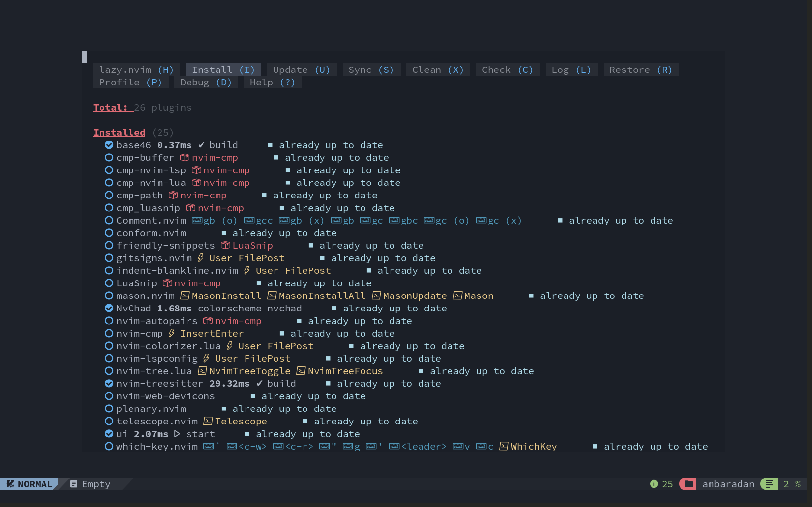

# :simple-neovim: Trasformare Neovim in un IDE avanzato

## :material-arrow-bottom-right-bold-outline: Prerequisiti

Come specificato sul sito di NvChad, è necessario assicurarsi che il sistema soddisfi i seguenti requisiti:

* [Neovim 0.10.0](https://github.com/neovim/neovim/releases/tag/v0.10.0).
* [Nerd Font](https://www.nerdfonts.com/) Impostato nel tuo emulatore di terminale.
    * Assicuratevi che il carattere nerd impostato non finisca con **Mono**
    * **Esempio:** Carattere Iosevka Nerd e non ~~Iosevka Nerd Font Mono~~
* [Ripgrep](https://github.com/BurntSushi/ripgrep) è necessario per la ricerca con grep in Telescope **(OPZIONALEL)**.
* GCC and Make

??? warning "Esecuzione di un'Installazione Pulita"

    Come specificato nei requisiti, l'installazione di questa nuova configurazione su una precedente può creare problemi irrisolvibili. Si raccomanda un'installazione pulita.

### :material-content-save-cog-outline: Operazioni Preliminari

Se avete già utilizzato l'installazione di Neovim, questa avrà creato tre cartelle in cui scrivere i vostri file, che sono:

```text
~/.config/nvim
~/.local/share/nvim
~/.cache/nvim
```

Per eseguire un'installazione pulita della configurazione, è necessario eseguire prima un backup di quella precedente:

```bash
mkdir ~/backup_nvim
cp -r ~/.config/nvim ~/backup_nvim
cp -r ~/.local/share/nvim ~/backup_nvim
cp -r ~/.cache/nvim ~/backup_nvim
```

E poi cancellare tutte le configurazioni e i file precedenti:

```bash
rm -rf ~/.config/nvim
rm -rf ~/.local/share/nvim
rm -rf ~/.cache/nvim
```

## :material-monitor-arrow-down-variant: Installazione

La creazione della struttura di configurazione viene realizzata copiando i file da un repository di inizializzazione (==starter==) utilizzando *Git*. Questo metodo consente di installare la configurazione di NvChad, preparata come plugin di Neovim, all'interno del gestore di plugin *lazy.nvim*.  
In questo modo, la configurazione viene aggiornata come tutti gli altri plugin, semplificandone la gestione da parte dell'utente. Inoltre, questo approccio rende indipendente l'intera configurazione dell'utente, consentendone la gestione totale e la distribuzione su più macchine.

Per scaricare e inizializzare la configurazione, utilizzare il seguente comando:

```bash
git clone https://github.com/NvChad/starter ~/.config/nvim && nvim
```

Il comando è composto da due parti. Il primo scarica il contenuto del repository *starter* in `~/.config/nvim/` (cartella predefinita per le impostazioni di Neovim), mentre il secondo richiama l'eseguibile ==nvim== che inizializza l'editor con la configurazione appena scaricata. Una volta terminata l'installazione dei plugin e dei parser, ci si troverà di fronte alla seguente schermata. Per chiudere il gestore dei plugin, digitare ++"q "++ :



La configurazione iniziale è minimale e costituisce un punto di partenza per la vostra personalizzazione. Come si può notare dalla schermata del primo avvio dell'editor, vengono caricati solo quattro moduli (==plugins==), contrassegnati da un segno di spunta, che sono i seguenti:

* **base46** - fornisce i temi per l'editor
* **NvChad** - la configurazione di base che consente di inserire la configurazione dell'utente in Neovim
* **nvim-treesitter** - per analizzare ed evidenziare il codice
* **ui** - l'interfaccia dell'editor (statusline, tabufline...)

I moduli rimanenti verranno attivati, grazie alla tecnica del ==*lazyloading*==, quando viene richiesta la funzionalità fornita dal modulo. Questo migliora le prestazioni dell'editor in generale e, in particolare, il suo tempo di avvio.

A questo punto, l'editor è pronto per essere utilizzato. Le sezioni seguenti forniscono uno sguardo approfondito al processo di installazione e non sono necessarie per l'uso quotidiano. Se si è interessati solo al suo utilizzo, si può consultare la pagina [Utilizzare NvChad](./nvchad_ui/using_nvchad.md).   
Tuttavia, si consiglia di leggere la [documentazione ufficiale](https://nvchad.com/docs/quickstart/install) per un'introduzione ai suoi componenti e alle sue funzionalità.

Per chiudere l'editor, utilizzare il tasto ++colon++ ++"q "++.

### :material-timer-cog-outline: Bootstrap

Il processo di bootstrap è implementato nel file ==*init.lua*== del repository *starter* e consiste nelle seguenti fasi:

Un'impostazione iniziale del percorso del tema predefinito e del tasto `<leader>`, in questo caso il tasto ++spazio++:

```lua
vim.g.base46_cache = vim.fn.stdpath "data" .. "/nvchad/base46/"
vim.g.mapleader = " "
```

Una successiva installazione del plugin principale **lazy.nvim**:

```lua
-- bootstrap lazy and all plugins
local lazypath = vim.fn.stdpath "data" .. "/lazy/lazy.nvim"

if not vim.loop.fs_stat(lazypath) then
  local repo = "https://github.com/folke/lazy.nvim.git"
  vim.fn.system { "git", "clone", "--filter=blob:none", repo, "--branch=stable", lazypath }
end

vim.opt.rtp:prepend(lazypath)

local lazy_config = require "configs.lazy"
```

E l'installazione dei plugin di NvChad e di tutti quelli configurati nella cartella `plugins`:

```lua
-- load plugins
require("lazy").setup({
  {
    "NvChad/NvChad",
    lazy = false,
    branch = "v2.5",
    import = "nvchad.plugins",
    config = function()
      require "options"
    end,
  },

  { import = "plugins" },
}, lazy_config)
```

Quindi si applica il tema alle impostazioni *default* e *statusline*:

```lua
-- load theme
dofile(vim.g.base46_cache .. "defaults")
dofile(vim.g.base46_cache .. "statusline")
```

Al termine, vengono inseriti anche gli ==autocmds== ([autocomandi Neovim](https://neovim.io/doc/user/autocmd.html)) necessari per il funzionamento della configurazione e le mappature della tastiera:

```lua
require "nvchad.autocmds"

vim.schedule(function()
  require "mappings"
end)
```

## :material-file-tree-outline: Configurazione della struttura

La struttura installata da NvChad è la seguente:

```text
~/.config/nvim/
├── init.lua
├── lazy-lock.json
├── LICENSE
├── lua
│   ├── chadrc.lua
│   ├── configs
│   │   ├── conform.lua
│   │   └── lazy.lua
│   ├── mappings.lua
│   ├── options.lua
│   └── plugins
│       └── init.lua
└── README.md
```

Consiste in un file iniziale **init.lua** che inizializza e coordina l'inserimento delle personalizzazioni nella configurazione di ==Neovim==, questo file inizialmente risulta identico a quello usato dal *bootstrap* del repository **starter** mostrato sopra, ma sarà usato in seguito per caricare altri file nella configurazione, come il proprio file *autocommands.lua*.

Segue il file **lazy-lock.json** in cui sono memorizzati tutti i plugin dell'installazione e il loro stato rispetto allo sviluppo su *GitHub*. Questo file consente di sincronizzare lo stato dell'editor tra le installazioni presenti su più macchine e permette alle installazioni personalizzate di replicare lo stato desiderato.

Il resto della configurazione si trova nella cartella `lua` e viene inizializzato a partire dal file **chadrc.lua**, che nella versione iniziale contiene solo le impostazioni del tema dell'editor.  
Questo file è usato per personalizzare l'aspetto dell'editor (==UI==) e condivide la sintassi con il file [nvconfig.lua](https://github.com/NvChad/NvChad/blob/v2.5/lua/nvconfig.lua) del plugin **NvChad**; per compilarlo, è sufficiente copiare la parte desiderata del file *nvconfig.lua* nel file *chadrc.lua* e modificarne le proprietà secondo necessità.

Il prossimo file utilizzato dalla configurazione, le cui cartelle saranno descritte più avanti, è il file **option.lua** per le personalizzazioni dell'editor, come gli spazi di indentazione, la condivisione della clipboard con il sistema ospite e, cosa molto importante, l'inclusione dei binari installati da *Mason* nel percorso.  
Come il precedente, condivide la sintassi del file [corrispondente](https://github.com/NvChad/NvChad/blob/v2.5/lua/nvchad/options.lua) del plugin **NvChad**; per personalizzarlo come sopra, basta copiare le opzioni e modificarle.

Infine, si incontra il file **mapping.lua** dove impostare i tasti della tastiera per richiamare le varie funzioni offerte dall'editor. Il file iniziale contiene la mappatura dei tasti per entrare in modalità **COMMAND**, per la formattazione con *conform.nvim* e il tasto per uscire dalla modalità **INSERT**.  
Le chiavi utilizzano la sintassi `vim.keymap.set` nativa di Neovim e per la loro configurazione si può fare riferimento alla [mappatura predefinita](https://github.com/NvChad/NvChad/blob/v2.5/lua/nvchad/mappings.lua) di NvChad o, in alternativa, alla pagina di aiuto inclusa in Neovim `:h vim.keymap.set`.

```lua
require "nvchad.mappings"

-- add yours here

local map = vim.keymap.set

map("n", ";", ":", { desc = "CMD enter command mode" })

map("n", "<leader>fm", function()
  require("conform").format()
end, { desc = "File Format with conform" })

map("i", "jk", "<ESC>", { desc = "Escape insert mode" })
```

Le due cartelle incluse nella configurazione `configs` e `plugins` servono entrambe a gestire i plugin; i plugin personali devono essere collocati nella cartella `plugins` e le loro eventuali configurazioni aggiuntive nella cartella `configs`..  
Inizialmente, sarà disponibile per le installazioni un file *plugins/init.lua* con il plugin *conform.lua* configurato in *configs/conform.lua* e *nvimtree.nvim* con l'opzione per le decorazioni relative a *Git* al suo interno.

!!! notes "Organizzazione dei plugin"

    L'inclusione dei plugin avviene mediante l'inserimento di qualsiasi file opportunamente configurato presente nella cartella `plugins`; ciò consente di organizzare i plugin, ad esempio per finalità, creando file separati (*utils.lua*, *editor.lua*, *markdown.lua*, ecc.) in questo modo è possibile lavorare sulla configurazione in modo più ordinato.

Sono presenti inoltre i file per la *licenza* e un *README.md* copiato dal repository **starter**, che può essere usato per illustrare la propria configurazione nel caso in cui sia mantenuta in un repository *Git*.

## :material-keyboard-outline: Chiavi principali della tastiera

Questa è la chiamata che restituisce le mappature dei comandi di base:

```lua
vim.schedule(function()
  require "mappings"
end)
```

Questo sistema prevede quattro tasti principali dai quali, in associazione con altri tasti, è possibile lanciare i comandi. Le chiavi principali sono:

* C = ++ctrl++
* leader = ++space++
* A = ++alt++
* S = ++shift++

!!! note "Nota"

    Nel corso di questi documenti si farà più volte riferimento a queste mappature di chiavi.

La mappatura predefinita è contenuta in *lua/mapping.lua* del plugin NvChad, ma può essere estesa con altri comandi personalizzati usando il proprio *mapping.lua*.

`<leader>th` per cambiare il tema ++space++ + ++"t"++ + ++"h"++  
`<C-n>` per aprire nvimtree ++ctrl++ + ++"n"++  
`<A-i>` per aprire un terminale in una scheda flottante ++alt++ + ++"i"++

Ci sono molte combinazioni preimpostate che coprono tutti gli usi di NvChad. Vale la pena soffermarsi ad analizzare le mappature delle chiavi prima di iniziare a usare l'istanza di Neovim configurata con NvChad.
