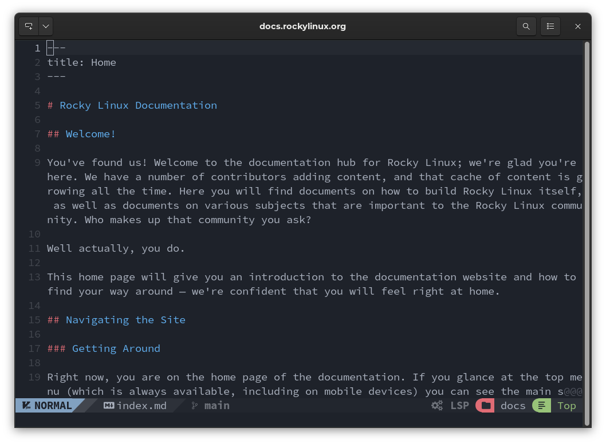

## Turning Neovim into an advanced IDE

This is actually not a real "installation" but rather writing a custom Neovim configuration for our user.

!!! warning "Performing a Clean Installation"

    As specified in the requirements, installing this new configuration on top of a previous one can create unfixable problems. A clean installation is recommended.

### Preliminary Operations

If you have used the Neovim installation before, it will have created three folders in which to write your files, which are:

```text
~/.config/nvim
~/.local/share/nvim
~/.cache/nvim
```

To perform a clean installation of the configuration, we need to back up the previous one first:

```bash
mkdir ~/backup_nvim
cp -r ~/.config/nvim ~/backup_nvim
cp -r ~/.local/share/nvim ~/backup_nvim
cp -r ~/.cache/nvim ~/backup_nvim
```

And then we delete all previous configurations and files:

```bash
rm -rf ~/.config/nvim
rm -rf ~/.local/share/nvim
rm -rf ~/.cache/nvim
```

Now that we have cleaned up, we can move on to installing NvChad.

To do this, simply run the following command from any location within your _home directory_:

```bash
git clone https://github.com/NvChad/NvChad ~/.config/nvim --depth 1 && nvim
```

The command runs a clone of the NvChad configuration hosted on GitHub in the user folder `~/.config/nvim`.

Once the cloning process is finished, the plugins that are part of the default configuration will be installed and configured, and you will have an IDE that's essentially ready to go.


As can be seen from the screenshot below, thanks to the configuration changes made, the editor has completely changed in appearance from the basic version of Neovim. It should be remembered, however, that although the configuration of NvChad completely transforms the editor, the base remains Neovim.



### Configuration Structure

Let us now go on to analyze the structure that the configuration created, the structure is as follows:

```text
nvim/
├── examples
│   ├── chadrc.lua
│   └── init.lua
├── init.lua
├── LICENSE
├── lua
│   ├── core
│   │   ├── default_config.lua
│   │   ├── init.lua
│   │   ├── lazy_load.lua
│   │   ├── mappings.lua
│   │   ├── options.lua
│   │   ├── packer.lua
│   │   └── utils.lua
│   └── plugins
│       ├── configs
│       │   ├── alpha.lua
│       │   ├── cmp.lua
│       │   ├── lspconfig.lua
│       │   ├── mason.lua
│       │   ├── nvimtree.lua
│       │   ├── nvterm.lua
│       │   ├── others.lua
│       │   ├── telescope.lua
│       │   ├── treesitter.lua
│       │   └── whichkey.lua
│       └── init.lua
└── plugin
    └── packer_compiled.lua
```

!!! note "Note"

    For the moment we will leave out the contents of the `examples` folder as it relates to the `custom` configuration, which we will address in later sections.

The first file we encounter is the `init.lua` file which initializes the configuration by inserting the `lua/core`, `lua/plugins` (and if present, the `lua/custom`) folders into the _nvim_ tree. It also inserts the following files: `lua/core/options.lua`, `lua/core/utils.lua`, and `lua/core/packer.lua`. 

In particular, the `load_mappings` function is called for loading keyboard shortcuts and `bootstrap` for loading preconfigured plugins.

```lua
require "core"
require "core.options"

vim.defer_fn(function()
  require("core.utils").load_mappings()
end, 0)

-- setup packer + plugins
require("core.packer").bootstrap()
require "plugins"

pcall(require, "custom")
```

Inclusion of the `core` folder also results in the inclusion of the `core/init.lua` file, which overrides some Neovim interface configurations and prepares for buffer management.

As we can see, each `init.lua` file is included following a well-established order. We can anticipate that the `init.lua` file we are going to create in our customization will also be included, but logically, last in the load order. Broadly speaking, we can say that `init.lua` files have the following functions:

- load global options, autocmds, or anything else.
- override the default options in `core/options.lua`.

This is the call that returns basic command mappings:

```lua
`require("core.utils").load_mappings()
```

This sets four main keys from which, in association with other keys, commands can be launched. The main keys are:

- C = CTRL
- leader = SPACE
- A = ALT
- S = SHIFT

!!! note

    We will refer to these key mappings several times throughout these documents. 

The default mapping is contained in _core/mapping.lua_ but can be extended with other custom commands using its own _mappings.lua_.

Some examples of the standard mapping are:

```text
<space>uu to update NvChad
<space>th to change the theme
<CTRL-n> to open nvimtree
<ALT-i> to open a terminal in a floating tab
```

There are many combinations pre-set for you, and they cover all the uses of NvChad. It is worth pausing to analyze the key mappings before starting to use your NvChad-configured instance of Neovim.

Continuing with the structural analysis, we find the _lua/plugins_ folder, which contains the setup of the built-in plugins and their configurations. The main plugins in the configuration will be described in the next section. As we can see, the _core/plugins_ folder also contains an `init.lua` file, which is used here for the installation and subsequent compilation of the plugins.

Lastly, we find the _nvim/plugin_ folder that contains an autogenerated file of the compiled plugins.
