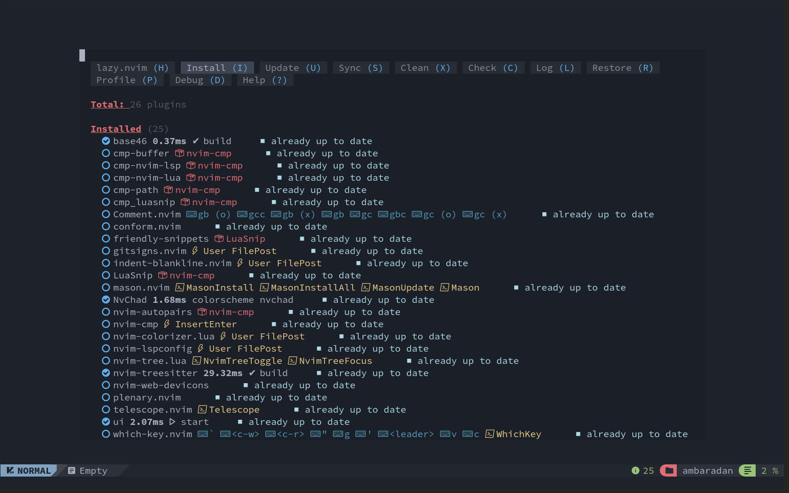

# :simple-neovim: Перетворення Neovim на просунутий IDE

## :material-arrow-bottom-right-bold-outline: Передумови

Як зазначено на сайті NvChad, вам потрібно переконатися, що система відповідає таким вимогам:

* [Neovim 0.9.5](https://github.com/neovim/neovim/releases/tag/v0.9.4).
* [Шрифт Nerd](https://www.nerdfonts.com/) Установіть його в емуляторі терміналу.
    * Переконайтеся, що шрифт, який ви налаштували, не закінчується на **Mono**
    * **Приклад:** шрифт Iosevka Nerd, а не ~~Шрифт Iosevka Nerd Mono~~
* [Ripgrep](https://github.com/BurntSushi/ripgrep) потрібен для пошуку grep за допомогою Telescope **(НЕОБОВ’ЯЗКОВО)**.
* GCC та Make

??? warning «Виконання чистої інсталяції»

    Як зазначено у вимогах, встановлення цієї нової конфігурації поверх попередньої може створити проблеми, які неможливо виправити. Рекомендується чиста інсталяція.

### :material-content-save-cog-outline: Попередні операції

Якщо ви раніше використовували інсталяцію Neovim, вона створить три папки для запису ваших файлів, а саме:

```text
~/.config/nvim
~/.local/share/nvim
~/.cache/nvim
```

Щоб виконати чисту інсталяцію конфігурації, нам потрібно спочатку створити резервну копію попередньої:

```bash
mkdir ~/backup_nvim
cp -r ~/.config/nvim ~/backup_nvim
cp -r ~/.local/share/nvim ~/backup_nvim
cp -r ~/.cache/nvim ~/backup_nvim
```

А потім видаляємо всі попередні конфігурації та файли:

```bash
rm -rf ~/.config/nvim
rm -rf ~/.local/share/nvim
rm -rf ~/.cache/nvim
```

## :material-monitor-arrow-down-variant: Встановлення

Створення структури конфігурації здійснюється шляхом копіювання файлів із сховища ініціалізації (==starter==) за допомогою *Git*. Цей метод дозволяє інсталювати конфігурацію NvChad, підготовлену як плагін Neovim, у менеджері плагінів *lazy.nvim*.  
Таким чином, конфігурація оновлюється, як і всі інші плагіни, що спрощує керування нею для користувача. Крім того, цей підхід робить всю конфігурацію користувача незалежною, дозволяючи її повне керування та розподіл між кількома машинами.

Щоб завантажити та ініціалізувати конфігурацію, скористайтеся такою командою:

```bash
git clone https://github.com/NvChad/starter ~/.config/nvim && nvim
```

Команда складається з двох частин. Перший завантажує вміст репозиторію *starter* до `~/.config/nvim/` (тека за замовчуванням для налаштувань Neovim), а другий викликає ==nvim== виконуваний файл, який ініціалізує редактор конфігурацією, яку ви щойно завантажили. Після завершення встановлення плагінів і синтаксичних аналізаторів ви побачите наступний екран. Щоб закрити диспетчер плагінів, введіть ++"q "++:



Початкова конфігурація є мінімальною та є відправною точкою для ваших налаштувань. Як свідчить скріншот, під час першого запуску редактора завантажуються лише чотири модулі (==плагіни==), позначені галочкою, а саме:

* **base46** - надає теми редактора
* **NvChad** - базова конфігурація, яка дозволяє вводити конфігурацію користувача в Neovim
* **nvim-treesitter** - для аналізу та підсвічування коду
* **ui** - інтерфейс редактора (рядок статусу, рядок вкладок..)

Решта модулів буде активовано завдяки техніці ==*відкладного завантаження*==, коли буде запитана функціональність, яку забезпечує модуль. Це покращує продуктивність редактора загалом і, зокрема, покращує час його запуску.

На цьому етапі редактор готовий до використання. Наступні розділи детально описують процес інсталяції та не є необхідними для його щоденного використання. Якщо вас цікавить лише його використання, ви можете звернутися до сторінки [Використання NvChad](./nvchad_ui/using_nvchad.md).<1 /> Проте все ж рекомендується прочитати [офіційну документацію](https://nvchad.com/docs/quickstart/install) для ознайомлення з його компонентами та функціями.

Щоб закрити редактор, використовуйте клавішу ++colon++ ++"q "++.

### :material-timer-cog-outline: Bootstrap

Процес початкового завантаження реалізовано у файлі ==*init.lua*== репозиторію *starter* і складається з таких кроків:

Початкове налаштування шляху до теми за замовчуванням і клавіші `<leader>`, у цьому випадку клавіші ++space++:

```lua
vim.g.base46_cache = vim.fn.stdpath "data" .. "/nvchad/base46/"
vim.g.mapleader = " "
```

Наступна інсталяція основного плагіна **lazy.nvim**:

```lua
-- bootstrap lazy and all plugins
local lazypath = vim.fn.stdpath "data" .. "/lazy/lazy.nvim"

if not vim.loop.fs_stat(lazypath) then
  local repo = "https://github.com/folke/lazy.nvim.git"
  vim.fn.system { "git", "clone", "--filter=blob:none", repo, "--branch=stable", lazypath }
end

vim.opt.rtp:prepend(lazypath)

local lazy_config = require "configs.lazy"
```

А також інсталяція плагінів NvChad і всіх налаштованих у папці `plugins`:

```lua
-- load plugins
require("lazy").setup({
  {
    "NvChad/NvChad",
    lazy = false,
    branch = "v2.5",
    import = "nvchad.plugins",
    config = function()
      require "options"
    end,
  },

  { import = "plugins" },
}, lazy_config)
```

Потім застосуйте тему до параметрів *default* і *statusline*:

```lua
-- load theme
dofile(vim.g.base46_cache .. "defaults")
dofile(vim.g.base46_cache .. "statusline")
```

Після завершення також буде введено ==autocmds== ([автокоманди Neovim](https://neovim.io/doc/user/autocmd.html)), необхідні для операції конфігурації та розкладки клавіатури:

```lua
require "nvchad.autocmds"

vim.schedule(function()
  require "mappings"
end)
```

## :material-file-tree-outline: Структура конфігурації

Структура, встановлена NvChad, така:

```text
~/.config/nvim/
├── init.lua
├── lazy-lock.json
├── LICENSE
├── lua
│   ├── chadrc.lua
│   ├── configs
│   │   ├── conform.lua
│   │   └── lazy.lua
│   ├── mappings.lua
│   ├── options.lua
│   └── plugins
│       └── init.lua
└── README.md
```

Встановлена конфігурація складається з двох частин: одна частина, присвячена редактору, який залишається під контролем версій (==git==) репозиторію NvChad, і інша, присвячена налаштуванню користувача, яке виключено з контролю версій через використання ==. gitignore== файлу.

Далі йде файл **lazy-lock.json**, де зберігаються всі встановлені плагіни та їхній статус щодо розробки на *GitHub*. Цей файл дозволяє переглядати статус редактора для синхронізації між інсталяціями, наявними на кількох машинах, і для створення власних інсталяцій, що копіюють потрібний статус.

Решта конфігурації знаходиться в папці `lua` та ініціалізується, починаючи з файлу **chadrc.lua**, який у початковій версії містить лише налаштування теми редактора.<2 /> Цей файл використовується для налаштування зовнішнього вигляду редактора (==UI==) і спільний синтаксис із файлом [nvconfig.lua](https://github.com/NvChad/NvChad/blob/v2.5/lua/nvconfig.lua) плагіна **NvChad**; щоб скомпілювати його, просто скопіюйте потрібну частину файлу *nvconfig.lua* у ваш *chadrc.lua* та за потреби змініть його властивості.

Наступний файл, який використовується конфігурацією, папки будуть описані пізніше, це файл **option.lua** для налаштувань редактора, таких як відступи, спільний доступ до буфера обміну з гостьовою системою, і, що дуже важливо, включення двійкових файлів, встановлених *Mason* у шлях.  
Як і попередній, він має синтаксис [відповідного файлу](https://github.com/NvChad/NvChad/blob/v2.5/lua/nvchad/options.lua) додатка **NvChad**; для його налаштування, як зазначено вище, просто скопіюйте параметри та відредагуйте їх.

Нарешті, зустрічається файл **mapping.lua**, де можна встановити клавіші клавіатури для виклику різних функцій, які пропонує редактор. Початковий файл містить відображення клавіш для входу в режим **COMMAND**, для форматування за допомогою *conform.nvim* і ключ для виходу з режиму **INSERT**.  
Ключі використовують власний синтаксис Neovim `vim.keymap.set`, і для їх конфігурації ви можете звернутися до [відповідності за замовчуванням](https://github.com/NvChad/NvChad/blob/v2.5/lua/nvchad/mappings.lua) NvChad або альтернативно до сторінки довідки, включеної до Neovim `:h vim.keymap.set`.

```lua
require "nvchad.mappings"

-- add yours here

local map = vim.keymap.set

map("n", ";", ":", { desc = "CMD enter command mode" })

map("n", "<leader>fm", function()
  require("conform").format()
end, { desc = "File Format with conform" })

map("i", "jk", "<ESC>", { desc = "Escape insert mode" })
```

Дві папки, включені в конфігурацію `configs` і `plugins`, обидві служать для керування плагінами; персональні плагіни слід розмістити в папці `plugins`, а їх додаткові конфігурації, якщо такі є, у папці `configs`.  
Спочатку файл *plugins/init.lua* буде доступний для встановлення з додатком *conform.lua*, налаштованим у *configs/conform.lua* та *nvimtree.nvim* із опцією для декорацій, пов’язаних із *Git* у ньому.

!!! notes "Організація плагінів"

    Включення плагінів здійснюється шляхом вставлення будь-якого належним чином налаштованого файлу, наявного в папці `plugins`, це дозволяє організовувати плагіни, наприклад, за призначенням, шляхом створення окремих файлів (*utils.lua*, *editor.lua*, *markdown.lua* тощо), таким чином можна працювати над конфігурацією більш упорядковано.

Є також файли для *ліцензування* та *README.md*, скопійовані зі сховища **starter**, які можна використовувати для ілюстрації конфігурації, якщо вона підтримується у сховищі *Git*.

## :material-keyboard-outline: Основні клавіші клавіатури

Це виклик, який повертає основні відображення команд:

```lua
vim.schedule(function()
  require "mappings"
end)
```

Це встановлює чотири основні клавіші, за допомогою яких разом з іншими клавішами можна запускати команди. Основні ключі:

* C = ++ctrl++
* leader = ++пробіл++
* A = ++alt++
* S = ++shift++

!!! note "Примітка"

    Ми будемо посилатися на ці зіставлення ключів кілька разів у цих документах.

Відображення за замовчуванням міститься в *lua/mapping.lua* плагіна NvChad, але його можна розширити за допомогою інших спеціальних команд за допомогою власного *mappings.lua*.

`<leader>th` щоб змінити тему ++space++ + ++"t"++ + ++"h"++  
`<C-n>` щоб відкрити nvimtree ++ctrl++ + ++"n"++  
`<A-i>` щоб відкрити термінал у плаваючій вкладці ++alt++ + ++"i"++

Для вас є багато попередньо встановлених комбінацій, які охоплюють усі можливості використання NvChad. Варто зупинитися, щоб проаналізувати зіставлення ключів, перш ніж почати використовувати свій екземпляр Neovim, налаштований за допомогою NvChad.
