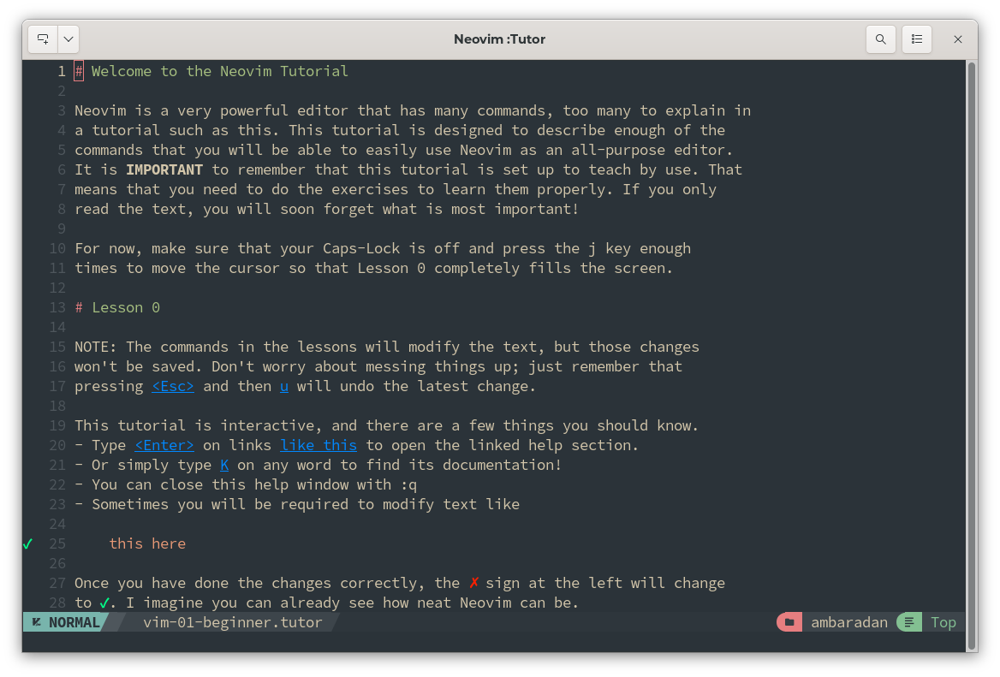
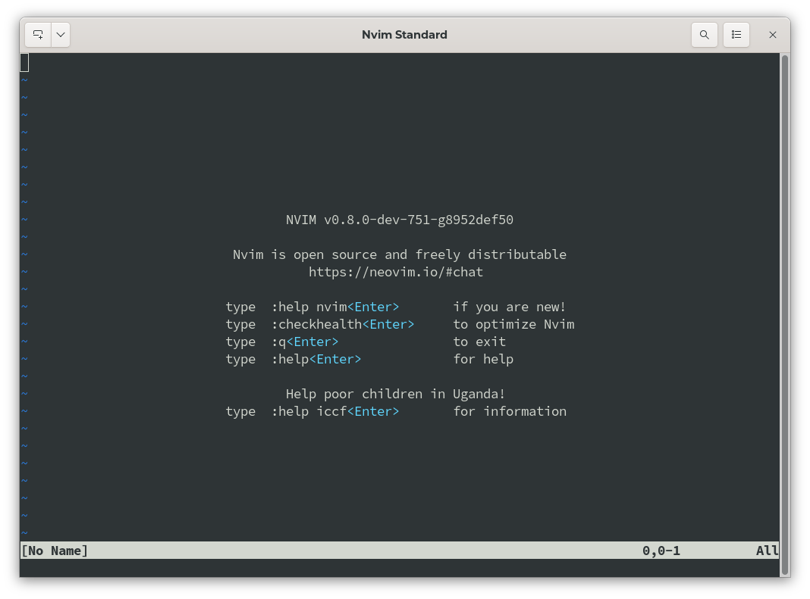

# :simple-neovim: Install Neovim

## :material-message-outline: Introduction to Neovim

Neovim is one of the best code editors due to its speed, ease of customization, and configuration.

Neovim is a fork of the ==Vim== editor. It was born in 2014, mainly due to the lack at the time of asynchronous job support in Vim. Written in the ==Lua== language with the goal of modularizing the code to make it more manageable, Neovim was designed with the modern user in mind. As the official website states

> Neovim is built for users who want the best parts of Vim, and more.

The developers of Neovim chose Lua as it was perfect for embedding, using LuaJIT quickly, and with a simple, script-oriented syntax.

From version 0.5 Neovim includes ==Treesitter== (a parser generator tool) and supports ==Language Server Protocol== (LSP). This reduces the number of plugins needed to achieve advanced editing functions. It improves the performance of operations such as code completion and linting.

One of its strengths is its customization. All its configurations are contained in a single file that can be distributed to various installations through version control systems (Git or other) so that they are always synchronized.

### :fontawesome-solid-users-gear: Community of developers

Although Vim and Neovim are both open-source projects and hosted on GitHub, there is a significant difference between the modes of development. Neovim has a more open community development, while Vim's development is more tied to the choices of its creator. Neovim's user and developer base is quite small compared to Vim, but it is a continuously growing project.

### :material-key: Key Features

- Performance: Very fast.
- Customizable: Wide ecosystem of plugins and themes
- Syntax highlighting: Integrated with Treesitter and LSP, but requires some configuration

As with Vim, Neovim requires a basic knowledge of its commands and options. You can get an overview of its features through the `:Tutor` command that invokes a file where you can read, and practice using it. Learning takes longer than a fully graphical IDE, but once you learn the shortcuts to the commands and the included features, you will proceed very smoothly in editing documents.



## :material-monitor-arrow-down-variant: Neovim Installation

!!! warning "Installation from EPEL"

    Neovim is also installable from the EPEL repository. The available version is always too old to meet the minimum requirements of the NvChad installation.  
    Installation by this method is strongly discouraged and is not supported in this guide.

=== "Installation from pre-compiled package"

    Use of the pre-compiled package allows installation of both the development and stable versions, which meet the requirements, and can be used as the basis for configuring NvChad.

    To use the full functionality of the editor, it is necessary to satisfy the dependencies required by Neovim by manually providing the pre-compiled package dependencies. The required packages can be installed with:

    ```bash
    dnf install compat-lua-libs libtermkey libtree-sitter libvterm luajit luajit2.1-luv msgpack unibilium xsel
    ```

    After installing the required dependencies, it is time to acquire the chosen package.

    By accessing the [release page](https://github.com/neovim/neovim/releases) it will be possible to download the development version (==pre-release==) or the stable version (==stable==).
    In both cases the compressed archive to download for our architecture is ==linux64==.

    The required file is ==nvim-linux64.tar.gz==, we should also download the file ==nvim-linux64.tar.gz.sha256sum== to verify its integrity.

    Assuming that both were downloaded to the same folder, we will use the following command for verification:

    ```bash
    sha256sum -c nvim-linux64.tar.gz.sha256sum
    nvim-linux64.tar.gz: OK
    ```
    
    Now unpack the precompiled package to a location within your home folder, in this guide the location `.local/share/` was chosen but can be changed according to your needs. Run the command:

    ```bash
    tar xvzf nvim-linux64.tar.gz -C ~/.local/share/
    ```

    All that remains at this point is to create a symbolic link in ~/.local/bin/ for the nvim executable of the precompiled package.

    ```bash
    cd ~/.local/bin/
    ln -sf ~/.local/share/nvim-linux64/bin/nvim nvim
    ```

    To verify the correct installation run in a terminal the command `nvim -v`, which should now show something like:

    ```txt
    nvim -v
    NVIM v0.9.5
    Build type: RelWithDebInfo
    LuaJIT 2.1.1692716794
    ```

=== "Installation from Source"

    Installing from precompiled package provides `nvim` only for the user who runs it. If you want to make Neovim available to all users of the system, you will have to do an installation from source. Compiling Neovim is not particularly difficult and consists of the following steps.

    We first install the packages required for compilation:

    ```bash
    dnf install ninja-build libtool autoconf automake cmake gcc gcc-c++ make pkgconfig unzip patch gettext curl git
    ```

    Once we have installed the necessary packages, we need to create a folder to build neovim from and change into it:

    The Neovim clone, by default, is synchronized with the Neovim development branch (at the time of this writing, version 0.10.0). To compile the stable version, we will have to switch to the corresponding branch before cloning with:

    ```bash
    mkdir ~/lab/build
    cd ~/lab/build
    ```

    Now clone the repository:

    ```bash
    git clone https://github.com/neovim/neovim
    ```

    Once the operation is finished, we will have a folder named *neovim* containing all the necessary files. The next step is to check out the stable branch, and then configure and compile the sources with the `make` command.

    ```bash
    cd ~/lab/build/neovim/
    git checkout stable
    make CMAKE_BUILD_TYPE=RelWithDebInfo
    ```

    We chose the `RelWithDebInfo` type because it provides optimizations, and a useful debugging layer for later customization. You could also use the `Release` type if you prefer maximum performance.

    The process takes care of configuring and compiling the files that are to be put into our system. These files are saved in `neovim/build`. To install them, we will use the *make install* command:

    ```bash
    make install
    ```

    Because this command will modify the filesystem, it must run as the superuser, either with `sudo` or directly by the root user.

    Once the installation is finished, we can verify that everything went well by checking the path to Neovim:

    ```bash
    whereis nvim
    nvim: /usr/local/bin/nvim
    ```

    And verifying the version:

    ```bash
    nvim --version
    NVIM v0.9.5
    Build type: Release
    LuaJIT 2.1.1692716794
    ....
    ```

    As you can see from the command excerpt above, an installation of the stable version was performed here. Both versions, stable and development, work perfectly with NvChad on Rocky Linux 9.

    ### :material-package-variant-closed-remove: Uninstall

    If we need to remove the installation, for example, to switch to another version, we will have to take ourselves back to the build folder and use the `target` cmake provided by Neovim. To perform the uninstallation, you need to execute the following command:

    ```bash
    cmake --build build/ --target uninstall
    ```

    This command also requires superuser privileges or to be run as a *root* user.

    Alternatively, you can use the manual method by removing the executable and libraries with:

    ```bash
    rm /usr/local/bin/nvim
    rm -r /usr/local/share/nvim/
    ```

    Again, you need to execute these commands with superuser permissions.

## :material-image-outline: Neovim Basic

As you can see from the screenshot, a basic installation of Neovim provides an editor that cannot yet be compared to an IDE.



Now that we have our basic editor, it is time to turn it into something more advanced thanks to the configuration provided by [NvChad](install_nvchad.md).
