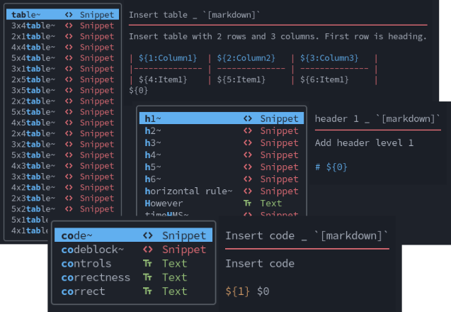

# Marksman - code assistant

Marksman is a useful tool when drafting your document for Rocky Linux. It allows the easy entry of symbols needed to define the *markdown* language tags. This allows you to write faster and reduces the possibility of errors.


NvChad/Neovim already includes text widgets that aid writing, such as the repetition of often-used words indexed by frequency of entry. The new options included by this language server will enrich these widgets.

[Marksman](https://github.com/artempyanykh/marksman) integrates with your editor to help you write and maintain your Markdown documents with the [LSP protocol](https://microsoft.github.io/language-server-protocol/), thereby providing features such as completion, go-to definition, reference searching, name refactoring, diagnostics, and more.

## Objectives

- increase the productivity of NvChad in writing Markdown code
- produce documents that conform to the rules of the Markdown language
- refine your knowledge regarding the language

## Requirements and skills

- A basic knowledge of the Markdown language, recommended reading the [Markdown Guide](https://www.markdownguide.org/)
- NvChad on the machine in use with the [Template Chadr](./template_chadrc.md) properly installed

**Difficulty level** :star:

**Reading time:** 20 minutes

## Installation of Marksman

Installation of the language server does not involve any particular problems since it is natively available in **Mason**. Install it directly from the *statusline* with the command:

`:MasonInstall marksman`

The command will open the *Mason* interface and directly install the required language server. Once binary installation completes, you can close the *Mason* screen with the <kbd>q</kbd> key.

Its installation, however, does not yet involve its integration into the editor. Enable this by editing the `custom/configs/lspconfig.lua` file of the *Chadrc Template*.

## Integration into the editor

!!! note "LSP in NvChad"

    The [nvim-lspconfig](https://github.com/neovim/nvim-lspconfig) plugin integrates the language servers into NvChad. This plugin greatly simplifies their inclusion in the NvChad configuration.

If during the editor installation you also chose to install the *Template Chadrc*, this creates the *lspoconfig.lua* file in your `custom/configs` folder.

This file takes care of entering the calls needed to use the language servers and also allows you to specify the ones you have installed. To integrate *marksman* into the editor's language server configuration you will need to edit the *local servers* string by adding your new LSP.

Open your NvChad on the file with the command:

```bash
nvim ~/.config/nvim/lua/custom/configs/lspconfig.lua
```

And edit the *local servers* string, which will look as follows when completed:

```lua
local servers = { "html", "cssls", "tsserver", "clangd", "marksman" }
```

Save the file and close the editor with the `:wq` command.

To check if the language server is properly activated, open a markdown file in your NvChad and use the command `:LspInfo` to view the language servers applied to that file. Within the summary there should be something like:

```text
 Client: marksman (id: 2, bufnr: [11, 156])
 	filetypes:       markdown
 	autostart:       true
 	root directory:  /home/your_user/your_path/your_directory
 	cmd:             /home/your_user/.local/share/nvim/mason/bin/marksman server
 
 Configured servers list: cssls, tsserver, clangd, html, yamlls, lua_ls, marksman
```

This indicates the activation of the *marksman* server for the open file, and that it started automatically (`autostart: true`) since it recognizes it as a markdown file `filetypes: markdown`. The other information indicates the path to the executable used for the code check `cmd:`, that it uses `marksman server` mode, and that it uses the root directory `your_directory` for the checks.

!!! note "Root folder"

    The concept of a "root folder" is important in using a language server in that to perform controls on the document, such as links to other files or images, it must have a "global view" of the project. We can say that "*root folders*" equates with the "*Projects*" found in graphics IDEs.

    The *root directory*, also called the "*working directory*", used by the editor for the open file, is viewable with the `:pwd` command. It is changeable with the `:lcd` command if it does not match the desired one. This command reassigns the *working directory* only to that buffer, without changing any settings of the other buffers open in the editor.

## Use of marksman

Once you have completed all the steps to enter it, activation of the language server occurs whenever opening a *markdown* file in the editor. By entering `INSERT` mode, when typing certain characters you will have new options in the widgets that will help you in writing the document. In the screenshot below you can see some of the markdown snippets available in these widgets.



## Main keys

The language server provides many shortcuts that activate writing assistance. This includes quick insertion of Markdown tags, creation of links, and insertion of images into the document. A non-exhaustive list of characters that activate the various snippets is below.

These snippets are displayed within widgets that also contain other shortcuts. Use the <kbd>Tab</kbd> key for navigation of the widget to select those provided by *marksman*.


| Key | Snippets |
|--------------- | --------------- |
| <kbd>h</kbd> | Allows for quick entry of title headings (*h1* to *h6*), for example, entering *h4* and pressing enter will insert four hash marks and a space and the cursor will already be in place to enter your title |
| <kbd>b</kbd> | Typing this character activates the ability to use the shortcut for entering bold text by inserting four asterisks and placing the cursor in the middle making writing the **bold** part much faster |
| <kbd>i</kbd> | As with the previous character, it allows you to select quick insertion of *italic* text by entering two asterisks and placing the cursor in between.   |
| <kbd>bi</kbd> | This key inserts six asterisks by placing the cursor in the middle for writing text in ***bold and italics*** |
| <kbd>img</kbd> | This key inserts the markdown structure for inserting an image into the document in the format ``. Note that writing the path can be done using the autocomplete provided by the server.   |
| <kbd>link</kbd> | This key creates the markdown tag structure for a `[text](url)` link. Again, if the link refers to a file in the **working directory** you will be able to use autocomplete and the server will check the correctness of the reference.    |
| <kbd>list</kbd> | Typing this key allows the entry of a list of three items to begin the creation of a numbered or unordered list |
| <kbd>q</kbd> | This character allows the insertion of the tag for a citation `>` followed by a space and positions the cursor for writing the citation |
| <kbd>s</kbd> | This character activates numerous possibilities including inserting four tildes and placing the cursor in the middle for writing text ~~strikethrough~~ |
| <kbd>sup</kbd> | The key inserts the *superscript* tag. Trademark<sup>TM |
| <kbd>sub</kbd> | The key inserts the *subscript* tag. Notes<sub>1 |
| <kbd>table</kbd> | This key enables quick creation of a table structure and allows you to choose from many starting structures |
| <kbd>code</kbd> | Inserts a block of code inline by placing two backticks at the position where the cursor is located by placing it in the center of the two backticks. |
| <kbd>codeblock</kbd> | Inserts three lines, two with triple backticks and one blank where you insert your code blocks. Note that it also inserts the string *language* which is to be compiled with the language you used in the block.


!!! note "Code block statement"

    Markdown code rules recommend always declaring the code used in the block, even without highlighting features for proper interpretation. If the code within it is too generic, using "text" for its declaration is recommended.

The activation keys for Markdown tagging shortcuts also include other combinations that you can discover as you use the language server.

## Conclusion

Although not strictly necessary, this language server can over time become a great companion in your documentation writing for Rocky Linux.


By using it and consequently memorizing the main keys for inserting Markdown code symbols it will enable effectively faster writing by allowing you to focus your attention on the content.

