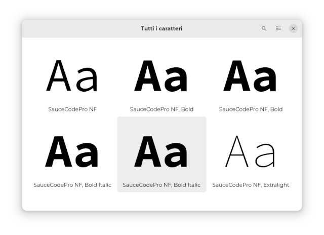

# :material-format-font: Nerd Fonts - Fonts for Developers

Installation of Nerd Fonts does not change the function of Neovim or NvChad, but simply adds fonts that are more pleasing to the eye than whatever the standard terminal font is currently.

{ align=right } Nerd Fonts are a collection of modified fonts aimed at developers. In particular, "iconic fonts" such as Font Awesome, Devicons, Octicons etc. are used to add extra glyphs.

Nerd Fonts takes the most popular programming fonts and modifies them by adding a group of glyphs (icons). A font patcher is also available if the font you'd like to use has not already been edited. A convenient preview is available on the site, allowing you to see how the font should look in the editor. For more information, check the project's main [site](https://www.nerdfonts.com/).

## :material-monitor-arrow-down-variant: Download

Fonts are available for download at:

```text
https://www.nerdfonts.com/font-downloads
```

## :material-monitor-arrow-down-variant: Installation

The procedure for installing fonts on Rocky Linux is to save the fonts you want to add somewhere, and then install them with the `fc-cache` command. This procedure is not a true installation so much as a registration of the new fonts in the system.

!!! warning "Creation of compressed packages"

    The procedure described below is not a standard procedure as each developer has packaged fonts using a custom scheme. So once downloaded and extracted, the contents must be checked to choose the procedure for copying the fonts.

For this guide we will use the `Sauce Code Pro Nerd` font.

Download the package with:

```bash
https://github.com/ryanoasis/nerd-fonts/releases/download/v2.3.3/SourceCodePro.zip
```

Next, unzip the contents of the folder and copy the fonts to `~/.local/share/fonts/` with:

```bash
mkdir ~/.local/share/fonts
unzip SourceCodePro.zip -d ~/.local/share/fonts/
fc-cache ~/.local/share/fonts
```

## :material-file-cog-outline: Configuration

At this point the Nerd Font of your choice should be available for selection. To actually select it you must refer to the desktop you are using.



If you are using the default Rocky Linux desktop (Gnome), to change the font in the terminal emulator you will just need to open `gnome-terminal`, go to "Preferences", and set the Nerd Font for your profile.
