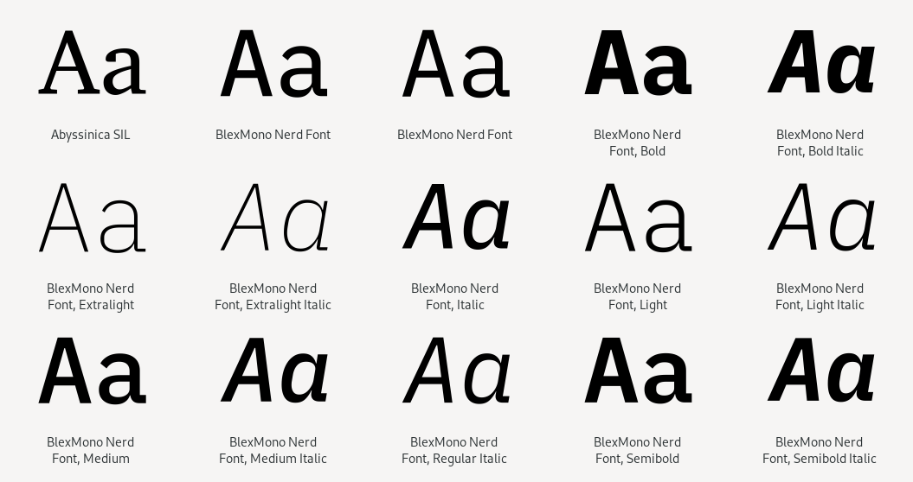

# :material-format-font: Nerd Fonts - Шрифти для розробників

Встановлення Nerd Fonts не змінює функції Neovim або NvChad, а просто додає шрифти, які приємніші для очей, ніж будь-який стандартний термінальний шрифт, який зараз є.

{ align=right } Nerd Fonts — це колекція модифікованих шрифтів, призначених для розробників. Зокрема, «знакові шрифти», такі як Font Awesome, Devicons, Octicons тощо, використовуються для додавання додаткових гліфів.

Nerd Fonts використовує найпопулярніші програмні шрифти та змінює їх, додаючи групу гліфів (піктограм). Також доступний засіб виправлення шрифтів, якщо шрифт, який ви хочете використати, ще не було відредаговано. На сайті доступний зручний попередній перегляд, який дозволяє побачити, як має виглядати шрифт у редакторі. Для отримання додаткової інформації відвідайте головний [сайт](https://www.nerdfonts.com/) проекту.

## :material-monitor-arrow-down-variant: Завантаження

Шрифти доступні для завантаження за адресою:

```text
https://www.nerdfonts.com/font-downloads
```

### :material-monitor-arrow-down-variant: Процедура інсталяції

Встановлення Nerd Fonts у Rocky Linux виконується повністю з командного рядка завдяки реалізації процедури, наданої репозиторієм проекту [ryanoasis/nerd-fonts](https://github.com/ryanoasis/nerd-fonts), процедура використовує *git</1 > для отримання необхідних шрифтів і *fc-cache* для їх конфігурації.</p>

!!! note "Примітка"

    Цей метод можна використовувати в усіх дистрибутивах *linux*, які використовують [fontconfig](https://www.freedesktop.org/wiki/Software/fontconfig/) для керування системними шрифтами.

Для початку отримайте необхідні файли зі сховища проекту:

```bash
git clone --filter=blob:none --sparse git@github.com:ryanoasis/nerd-fonts
```

Ця команда завантажує лише необхідні файли, пропускаючи шрифти, які містяться в *patched-fonts*, щоб не перевантажувати локальне сховище шрифтами, які пізніше не використовуватимуться, таким чином дозволяючи вибіркове встановлення.  
У цьому посібнику використовуватиметься шрифт [IBM Plex Mono](https://github.com/ryanoasis/nerd-fonts/tree/master/patched-fonts/IBMPlexMono), який пропонує чітке та трохи типографське відображення, функції, які роблять його особливо придатним для написання документації Markdown.  
Щоб отримати огляд, ви можете відвідати [спеціальний сайт](https://www.programmingfonts.org/#plex-mono) із попереднім переглядом доступних шрифтів.

Перейдіть до новоствореної папки та завантажте набір шрифтів за допомогою команд:

```bash
cd ~/nerd-fonts/
git sparse-checkout add patched-fonts/IBMPlexMono
```

Команда завантажить шрифти до папки *patched-fonts* і після завершення ви зможете встановити їх за допомогою наданого сценарію ==install.sh==, введіть:

```bash
./install.sh IBMPlexMono
```

!!! Note "Зарезервована Назва"

    Під час інсталяції шрифт перейменовується на BlexMono відповідно до ліцензії SIL Open Font License (OFL) і, зокрема, [механізму зарезервованих імен](http://scripts.sil.org/cms/scripts/page.php? item_id=OFL_web_fonts_and_RFNs#14cbfd4a).

Сценарій *install.sh* копіює шрифти до папки користувача `~/.local/share/fonts/` і викликає програму *fc-cache* для зареєструвати їх у системі. Після завершення шрифти будуть доступні для емулятора терміналу, зокрема ми знайдемо такі встановлені шрифти:

```text title="~/.local/share/fonts/"
NerdFonts/
├── BlexMonoNerdFont-BoldItalic.ttf
├── BlexMonoNerdFont-Bold.ttf
├── BlexMonoNerdFont-ExtraLightItalic.ttf
├── BlexMonoNerdFont-ExtraLight.ttf
├── BlexMonoNerdFont-Italic.ttf
├── BlexMonoNerdFont-LightItalic.ttf
├── BlexMonoNerdFont-Light.ttf
├── BlexMonoNerdFont-MediumItalic.ttf
├── BlexMonoNerdFont-Medium.ttf
├── BlexMonoNerdFont-Regular.ttf
├── BlexMonoNerdFont-SemiBoldItalic.ttf
├── BlexMonoNerdFont-SemiBold.ttf
├── BlexMonoNerdFont-TextItalic.ttf
├── BlexMonoNerdFont-Text.ttf
├── BlexMonoNerdFont-ThinItalic.ttf
├── BlexMonoNerdFont-Thin.ttf
```

## :material-file-cog-outline: Конфігурація

На цьому етапі шрифт Nerd за вашим вибором має бути доступним для вибору. Щоб фактично вибрати його, ви повинні звернутися до робочого столу, який ви використовуєте.



Якщо ви використовуєте робочий стіл Rocky Linux за замовчуванням (Gnome), щоб змінити шрифт в емуляторі терміналу, вам потрібно просто відкрити `gnome-terminal`, перейти до «Параметрів» і встановити Nerd Font для свого профілю.
