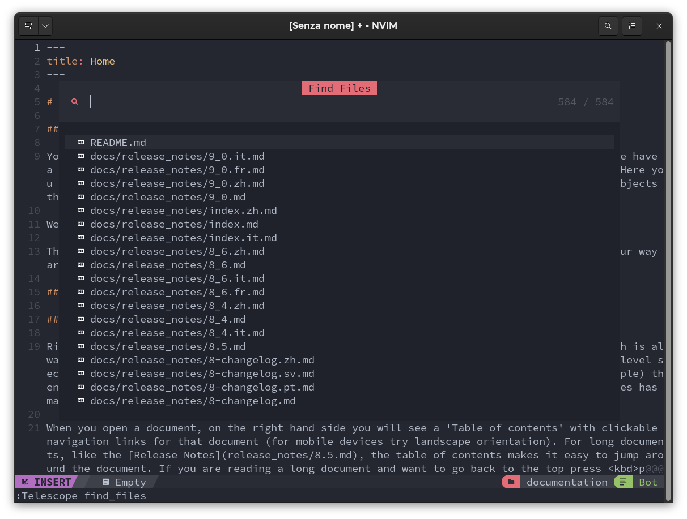
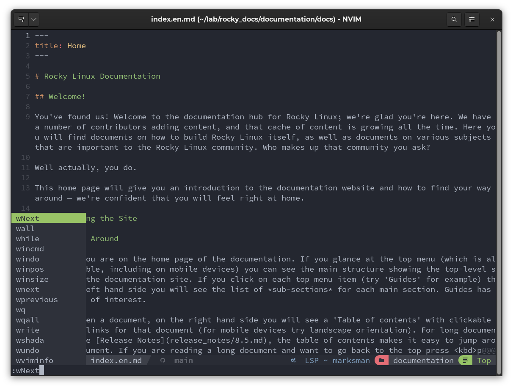

# :material-folder-multiple-outline: Basic configuration plugins

!!! note "Plugin Naming Convention"

    This chapter will identify the plugin using the format `user_github/plugin_name`. This is to avoid possible errors with similarly named plugins and to introduce the format used for plugin entry by both NvChad and the `custom` configuration.

The basic NvChad plugins are in the `~/.local/share/nvim/lazy/NvChad/lua/nvchad/plugins/` folder:

```text title=".local/share/nvchad/lazy/NvChad/lua/nvchad/plugins/"
├── init.lua
└── ui.lua
```

and respective configurations in the `~/.local/share/nvim/lazy/NvChad/lua/nvchad/configs/` folder:

```text title=".local/share/nvchad/lazy/NvChad/lua/nvchad/configs/"
├── cmp.lua
├── gitsigns.lua
├── lazy_nvim.lua
├── lspconfig.lua
├── luasnip.lua
├── mason.lua
├── nvimtree.lua
├── telescope.lua
└── treesitter.lua
```

Within the `plugins` folder are the files *init.lua* and *ui.lua*. The former deals with the configuration of plugins that offer additional functionality to the editor (*telescope*, *gitsigns*, *tree-sitter*, etc.), while the latter sets the appearance of the editor (colors, icons, file manager, etc.).
  
## :material-download-circle-outline: Basic Plugins

The following is a brief analysis of the main plugins:

=== "init.lua plugins"

    - [nvim-lua/plenary.nvim](https://github.com/nvim-lua/plenary.nvim) - Provides a library of commonly used lua functions that are used by the other plugins, for example *telescope* and *gitsigns*.

    - [stevearc/conform.nvim](https://github.com/stevearc/conform.nvim) Formatting plugin for Neovim, fast and extensible thanks to `configs/conform.lua` file provided by user configuration

    - [nvim-treesitter/nvim-treesitter](https://github.com/nvim-treesitter/nvim-treesitter) - Allows you to use the tree-sitter interface in Neovim, and provide some basic functionality, such as highlighting.

    - [lewis6991/gitsigns.nvim](https://github.com/lewis6991/gitsigns.nvim) - Provides decoration for *git* with reports for added, removed, and changed lines-reports that are also integrated into the *statusline*.

    - [williamboman/mason.nvim](https://github.com/williamboman/mason.nvim) - Allows simplified management of LSP (Language Server) installation through a convenient graphical interface.

    - [neovim/nvim-lspconfig](https://github.com/neovim/nvim-lspconfig) - Provides the appropriate configurations for almost every language server available. It is a community collection, with the most relevant settings already set. The plugin takes care of receiving our configurations and putting them into the editor environment.

    - [hrsh7th/nvim-cmp](https://github.com/hrsh7th/nvim-cmp) with the respective sources provided by the plugins:

        - [L3MON4D3/LuaSnip](https://github.com/L3MON4D3/LuaSnip)
        - [saadparwaiz1/cmp_luasnip](https://github.com/saadparwaiz1/cmp_luasnip)
        - [hrsh7th/cmp-nvim-lua](https://github.com/hrsh7th/cmp-nvim-lua)
        - [hrsh7th/cmp-nvim-lsp](https://github.com/hrsh7th/cmp-nvim-lsp)
        - [hrsh7th/cmp-buffer](https://github.com/hrsh7th/cmp-buffer)
        - [hrsh7th/cmp-path](https://github.com/hrsh7th/cmp-path)

    - [windwp/nvim-autopairs](https://github.com/windwp/nvim-autopairs) - Thanks to this plugin we have the functionality of automatic closing of parentheses and other characters. For example, by inserting a beginning parenthesis `(` completion will automatically insert the closing parenthesis `)` placing the cursor in the middle.

    - [numToStr/Comment.nvim](https://github.com/numToStr/Comment.nvim) - Provides advanced functionality for code commenting.

    - [nvim-telescope/telescope.nvim](https://github.com/nvim-telescope/telescope.nvim) - Provides advanced file search capabilities, is highly customizable, and can also be (for example) used for selecting NvChad themes (command `:Telescope themes`).

    

=== "ui.lua plugins"

    - [NvChad/base46](https://github.com/NvChad/base46) - Provides themes for the interface.

    - [NvChad/ui](https://github.com/NvChad/ui) - Provides the actual interface and the core utilities of NvChad. Thanks to this plugin we can have a *statusline* that gives us the information during editing and a *tabufline* that allows us to manage open buffers. This plugin also provides the utilities **NvChadUpdate** for updating it, **NvCheatsheet** for an overview of keyboard shortcuts, and **Nvdash** from which file operations can be performed.

    - [NvChad/nvim-colorizer.lua](https://github.com/NvChad/nvim-colorizer.lua) - Another plugin written by the developers of NvChad. It is specifically a high-performance highlighter.

    - [kyazdani42/nvim-web-devicons](https://github.com/kyazdani42/nvim-web-devicons)—This adds icons (requires one of the Nerd Fonts) to file types and folders in our IDE. This allows us to visually identify file types in our File Explorer, speeding up operations.

    - [lukas-reineke/indent-blankline.nvim](https://github.com/lukas-reineke/indent-blankline.nvim) - Provides guides to identify indentation in the document better, allowing sub-routines and nested commands to be easily recognized.

    - [kyazdani42/nvim-tree.lua](https://github.com/kyazdani42/nvim-tree.lua) - A File Explorer for Neovim that allows the most common operations on files (copy, paste, etc.), has integration with Git, identifies files with different icons, and other features. Most importantly, it updates automatically (this is very useful when you work with Git repositories).

    

    - [folke/which-key.nvim](https://github.com/folke/which-key.nvim) - Displays all possible autocompletions available for the entered partial command.

    

## Conclusions and final thoughts

There's a huge amount of work by the NvChad developers that must be acknowledged. They have created an integrated environment among all plugins, making the user interface clean and professional. In addition, plugins that work *under the hood* allow for enhanced editing and other features.

This means that ordinary users can instantly have a basic IDE with which to start working and an extensible configuration that can adapt to their needs.
