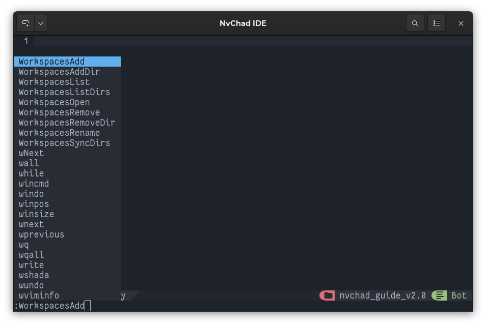

# Плагіни базової конфігурації

!!! примітка "Угода про іменування плагінів"

    У цій главі формат `user_github/plugin_name` використовуватиметься для ідентифікації плагіна. Це зроблено для того, щоб уникнути можливих помилок із плагінами з подібними назвами та запровадити формат, який використовується для введення плагінів як NvChad, так і `спеціальною` конфігурацією.

Версія 2.0 містить багато нових функцій. Нова версія використовує `lazy.nvim` як менеджер плагінів замість `packer.nvim`; це передбачає внесення деяких змін для користувачів попередньої версії з власною конфігурацією (папка *custom*).

`lazy.nvim` забезпечує зручне керування плагінами за допомогою єдиного інтерфейсу та інтегрує механізм для синхронізації плагінів між установками (*lazy-lock.json*).

NvChad зберігає конфігурацію плагінів за умовчанням у файлі *lua/plugins/init.lua*. А додаткові конфігурації різних плагінів містяться в папці */nvim/lua/plugins/configs*.

Ми можемо побачити уривок файлу *init.lua* нижче:

```lua
require "core"
-- All plugins have lazy=true by default,to load a plugin on startup just lazy=false
-- List of all default plugins & their definitions
local default_plugins = {

  "nvim-lua/plenary.nvim",

  {
    "NvChad/base46",
    branch = "v2.0",
    build = function()
      require("base46").load_all_highlights()
    end,
  },

  {
    "NvChad/ui",
    branch = "v2.0",
    lazy = false,
  },

  {
    "NvChad/nvterm",
    init = function()
      require("core.utils").load_mappings "nvterm"
    end,
    config = function(_, opts)
      require "base46.term"
      require("nvterm").setup(opts)
    end,
  },
...
...
local lazypath = vim.fn.stdpath "data" .. "/lazy/lazy.nvim"

-- bootstrap lazy.nvim!
if not vim.loop.fs_stat(lazypath) then
  require("core.bootstrap").gen_chadrc_template()
  require("core.bootstrap").lazy(lazypath)
end

dofile(vim.g.base46_cache .. "defaults")
vim.opt.rtp:prepend(lazypath)
require "plugins"
```

Розробники NvChad провели величезну роботу, яку слід відзначити. Вони створили інтегроване середовище серед усіх плагінів, що робить інтерфейс користувача чистим і професійним. Крім того, плагіни, які працюють *під капотом*, дозволяють розширене редагування та інші функції.

Усе це означає, що звичайні користувачі можуть миттєво отримати базову IDE, з якою можна почати роботу, і розширювану конфігурацію, яку можна адаптувати до їхніх потреб.

## Основні плагіни

Нижче наведено короткий аналіз основних плагінів:

- [nvim-lua/plenary.nvim](https://github.com/nvim-lua/plenary.nvim) – надає бібліотеку поширених функцій lua, які використовуються іншими плагінами, наприклад *telescope* і *gitsigns*.

- [NvChad/base46](https://github.com/NvChad/base46) – надає теми для інтерфейсу.

- [NvChad/ui](https://github.com/NvChad/ui) – надає фактичний інтерфейс і основні утиліти NvChad. Завдяки цьому плагіну ми можемо мати *рядок стану*, який надає нам інформацію під час редагування, і *рядок вкладок*, який дозволяє щоб керувати відкритими буферами. Цей плагін також містить утиліти **NvChadUpdate** для його оновлення, **NvCheatsheet** для огляду комбінацій клавіш і **Nvdash**, з якого можна виконувати операції з файлами.

- [NvChad/nvterm](https://github.com/NvChad/nvterm) – надає термінал для нашої IDE, де ми можемо видавати команди. Термінал можна відкрити в буфері різними способами:

- `<ALT-h>` відкриває термінал, розділяючи буфер горизонтально
- `<ALT-v>` відкриває термінал, розділяючи буфер по вертикалі
- `<ALT-i>` відкриває термінал у плаваючій вкладці

- [NvChad/nvim-colorizer.lua](https://github.com/NvChad/nvim-colorizer.lua) – ще один плагін, написаний розробниками NvChad. Це особливо високоефективний хайлайтер.

- [kyazdani42/nvim-web-devicons](https://github.com/kyazdani42/nvim-web-devicons) – додає піктограми (потрібен один із Nerd Fonts) до типів файлів і папок до нашої IDE. Це дозволяє нам візуально ідентифікувати типи файлів у нашому Провіднику файлів, щоб пришвидшити операції.

- [lukas-reineke/indent-blankline.nvim](https://github.com/lukas-reineke/indent-blankline.nvim) – надає вказівки для кращого визначення відступів у документі, дозволяючи суб - підпрограми та вкладені команди, які легко розпізнаються.

- [nvim-treesitter/nvim-treesitter](https://github.com/nvim-treesitter/nvim-treesitter) – дозволяє використовувати інтерфейс Treesitter у Neovim і надає деякі основні функціональність, наприклад підсвічування.

- [lewis6991/gitsigns.nvim](https://github.com/lewis6991/gitsigns.nvim) – прикрашає *git* зі звітами для доданих, видалених і змінених рядків-звітів, які також інтегровані в *рядок стану*.

## Функціональність LSP

Тепер давайте перейдемо до плагінів, які забезпечують функціональність для інтеграції LSP (Language Server Protocols) у наші проекти. Це, безумовно, одна з найкращих функцій NvChad. Завдяки LSP ми можемо контролювати те, що пишемо, у режимі реального часу.

- [williamboman/mason.nvim](https://github.com/williamboman/mason.nvim) – дозволяє спрощувати керування встановленням LSP (Language Server) через зручний графічний інтерфейс. Надаються такі команди:

- `:Mason`
- `:MasonInstall`
- `:MasonUninstall`
- `:MasonUnistallAll`
- `:MasonLog`

- [neovim/nvim-lspconfig](https://github.com/neovim/nvim-lspconfig) – надає відповідні конфігурації майже для кожного доступного мовного сервера. Це колекція спільноти з уже встановленими найбільш релевантними параметрами. Плагін піклується про отримання наших конфігурацій і розміщення їх у середовищі редактора.

Він надає такі команди:

- `:LspInfo`
- `:LspStart`
- `:LspStop`
- `:LspRestart`

## Код Lua

Після LSP з’являються всі плагіни, які забезпечують функціональність у написанні та виконанні коду Lua, наприклад фрагменти, команди lsp, буфери тощо. Ми не будемо вдаватися в подробиці, але їх можна переглянути у відповідних проектах на GitHub.

Плагіни:

- [hrsh7th/nvim-cmp](https://github.com/hrsh7th/nvim-cmp)
- [L3MON4D3/LuaSnip](https://github.com/L3MON4D3/LuaSnip)
- [rafamadriz/friendly-snippets](https://github.com/rafamadriz/friendly-snippets)
- [saadparwaiz1/cmp_luasnip](https://github.com/saadparwaiz1/cmp_luasnip)
- [hrsh7th/cmp-nvim-lua](https://github.com/hrsh7th/cmp-nvim-lua)
- [hrsh7th/cmp-nvim-lsp](https://github.com/hrsh7th/cmp-nvim-lsp)
- [hrsh7th/cmp-buffer](https://github.com/hrsh7th/cmp-buffer)
- [hrsh7th/cmp-path](https://github.com/hrsh7th/cmp-path)

## Змішані плагіни

- [windwp/nvim-autopairs](https://github.com/windwp/nvim-autopairs) – завдяки цьому плагіну ми маємо функцію автоматичного закриття дужок та інших символів. Наприклад, вставивши початкову дужку `(` завершення автоматично вставить закриваючу дужку `)`, розмістивши курсор посередині.

- [numToStr/Comment.nvim](https://github.com/numToStr/Comment.nvim) – надає розширені функції для коментування коду.

## Керування файлами

- [kyazdani42/nvim-tree.lua](https://github.com/kyazdani42/nvim-tree.lua) – Провідник файлів для Neovim, який дозволяє виконувати найпоширеніші операції з файлами (копіювати, вставити тощо), має інтеграцію з Git, ідентифікує файли з різними значками та іншими функціями. Найважливіше те, що він оновлюється автоматично (це дуже корисно, коли ви працюєте зі сховищами Git).

  

- [nvim-telescope/telescope.nvim](https://github.com/nvim-telescope/telescope.nvim) – надає розширені можливості пошуку файлів, має широкі можливості налаштування та також може бути (для прикладу), який використовується для вибору тем NvChad (команда `:Telescope themes`).

  

- [folke/which-key.nvim](https://github.com/folke/which-key.nvim) – відображає всі можливі автозаповнення, доступні для введеної часткової команди.

  

Ознайомившись із плагінами, які складають базову конфігурацію NvChad, ми можемо перейти до того, як ними керувати.
