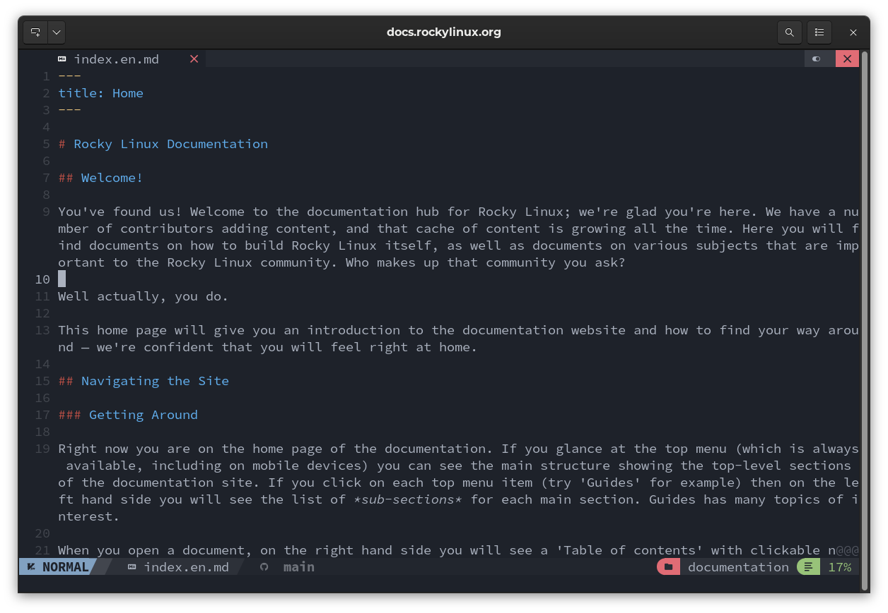
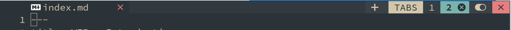
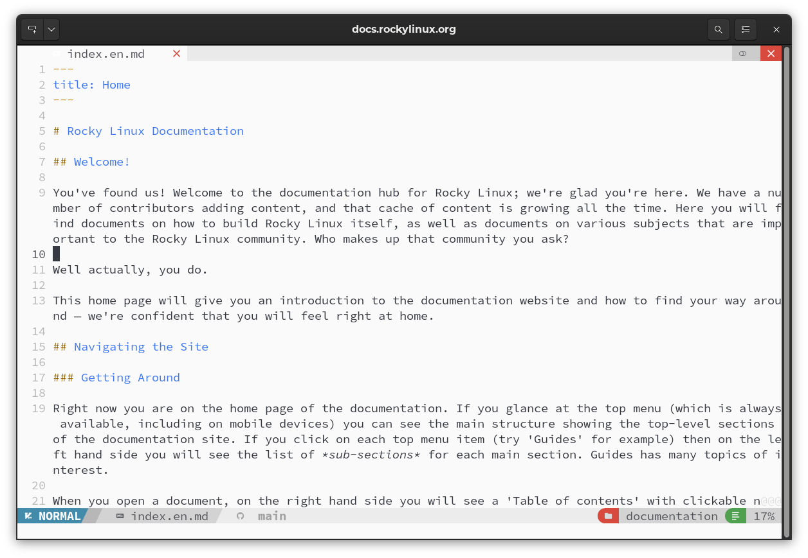
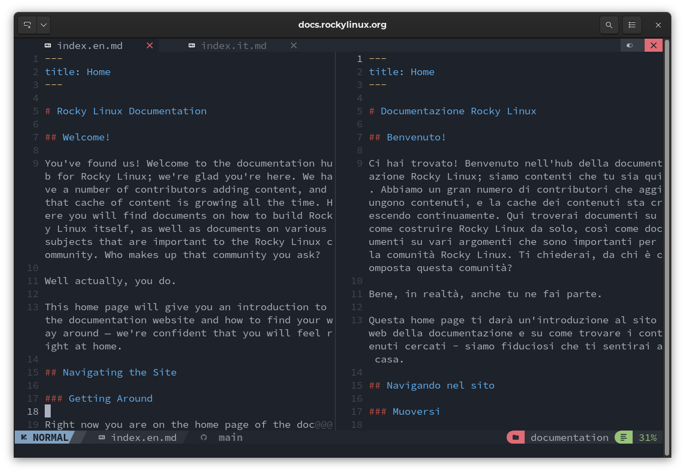
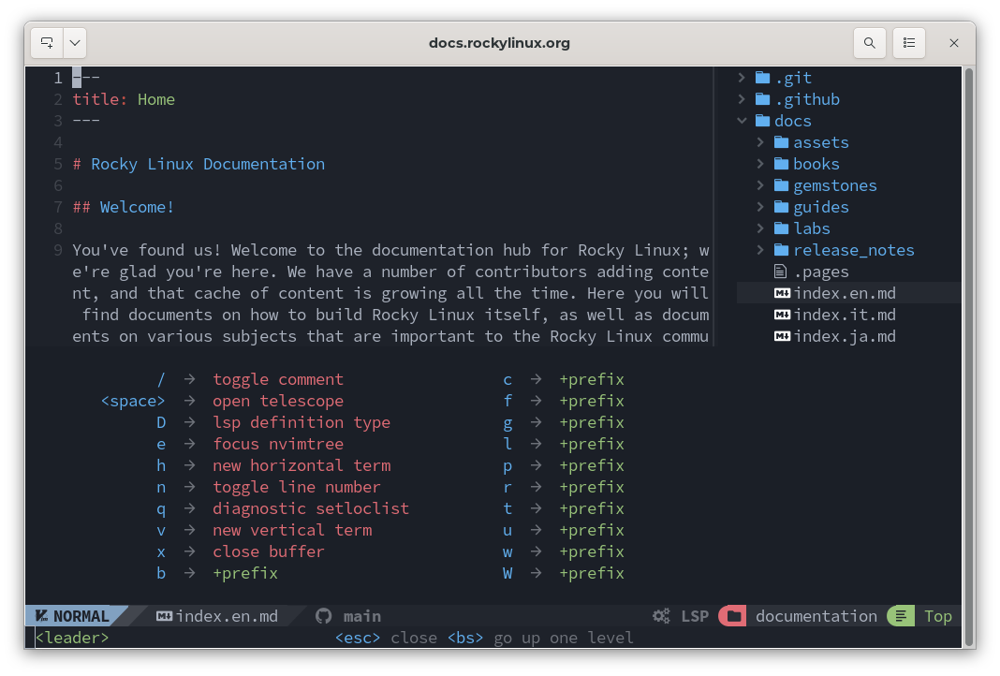
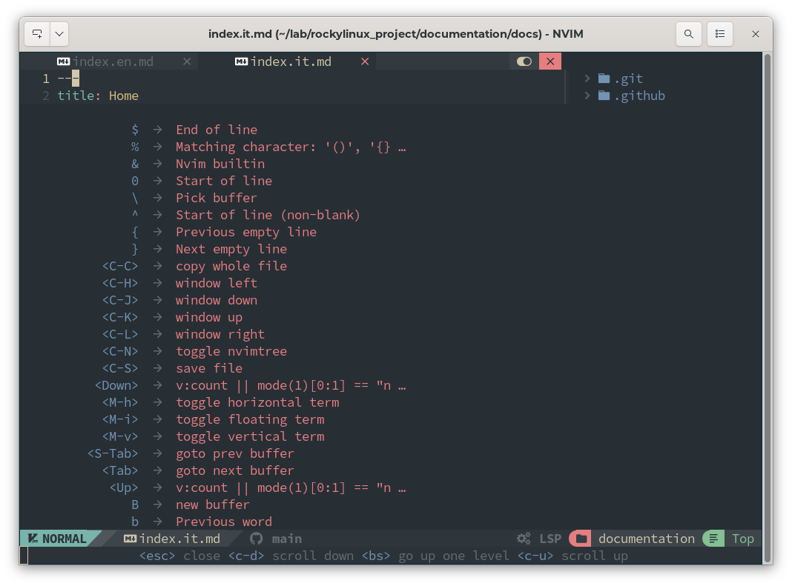
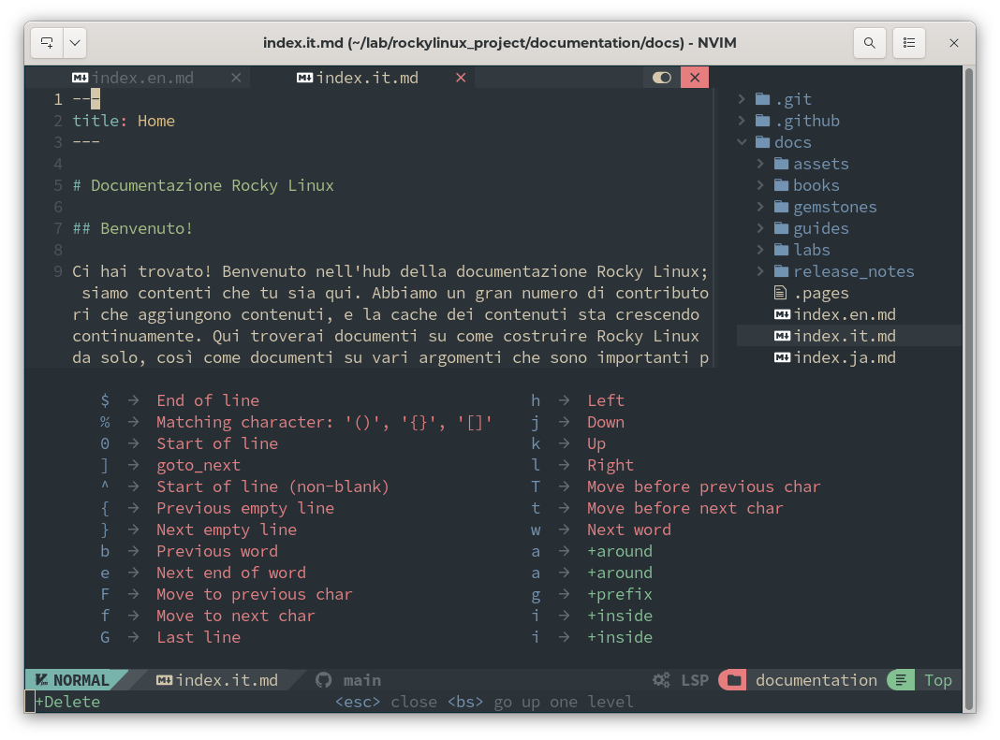
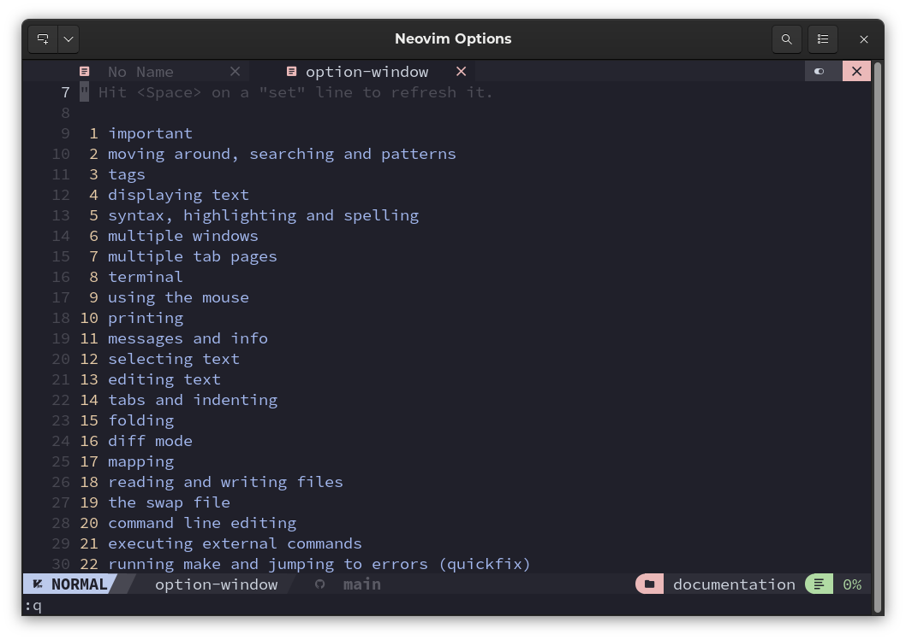
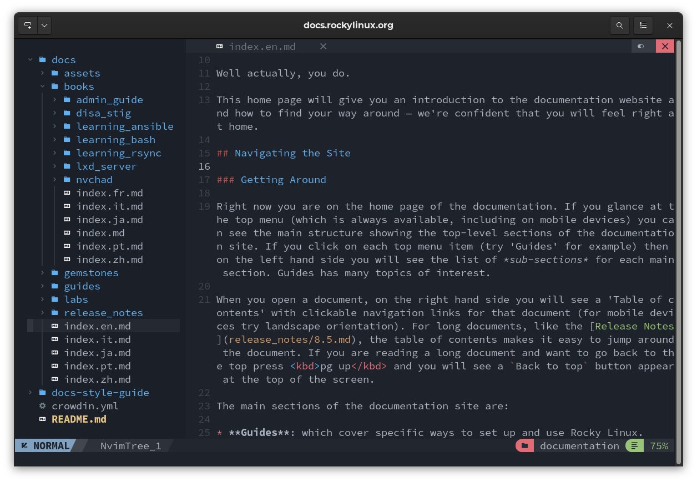

# Nvchad 인터페이스

!!! 참고 "`mappings.lua`에 대해 간략히 알아보기"

    NvChad의 공식 문서에서는 '<leader>'와 같은 명령과 일반 독자에게는 이해하기 어려울 수 있는 다른 키들이 언급됩니다. 이는 기본  `mappings.lua` 파일(`../nvim/lua/core/mappings.lua`) 때문입니다.
    
    이 파일과 그에 기술된 키 매핑에 대해 [여기에서](https://nvchad.com/docs/config/mappings) 설명하겠습니다. 명확하게 말하자면, 사용자 정의 `mappings.lua` 파일(`../nvim/lua/custom/mappings.lua`)을 사용하여 어떤 키 매핑이든 재정의할 수 있습니다.
    
    지금 읽고 있는 문서에서 혼란을 피하기 위해, 우리는 기본 `mappings.lua`` 파일을 사용한다고 가정하고 필요한 실제 명령을 사용하여 기능에 접근하는 방법을 대신 사용할 것입니다. 표준 키 참조는 다음과 같습니다:

    * leader = <kbd>SPACE</kbd>
    * A = <kbd>ALT</kbd>
    * C = <kbd>CTRL</kbd>
    * S = <kbd>SHFT</kbd>

    예를 들어 명령에서 `<leader>uu`를 지정하는 경우, 우리는 <kbd>SPACE</kbd><kbd>uu</kbd> 라는 키 조합으로 대체할 것입니다

    이는 다음 섹션[NvChad 사용](./using_nvchad.md)에서 다시 다룰 것입니다.

Neovim이 설치되고 NvChad 구성이 입력되면, 우리의 IDE는 다음과 같아야 합니다:

인터페이스에는 이미 Git 저장소의 상태를 나타내는 등 일부 고급 기능이 포함되어 있지만, Language Server를 사용하여 더욱 향상시키고 몇 가지 기본 설정을 재정의하여 사용자 정의할 수 있습니다. 이에 대한 기본 모듈은 아래에서 자세히 설명합니다.

## Tabufline

사용자 인터페이스에서는 `Tabufline`이라는 상단 바가 있는데, 여기서 열린 버퍼를 관리합니다. `Tabufline`은 하나 이상의 파일이 열려 있을 때만 표시됩니다. 열린 버퍼는 파일 유형 아이콘, 파일 이름 및 상태로 표시됩니다. 상태는 아이콘으로 표시됩니다.

스크린샷에서와 같이 빨간색 `x`가 있다면, 이미 저장된 파일이므로 닫을 수 있습니다. 그 대신에 아이콘이 초록색 점 `.` 인 경우, 파일을 저장해야 하며, 닫기 명령 <kbd>SHIFT</kbd> + <kbd>:q</kbd>를 실행하면 "마지막 변경 이후로 저장하지 않음"이라는 경고가 표시됩니다.

오른쪽에는 _어둡게_ 또는 _밝게_ 테마를 설정하는 아이콘이 있습니다. 마우스로 클릭하여 원하는 테마를 선택할 수 있습니다.

오른쪽에는 편집기를 닫는 아이콘이 있습니다.

## 중간 섹션 - 오픈 버퍼

편집기의 중앙 부분은 현재 활성화된 버퍼로 구성되어 있습니다 (_index.en.md_). 추가 기능을 도입하기 위해 예시로 두 개의 파일을 분할 버퍼에서 동시에 작업할 수 있습니다(_index.it.md_).

편집기에서 첫 번째 버퍼가 앞쪽에 있고 두 번째 파일이 Tabufline에 나열됩니다. 이제 첫 번째 버퍼를  <kbd>SHIFT</kbd> + <kbd>:vsplit</kbd> 명령으로 분할하고 오른쪽 버퍼를 선택하면, Tabufline의 두 번째 파일 (*index.it.md*)의 이름을 클릭하면 오른쪽 버퍼에서 해당 파일이 열리고 두 파일을 나란히 작업할 수 있습니다.

## Statusline

하단에는 상태 정보를 처리하는 Statusline이 있습니다. 오른쪽에는 편집기 상태를 나타내는 부분이 있습니다. 텍스트 편집기를 사용하고 있으며, 특히 Vim의 철학과 작동 방식을 유지한다는 것을 잊지 말아야 합니다. 가능한 상태는 다음과 같습니다:

- **NORMAL**
- **INSERT**
- **COMMAND**
- **VISUAL**

문서 편집은 파일을 열 때  **NORMAL** 모드에서 시작되며, 편집을 위해 **INSERT** 모드로 전환할 수 있으며, 완료하고 <kbd>ESC</kbd>를 눌러  **NORMAL** 모드로 돌아갑니다.

이제 파일을 저장하려면 상태 표시줄에 `:`를 입력한 다음 `w`(_write_) 작성하고 <kbd>ESC</kbd>를 누르면 **NORMAL** 모드로 돌아갑니다. 상태 표시는 사용법을 익히는 동안 매우 유용하며, 특히 Vim의 작업 흐름에 익숙하지 않은 경우에 유용합니다.

그런 다음 열린 파일의 이름을 찾을 수 있으며, Git 저장소에서 작업하는 경우 저장소의 상태를 나타내는 표시가 있습니다. 이는 _lewis6991/gitsigns.nvim_ 플러그인 덕분입니다.

오른쪽으로 넘어가면 편집기를 열었던 폴더의 이름을 찾을 수 있습니다. LSP를 사용하는 경우 이는 `workspace`로 고려되는 폴더를 나타내며, 이로 인해 진단이 수행되고 파일 내 커서 위치를 따를 수 있습니다.

## 통합 도움말

NvChad 및 Neovim은 미리 설정된 키 조합과 사용 가능한 옵션을 표시하는 몇 가지 유용한 명령을 제공합니다.

<kbd>SPACE</kbd> 키를 단독으로 누르면 다음 스크린샷과 같이 관련 명령의 설명을 제공합니다:

편집기에 포함된 모든 명령을 보려면 <kbd>SPACE</kbd> + <kbd>wK</kbd> 명령을 사용하면 다음 결과가 나옵니다:

그리고 <kbd>d</kbd>를 누르면 나머지 명령을 표시할 수 있습니다:

보시다시피, 거의 모든 명령은 문서나 버퍼 내에서의 탐색을 위한 것입니다. 파일을 열기 위한 명령은 포함되어 있지 않습니다. 이는 Neovim에서 제공됩니다.

Neovim의 모든 옵션을 보려면 <kbd>SHIFT</kbd> + <kbd>:options</kbd> 명령을 사용할 수 있습니다. 이 명령은 범주별로 색인화된 옵션 트리를 제공합니다.

이를 통해 내장 도움말을 통해 편집기를 사용하면서 명령을 배울 수 있으며, 사용 가능한 옵션을 자세히 살펴볼 수 있습니다.

## NvimTree

파일로 작업하려면 파일 탐색기가 필요하며 이는 _kyazdani42/nvim-tree.lua_ 플러그인에서 제공합니다. <kbd>CTRL</kbd> + <kbd>n</kbd> 조합을 사용하여 NvimTree를 열 수 있습니다.

NvimTree의 명령 및 기능에 대한 자세한 설명은 [해당 페이지](nvimtree.md)에서 찾을 수 있습니다.

인터페이스 구성 요소를 살펴본 후 NvChad의 사용법으로 넘어갈 수 있습니다.
