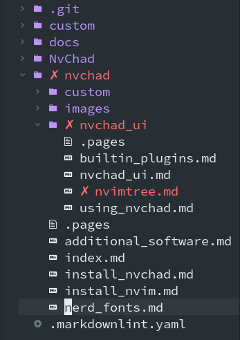
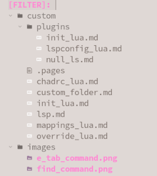

# NvimTree - Провідник файлів

{ align=right }

Редактор, щоб бути функціональним, повинен забезпечувати підтримку відкриття та керування файлами, які ми хочемо записати або відредагувати. Neovim у своїй базовій інсталяції не надає функції керування файлами. Це реалізовано NvChad за допомогою плагіна _kyazdani42/nvim-tree.lua_. Плагін надає файловий провідник, за допомогою якого можна виконувати всі найпоширеніші операції з файлами за допомогою клавіш клавіатури. Щоб відкрити його, скористайтеся комбінацією ++ctrl++ + ++"n"++, яка доступна лише в режимі _NORMAL_ і за допомогою тієї ж комбінаціії клавіш, якою ви його закриваєте.

Якщо ми встановили [Nerd Fonts](../nerd_fonts.md), ми матимемо, як показано на знімку екрана, файловий провідник, який, хоча й текстовий, надасть нам графічне представлення нашого файлового дерева.

Після відкриття ми можемо перемикатися з вікна провідника у вікно редактора та навпаки за допомогою комбінацій ++ctrl++ + ++"h"++ для переміщення вліво та ++ctrl++ + ++"l"++, щоб рухатися праворуч.

## Робота з файловим провідником

Для роботи з деревом файлів вашого проекту _NvimTree_ надає ряд корисних ярликів для керування ним, а саме:

- ++"R"++ (оновити), для виконання повторного читання файлів, які містяться в проекті
- ++"H"++ (сховати), щоб приховати/показати приховані файли та папки (починаючи з крапки `.`)
- ++"E"++ (expand_all), щоб розгорнути все дерево файлів, починаючи з кореневої теки (робоча область)
- ++"W"++ (collapse_all), щоб закрити всі відкриті теки, починаючи з кореневої теки
- ++"-"++ (dir_up) дозволяє повертатися до папок. Ця навігація також дозволяє вам вийти з кореневої папки (робочої області) у свій домашній каталог
- ++"s"++ (система), щоб відкрити файл за допомогою системної програми, встановленої за замовчуванням для цього типу файлу
- ++"f"++ (знайти), щоб відкрити інтерактивний пошук файлів, до яких можна застосувати пошукові фільтри
- ++"F"++, щоб закрити інтерактивний пошук
- ++ctrl++ + ++"k"++, щоб показати інформацію про файл, наприклад розмір, дату створення тощо.
- ++"g"++ + ++"?"++, щоб відкрити довідку з усіма попередньо визначеними комбінаціями клавіш для швидкого доступу
- ++"q"++, щоб закрити провідник файлів

{ align=right }

!!! note "Примітка:"

    Інтерактивний пошук, який виконується за допомогою ++"f"++, як і під час навігації за допомогою стрілок ++"&gt;"++ ++"&lt;"++, залишається обмеженим текою, де зараз знаходиться _NvimTree_. Щоб здійснити глобальний пошук у всій робочій області, вам слід спочатку відкрити все дерево файлів за допомогою ++"E"++, а потім почати пошук за допомогою ++"f"++.

Пошук переводить буфер **NvimTree_1** у стан _INSERT_ для введення наших фільтрів. Якщо файл не вибрано, для виходу з нього потрібно повернути буфер до _NORMAL_ за допомогою ++esc++ перед закриттям пошуку за допомогою ++"F"++.

### Обрати файл

Щоб вибрати файл, ми повинні спочатку переконатися, що ми знаходимося в буфері _nvimtree_, виділеному в рядку стану за допомогою **NvimTree_1**. Для цього ми можемо скористатися клавішами вибору вікна, згаданими вище, або спеціальною командою ++space++ + ++"e"++, наданою NvChad, яка розташує курсор у дереві файлів. Ця комбінація є частиною відображення NvChad за замовчуванням і відповідає команді плагіна `:NvimTreeFocus`.

Для переміщення по дереву файлів нам надано клавіші ++"&gt;"++ and ++"&lt;"++, за допомогою яких можна рухатися вгору та вниз по дереву, доки ми не досягнемо потрібної теки. Після позиціонування ми можемо відкрити його за допомогою ++enter++ і закрити за допомогою ++"BS"++.

Слід підкреслити, що навігація за допомогою клавіш ++"&gt;"++ and ++"&lt;"++ завжди посилається на поточну теку. Це означає, що коли папку відкрито та розміщено в ній, навігація залишатиметься обмеженою цією папкою. Щоб вийти з папки, ми використовуємо клавішу ++ctrl++ + ++"p"++ (батьківський каталог), яка дозволяє нам перейти з поточної папки до папки, з якої ми відкрили редактор і яка відповідає нашій _робочій області_, визначеній у рядку стану праворуч.

### Відкрити файл

Розташований у потрібній папці з файлом, вибраним для редагування, у нас є такі комбінації, щоб відкрити його:

- ++enter++ або ++"o"++, щоб відкрити файл у новому буфері та встановити курсор на перший рядок файлу
- ++tab++, щоб відкрити файл у новому буфері, утримуючи курсор у _nvimtree_, це, наприклад, корисно, якщо ви хочете відкрити кілька файлів одночасно
- ++ctrl++ + ++"t"++, щоб відкрити файл у новій _вкладці_, якою можна керувати окремо від інших присутніх буферів
- ++ctrl++ + ++"v"++, щоб відкрити файл у буфері, розділивши його вертикально на дві частини, якщо вже був відкритий файл, він буде показаний поряд із новим файлом
- ++ctrl++ + ++"h"++, щоб відкрити файл, як описано вище, але розділивши буфер горизонтально

### Керування файлами

Як і в усіх файлових провідниках, у _nvimtree_ ви можете створювати, видаляти та перейменовувати файли. Оскільки це завжди з текстовим підходом, у вас не буде зручного графічного віджета, але вказівки будуть показані в _рядку стану_. Усі комбінації мають запит на підтвердження _(y/n)_, щоб дати можливість перевірити операцію та уникнути невідповідних змін. Це особливо важливо для видалення файлу, оскільки видалення буде незворотним.

Ключі для модифікації:

- ++"a"++ (додати) дозволяє створювати файли або теки, створюючи теку, слідуючи назві скісної риски `/`. Наприклад, `/nvchad/nvimtree.md` створює відповідний файл розмітки, а `/nvchad/nvimtree/` створює _nvimtree_ папку. Створення за замовчуванням відбуватиметься в тому місці, де на той момент знаходиться курсор у провіднику файлів, тому вибір папки, де буде створено файл, потрібно буде зробити раніше або ви можете написати повний шлях у рядку стану, у записі шляху ви можете скористатися функцією автозаповнення
- ++"r"++ (перейменувати), щоб змінити початкову назву вибраного файлу
- ++ctrl++ + ++"r"++, щоб перейменувати файл незалежно від його оригінальної назви
- ++"d"++ (видалити), щоб видалити вибраний файл або, якщо є папка, видалити папку з усім її вмістом
- ++"x"++ (вирізати), щоб вирізати та скопіювати вибраний фрагмент до буфера обміну, це можуть бути файли або теки з усім вмістом, за допомогою цієї команди, пов’язаної з командою вставлення, ви змушуєте файл переміщатися в межах дерева
- ++"c"++ (копіювати) подібно до попередньої команди, ця команда копіює файл до буфера обміну, але зберігає оригінальний файл у своєму розташуванні
- ++"p"++ (вставити), щоб вставити вміст буфера обміну до поточного розташування
- ++"y"++, щоб скопіювати лише назву файлу до буфера обміну, є також два варіанти: ++"Y"++, щоб скопіювати відносний шлях, і ++"g"++ + ++"y"++, щоб скопіювати абсолютний шлях

## Додаткові функції

Незважаючи на те, що за замовчуванням вимкнено, _nvimtree_ об’єднує деякі функції для керування можливим сховищем _Git_. Така функція вмикається за допомогою заміни базових налаштувань, як описано в розділі заміни на сторінці [Шаблон Chadrc](../template_chadrc.md).

Відповідний код виглядає наступним чином:

```lua
M.nvimtree = {
    git = {
        enable = true,
    },
    renderer = {
        highlight_git = true,
        icons = {
        show = {
            git = true,
            },
        },
    },
    view = {
        side = "right",
    },
}
```

Після ввімкнення функції _Git_ наше дерево файлів надасть нам статус локальних файлів у реальному часі щодо сховища Git.

## Висновок

Плагін _kyazdani42/nvim-tree.lua_ надає Провідник файлів для редактора Neovim, який, безумовно, є одним із основних будівельних блоків NvChad IDE, з якого всі загальні можна виконувати операції з файлами. Він також містить розширені функції, але їх потрібно ввімкнути. Більше інформації можна знайти на [сторінці проекту](https://github.com/kyazdani42/nvim-tree.lua).
