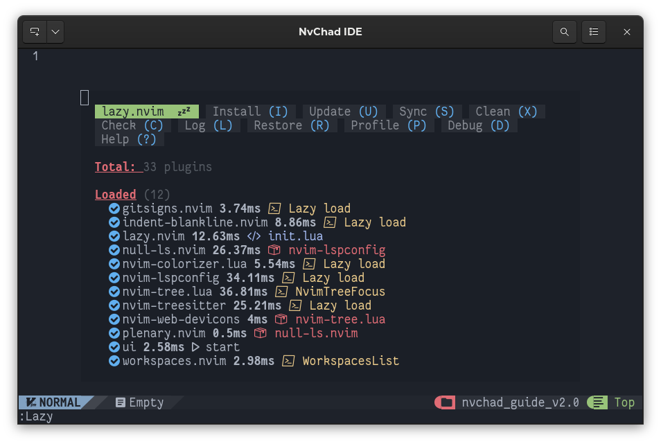
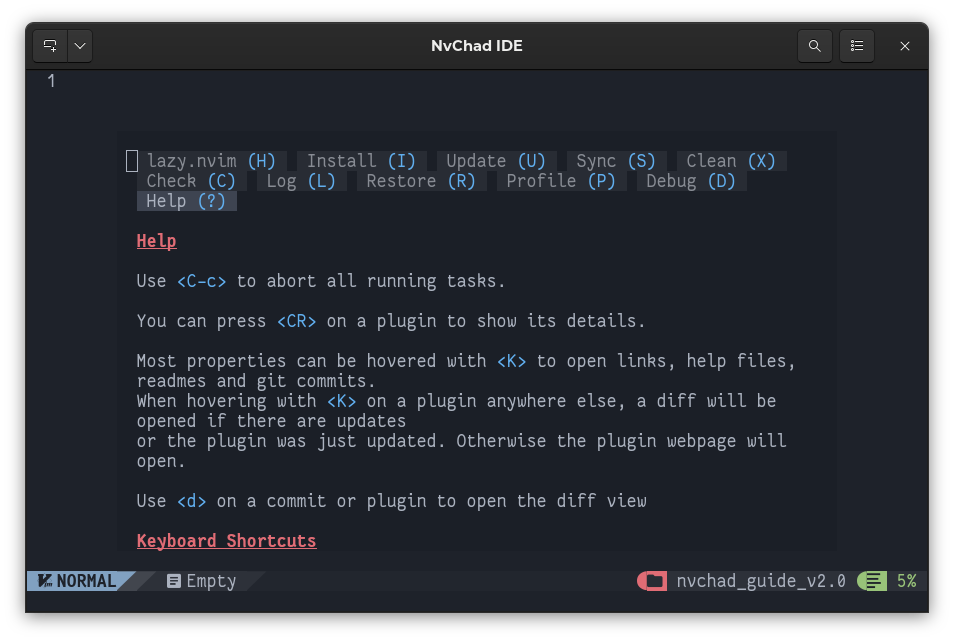
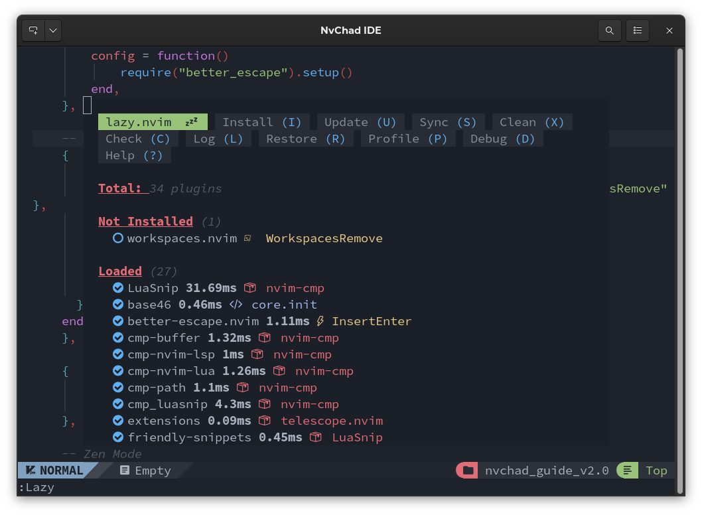
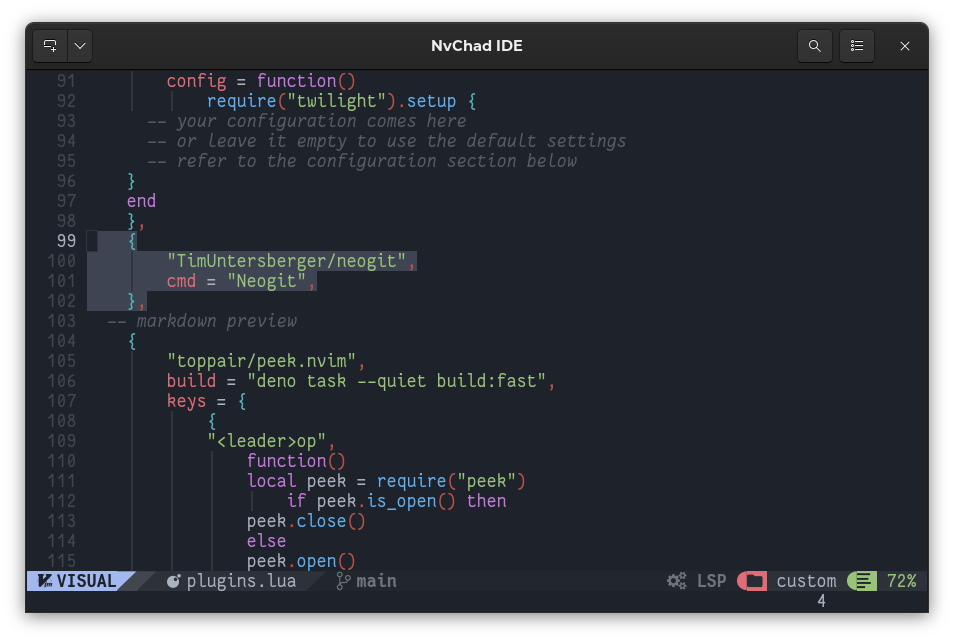
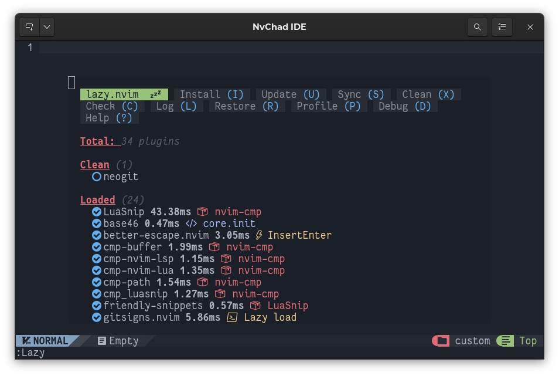
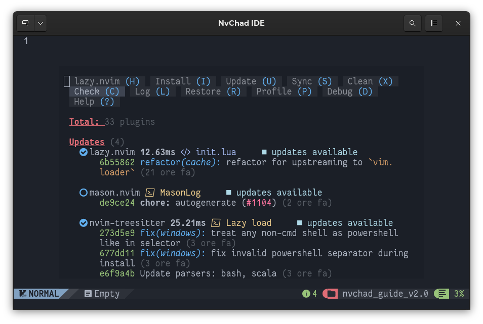
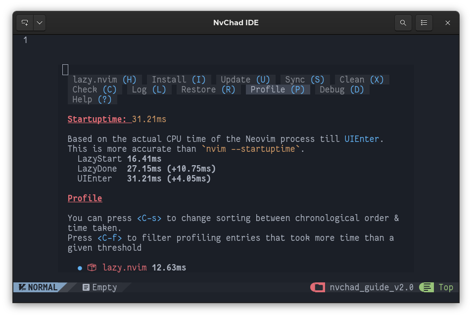
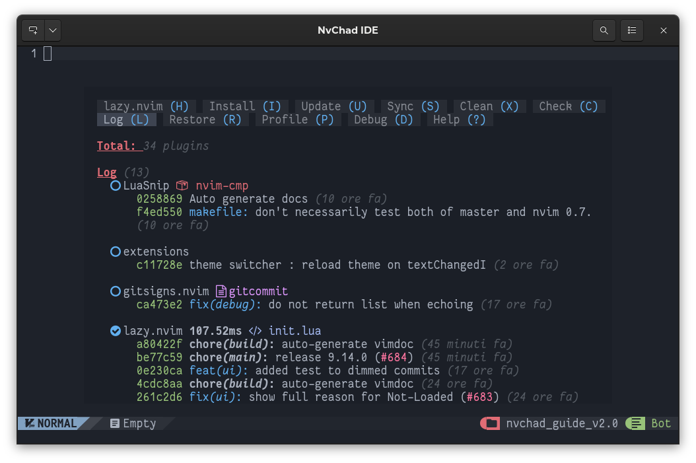
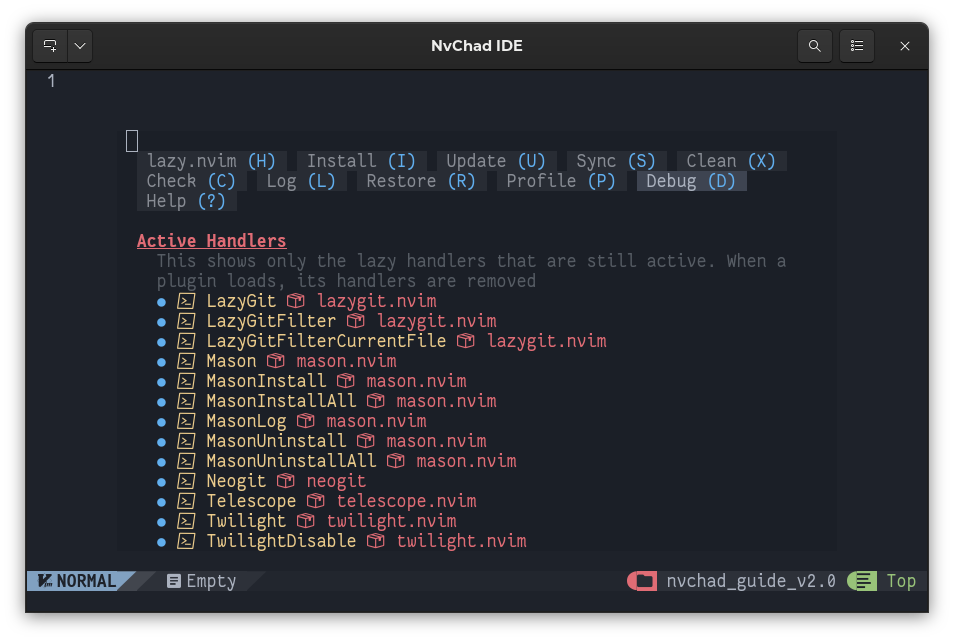

# :material-file-settings-outline: Gestione dei Plugin

La gestione dei plugin in NvChad 2.0 è affidata a [folke/lazy.nvim](https://github.com/folke/lazy.nvim), questo plugin viene installato durante la prima installazione dalla procedura di bootstrap. Il plugin consente di eseguire tutte le operazioni comuni sui plugin, come l'installazione, l'aggiornamento, ecc.



## :material-application-import: Caratteristiche Principali

- Gestione di tutte le operazioni sui plugins da un'interfaccia unificata.
- Prestazioni ottimizzate del plugin grazie al caching e alla compilazione del bytecode del modulo Lua.
- Controllo automatico e installazione dei plugin mancanti all'avvio, una funzione molto utile quando si trasferisce una configurazione da una macchina all'altra.
- Profiler per la consultazione dei tempi di caricamento dei plugin. Permette di monitorare e risolvere i problemi causati da plugins difettosi.
- Sincronizzazione dei plugin su più postazioni memorizzando la revisione di tutti i plugin installati nel file *lazy-lock.json*.

## :material-arrow-bottom-right-bold-outline: Operazioni Preliminari

*lazy.nvim* integra una funzione di controllo dello stato di salute dell'ambiente che può essere invocata con il comando `:checkhealth lazy`. Il comando dovrebbe restituire qualcosa del genere in un nuovo buffer:

```text
lazy: require("lazy.health").check()
========================================================================
## lazy.nvim
  - OK: Git installed
  - OK: no existing packages found by other package managers
  - OK: packer_compiled.lua not found
  - WARNING: {nvim-lspconfig}: overriding <config>
```

Anche se non è strettamente necessario, controllare l'ambiente di compilazione prima di iniziare a lavorare sulla nostra configurazione personalizzata ci permette di escludere questa variabile da eventuali errori o malfunzionamenti che potrebbero verificarsi nei plugins stessi o nella scrittura delle loro configurazioni.

Potrebbe anche essere interessante consultare l'aiuto in linea fornito dal plugin stesso. Per aprirlo si può usare il comando `:Lazy help` o richiamarlo dall'interfaccia del plugin digitando ++"?"++.



La guida fornisce un'introduzione alla navigazione dell'interfaccia, ai controlli e alle loro funzioni.

Ora, dopo aver controllato l'ambiente e aver acquisito le conoscenze di base, possiamo passare alla creazione della nostra configurazione. Lo scopo è chiaramente quello di aggiungere funzionalità all'editor per soddisfare le nostre esigenze e, poiché questo si ottiene includendo i plugins nella configurazione di NvChad, inizieremo aggiungendo un plugin.

## Inserimento di un plugin

Mentre la gestione dei plugin installati può essere comodamente eseguita dall'interfaccia *lazy.nvim*, l'inserimento di un nuovo plugin richiede la modifica manuale del file **lua/plugins/init.lua**.

In questo esempio installeremo il plugin [natecraddock/workspaces.nvim.](https://github.com/natecraddock/workspaces.nvim)  Questo plugin consente di salvare e utilizzare successivamente le sessioni di lavoro (workspace) in modo da potervi accedere rapidamente. Apriamo il file con:

```bash
nvim ~/.config/nvim/lua/plugins/init.lua
```

e inseriamo il seguente codice dopo il plugin *better-escape.nvim*:

```lua
    -- Workspaces
    {
        "natecraddock/workspaces.nvim",
        cmd = { "WorkspacesList", "WorkspacesAdd", "WorkspacesOpen", "WorkspacesRemove" },
        config = function()
            require("workspaces").setup {
        hooks = {
            open = "Telescope find_files",
        },
      }
    end,
    },
```

Una volta salvato il file, riceveremo una notifica con la richiesta di approvazione:

```text
# Config Change Detected. Reloading...

- **changed**: `lua/plugins/init.lua`
```

Questo grazie al meccanismo incorporato in *lazy.nvim* che controlla lo stato dei plugin e delle sue configurazioni e permette quindi di eseguire operazioni sui plugin senza dover uscire dall'editor.

Chiaramente risponderemo "sì".

Ora, se apriamo il gestore dei plugin con il comando `:Lazy`, scopriremo che il nostro plugin è stato riconosciuto ed è pronto per essere installato. Per installarlo, è sufficiente digitare ++"I"++



A questo punto sarà _lazy.nvim_ a occuparsi di scaricare il repository nel percorso **.local/share/nvim/lazy/** e di eseguire la compilazione. Una volta terminata l'installazione, avremo una nuova cartella denominata _workspaces.nvim_:

```text
.local/share/nvim/lazy/workspaces.nvim/
├── CHANGELOG.md
├── doc
│   ├── tags
│   └── workspaces.txt
├── LICENSE
├── lua
│   ├── telescope
│   │   └── _extensions
│   │       └── workspaces.lua
│   └── workspaces
│       ├── init.lua
│       └── util.lua
├── README.md
└── stylua.toml
```

Ora abbiamo le funzionalità del plugin che possono essere invocate con i comandi impostati nell'array:

```lua
cmd = { "WorkspacesList", "WorkspacesAdd", "WorkspacesOpen", "WorkspacesRemove" },
```

L'inserimento comporta anche l'aggiunta di una stringa al file *lazy-lock.json* per il monitoraggio dello stato e gli aggiornamenti successivi. La funzione del file *lazy-lock.json* sarà descritta nella sezione corrispondente.

```json
  "workspaces.nvim": { "branch": "master", "commit": "dd9574c8a6fbd4910bf298fcd1175a0222e9a09d" },
```

## :material-tray-remove: Rimozione di un plugin

Come per l'installazione, la rimozione di un plugin dalla configurazione avviene modificando manualmente il file *lua/plugins/init.lua*. Per seguire l'esempio, rimuoveremo il plugin appena installato.

Apriamo il nostro editor e rimuoviamo il plugin dalla configurazione. È possibile farlo comodamente selezionando con il mouse le righe da eliminare e premendo ++"x "++ per eliminarle e ++ctrl++ ++"s "++ per salvare il file.



Again we will receive a notice about the modification of the *init.lua* file to which we will answer "yes" and once we open *Lazy* we will have our plugin marked as to be removed. La rimozione viene eseguita premendo il tasto ++"X"++.



La rimozione di un plugin consiste fondamentalmente nella rimozione della cartella creata durante l'installazione.

## Aggiornamento dei Plugins

Una volta installati e configurati, i plugin sono gestiti in modo indipendente da *lazy.nvim*. Per verificare la presenza di aggiornamenti, è sufficiente aprire il manager e digitare ++"C"++. _Lazy_ controllerà i repository dei plugins installati_(git fetch_) e poi ci presenterà un elenco di plugins aggiornabili che, una volta controllati, possono essere aggiornati tutti in una volta con ++"U"++ o singolarmente dopo averli selezionati con ++"u"++.



!!! note "Nota"

    Anche se non è presente nella schermata precedente, se ci sono plugin con commit che includono "breaking changes", questi verranno visualizzati per primi.

Esiste anche la possibilità di eseguire l'intero ciclo di aggiornamento con il solo comando `Sync`. Dall'interfaccia digitando ++"S"++ o con il comando `:Lazy sync` invocheremo la funzione, che consiste nella concatenazione di `install` + `clean` + `update`.

Il processo di aggiornamento, sia individuale che cumulativo, modificherà anche il file _lazy-lock.json_. In particolare, i commit saranno modificati per sincronizzarli con lo stato del repository su GitHub.

## Funzionalità Aggiuntive

Nella scrittura del plugin, si è prestata particolare attenzione alle prestazioni e all'efficienza del codice, oltre a fornire un modo per valutare i tempi di avvio dei vari plugin. Viene fornito un _profiler_ che può essere invocato con il comando `:Lazy profile` o con il tasto ++"P"++ dall'interfaccia.



Qui si possono vedere i tempi di caricamento dei vari plugin, che possono essere ordinati con la combinazione di tasti ++ctrl++ ++"s "++ per voce nella configurazione o per tempo di caricamento. Possiamo anche eseguire ricerche sul tempo di caricamento dei plugin impostando una soglia minima in millisecondi con la combinazione ++ctrl++ ++"f "++.

Queste informazioni possono essere utili per la risoluzione dei problemi se l'editor rallenta in modo anomalo.

Il plugin fornisce anche una visualizzazione delle ultime operazioni eseguite sui plugins, visualizzazione che può essere richiamata con il tasto ++"L"++ dall'interfaccia o con il comando `:Lazy log` dall'editor stesso.



Integra anche una funzione di debug che ci permette di controllare i gestori attivi in lazy-loading e ciò che è presente nella cache del modulo. Per attivarlo possiamo utilizzare il tasto ++"D"++ dall'interfaccia o invocarlo con il comando `:Lazy debug`.



## Sincronizzazione

Lazy.nvim consente la sincronizzazione di tutti i plugin installati, memorizzando il loro stato in un file _json_. Al suo interno, per ogni plugin viene creata una stringa che contiene il nome della cartella corrispondente al plugin installato che si trova in **~/.local/share/nvim/lazy/**, il ramo corrispondente e il commit utilizzato per la sincronizzazione dal repository GitHub. Il file utilizzato a questo scopo è il file `lazy-lock.json` che si trova nella cartella principale di **~/.config/nvim**. Qui sotto possiamo vedere un estratto del file:

```json
{
  "Comment.nvim": { "branch": "master", "commit": "8d3aa5c22c2d45e788c7a5fe13ad77368b783c20" },
  "LuaSnip": { "branch": "master", "commit": "025886915e7a1442019f467e0ae2847a7cf6bf1a" },
  "base46": { "branch": "v2.0", "commit": "eea1c3155a188953008bbff031893aa8cb0610e9" },
  "better-escape.nvim": { "branch": "master", "commit": "426d29708064d5b1bfbb040424651c92af1f3f64" },
  "cmp-buffer": { "branch": "main", "commit": "3022dbc9166796b644a841a02de8dd1cc1d311fa" },
  "cmp-nvim-lsp": { "branch": "main", "commit": "0e6b2ed705ddcff9738ec4ea838141654f12eeef" },
  "cmp-nvim-lua": { "branch": "main", "commit": "f3491638d123cfd2c8048aefaf66d246ff250ca6" },
  "cmp-path": { "branch": "main", "commit": "91ff86cd9c29299a64f968ebb45846c485725f23" },
  "cmp_luasnip": { "branch": "master", "commit": "18095520391186d634a0045dacaa346291096566" },
...
```

Grazie alla memorizzazione dei commit, possiamo vedere esattamente lo stato del plugin nel repository al momento dell'installazione o dell'aggiornamento. Questo ci permette, attraverso la funzione di `restore`, di riportarlo o portarlo allo stesso stato anche nell'editor. La funzione, richiamabile con il tasto ++"R"++ dall'interfaccia o con `:Lazy restore`, aggiorna tutti i plugin dell'editor allo stato definito nel file _lazy-lock.json_.

Copiando il file _lazy-lock.json_ da una configurazione stabile in un posto sicuro, si ha la possibilità di ripristinare l'editor in quella condizione se un aggiornamento dovesse creare problemi. Esportandolo invece su un'altra stazione di lavoro, possiamo utilizzarlo per configurare l'editor con le stesse funzionalità.

Se invece lo mettiamo sotto un controllo di versione, possiamo ottenere la sincronizzazione della configurazione tra tutte le postazioni di lavoro utilizzate.

Dopo aver descritto il gestore dei plugin, possiamo passare ad analizzare l'interfaccia utente.
