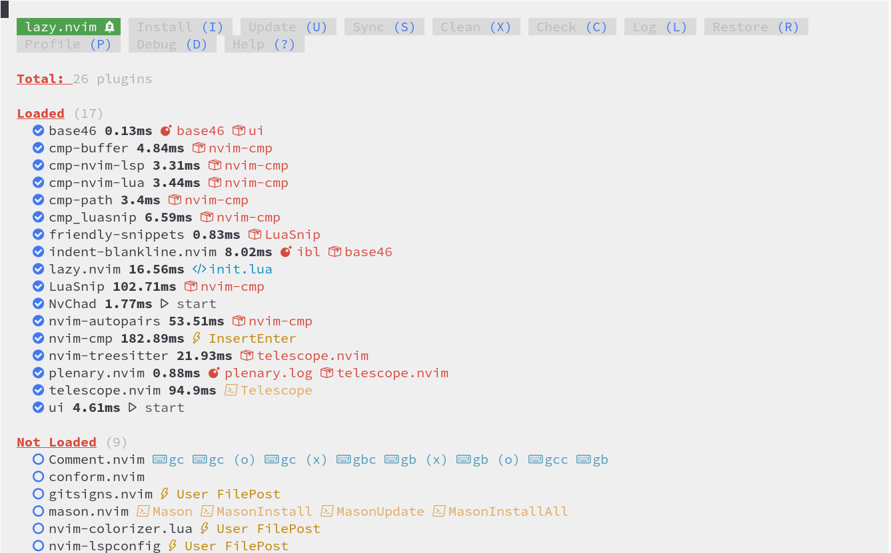
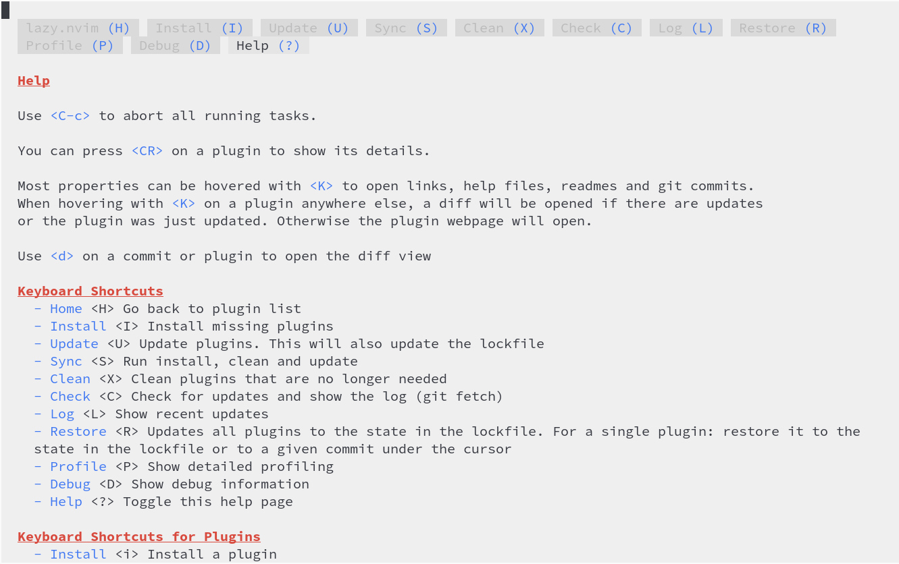
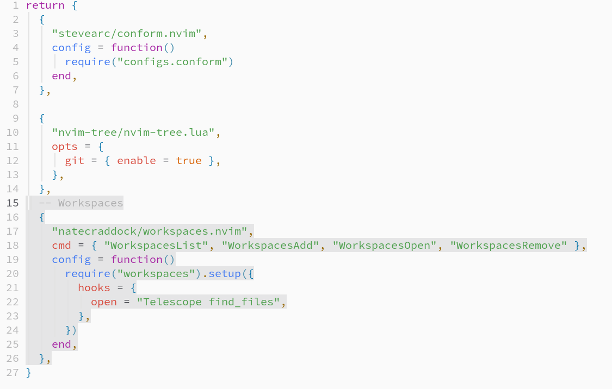

# 플러그인 관리자

NvChad 2.0의 플러그인 관리는 [folke/lazy.nvim](https://github.com/folke/lazy.nvim)에서 수행하며, 이 플러그인은 부트스트랩 절차를 통해 첫 번째 설치 시 설치됩니다. 이 플러그인을 사용하면 플러그인의 설치, 업데이트 등과 같은 모든 일반 작업을 수행할 수 있습니다.



## 주요 기능

- 통합 인터페이스를 통한 모든 플러그인 작업 관리
- Lua 모듈 바이트 코드의 캐싱 및 컴파일에 의한 플러그인 성능 최적화
- 부팅 시 누락된 플러그인의 자동 확인 및 설치 기능. 한 컴퓨터에서 다른 컴퓨터로 설정을 전송할 때 매우 유용한 기능입니다.
- 플러그인 로딩 시간을 컨설팅하기 위한 프로파일러. 문제가 있는 플러그인으로 인한 문제를 모니터링하고 해결할 수 있는 플러그인 로딩 시간을 분석하는 프로파일러
- _lazy-lock.json_ 파일에 설치된 모든 플러그인의 리비전을 저장하여 여러 작업 환경 간 플러그인 동기화 기능

## 사전 작업:

_lazy.nvim_은 환경 상태를 확인하는 기능을 내장하고 있습니다. 이 기능은 `:checkhealth lazy` 명령을 사용하여 호출할 수 있습니다. 이 명령은 새로운 버퍼에 다음과 유사한 결과를 반환해야 합니다.

```text
lazy: require("lazy.health").check()
========================================================================
## lazy.nvim
  - OK: Git installed
  - OK: no existing packages found by other package managers
  - OK: packer_compiled.lua not found
  - WARNING: {nvim-lspconfig}: overriding <config>
```

엄격하게 필요하지는 않지만, 사용자 정의 구성 작업을 시작하기 전에 빌드 환경을 확인하는 것은 플러그인 자체나 해당 플러그인의 설정 작성에 발생할 수 있는 오류 또는 잘못된 작동과 같은 변수를 오류에서 제외할 수 있도록 도와줍니다.

또한 플러그인 자체에서 제공하는 인라인 도움말을 확인하는 것도 유용할 수 있습니다. `:Lazy help` 명령을 사용하거나 플러그인 인터페이스에서 <kbd>?</kbd>를 입력하여 열 수 있습니다.



도움말은 인터페이스 탐색, 컨트롤 및 해당 기능에 대한 소개를 제공합니다.

이제 환경을 확인하고 기본 지식을 얻은 후 자체 구성을 생성할 수 있습니다. 분명히 목적은 편집기에 기능을 추가하여 우리의 요구 사항을 충족하는 것이며 NvChad 구성에 플러그인을 포함하여 달성되므로 플러그인을 추가하는 것으로 시작하겠습니다.

## 플러그인 추가하기

!!! 참고 사항

    이 예에서는 NvChad를 설치하는 동안 _template chadrc_를 사용하여 `custom` 폴더 구조를 생성하도록 선택했다고 가정합니다.

설치된 Plugin 관리는 _lazy.nvim_ 인터페이스에서 편리하게 할 수 있지만, 새로운 Plugin을 삽입하려면 **custom/plugins.lua**파일을 수동으로 수정해야 합니다.

이 예제에서는 [natecraddock/workspaces.nvim](https://github.com/natecraddock/workspaces.nvim) 플러그인을 설치해보겠습니다. 이 플러그인은 작업 세션(워크스페이스)을 저장하고 나중에 빠르게 액세스할 수 있도록 해주는 기능을 제공합니다. 다음 명령을 사용하여 파일을 엽니다:

```bash
nvim ~/.config/nvim/lua/custom/plugins.lua
```

플러그인 _better-escape.nvim_ 뒤에 다음 코드를 삽입합니다.

```lua
    -- Workspaces
    {
        "natecraddock/workspaces.nvim",
        cmd = { "WorkspacesList", "WorkspacesAdd", "WorkspacesOpen", "WorkspacesRemove" },
        config = function()
            require("workspaces").setup {
        hooks = {
            open = "Telescope find_files",
        },
      }
    end,
    },
```

파일을 저장하면 플러그인 변경에 대한 승인을 요청하는 안내가 표시됩니다:

```text
# Config Change Detected. Reloading...

> - **changed**: `plugins.lua`
```

이는 _lazy.nvim_ 에 내장된 메커니즘 덕분에 플러그인 및 해당 구성의 상태를 확인하고, 편집기를 종료할 필요 없이 플러그인 작업을 수행할 수 있게 해주는 것입니다. 이는 1.0 버전에서는 필요한 작업이었습니다.

분명히 우리는 "yes."라고 대답할 것이며 따라서 버전 1.0에서 필요했던 작업인 편집기를 종료하지 않고도 플러그인 작업을 수행할 수 있습니다.

이제 `:Lazy` 명령을 사용하여 플러그인 관리자를 열면 우리의 플러그인이 인식되고 설치할 준비가 된 것을 확인할 수 있습니다. 설치하려면 <kbd>I</kbd>를 입력하기만 하면 됩니다.


이때 **.local/share/nvim/lazy/**경로에 있는 리포지토리를 다운로드하고 빌드를 수행하는 것은 _lazy.nvim_이 됩니다. 설치가 완료되면 _workspaces.nvim_이라는 새 폴더가 생깁니다.

```text
.local/share/nvim/lazy/workspaces.nvim/
├── CHANGELOG.md
├── doc
│   ├── tags
│   └── workspaces.txt
├── LICENSE
├── lua
│   ├── telescope
│   │   └── _extensions
│   │       └── workspaces.lua
│   └── workspaces
│       ├── init.lua
│       └── util.lua
├── README.md
└── stylua.toml
```

이제 우리는 cmd 배열에 설정된 명령어를 사용하여 플러그인 기능을 사용할 수 있게 됩니다.

```lua
cmd = { "WorkspacesList", "WorkspacesAdd", "WorkspacesOpen", "WorkspacesRemove" },
```

입력에는 상태 추적 및 후속 업데이트를 위해 _lazy-lock.json_ 파일에 문자열을 추가하는 작업도 포함됩니다. _lazy-lock.json_ 파일의 기능은 아래 해당 섹션에서 설명합니다.

```json
  "workspaces.nvim": { "branch": "master", "commit": "dd9574c8a6fbd4910bf298fcd1175a0222e9a09d" },
```
## 플러그인 제거

설치와 마찬가지로 구성에서 플러그인을 제거할 때도 _custom/plugins.lua_ 파일을 수동으로 편집해야 합니다. 이 예시에서는 [TimUntersberger/neogit](https://github.com/TimUntersberger/neogit) 플러그인을 제거하여 편집기에서 직접 git 저장소를 관리할 수 있습니다.

!!! 참고 사항

    플러그인의 선택은 완전히 무작위입니다. 이 예시에 사용된 플러그인은 NvChad에서 문제 없이 작동하는 것으로 알려져 있습니다.

편집기를 열고 구성에서 플러그인을 제거합니다. 삭제할 행 4개를 마우스로 선택한 후 <kbd>x</kbd>를 눌러 삭제하고 <kbd>CTRL</kbd> + <kbd>s</kbd>을 눌러 파일을 저장하면 편리합니다.



다시 _plugins.lua_ 파일의 수정에 대한 알림을 받게 되며 "yes"라고 대답하고 _Lazy_를 열면 플러그인이 제거된 것으로 표시됩니다. <kbd>X</kbd> 키를 누르면 제거됩니다.


플러그인 제거는 기본적으로 설치 중에 생성된 폴더를 삭제하는 것입니다.

## 플러그인 업데이트

플러그인이 설치되고 구성되면 _lazy.nvim_에 의해 독립적으로 관리됩니다. 업데이트를 확인하려면 관리자를 열고 <kbd>C</kbd>를 입력하십시오. _Lazy_는 설치된 플러그인의 저장소를 확인한 다음(_git fetch_) 목록을 표시합니다. 업데이트 가능한 플러그인은 <kbd>U</kbd>로 한 번에 업데이트하거나 <kbd>u</kbd>로 선택한 후 개별적으로 업데이트할 수 있습니다.


!!! 참고 사항

    위의 스크린샷에 없더라도 "breaking changes"가 포함된 커밋이 있는 플러그인이 있다면 이들이 먼저 표시됩니다.

`Sync` 명령만으로 전체 업데이트 주기를 실행할 수도 있습니다. 인터페이스에서 <kbd>S</kbd>를 입력하거나 `:Lazy sync` 명령을 사용하여 `install` + `clean` + `update`의 연결로 구성된 기능을 호출합니다.

개별적으로 수행되는 업데이트 과정은 _lazy-lock.json_ 파일도 수정합니다. 특히 커밋은 GitHub 리포지토리의 상태와 동기화하기 위해 수정됩니다.

## 추가 기능

추가 기능으로는 플러그인의 시작 시간을 평가하는 방법을 제공하기 위해 성능과 코드 효율성에 특별한 주의가 기울여졌습니다. <kbd>P</kbd> 키 또는 인터페이스에서 `:Lazy profile` 명령어를 사용하여 _profiler_ 를 호출할 수 있습니다.


여기에서 키 조합으로 정렬할 수 있는 다양한 플러그인의 로딩 시간을 볼 수 있습니다. <knd><kbd>CTRL</kbd> + <kbd>s</kbd> 구성의 항목별 또는 로드 시간별로 지정합니다. 또한 <kbd>CTRL</kbd> + <kbd>f</kbd> 조합으로 밀리초 단위로 최소 임계값을 설정하여 플러그인 로딩 시간에 대한 검색을 수행할 수 있습니다.

이 정보는 에디터가 비정상적으로 느려질 때 문제 해결에 유용할 수 있습니다.

플러그인은 또한 플러그인에 대한 최근 작업을 표시하는 기능을 제공합니다. 이는 인터페이스에서 <kbd>L</kbd> 키를 누르거나 에디터에서 `:Lazy log` 명령어로 호출할 수 있습니다.


또한 모듈 캐시에 있는 활성 lazy-loading 핸들러와 내용을 확인할 수 있는 디버깅 기능을 통합하고 있습니다. 인터페이스에서 <kbd>D</kbd> 키를 사용하거나 `:Lazy debug`명령어로 호출하여 활성 lazy-loading 핸들러와 모듈 캐시 내용을 확인할 수 있습니다.


## 동기화

Lazy.nvim은 모든 설치된 플러그인을 상태를 _json_ 파일에 저장하여 동기화할 수 있습니다. 이를 위해 **~/.local/share/nvim/lazy/**에 설치된 플러그인에 해당하는 폴더 이름, 해당 브랜치, GitHub 리포지토리에서 동기화에 사용되는 커밋을 포함하는 문자열이 생성됩니다. 이를 위해 사용되는 파일은 **~/.config/nvim**의 루트 폴더에 위치한 `lazy-lock.json` 파일입니다. 아래는 파일의 일부분입니다.

```json
{
  "Comment.nvim": { "branch": "master", "commit": "8d3aa5c22c2d45e788c7a5fe13ad77368b783c20" },
  "LuaSnip": { "branch": "master", "commit": "025886915e7a1442019f467e0ae2847a7cf6bf1a" },
  "base46": { "branch": "v2.0", "commit": "eea1c3155a188953008bbff031893aa8cb0610e9" },
  "better-escape.nvim": { "branch": "master", "commit": "426d29708064d5b1bfbb040424651c92af1f3f64" },
  "cmp-buffer": { "branch": "main", "commit": "3022dbc9166796b644a841a02de8dd1cc1d311fa" },
  "cmp-nvim-lsp": { "branch": "main", "commit": "0e6b2ed705ddcff9738ec4ea838141654f12eeef" },
  "cmp-nvim-lua": { "branch": "main", "commit": "f3491638d123cfd2c8048aefaf66d246ff250ca6" },
  "cmp-path": { "branch": "main", "commit": "91ff86cd9c29299a64f968ebb45846c485725f23" },
  "cmp_luasnip": { "branch": "master", "commit": "18095520391186d634a0045dacaa346291096566" },
...
```

커밋 저장을 통해 설치 또는 업데이트 시점의 플러그인의 정확한 상태를 확인할 수 있습니다. 이를 통해 `복원` 기능을 사용하여 해당 플러그인을 에디터에서 이전 상태로 되돌리거나 동일한 상태로 가져올 수 있습니다. <kbd>R</kbd> 키를 사용하여 인터페이스에서 호출하거나 `:Lazy restore` 명령어를 사용하여 모든 플러그인을 lazy-lock.json 파일에 정의된 상태로 업데이트하는 기능을 사용할 수 있습니다.

_lazy-lock.json_ 파일을 안전한 위치에 있는 안정적인 구성에서 복사함으로써 업데이트로 인해 문제가 발생한 경우 에디터를 해당 상태로 복원할 수 있습니다. 대신 다른 워크스테이션으로 내보내면 동일한 기능을 가진 에디터를 구성하는 데 사용할 수 있습니다.

대신 버전 관리에 포함시키면 사용하는 모든 워크스테이션 간에 구성 동기화를 달성할 수 있습니다.

이제 플러그인 관리자를 설명한 후에 사용자 인터페이스를 분석하기 위해 진행할 수 있습니다.
