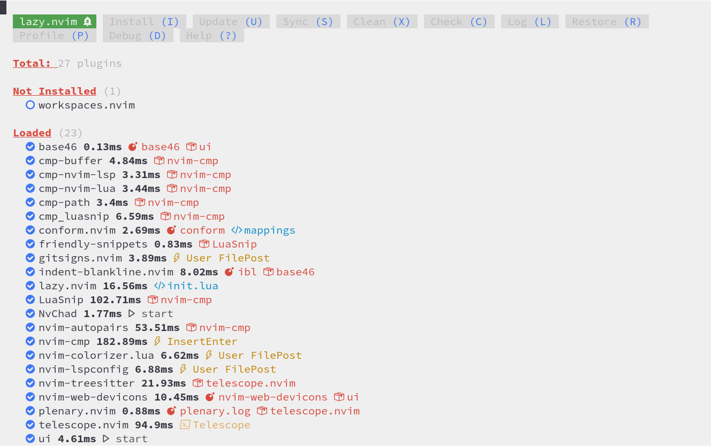
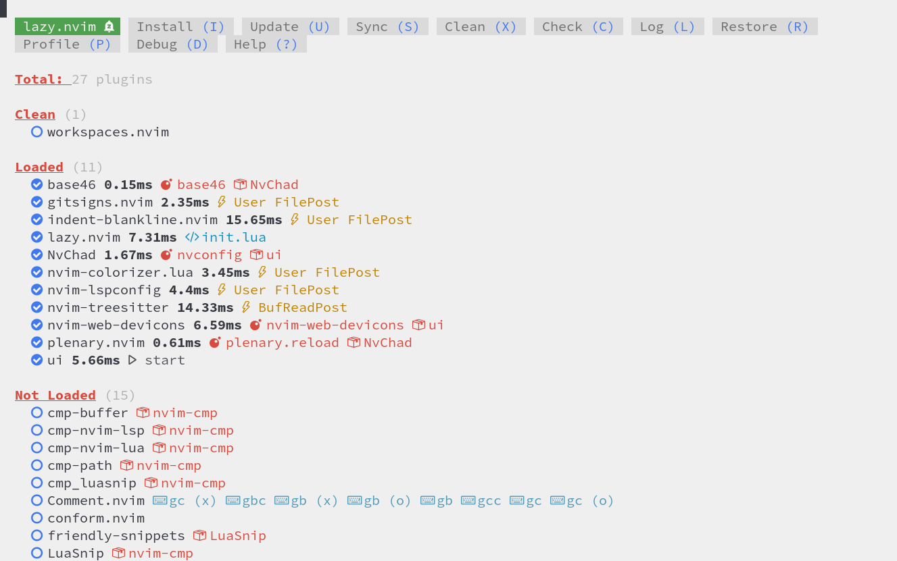
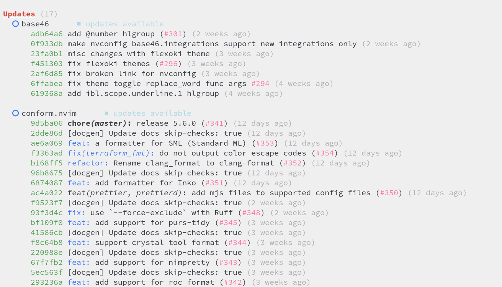
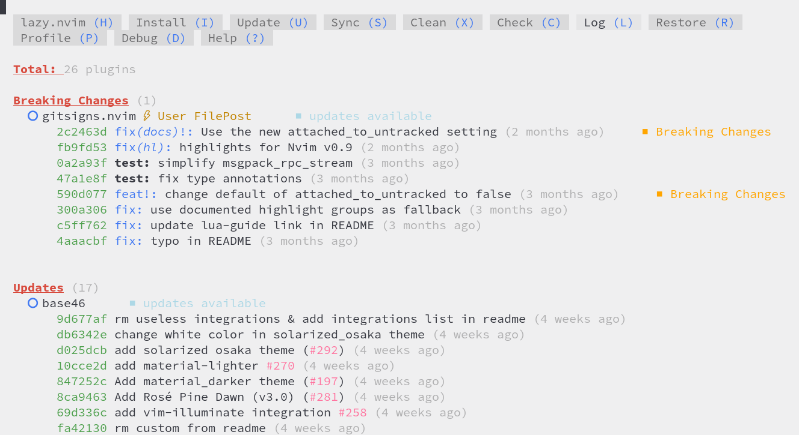

# Менеджер плагінів

Керування плагінами в NvChad 2.0 здійснюється за допомогою [folke/lazy.nvim](https://github.com/folke/lazy.nvim), цей плагін встановлюється під час першої інсталяції з процедури bootstrap. Плагін дозволяє виконувати всі типові операції з плагінами, такі як встановлення, оновлення тощо.


## :material-application-import: Основні особливості

- Управління всіма операціями над плагінами з єдиного інтерфейсу.
- Оптимізована продуктивність плагіна за рахунок кешування та компіляції байт-коду модуля Lua.
- Автоматична перевірка та встановлення відсутніх плагінів під час запуску, дуже корисна функція під час перенесення конфігурації з однієї машини на іншу.
- Профайлер для консультації щодо часу завантаження плагіна. Дозволяє відстежувати та усувати проблеми, спричинені несправними плагінами.
- Синхронізація плагінів на кількох робочих станціях шляхом збереження версій усіх встановлених плагінів у файлі _lazy-lock.json_.

## :material-arrow-bottom-right-bold-outline: Попередні операції

_lazy.nvim_ інтегрує функцію перевірки стану середовища, яку можна викликати командою `:checkhealth lazy`. Команда має повернути щось подібне до нового буфера:

```text
lazy: require("lazy.health").check()
========================================================================
## lazy.nvim
  - OK: Git installed
  - OK: no existing packages found by other package managers
  - OK: packer_compiled.lua not found
  - WARNING: {nvim-lspconfig}: overriding <config>
```

Хоча це і не обов’язково, перевірка середовища збірки перед тим, як ми почнемо працювати над нашою спеціальною конфігурацією, дозволяє нам виключити цю змінну з будь-яких помилок або несправностей, які можуть виникнути в самих плагінах або під час написання їхніх конфігурацій.

Також може бути цікаво переглянути вбудовану довідку, надану самим плагіном. Щоб відкрити його, ми можемо скористатися командою `:Lazy help` або викликати його з інтерфейсу плагіна, ввівши ++"?"++.


Довідка надає інформацію про навігацію інтерфейсом, елементами керування та їхніми функціями.

Тепер, перевіривши середовище та отримавши базові знання, ми можемо перейти до створення власної конфігурації. Мета полягає в тому, щоб додати функціональність до редактора, щоб задовольнити наші потреби, і оскільки це досягається шляхом включення плагінів у конфігурацію NvChad, ми почнемо з додавання плагіна.

## :material-location-enter: Вставити плагін

Хоча керування встановленими плагінами можна зручно виконувати з інтерфейсу _lazy.nvim_, вставлення нового плагіна потребує редагування файлу **lua/plugins/init.lua** вручну.

У цьому прикладі ми встановимо плагін [natecraddock/workspaces.nvim](https://github.com/natecraddock/workspaces.nvim). Цей плагін дозволяє зберігати та пізніше використовувати робочі сеанси (робочі області), щоб мати до них швидкий доступ. Відкриваємо файл за допомогою:

```bash
nvim ~/.config/nvim/lua/plugins/init.lua
```

і ми вставляємо наступний код після плагіна _better-escape.nvim_:

```lua
    -- Workspaces
    {
        "natecraddock/workspaces.nvim",
        cmd = { "WorkspacesList", "WorkspacesAdd", "WorkspacesOpen", "WorkspacesRemove" },
        config = function()
            require("workspaces").setup {
        hooks = {
            open = "Telescope find_files",
        },
      }
    end,
    },
```

Щойно файл буде збережено, ми отримаємо сповіщення з запитом на наше схвалення:

```text
# Config Change Detected. Reloading...

- **changed**: `lua/plugins/init.lua`
```

Це завдяки механізму, вбудованому в _lazy.nvim_, який перевіряє стан плагінів та їхні конфігурації, що дозволяє виконувати операції з плагінами без виходу з редактора.

Однозначно ми відповімо «так».

Тепер, якщо ми відкриємо менеджер плагінів за допомогою команди `:Lazy`, ми побачимо, що наш плагін розпізнано та готовий до встановлення. Щоб встановити його, просто введіть ++"I"++



На цьому етапі саме _lazy.nvim_ подбає про завантаження репозиторію за шляхом **.local/share/nvim/lazy/** та виконання збірки. Після завершення встановлення у нас буде нова папка з назвою _workspaces.nvim_:

```text
.local/share/nvim/lazy/workspaces.nvim/
├── CHANGELOG.md
├── doc
│   ├── tags
│   └── workspaces.txt
├── LICENSE
├── lua
│   ├── telescope
│   │   └── _extensions
│   │       └── workspaces.lua
│   └── workspaces
│       ├── init.lua
│       └── util.lua
├── README.md
└── stylua.toml
```

Тепер у нас буде функція плагіна, яку можна викликати за допомогою команд, налаштованих у масиві:

```lua
cmd = { "WorkspacesList", "WorkspacesAdd", "WorkspacesOpen", "WorkspacesRemove" },
```

Вхідні дані також включають додавання рядка до файлу _lazy-lock.json_ для відстеження статусу та подальших оновлень. Функцію файлу _lazy-lock.json_ буде описано у відповідному розділі нижче.

```json
  "workspaces.nvim": { "branch": "master", "commit": "dd9574c8a6fbd4910bf298fcd1175a0222e9a09d" },
```

## :material-tray-remove: Видалення плагіна

Як і під час встановлення, видалення плагіна з конфігурації відбувається через ручне редагування файлу _lua/plugins/init.lua_. Щоб наслідувати приклад, ми видалимо щойно встановлений плагін.

Відкриваємо наш редактор і видаляємо плагін з конфігурації. Це зручно зробити, вибравши рядки, які потрібно видалити, за допомогою миші, а потім натиснувши ++"x"++, щоб видалити їх, і ++ctrl++ + ++"s"++, щоб зберегти файл.


Знову ж таки, ми отримаємо повідомлення про модифікацію файлу _init.lua_, на яке відповімо «так», і щойно ми відкриємо _Lazy_, наш плагін буде позначено як такий, що підлягає видаленню. Видалення виконується натисканням клавіші ++"X"++.



Видалення плагіна в основному складається з видалення папки, створеної під час встановлення.

## Оновлення плагінів

Після встановлення та налаштування плагінів вони керуються незалежно за допомогою _lazy.nvim_. Щоб перевірити наявність оновлень, просто відкрийте менеджер і введіть ++"C"++. _Lazy_ перевірить репозиторії встановлених плагінів (_git fetch_), а потім надасть нам список оновлюваних плагінів, які після перевірки можна оновити одночасно за допомогою ++"U"++ або окремо після вибору їх за допомогою ++"u"++.



!!! note

    Навіть якщо їх немає на знімку екрана вище, якщо є плагіни з комітами, включаючи «небезпечні зміни», вони відображатимуться першими.

Також існує можливість запустити весь цикл оновлення лише за допомогою команди `Sync`. З інтерфейсу, набравши ++"S"++ або за допомогою команди `:Lazy sync`, ми викличемо функцію, яка складається з конкатенації `install` + `clean` + `update`.

Процес оновлення, незалежно від того, чи виконується він окремо, чи сукупно, також змінить файл _lazy-lock.json_. Зокрема, коміти будуть змінені для їх синхронізації зі станом репозиторію на GitHub.

## Додаткові можливості

Під час написання плагіна особливу увагу було приділено продуктивності та ефективності коду, а також щоб дати нам можливість оцінити час запуску різних плагінів. Нам надається _профайлер_, який можна викликати командою `:Lazy profile` або натисканням клавіші ++"P"++ з інтерфейсу.


Тут ми можемо побачити час завантаження різних плагінів, які можна відсортувати за допомогою комбінації клавіш ++ctrl++ + ++"s"++ за записом конфігурації або часом завантаження. Ми також можемо шукати час завантаження плагінів, встановивши мінімальний поріг у мілісекундах за допомогою комбінації ++ctrl++ + ++"f"++.

Ця інформація може бути корисною для усунення несправностей, якщо редактор сповільнюється ненормально.

Плагін також надає відображення останніх операцій, виконаних над плагінами, дисплей, який можна викликати за допомогою клавіші ++"L"++ з інтерфейсу або за допомогою команди `:Lazy log` з самого редактору.



Він також інтегрує функцію налагодження, яка дозволяє нам перевіряти активні обробники відкладеного завантаження та те, що знаходиться в кеші модуля. Щоб активувати його, ми можемо скористатися клавішею ++"D"++ з інтерфейсу або викликати його за допомогою команди `:Lazy debug`.


## Синхронізація

Lazy.nvim дозволяє синхронізувати всі встановлені плагіни, зберігаючи їхній стан у файлі _json_. У ньому для кожного плагіна створюється рядок, який містить назву папки, що відповідає встановленому плагіну, знайденому в **~/.local/share/nvim/lazy/**, відповідну гілку та коміт, що використовується для синхронізації з репозиторію GitHub. Для цієї мети використовується файл `lazy-lock.json`, розташований у кореневій папці **~/.config/nvim**. Нижче ми можемо побачити уривок файлу:

```json
{
  "Comment.nvim": { "branch": "master", "commit": "8d3aa5c22c2d45e788c7a5fe13ad77368b783c20" },
  "LuaSnip": { "branch": "master", "commit": "025886915e7a1442019f467e0ae2847a7cf6bf1a" },
  "base46": { "branch": "v2.0", "commit": "eea1c3155a188953008bbff031893aa8cb0610e9" },
  "better-escape.nvim": { "branch": "master", "commit": "426d29708064d5b1bfbb040424651c92af1f3f64" },
  "cmp-buffer": { "branch": "main", "commit": "3022dbc9166796b644a841a02de8dd1cc1d311fa" },
  "cmp-nvim-lsp": { "branch": "main", "commit": "0e6b2ed705ddcff9738ec4ea838141654f12eeef" },
  "cmp-nvim-lua": { "branch": "main", "commit": "f3491638d123cfd2c8048aefaf66d246ff250ca6" },
  "cmp-path": { "branch": "main", "commit": "91ff86cd9c29299a64f968ebb45846c485725f23" },
  "cmp_luasnip": { "branch": "master", "commit": "18095520391186d634a0045dacaa346291096566" },
...
```

Завдяки виділеному сховищу ми можемо бачити стан плагіна в репозиторії під час встановлення чи оновлення. Це дозволяє нам, за допомогою функції `restore`, повернути його або привести до того ж стану також у редакторі. Функція, яку можна викликати за допомогою клавіші ++"R"++ з інтерфейсу або за допомогою `:Lazy restore`, оновлює всі плагіни в редакторі до стану, визначеного у файлі _lazy-lock.json_.

Скопіювавши файл _lazy-lock.json_ зі стабільної конфігурації в безпечне місце, ми маємо можливість відновити редактор до цього стану, якщо оновлення створить проблеми. Експортувавши його на іншу робочу станцію, ми можемо використовувати його для налаштування редактора з тією самою функціональністю.

Якщо натомість ми поставимо його під керування версіями, ми зможемо досягти синхронізації конфігурації між усіма робочими станціями, які ми використовуємо.

Тепер, проілюструвавши диспетчер плагінів, ми можемо перейти до аналізу інтерфейсу користувача.
