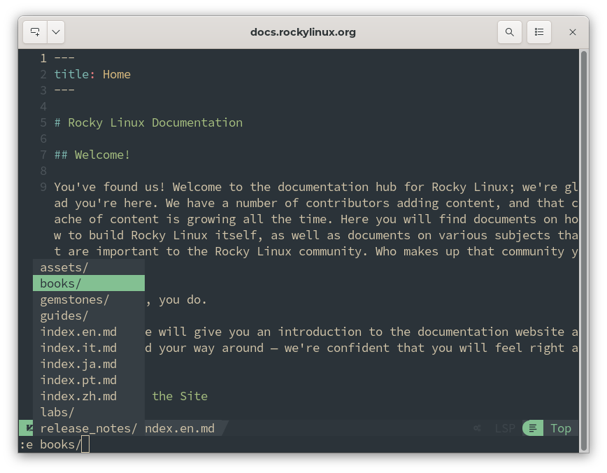
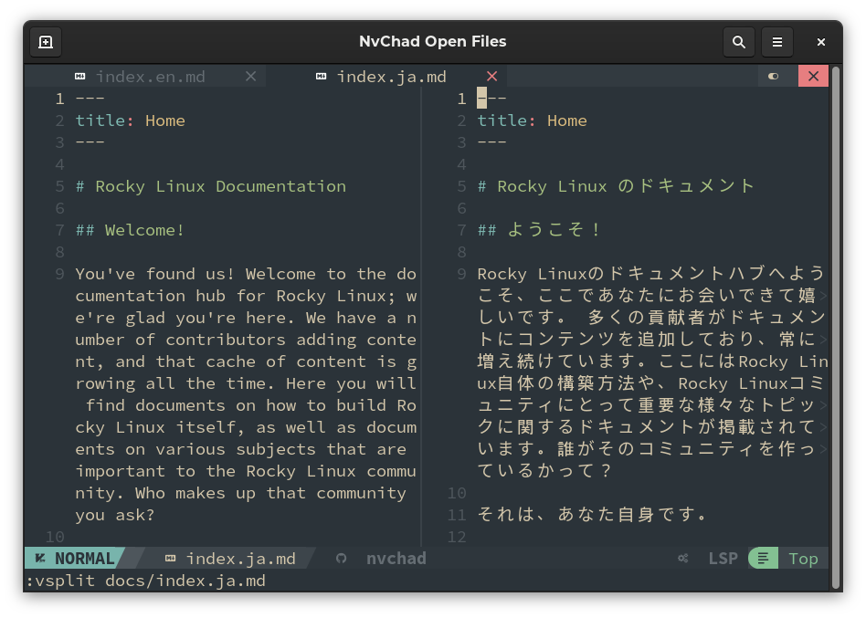
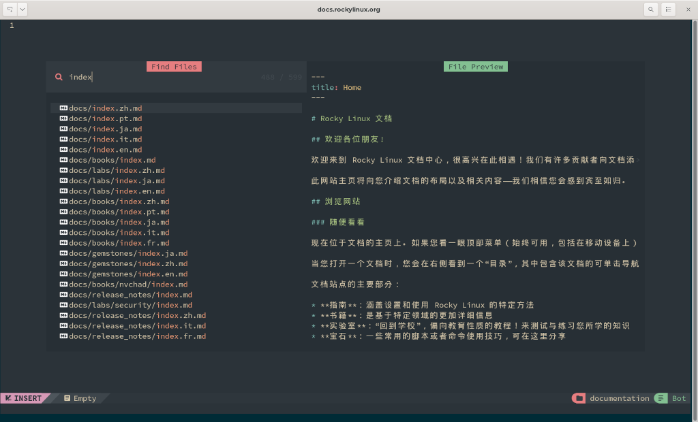
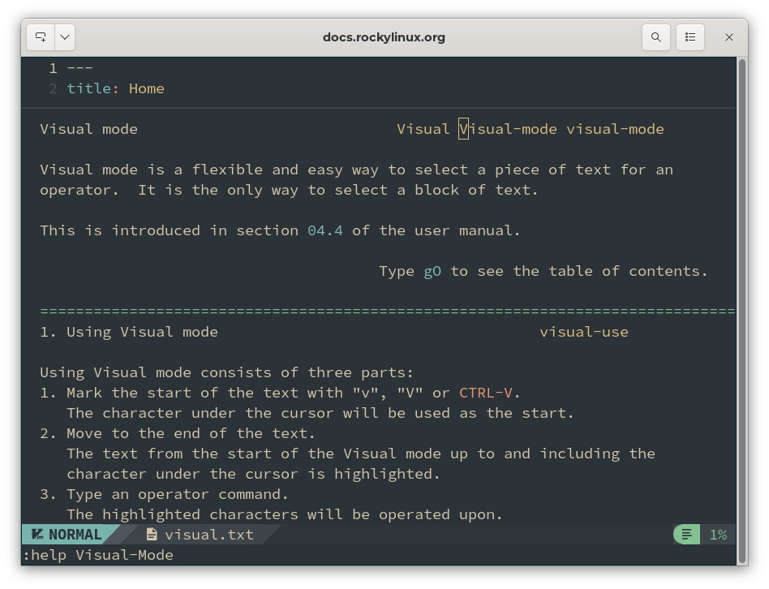
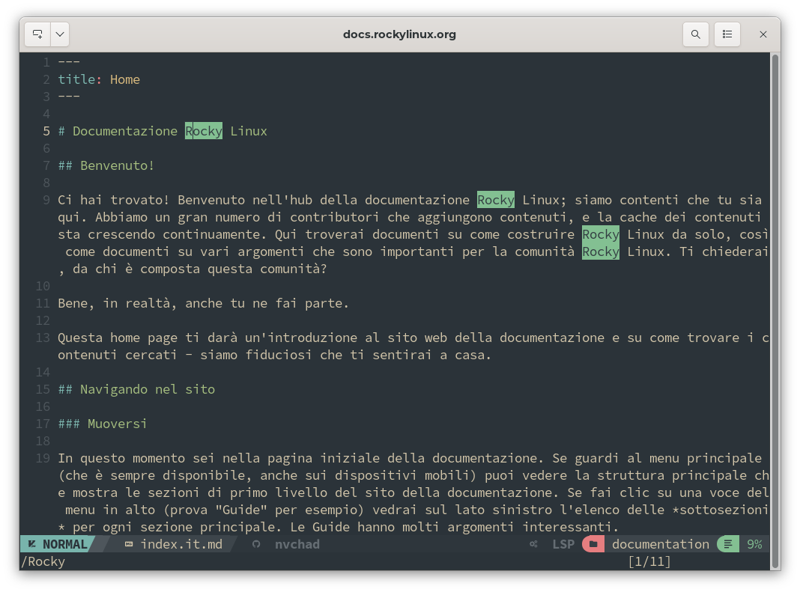

# Modificare con NvChad

Questo capitolo introduce alcuni comandi specifici di NvChad e alcuni comandi standard di Neovim (vim).  Come descritto in precedenza nell'[interfaccia utente di NvChad](nvchad_ui.md), i comandi di NvChad sono impostati nel file `..nvim/lua/core/mapping.lua` e consentono di utilizzare i tasti per eseguire comandi compositi talvolta molto lunghi.

Tutte le sequenze iniziano con una chiave primaria seguita da un'opzione. Le quattro chiavi principali sono:

* leader = <kbd>SPAZIO</kbd>
* A = <kbd>ALT</kbd>
* C = <kbd>CTRL</kbd>
* S = <kbd>SHIFT</kbd>

Come nel documento "NvChad UI", sostituiremo il comando effettivo da inserire, anziché le mappature.

## Aprire un file

Per aprire un file nel nostro editor possiamo utilizzare vari metodi. Possiamo semplicemente iniziare dalla riga di comando indicando il nome del file con:

```bash
nvim /path/to/the/file
```

Oppure aprire l'editor con il comando `nvim`.

Se utilizziamo quest'ultimo metodo, abbiamo diverse possibilità. È possibile aprire un file nel buffer con il comando <kbd>SHIFT</kbd> + <kbd>:e</kbd> + <kbd>SPAZIO</kbd> (modifica) seguito dal percorso, oppure facendo seguire il comando dal tasto <kbd>TAB</kbd>.

Questo mostrerà tutti i file e le cartelle disponibili, a partire dalla radice del progetto. È bene ricordare che quando si utilizza il tasto <kbd>TAB</kbd> nei comandi di apertura dei file, è possibile selezionare il file da un comodo menu a discesa. Una volta aperto questo menu a discesa, si può continuare a navigare al suo interno utilizzando ripetutamente il tasto <kbd>TAB</kbd>.



È bene ricordare che ciascuno dei comandi elencati è preceduto da <kbd>SHIFT</kbd> e seguito da uno <kbd>SPAZIO</kbd> e dal percorso o <kbd>TAB</kbd>. Ecco un elenco di altre azioni:

* `:view` - Visualizza il file in modalità di sola lettura senza la possibilità di modificarlo. Ottimo per la protezione dei file critici.
* `:split` - Apre il file in una schermata divisa orizzontalmente.
* `:vsplit` - Apre il file in uno schermata diviso verticalmente.
* `:tabedit` - Apre il file in una nuova scheda.

Nell'esempio seguente, abbiamo aperto il file utilizzando `:vsplit`.



Grazie al lavoro svolto dagli sviluppatori di NvChad, abbiamo a disposizione un modo aggiuntivo per aprire un file, ovvero utilizzare il plugin *nvim-telescope/telescope.nvim*.

Questo plugin, se usato in combinazione con *RipGrep*, ci permette di cercare il file da aprire in modalità interattiva. Digitando i caratteri iniziali del file che stiamo cercando, il plugin ignorerà tutti i file non corrispondenti e ci presenterà solo quelli che corrispondono alla nostra ricerca. Ciò consente un processo di ricerca e apertura molto agevole.

Per accedere alla funzione di ricerca dei file di Telescope, è necessario essere in modalità NORMAL nell'editor e digitare: <kbd>SHIFT</kbd> + <kbd>:Telescope fd</kbd>



## Lavorare con l'editor

Una volta che il file è aperto, possiamo iniziare a modificarlo. A tale scopo è necessario passare alla modalità INSERT, che si attiva premendo il tasto <kbd>i</kbd> (inserisci). L'indicatore di modalità nella Statusline dovrebbe cambiare da NORMAL a INSERT e anche il cursore posizionato nel buffer dovrebbe cambiare da un rettangolo colorato a una pipe `|`.

Ora tutti i caratteri digitati vengono inseriti nel documento a partire dalla posizione del cursore. Per spostare il cursore in modalità INSERT gli sviluppatori di Nvchad hanno impostato alcune comode mappature che sono:

- <kbd>CTRL</kbd> + <kbd>b</kbd> per andare all'inizio della riga
- <kbd>CTRL</kbd> + <kbd>e</kbd> per andare alla fine della riga
- <kbd>CTRL</kbd> + <kbd>h</kbd> per spostare un carattere a sinistra
- <kbd>CTRL</kbd> + <kbd>l</kbd> per spostare un carattere a destra
- <kbd>CTRL</kbd> + <kbd>j</kbd> per andare alla riga successiva
- <kbd>CTRL</kbd> + <kbd>k</kbd> per andare alla riga precedente

Imparare tutte le combinazioni richiede un po' di tempo ma, una volta acquisite, renderanno la navigazione molto veloce. Ad esempio, se si vuole modificare la fine della riga successiva a quella in cui è posizionato il cursore, si può arrivare alla fine della riga corrente con <kbd>CTRL</kbd> + <kbd>e</kbd>, quindi passare alla successiva con <kbd>CTRL</kbd> + <kbd>j</kbd> ed essere già in posizione per aggiungere le modifiche.

La navigazione nel documento può essere effettuata anche con i tasti freccia della tastiera o con il mouse.

### Selezione Testo

La selezione del testo può essere effettuata anche con il mouse ed è molto comoda, ma in questo capitolo utilizzeremo il metodo tradizionale basato sulla tastiera.

Per selezionare il testo è necessario accedere alla modalità VISUAL. A tale scopo, è necessario uscire dalla modalità di inserimento e passare alla modalità normale.

Una volta posizionato il cursore all'inizio della parte che si desidera selezionare, si utilizzano i tasti <kbd>CTRL</kbd> + <kbd>v</kbd> per accedere alla modalità V-BLOC (Visual Block). Spostandosi con il cursore, la selezione verrà evidenziata. A questo punto possiamo lavorare sulla parte di testo selezionata.

Se si desidera copiare la selezione negli appunti, si utilizzerà il tasto <kbd>y</kbd>. Se si vuole cancellarlo, il tasto <kbd>d</kbd>. Una volta terminata l'operazione, il testo non sarà più evidenziato. Per una panoramica di tutte le operazioni che possono essere eseguite in Modalità Visuale, è possibile consultare la guida direttamente dall'editor con <kbd>SHIFT</kbd> + <kbd>:help Visual-Mode</kbd>.



### Ricerca testo

Per la ricerca si utilizza il carattere slash <kbd>/</kbd> seguito dalla chiave di ricerca `/search_key`, che evidenzia tutte le occorrenze trovate. Per passare alla successiva, si usa la combinazione <kbd>/</kbd> + <kbd>Invio</kbd>. Per passare a quello precedente <kbd>?</kbd> + <kbd>Invio</kbd>.

Una volta terminata la ricerca, l'evidenziazione può essere rimossa con il comando <kbd>MAIUSC</kbd> + <kbd>:noh</kbd> (nessuna evidenziazione).



Le ricerche possono essere ancora più complesse di quella illustrata sopra; si possono usare caratteri jolly, contatori e altre opzioni. Il comando di aiuto<kbd>(SHIFT</kbd> + <kbd>:help /</kbd>) può essere utilizzato per visualizzare altre opzioni.

## Salvataggio del documento

Una volta creato o modificato, il file viene salvato uscendo dalla modalità INSERT con <kbd>ESC</kbd> e immettendo il comando <kbd>SHIFT</kbd> + <kbd>:w</kbd> (write) che salverà il file con il nome corrente nella posizione in cui si trova. Se si desidera salvare il file con un altro nome o in un'altra posizione, è sufficiente che il comando segua il percorso di salvataggio:

```text
:w /percorso/nuovo/file_o_posizione
```

Per salvare e contemporaneamente chiudere l'editor, si usa il comando <kbd>SHIFT</kbd> + <kbd>:wq</kbd> (write - quit).

In questo capitolo abbiamo introdotto l'editor. Esistono molte altre funzioni avanzate oltre a quelle descritte qui. Queste funzioni possono essere consultate nella pagina di [aiuto di Neovim](https://neovim.io/doc/user/) o digitando il seguente comando nell'editor <kbd>SHIFT</kbd> + <kbd>:help</kbd>.

