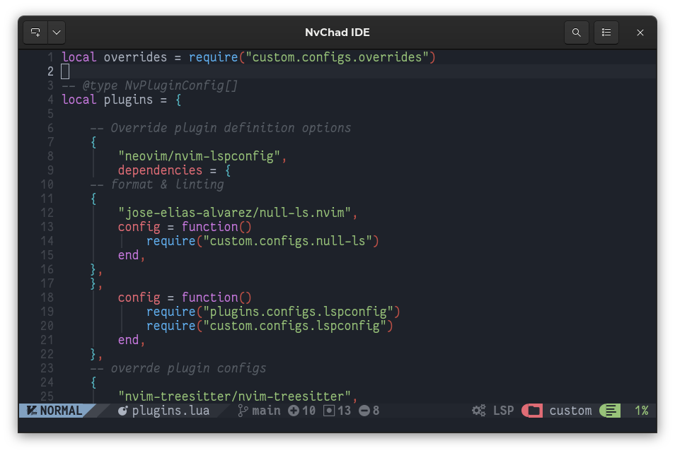

# Panoramica

## Introduzione

La configurazione personalizzata creata dagli sviluppatori di NvChad permette di avere un ambiente integrato con molte delle caratteristiche di un IDE grafico. Queste caratteristiche sono integrate nella configurazione di Neovim per mezzo di plugin. Quelli selezionati per NvChad dagli sviluppatori hanno la funzione di impostare l'editor per l'uso generale.

Tuttavia, l'ecosistema di plugin per Neovim è molto più ampio e, attraverso il loro utilizzo, consente di estendere l'editor per concentrarsi sulle proprie esigenze.

Lo scenario affrontato in questa sezione è la creazione di documentazione per Rocky Linux, quindi verranno spiegati i plugin per la scrittura di codice Markdown, la gestione dei repository Git e altri compiti legati allo scopo.

## Requisiti

- NvChad sia stato installato correttamente sul sistema con il*"template chadrc*"
- Familiarità con la riga di comando
- Una connessione internet attiva

## Suggerimenti generali sui plugin

Se hai scelto durante l'installazione di NvChad di installare anche il [template chadrc](../template_chadrc.md) avrai nella tua configurazione una cartellarong x-id="1">~/. onfig/nvim/lua/custom/</strong> folder. Tutte le modifiche ai plugin devono essere apportate nel file **/custom/plugins.lua** in quella cartella. Nel caso in cui il plugin necessiti di configurazioni aggiuntive, queste sono collocate nella cartella **/custom/configs**.

Neovim, su cui si basa la configurazione di NvChad, non integra un meccanismo di aggiornamento automatico della configurazione con l'editor in esecuzione. Questo implica che ogni volta che il file dei plugin viene modificato, è necessario chiudere `nvim` e poi riaprirlo per ottenere la piena funzionalità del plugin.

L'installazione del plugin può essere eseguita immediatamente dopo che è stato posizionato nel file dal `lazy.nvim` il plugin manager tiene traccia delle modifiche in **plugins.lua** e quindi consente la sua installazione "live".

