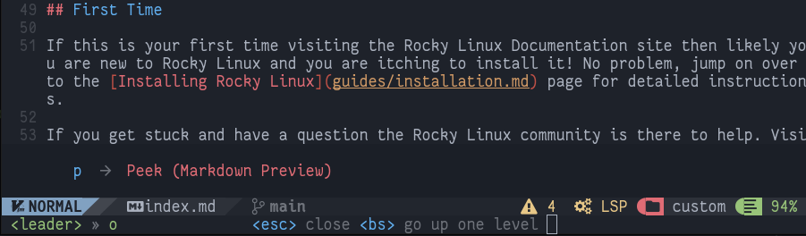
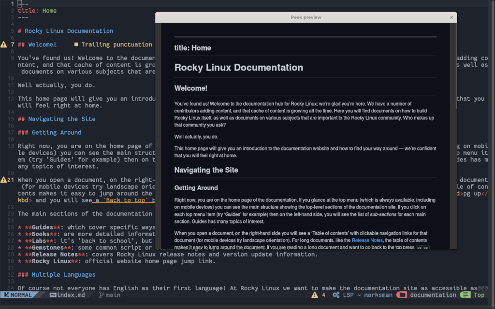
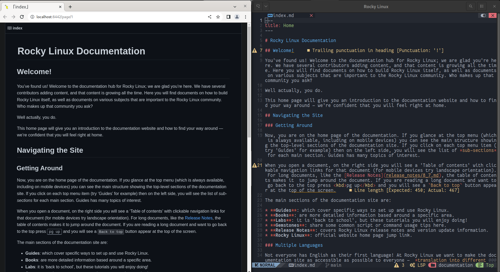

# Aperçu de Markdown

## Introduction

L'une des caractéristiques du langage Markdown qui le rend largement utilisé dans l'écriture de documentation technique est sa convertibilité. Le code peut être converti pour l'affichage dans de nombreux formats (HTML, PDF, texte brut,..), ce qui rend le contenu utilisable dans de nombreux scénarios.

Plus précisément, la documentation écrite pour Rocky Linux est convertie au format `HTML` en utilisant une application *python*. L'application convertit les documents écrits en *markdown* vers des pages HTML statiques.

Le problème qui se pose lors de l'écriture de votre documentation pour Rocky Linux est de vérifier son affichage correct lors de la conversion en code `HTML`.

Pour intégrer cette fonctionnalité dans votre éditeur, deux des plugiciels disponibles à cet effet, [toppair/peek.nvim](https://github.com/toppair/peek.nvim) et [markdown-preview.nvim](https://github.com/iamcco/markdown-preview.nvim) seront illustrés dans ce guide. Les deux supportent *github-style*, le choix du navigateur à utiliser pour l'aperçu et le défilement synchronisé avec l'éditeur.

### Peek.nvim

[Peek](https://github.com/toppair/peek.nvim) utilise [Deno](https://deno.com/manual) un runtime JavaScript, TypeScript et WebAssembly avec des paramètres sécurisés par défaut pour son bon fonctionnement. Par défaut, Deno n'autorise pas l'accès à un quelconque fichier, réseau ou environnement à moins qu'il ne soit explicitement activé.

Si vous avez également installé le [Template Chadrc](../template_chadrc.md) ce composant sera déjà disponible car il est l'un des serveurs de langage installés par défaut. S'il n'est pas encore présent dans l'éditeur, vous pouvez l'installer avec la commande `:MasonInstall deno`.

!!! warning "Avertissement"

    Le serveur de langage **doit** être installé avant de procéder à l'installation du plugiciel. Sinon, l'installation échouera et il sera nécessaire de supprimer le code contenu dans **/custom/plugins.ua**, effectuer un nettoyage de configuration en éditant `Lazy` et en tapant <kbd>X</kbd> pour supprimer le plugin puis répéter la procédure d'installation.

Pour installer le plugiciel, vous devrez éditer le fichier **/custom/plugins.lua** en ajoutant le bloc de code suivant :

```lua
{
    "toppair/peek.nvim",
    build = "deno task --quiet build:fast",
    keys = {
        {
        "<leader>op",
            function()
            local peek = require("peek")
                if peek.is_open() then
            peek.close()
            else
            peek.open()
            end
        end,
        desc = "Peek (Markdown Preview)",
        },
},
    opts = { theme = "dark", app = "browser" },
},
```

Une fois que vous avez enregistré le fichier, vous pouvez effectuer son installation en ouvrant l'interface du gestionnaire de plugiciels avec la commande `:Lazy`. Le gestionnaire de plugiciels l'aura déjà reconnu automatiquement et vous permettra de l'installer en tapant <kbd>I</kbd>.

Pour obtenir toutes les fonctionnalités, cependant, vous devez fermer NvChad (*nvim*) et le relancer. Ceci permet à l'éditeur de charger ceux de **Peek** dans la configuration.

Sa configuration inclut déjà la commande pour l'activer `<leader>op` qui, sur le clavier, se traduit par <kbd>Espace</kbd> + <kbd>o</kbd> suivi de <kbd>p</kbd>.



Vous avez également la chaîne suivante :

```lua
opts = { theme = "dark", app = "browser" },
```

Ce qui vous permet de passer des options pour le thème clair ou sombre de l'aperçu et la méthode à utiliser pour l'affichage.

Dans cette configuration, la méthode "navigateur" a été choisie, ce qui ouvre le fichier à consulter dans le navigateur par défaut du système, mais le plugiciel permet à travers la méthode "webview" de prévisualiser le fichier en utilisant seulement **Deno** via le composant [webview_deno](https://github.com/webview/webview_deno).



### Markdown-preview.nvim

[Markdown-preview.nvim](https://github.com/iamcco/markdown-preview.nvim) est un plugiciel écrit en `node.js` (JavaScript). Son installation sur NvChad ne nécessite aucune dépendance, car les développeurs fournissent une version précompilée qui fonctionne parfaitement dans l'éditeur.

Pour installer cette version, vous devrez ajouter ce bloc de code au fichier **/custom/plugins.lua**:

```lua
{
    "iamcco/markdown-preview.nvim",
    cmd = {"MarkdownPreview", "MarkdownPreviewStop"},
    lazy = false,
    build = function() vim.fn["mkdp#util#install"]() end,
    init = function()
        vim.g.mkdp_theme = 'dark'
    end
},
```

Comme pour le plugiciel précédent, vous devrez relancer l'éditeur pour permettre à NvChad de charger la nouvelle configuration. Encore une fois, vous pouvez passer au plugiciel certaines options personnalisées décrites dans la [section dédiée](https://github.com/iamcco/markdown-preview.nvim#markdownpreview-config) du dépôt du projet.

Cependant, les options doivent être modifiées pour correspondre à la configuration de `lazy.nvim`, en particulier l'option indiquée dans cet exemple :

```lua
vim.g.mkdp_theme = 'dark'
```

Elle correspond à l'option décrite sur le site du projet en tant que :

```lua
let g:mkdp_theme = 'dark'
```

Comme vous pouvez le constater, pour définir les options, vous devrez modifier la partie initiale de ceux-ci pour les rendre interprétables. Pour donner un autre exemple, prenons l'option qui vous permet de choisir quel navigateur utiliser pour l'aperçu spécifié comme ceci :

```lua
let g:mkdp_browser = '/usr/bin/chromium-browser'
```

Pour interpréter correctement cela dans NvChad, il devra être modifié en remplaçant `let g:` par `vim.g.`.


```lua
vim.g.mkdp_browser = '/usr/bin/chromium-browser'
```

De cette façon, la prochaine fois que NvChad sera lancé, le `navigateur chromium-` sera utilisé indépendamment du navigateur par défaut du système.

La configuration fournit également les commandes `:MarkdownPreview` et `:MarkdownPreviewStop` pour ouvrir et fermer l'aperçu, respectivement. Pour un accès plus rapide aux commandes, vous pouvez les associer au fichier **/custom/mapping.lua** comme suit :

```lua
-- binding for Markdown Preview
M.mdpreview = {
  n = {
    ["<leader>mp"] = { "<cmd> MarkdownPreview<CR>", "Open Preview"},
    ["<leader>mc"] = { "<cmd> MarkdownPreviewStop<CR>", "Close Preview"},
    },
}
```

Cela vous permettra d'ouvrir l'aperçu markdown en tapant <kbd>Enter</kbd> + <kbd>m</kbd> suivi de <kbd>p</kbd> et de le fermer avec la combinaison <kbd>Enter</kbd> + <kbd>m</kbd> suivie de <kbd>c</kbd>.

!!! note "Remarque"

    Le plugiciel fournit également la commande `:MarkdownPreviewToggle` mais au moment d'écrire ce document, il ne semble pas fonctionner correctement. Si vous essayez de l'utiliser, cela ne changera pas le thème d'aperçu mais ouvrira un nouvel onglet du navigateur avec le même aperçu.



## Conclusions et pensées finales

Un aperçu de ce que vous écrivez peut être utile, à la fois pour les nouveaux utilisateurs de cet éditeur et pour ceux qui ont une connaissance plus approfondie du langage Markdown. L'aperçu vous permet d'évaluer l'impact du code une fois converti et toutes les erreurs qu'il contient.

Le choix du plugiciel à utiliser est totalement subjectif, et nous vous encourageons à essayer les deux pour évaluer celui qui vous convient le mieux.

L'utilisation de l'un de ces plugins vous permet de contribuer à la documentation sur Rocky Linux qui est conforme au code utilisé donc simplifier le travail des réviseurs de documentation.
