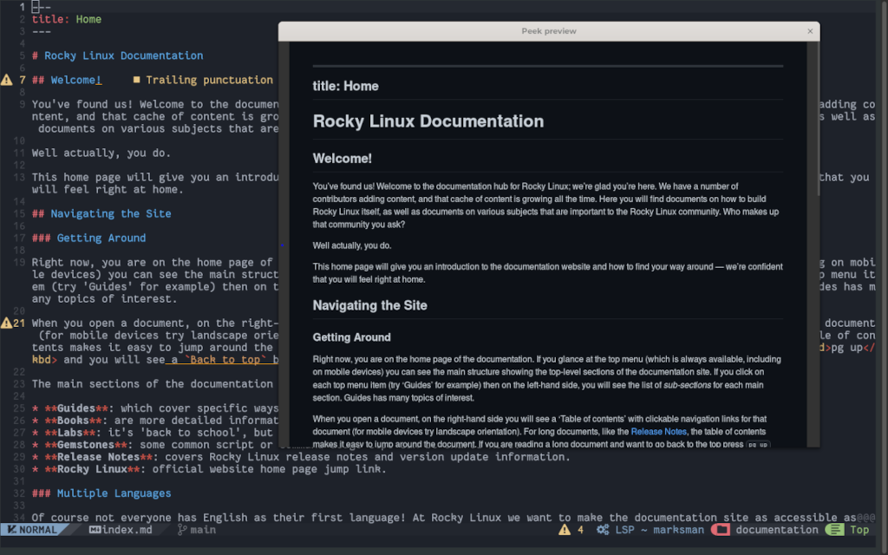

# 마크다운 프리뷰

## 소개

마크다운 언어의 기능 중 하나는 기술 문서 작성에 널리 사용되는 변환성입니다. 코드는 여러 형식(HTML, PDF, 일반 텍스트 등)으로 표시할 수 있으므로 콘텐츠를 다양한 시나리오에서 사용할 수 있습니다.

특히 Rocky Linux를 위해 작성된 문서는 python 애플리케이션을 사용하여 HTML로 변환됩니다. 이 애플리케이션은 마크다운으로 작성된 문서를 정적 HTML 페이지로 변환합니다.

Rocky Linux 문서를 작성할 때 변환된 `HTML` 코드가 정확히 표시되는지 확인하는 문제가 발생합니다.

이 기능을 편집기에 통합하기 위해, 이 페이지에서는 이를 위한 두 가지 플러그인인 [toppair/peek.nvim](https://github.com/toppair/peek.nvim) 와 [markdown-preview.nvim](https://github.com/iamcco/markdown-preview.nvim)을 설명하겠습니다. 이 두 플러그인은 *github 스타일*을 지원하며, 미리보기에 사용할 브라우저 선택 및 편집기와 동기화된 스크롤링을 지원합니다.

### Peek.nvim

[Peek](https://github.com/toppair/peek.nvim)는 JavaScript, TypeScript 및 WebAssembly 런타임인 [Deno](https://deno.com/manual)를 사용하여 작동하며, 기본 및 안전한 설정으로 동작합니다. 기본적으로 Deno는 명시적으로 허용되지 않는 한 파일, 네트워크 또는 환경 액세스를 허용하지 않습니다.

[Template Chadrc](../template_chadrc.md)도 설치한 경우 이 구성 요소는 기본적으로 제공되는 언어 서버 중 하나이므로 이미 사용 가능합니다. 편집기에 아직 설치되지 않은 경우 `:MasonInstall deno` 명령을 사용하여 설치할 수 있습니다.

!!! warning "주의"

    플러그인을 설치하기 전에 언어 서버를 **반드시** 설치해야 합니다. 그렇지 않으면 설치가 실패하며,  **/custom/plugins.lua**에서 코드를 제거하고, `Lazy`를 열어 <kbd>X</kbd>를 입력하여 플러그인을 삭제한 다음 설치 절차를 반복해야 합니다.

플러그인을 설치하려면 다음 코드 블록을 추가하여 **/custom/plugins.lua** 파일에 추가해야 합니다:

```lua
{
    "toppair/peek.nvim",
    build = "deno task --quiet build:fast",
    keys = {
        {
        "<leader>op",
            function()
            local peek = require("peek")
                if peek.is_open() then
            peek.close()
            else
            peek.open()
            end
        end,
        desc = "Peek (Markdown Preview)",
        },
},
    opts = { theme = "dark", app = "browser" },
},
```

파일을 저장한 후 `:Lazy` 명령을 사용하여 플러그인 관리자 인터페이스를 열어 설치할 수 있습니다. 플러그인 관리자는 이미 자동으로 인식했을 것이며, <kbd>I</kbd>를 입력하여 설치할 수 있습니다.

그러나 기능을 완전히 활용하려면 NvChad(*nvim*)를 종료한 다음 다시 열어야 합니다. 이렇게 하면 **Peek**의 설정을 편집기에 로드할 수 있습니다.

이 구성에는 이미 `<leader>op`를 활성화하는 명령이 포함되어 있습니다. 이는 키보드에서 <kbd>Space</kbd> + <kbd>o</kbd>를 누른 다음 <kbd>p</kbd>를 입력하는 것과 같습니다.


또한 다음 문자열이 있습니다:

```lua
opts = { theme = "dark", app = "browser" },
```

이는 미리보기의 밝은 또는 어두운 테마와 표시에 사용될 방법에 대한 옵션을 전달할 수 있습니다.

이 구성에서는 "browser" 방법을 선택했으며, 이는 시스템의 기본 브라우저에서 보려는 파일을 엽니다. 그러나 "webview" 방법을 통해 [webview_deno](https://github.com/webview/webview_deno) 구성 요소를 통해 **Deno**만 사용하여 파일을 미리 볼 수도 있습니다.



### Markdown-preview.nvim

[Markdown-preview.nvim](https://github.com/iamcco/markdown-preview.nvim)은 `node.js`(JavaScript)로 작성된 플러그인입니다. NvChad에 대한 설치에는 추가 종속성이 필요하지 않으며, 개발자는 편집기에서 완벽하게 작동하는 사전 컴파일된 버전을 제공합니다.

이 버전을 설치하려면 이 코드 블록을 **/custom/plugins.lua**에 추가해야 합니다.

```lua
{
    "iamcco/markdown-preview.nvim",
    cmd = {"MarkdownPreview", "MarkdownPreviewStop"},
    lazy = false,
    build = function() vim.fn["mkdp#util#install"]() end,
    init = function()
        vim.g.mkdp_theme = 'dark'
    end
},
```

이전 플러그인과 마찬가지로, 편집기를 종료하고 다시 열어 NvChad가 새 구성을 로드할 수 있도록 해야 합니다. 마찬가지로 프로젝트 저장소의 [전용 섹션](https://github.com/iamcco/markdown-preview.nvim#markdownpreview-config)에 설명된 사용자 정의 옵션을 전달할 수 있습니다.

그러나 이러한 옵션은 `lazy.nvim`의 구성에 맞게 수정해야 합니다. 특히, 이 예제에서 구성된 옵션은 다음과 같습니다:

```lua
vim.g.mkdp_theme = 'dark'
```

이는 프로젝트 사이트에서 다음과 같이 설명된 옵션에 해당합니다:

```lua
let g:mkdp_theme = 'dark'
```

보다시피 옵션을 설정하려면 그들을 해석 가능하도록 초기 부분을 수정해야 합니다. 또 다른 예를 들어 미리보기에 사용할 브라우저를 선택하는 옵션을 살펴보겠습니다. 이 옵션은 다음과 같이 지정됩니다:

```lua
let g:mkdp_browser = '/usr/bin/chromium-browser'
```

NvChad에서 이를 올바르게 해석하려면 `let g:`를 `vim.g.`로 교체하여 수정해야 합니다.


```lua
vim.g.mkdp_browser = '/usr/bin/chromium-browser'
```

이렇게 하면 다음에 NvChad를 열 때 시스템의 기본 브라우저에 관계없이 `chromium-browser`가 사용됩니다.

이 구성에는 또한 `:MarkdownPreview` 및 `:MarkdownPreviewStop` 명령이 미리보기를 열고 닫는 데 사용됩니다. 명령에 빠르게 액세스하기 위해 다음과 같이 **/custom/mapping.lua** 파일에 매핑할 수 있습니다:

```lua
-- binding for Markdown Preview
M.mdpreview = {
  n = {
    ["<leader>mp"] = { "<cmd> MarkdownPreview<CR>", "Open Preview"},
    ["<leader>mc"] = { "<cmd> MarkdownPreviewStop<CR>", "Close Preview"},
    },
}
```

이렇게 하면 <kbd>Enter</kbd> + <kbd>m</kbd>다음에 <kbd>p</kbd> 를 입력하여 마크다운 미리보기를 열고, <kbd>Enter</kbd> + <kbd>m</kbd> 다음에 <kbd>c</kbd>를 입력하여 마크다운 미리보기를 닫을 수 있습니다.

!!! note "참고 사항"

    이 플러그인은 `:MarkdownPreviewToggle` 명령도 제공하지만, 이 문서 작성 시점에서 제대로 작동하지 않는 것으로 보입니다. 이 명령을 실행하면 미리보기 테마가 변경되지 않고 같은 미리보기로 새로운 브라우저 탭이 열립니다.


## 결론 및 최종 생각

작성 중인 내용의 미리보기는 이 편집기를 처음 사용하는 사람들과 마크다운 언어에 대해 더 깊이있는 지식을 가진 사람들 모두에게 유용할 수 있습니다. 미리보기를 통해 변환된 코드의 영향과 포함된 오류를 평가할 수 있습니다.

어떤 플러그인을 사용할지 선택하는 것은 완전히 주관적이며, 어떤 것이 가장 적합한지 평가하기 위해 두 플러그인을 모두 시도해 보시기를 권장합니다.

이러한 플러그인 중 하나를 사용하면 Rocky Linux 문서에 코드에 맞는 문서를 기여할 수 있으며, 이로 인해 문서 검토 작업이 완화됩니다.
