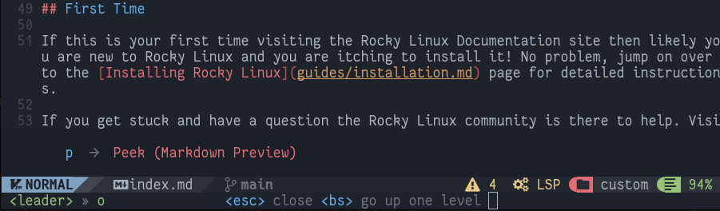

# Markdown Preview

## Introduction

One of the features of the Markdown language that make it widely used in writing technical documentation is its convertibility. Code can be converted for display in many formats (HTML, PDF, plain text,..), therefore making content usable in numerous scenarios.

Specifically, documentation written for Rocky Linux is converted to `HTML` using a *python* application. The application converts documents written in *markdown* to static HTML pages.

The problem arises when writing your documentation for Rocky Linux, of verifying its correct display when converted to `HTML` code.

To integrate this functionality into your editor, two of the plugins available for this purpose, [toppair/peek.nvim](https://github.com/toppair/peek.nvim) and [markdown-preview.nvim](https://github.com/iamcco/markdown-preview.nvim), will be illustrated on this page. Both of these support *github-style*, the choice of browser to use for preview, and synchronized scrolling with the editor.

### Peek.nvim

[Peek](https://github.com/toppair/peek.nvim) uses [Deno](https://deno.com/manual) a JavaScript, TypeScript and WebAssembly runtime with default and secure settings for its operation. By default Deno does not allow any file, network or environment access unless explicitly enabled.

If you have also installed the [Template Chadrc](../template_chadrc.md) this component will already be available as it is one of the language servers installed by default. In case it is not yet present in the editor you can install it with the command `:MasonInstall deno`.

!!! Warning

    The language server **must** be installed before proceeding to install the plugin. Otherwise the installation will fail and it will be necessary to remove the code from **/custom/plugins.lua**, perform a configuration cleanup by opening `Lazy` and typing <kbd>X</kbd> to delete the plugin and then repeat the installation procedure.

To install the plugin you will have to edit the file **/custom/plugins.lua** by adding the following block of code:

```lua
{
    "toppair/peek.nvim",
    build = "deno task --quiet build:fast",
    keys = {
        {
        "<leader>op",
            function()
            local peek = require("peek")
                if peek.is_open() then
            peek.close()
            else
            peek.open()
            end
        end,
        desc = "Peek (Markdown Preview)",
        },
},
    opts = { theme = "dark", app = "browser" },
},
```

Once you have saved the file you can perform its installation by opening the plugins manager interface with the `:Lazy` command. The plugins manager will have already recognized it automatically and will allow you to install it by typing <kbd>I</kbd>.

To get the full functionality, however, you must close NvChad (*nvim*) and reopen it. This is to allow the editor to load those of **Peek** into the configuration.

Its configuration already includes the command to activate it `<leader>op` which on the keyboard translates to <kbd>Space</kbd> + <kbd>o</kbd> followed by <kbd>p</kbd>.



You also have the string:

```lua
opts = { theme = "dark", app = "browser" },
```

Which allows you to pass options for the light or dark theme of the preview and the method to be used for display.

In this configuration, the "browser" method was chosen, which opens the file to be viewed in the system's default browser, but the plugin allows through the "webview" method to preview the file using only **Deno** via the [webview_deno](https://github.com/webview/webview_deno) component.


### Markdown-preview.nvim

[Markdown-preview.nvim](https://github.com/iamcco/markdown-preview.nvim) is a plugin written in `node.js` (JavaScript). Its installation on NvChad does not require any dependencies as the developers provide a precompiled version that works perfectly in the editor.

To install this version you will need to add this code block to your **/custom/plugins.lua**:

```lua
{
    "iamcco/markdown-preview.nvim",
    cmd = {"MarkdownPreview", "MarkdownPreviewStop"},
    lazy = false,
    build = function() vim.fn["mkdp#util#install"]() end,
    init = function()
        vim.g.mkdp_theme = 'dark'
    end
},
```

As with the previous plugin, you will need to close the editor and reopen it to give NvChad a chance to load the new configuration. Again you can pass to the plugin some custom options described in the [dedicated section](https://github.com/iamcco/markdown-preview.nvim#markdownpreview-config) of the project repository.

However, the options must be modified to fit the configuration of `lazy.nvim`, particularly the option configured in this example:

```lua
vim.g.mkdp_theme = 'dark'
```

It corresponds to the option described on the project site as:

```lua
let g:mkdp_theme = 'dark'
```

As you can see, to set the options you will have to modify the initial part of them to make them interpretable. To give another example let us take the option that allows you to choose which browser to use for the preview that is specified like this:

```lua
let g:mkdp_browser = '/usr/bin/chromium-browser'
```

To interpret this correctly in NvChad it will have to be modified by replacing `let g:` with `vim.g.`.


```lua
vim.g.mkdp_browser = '/usr/bin/chromium-browser'
```

This way the next time NvChad is opened, `chromium-browser` will be used regardless of the system's default browser.

The configuration also provides the commands `:MarkdownPreview` and `:MarkdownPreviewStop` to open and close the preview, respectively. For faster access to the commands you can map them to the **/custom/mapping.lua** file as follows:

```lua
-- binding for Markdown Preview
M.mdpreview = {
  n = {
    ["<leader>mp"] = { "<cmd> MarkdownPreview<CR>", "Open Preview"},
    ["<leader>mc"] = { "<cmd> MarkdownPreviewStop<CR>", "Close Preview"},
    },
}
```

This will allow you to open the markdown preview by typing <kbd>Enter</kbd> + <kbd>m</kbd> followed by <kbd>p</kbd> and close it with the combination <kbd>Enter</kbd> + <kbd>m</kbd> followed by <kbd>c</kbd>.

!!! Note

    The plugin also provides the command `:MarkdownPreviewToggle` but at the time of writing this document it does not seem to work properly. If you try to invoke it, it will not change the preview theme but will open a new browser Tab with the same preview.


## Conclusions and final thoughts

A preview of what you are writing can be useful, both for those new to this editor and for those with a more in-depth knowledge of the Markdown language. The preview allows you to assess the impact of the code once converted, and any errors it contains.

The choice of which plugin to use is totally subjective, and we encourage you to try both to assess which one might be best for you.

The use of one of these plugins allows you to contribute documents to the documentation on Rocky Linux that conform to the code used therefore alleviating the work of documentation reviewers.
