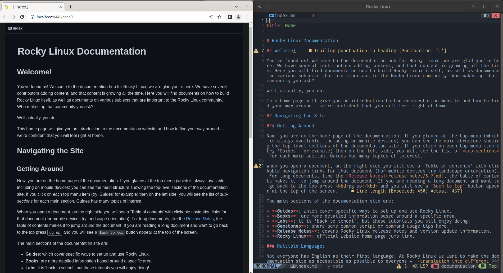

# Огляд Markdown

## Вступ

Однією з особливостей мови Markdown, яка робить її широко використовуваною для написання технічної документації, є її конвертованість. Код можна конвертувати для відображення в багатьох форматах (HTML, PDF, звичайний текст тощо), завдяки чому вміст можна використовувати в багатьох сценаріях.

Зокрема, документація, написана для Rocky Linux, перетворюється на `HTML` за допомогою додатку *python*. Додаток перетворює документи, написані в *markdown*, на статичні сторінки HTML.

Під час написання вашої документації для Rocky Linux виникає проблема перевірки її правильного відображення під час перетворення на код `HTML`.

Щоб інтегрувати цю функцію у ваш редактор, скористайтеся двома плагінами, доступними для цієї мети, [toppair/peek.nvim](https://github.com/toppair/peek.nvim) і [markdown-preview.nvim](https://github.com/iamcco/markdown-preview.nvim), як буде показано на цій сторінці. Обидва вони підтримують *github-style*, вибір браузера для попереднього перегляду та синхронізоване прокручування з редактором.

### Peek.nvim

[Peek](https://github.com/toppair/peek.nvim) використовує [Deno](https://deno.com/manual) JavaScript, Середовище виконання TypeScript і WebAssembly із безпечними налаштуваннями за замовчуванням для його роботи. За замовчуванням Deno не дозволяє доступ до файлів, мережі чи середовища, якщо це явно не ввімкнено.

Якщо ви також встановили [шаблон Chadrc](../template_chadrc.md), цей компонент уже буде доступним, оскільки це один із мовних серверів, установлених за умовчанням. Якщо його ще немає в редакторі, ви можете встановити його за допомогою команди `:MasonInstall deno`.

!!! Важливо

    Мовний сервер **необхідно** встановити перед тим, як продовжити встановлення плагіна. Інакше інсталяція не вдасться, і потрібно буде видалити код із **/custom/plugins.lua**, виконати очищення конфігурації, відкривши `Lazy` і ввівши <kbd>X</kbd> щоб видалити плагін, а потім повторити процедуру встановлення.

Щоб установити плагін, вам потрібно буде відредагувати файл **/custom/plugins.lua**, додавши наступний блок коду:

```lua
{
    "toppair/peek.nvim",
    build = "deno task --quiet build:fast",
    keys = {
        {
        "<leader>op",
            function()
            local peek = require("peek")
                if peek.is_open() then
            peek.close()
            else
            peek.open()
            end
        end,
        desc = "Peek (Markdown Preview)",
        },
},
    opts = { theme = "dark", app = "browser" },
},
```

Після збереження файлу ви можете виконати його інсталяцію, відкривши інтерфейс менеджера плагінів за допомогою команди `:Lazy`. Менеджер плагінів вже розпізнає його автоматично та дозволить вам встановити його, ввівши <kbd>I</kbd>.

Щоб отримати повну функціональність, ви повинні закрити NvChad (*nvim*) і знову відкрити його. Це дозволяє редактору завантажити файли **Peek** у конфігурацію.

Його конфігурація вже містить команду для його активації `<leader>op`, що на клавіатурі перекладається як <kbd>Пробіл</kbd> + <kbd>o</kbd>, а потім <kbd>p </kbd>.


У вас також є рядок:

```lua
opts = { theme = "dark", app = "browser" },
```

Що дозволяє передавати параметри для світлої або темної теми попереднього перегляду та метод, який буде використовуватися для відображення.

У цій конфігурації було вибрано метод «браузер», який відкриває файл для перегляду в браузері системи за замовчуванням, але плагін дозволяє за допомогою методу «webview» переглядати файл, використовуючи лише **Deno** через компонент [webview_deno](https://github.com/webview/webview_deno).


### Markdown-preview.nvim

[Markdown-preview.nvim](https://github.com/iamcco/markdown-preview.nvim) — це плагін, написаний на `node.js` (JavaScript). Його встановлення на NvChad не вимагає жодних залежностей, оскільки розробники надають попередньо скомпільовану версію, яка ідеально працює в редакторі.

Щоб установити цю версію, вам потрібно буде додати цей блок коду до вашого **/custom/plugins.lua**:

```lua
{
    "iamcco/markdown-preview.nvim",
    cmd = {"MarkdownPreview", "MarkdownPreviewStop"},
    lazy = false,
    build = function() vim.fn["mkdp#util#install"]() end,
    init = function()
        vim.g.mkdp_theme = 'dark'
    end
},
```

Як і в попередньому плагіні, вам потрібно буде закрити редактор і знову відкрити його, щоб дати NvChad можливість завантажити нову конфігурацію. Знову ж таки, ви можете передати плагіну деякі спеціальні параметри, описані в [спеціальному розділі](https://github.com/iamcco/markdown-preview.nvim#markdownpreview-config) репозиторію проекту.

Однак параметри потрібно змінити, щоб відповідати конфігурації `lazy.nvim`, зокрема параметру, налаштованого в цьому прикладі:

```lua
vim.g.mkdp_theme = 'dark'
```

Це відповідає варіанту, описаному на сайті проекту як:

```lua
let g:mkdp_theme = 'dark'
```

Як бачите, щоб встановити параметри, вам доведеться змінити їх початкову частину, щоб зробити їх інтерпретованими. Щоб навести ще один приклад, візьмемо параметр, який дозволяє вам вибрати, який браузер використовувати для попереднього перегляду, що вказано так:

```lua
let g:mkdp_browser = '/usr/bin/chromium-browser'
```

Щоб правильно інтерпретувати це в NvChad, його потрібно буде змінити, замінивши `let g:` на `vim.g.`.


```lua
vim.g.mkdp_browser = '/usr/bin/chromium-browser'
```

Таким чином, під час наступного відкриття NvChad `chromium-browser` використовуватиметься незалежно від браузера системи за замовчуванням.

Конфігурація також надає команди `:MarkdownPreview` і `:MarkdownPreviewStop` для відкриття та закриття попереднього перегляду відповідно. Для швидшого доступу до команд ви можете відобразити їх у файлі **/custom/mapping.lua** наступним чином:

```lua
-- binding for Markdown Preview
M.mdpreview = {
  n = {
    ["<leader>mp"] = { "<cmd> MarkdownPreview<CR>", "Open Preview"},
    ["<leader>mc"] = { "<cmd> MarkdownPreviewStop<CR>", "Close Preview"},
    },
}
```

Це дозволить вам відкрити попередній перегляд розмітки, ввівши <kbd>Enter</kbd> + <kbd>m</kbd> і <kbd>p</kbd>, і закрити його комбінацією <kbd>Enter</kbd> + <kbd>m</kbd>, а потім <kbd>c</kbd>.

!!! Примітка

    Плагін також надає команду `:MarkdownPreviewToggle`, але на момент написання цього документа вона не працює належним чином. Якщо ви спробуєте його викликати, це не змінить тему попереднього перегляду, але відкриє нову вкладку веб-переглядача з тим самим попереднім переглядом.



## Висновки та заключні думки

Попередній перегляд того, що ви пишете, може бути корисним як для новачків у цьому редакторі, так і для тих, хто має більш глибоке знання мови Markdown. Попередній перегляд дозволяє оцінити вплив коду після перетворення та будь-які помилки, які він містить.

Вибір того, який плагін використовувати, є абсолютно суб’єктивним, і ми рекомендуємо вам спробувати обидва, щоб визначити, який із них найкращий для вас.

Використання одного з цих плагінів дозволяє додавати документи до документації Rocky Linux, які відповідають використовуваному коду, таким чином полегшуючи роботу рецензентів документації.
