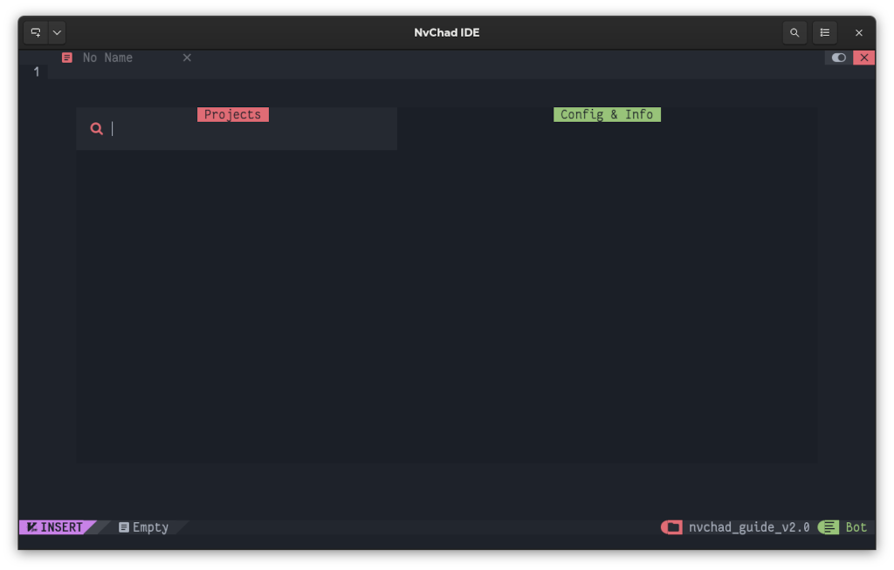

# Gestionnaire de Projet

## Introduction

L'une des fonctionnalités qu'un IDE doit certainement avoir est la capacité de gérer les différents projets sur lesquels travaille un développeur ou un rédacteur. Possibilité de sélectionner le projet sur lequel travailler une fois que NvChad est ouvert, sans avoir besoin de taper des commandes dans la ligne d'état ** pour atteindre l'objectif. Cela permet de gagner du temps et de simplifier la gestion dans le cas d'un grand nombre de projets.

L'utilisation de [charludo/projectmgr.nvim](https://github.com/charludo/projectmgr.nvim) permettra d'intégrer cette fonctionnalité. Le plugiciel fournit une excellente intégration avec `Telescope` et quelques fonctionnalités supplémentaires intéressantes telles que la possibilité de synchroniser un dépôt *git* lors de l'ouverture du *projet*.

Le plugiciel enregistre également l'état de l'éditeur quand il se ferme vous permettant d'ouvrir, lorsque vous le relancerez par la suite, toutes les pages sur lesquelles vous travailliez.

### Installation du plugiciel

Pour installer le plugiciel, vous devrez éditer le fichier **custom/plugins.lua** en ajoutant le bloc de code suivant :

```lua
{
    "charludo/projectmgr.nvim",
    lazy = false, -- important!
},
```

Une fois que vous avez enregistré le fichier, le plugiciel sera disponible pour l'installation. Pour l'installer, ouvrez *lazy.nvim* avec la commande `:Lazy` et tapez <kbd>I</kbd>. Une fois l'installation terminée, vous devrez relancer l'éditeur pour qu'il utilise la nouvelle configuration que vous avez enregistrée.

Le plugiciel fournit une commande unique `:ProjectMgr` qui ouvre un tampon interactif à partir duquel vous pouvez effectuer toutes les opérations en utilisant des raccourcis clavier. Lors de la première ouverture, le tampon sera vide comme cette capture d'écran l'indique :



### Utilisation du Gestionnaire de Projet

Toutes les opérations sont effectuées avec la touche <kbd>Ctrl</kbd> suivie d'une lettre (exemple `<C-a`), la touche `<CR>` correspondant à la touche <kbd>Entrer</kbd>.

Le tableau suivant montre toutes les opérations disponibles

| Touche        | Opération                                      |
| ------------- | ---------------------------------------------- |
| `<CR>`  | Ouvre le projet sous le curseur                |
| `<C-a>` | Ajoute un projet par une procédure interactive |
| `<C-d>` | Supprimer un projet                            |
| `<C-e>` | Modifier les paramètres du projet              |
| `<C-q>` | Fermer le tampon                               |

Pour ajouter votre premier projet, vous devrez utiliser la combinaison <kbd>Ctrl</kbd> + <kbd>a</kbd> qui ouvrira un menu interactif dans la *ligne d'état*. Dans cet exemple, un clone de la documentation de Rocky Linux enregistrée dans **~/lab/rockydocs/documentation** sera utilisé.

La première question concerne le nom du projet :

> Nom du projet : documentation

Ensuite le répertoire du projet :

> Répertoire du projet : ~/lab/rockydocs/documentation/

Ceci est suivi par la possibilité de définir des commandes à exécuter lors de l'ouverture et de la fermeture du projet. Ces commandes font référence aux exécutables dans l'éditeur et non au langage **bash**.

Vous avez, par exemple, la possibilité d'ouvrir contextuellement lors du lancement de l'éditeur un tampon de *NvimTree* avec la commande `NvimTreeToggle`.

> Commande de démarrage (optionnel) : NvimTreeToggle

Ou exécuter une commande avant de fermer l'éditeur.

> La commande Exit (optionnel) :

Les commandes doivent être saisies en omettant le deux-points `:` utilisé pour exécuter les mêmes commandes dans la *ligne d'état*.

Une fois la configuration terminée, votre projet sera disponible dans le tampon. Pour l'ouvrir, sélectionnez-le et appuyez sur <kbd>Entrer</kbd>.


Comme vous pouvez le constater à partir de la capture d'écran dans la section **Config & Infos** le plugiciel a reconnu le dossier comme géré par *Git* et nous fournit quelques informations à son sujet.

La modification d'un projet se fait avec <kbd>Ctrl</kbd> + <kbd>e</kbd> et se compose d'une nouvelle boucle interactive, alors que toute suppression est effectuée avec la combinaison <kbd>Ctrl</kbd> + <kbd>d</kbd>.

### Fonctions supplémentaires

Le plugiciel fournit quelques fonctions supplémentaires spécifiées dans la [section dédiée](https://github.com/charludo/projectmgr.nvim#%EF%B8%8F-configuration). Les plus intéressantes sont la possibilité de synchroniser un dépôt git lors de l'ouverture du projet et la possibilité de stocker l'état de l'éditeur lors de sa fermeture. Les deux fonctionnalités sont déjà présentes dans le fichier de configuration par défaut, bien que la fonctionnalité concernant *Git* soit désactivée.

Pour ajouter une synchronisation de dépôt lors de l'ouverture de projets, vous devrez ajouter le code suivant à la configuration initiale du plugiciel :

```lua
config = function()
    require("projectmgr").setup({
        autogit = {
            enabled = true,
            command = "git pull --ff-only >> .git/fastforward.log 2>&1",
        },
    })
end,
```

Comme vous pouvez le voir à partir du code, la fonction `require("projectmgr").setup` est appelée, ce qui vous permet de remplacer les paramètres par défaut. Tout ce que vous définissez à l'intérieur changera son fonctionnement.

La commande `git pull --ff-only` effectue une synchronisation *fast forward* du dépôt, télécharger uniquement les fichiers qui n'ont aucun conflit et peuvent être mis à jour sans intervention de votre part.

Le résultat de la commande est également dirigé vers le fichier **.git/fastforward .log** pour l'empêcher d'être affiché sur le terminal où NvChad est en cours d'exécution et d'avoir un historique de synchronisation disponible.

Vous pouvez également enregistrer la session quand elle se termine. Cela vous permet de revenir aux pages sur lesquelles vous travailliez en sélectionnant le projet et en l'ouvrant à nouveau.

```lua
session = { enabled = true, file = "Session.vim" },
```

Cette option est activée par défaut, mais elle écrit le fichier **Session.vim** à la *racine* du projet et ce n'est pas souhaitable dans le cas de la documentation Rocky Linux. Dans cet exemple, il est sauvegardé dans le dossier `.git` qui n'est pas sous contrôle de version.

Ajustez le répertoire de **Session.vim** et **fastforward.log** selon vos besoins.

Une fois les modifications terminées, votre configuration devrait ressembler à ceci :

```lua
{
    "charludo/projectmgr.nvim",
    lazy = false, -- important!
    config = function()
        require("projectmgr").setup({
            autogit = {
                enabled = true,
                command = "git pull --ff-only > .git/fastforward.log 2>&1",
            },
            session = { enabled = true, file = ".git/Session.vim" },
        })
    end,
},
```

Maintenant à chaque fois que vous ouvrez vos projets, les fichiers mis à jour seront automatiquement téléchargés depuis le dépôt Git et vous aurez les derniers fichiers sur lesquels vous travailliez dans l'éditeur prêts à être édités.

!!! warning "Avertissement"

    Les fichiers ouverts dans les tampons de session enregistrés de NvChad ne sont pas automatiquement mis à jour.

Pour vérifier si les fichiers ouverts ne correspondent pas à ceux mis à jour depuis le dépôt, vous pouvez utiliser la commande `:checktime` qui vérifie si les fichiers ouverts dans l'éditeur ont été modifiés en dehors de NvChad et vous avertit de la nécessité de mettre à jour les tampons.

### Mapping

Pour accélérer l'ouverture de vos projets, vous pouvez créer un raccourci clavier à définir dans **/custom/mapping.lua**. Par exemple :

```lua
-- Projects
M.projects = {
  n = {
    ["<leader>fp"] = { "<cmd> ProjectMgr<CR>", "Open Projects"}
    },
}
```

Avec l'éditeur dans l'état **NORMAL** vous pouvez ouvrir le gestionnaire de projet avec la combinaison <kbd>Espace</kbd> + <kbd>f</kbd> suivie de <kbd>p</kbd>.

## Conclusions et pensées finales

Comme le nombre de projets sur lesquels vous travaillez augmente, il peut être utile d'avoir un outil pour vous aider à les gérer. Ce plugiciel vous permettra d'accélérer votre travail en réduisant le temps nécessaire pour accéder aux fichiers dont vous avez besoin pour les éditer.

Nous devrions également souligner l'excellente intégration avec `Telescope` qui rend la gestion de projet très fonctionnelle.
