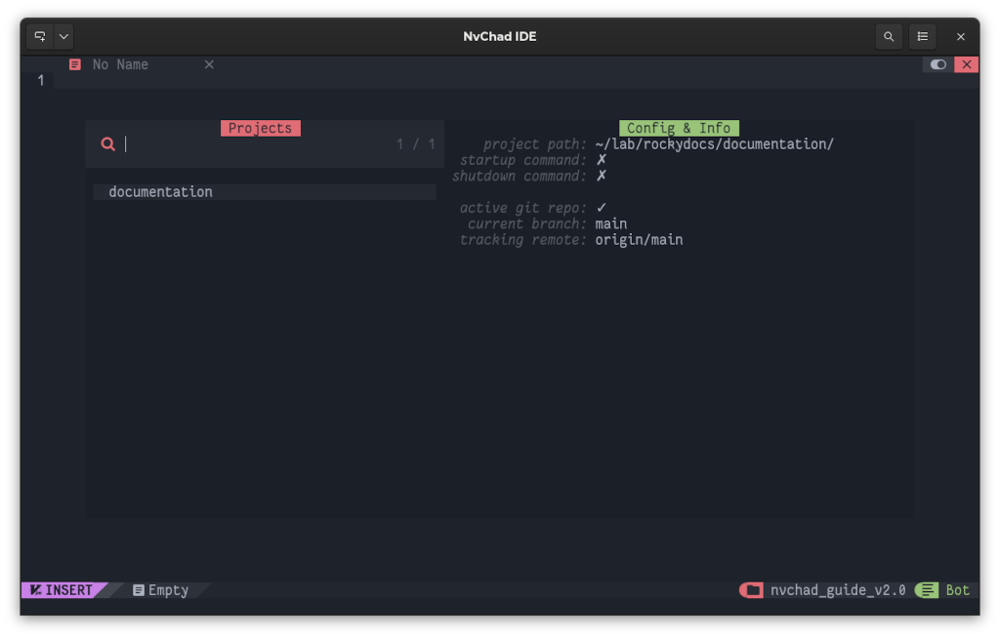

# 프로젝트 매니저

## 소개

IDE가 반드시 갖추어야 할 기능 중 하나는 개발자 또는 게시자가 작업하는 다양한 프로젝트를 관리하는 기능입니다. 목표를 달성하기 위해 *상태 표시줄*에 명령을 입력할 필요 없이 NvChad가 열리면 작업할 프로젝트를 선택할 수 있습니다. 이를 통해 시간을 절약하고 프로젝트 수가 많은 경우 관리를 간소화할 수 있습니다.

[charludo/projectmgr.nvim](https://github.com/charludo/projectmgr.nvim)을 사용하면 이 기능이 통합됩니다. 이 플러그인은 `Telescope`와의 뛰어난 통합 및 *프로젝트*를 열 때 *git* 저장소를 동기화하는 기능과 같은 몇 가지 흥미로운 추가 기능을 제공합니다.

플러그인은 또한 편집기가 닫힐 때 편집기의 상태를 추적하여 다음에 편집기를 열 때 작업 중이던 모든 페이지를 가질 수 있도록 합니다.

### 플러그인 설치

플러그인을 설치하려면 다음 코드 블록을 추가하여 **custom/plugins.lua** 파일을 편집해야 합니다.

```lua
{
    "charludo/projectmgr.nvim",
    lazy = false, -- important!
},
```

파일을 저장하면 플러그인을 설치할 수 있습니다. 설치하려면 `:Lazy` 명령으로 *lazy.nvim*을 열고 <kbd>I</kbd>를 입력합니다. 설치가 완료되면 편집기를 종료하고 다시 열어 입력한 새 구성을 읽어야 합니다.

플러그인은 키보드 단축키를 사용하여 모든 작업을 수행할 수 있는 대화형 버퍼를 여는 단일 명령 `:ProjectMgr`을 제공합니다. 이 스크린샷에 표시된 것처럼 처음 열면 버퍼가 비어 있습니다.


### 프로젝트 매니저 사용

모든 작업은 <kbd>Ctrl</kbd> 키 다음에 문자(예: `<C-a`)를 사용하여 수행되며 `<CR>` 키는 <kbd>Enter</kbd> 키에 해당합니다.

다음 표는 사용 가능한 모든 작업을 보여줍니다.

| 키             | 동작                      |
| ------------- | ----------------------- |
| `<CR>`  | 커서 아래에서 프로젝트를 엽니다.      |
| `<C-a>` | 대화식 절차를 통해 프로젝트를 추가합니다. |
| `<C-d>` | 프로젝트 삭제                 |
| `<C-e>` | 프로젝트 설정 변경              |
| `<C-q>` | 버퍼 닫기                   |

첫 번째 프로젝트를 추가하려면 *상태 표시줄*에서 대화형 메뉴를 여는 <kbd>Ctrl</kbd> + <kbd>a</kbd> 조합을 사용해야 합니다. 이 예에서는 **~/lab/rockydocs/documentation**에 저장된 Rocky Linux 문서의 복제본이 사용됩니다.

첫 번째 질문은 프로젝트 이름을 묻습니다.

> 프로젝트 이름: 문서

프로젝트 경로를 따릅니다.

> 프로젝트 경로: ~/lab/rockydocs/documentation/

그 다음에는 프로젝트를 열고 닫을 때 실행할 명령을 설정하는 기능이 있습니다. 이러한 명령은 **bash** 언어가 아닌 편집기에서 실행 가능한 명령을 나타냅니다.

예를 들어 `NvimTreeToggle` 명령을 사용하여 편집기에서 *NvimTree*가 있는 사이드 버퍼를 열 때 상황에 맞게 열 수 있습니다.

> 시작 명령(선택 사항): NvimTreeToggle

또는 편집기를 닫기 전에 명령을 실행합니다.

> 종료 명령(선택 사항):

*상태 표시줄*에서 동일한 명령을 실행하는 데 사용되는 `:` 콜론을 생략하여 명령을 입력해야 합니다.

구성이 완료되면 프로젝트를 버퍼에서 사용할 수 있습니다. 열려면 선택하고 <kbd>Enter</kbd>를 누르십시오.



**Config & Info** 섹션에서 플러그인은 폴더를 *Git*에서 관리하는 것으로 인식하고 이에 대한 몇 가지 정보를 제공합니다.

프로젝트 편집은 <kbd>Ctrl</kbd> + <kbd>e</kbd>로 수행되며 새로운 대화형 루프로 구성되며 삭제는 <kbd>Ctrl</kbd> + <kbd>d</kbd> 조합으로 수행됩니다.

### 추가 기능

플러그인은 [전용 섹션](https://github.com/charludo/projectmgr.nvim#%EF%B8%8F-configuration)에 지정된 몇 가지 추가 기능을 제공합니다. 가장 흥미로운 기능은 프로젝트를 열 때 git 저장소를 동기화하는 기능과 프로젝트를 닫을 때 편집기의 상태를 저장하는 기능입니다. 두 기능 모두 기본 구성 파일에 이미 있지만 *Git* 관련 기능은 비활성화되어 있습니다.

프로젝트를 열 때 저장소 동기화를 추가하려면 초기 플러그인 구성에 다음 코드를 추가해야 합니다.

```lua
config = function()
    require("projectmgr").setup({
        autogit = {
            enabled = true,
            command = "git pull --ff-only >> .git/fastforward.log 2>&1",
        },
    })
end,
```

코드에서 볼 수 있듯이 `require("projectmgr").setup` 함수가 호출되어 기본 설정을 재정의할 수 있습니다. 내부에 설정한 내용은 작동 방식을 변경합니다.

`git pull --ff-only` 명령은 리포지토리의 *빠른 전달* 동기화를 수행하여 충돌이 없고 다운로드할 수 있는 파일만 다운로드합니다. 사용자의 개입 없이 업데이트됩니다.

명령의 결과는 NvChad가 실행 중인 터미널에 표시되지 않도록 하고 동기화 기록을 사용할 수 있도록 **.git/fastforward.log** 파일로 지정됩니다.

세션이 닫힐 때 세션을 저장하는 옵션도 제공됩니다. 이렇게 하면 프로젝트를 선택하고 다시 열어서 작업 중이던 페이지로 돌아갈 수 있습니다.

```lua
session = { enabled = true, file = "Session.vim" },
```

이 옵션은 기본적으로 활성화되어 있지만 **Session.vim** 파일을 프로젝트의 *root* 디렉토리에 작성하고 이것은 Rocky Linux 문서의 경우 바람직하지 않습니다. 이 예제에서는 버전 제어가 아닌 `.git` 폴더에 저장됩니다.

필요에 따라 **Session.vim** 및 **fastforward.log**의 경로를 조정합니다.

변경이 완료되면 구성은 다음과 같아야 합니다.

```lua
{
    "charludo/projectmgr.nvim",
    lazy = false, -- important!
    config = function()
        require("projectmgr").setup({
            autogit = {
                enabled = true,
                command = "git pull --ff-only > .git/fastforward.log 2>&1",
            },
            session = { enabled = true, file = ".git/Session.vim" },
        })
    end,
},
```

이제 프로젝트를 열 때마다 업데이트된 파일이 Git 리포지토리에서 자동으로 다운로드되며 편집할 준비가 된 편집기에서 작업 중이던 최신 파일을 열 수 있습니다.

!!! warning "주의"

    NvChad의 저장된 세션 버퍼에서 열린 파일은 자동으로 업데이트되지 않습니다.

열려 있는 파일이 저장소에서 업데이트된 파일과 일치하지 않는지 확인하려면 `:checktime` 명령을 사용하면 됩니다. 이 명령은 편집기에서 열려 있는 파일이 NvChad 외부에서 수정되었는지 확인하고 버퍼를 업데이트해야 한다는 메시지를 표시합니다

### 매핑

프로젝트 열기 속도를 높이려면 **/custom/mapping.lua**에 있는 매핑에 넣을 키보드 단축키를 만들 수 있습니다. 예제는 다음과 같습니다:

```lua
-- Projects
M.projects = {
  n = {
    ["<leader>fp"] = { "<cmd> ProjectMgr<CR>", "Open Projects"}
    },
}
```

편집기가 **NORMAL** 상태이면 <kbd>Space</kbd> + <kbd>f</kbd>와 <kbd>p</kbd> 조합을 사용하여 프로젝트 관리자를 열 수 있습니다.

## 결론 및 최종 생각

작업 중인 프로젝트 수가 증가함에 따라 모든 프로젝트를 관리하는 데 도움이 되는 도구가 있으면 유용할 수 있습니다. 이 플러그인을 사용하면 편집해야 하는 파일에 액세스하는 데 걸리는 시간을 줄여 작업 속도를 높일 수 있습니다.

우리는 또한 프로젝트 관리를 매우 기능적으로 만드는 `Telescope`와의 우수한 통합을 지적해야 합니다.
