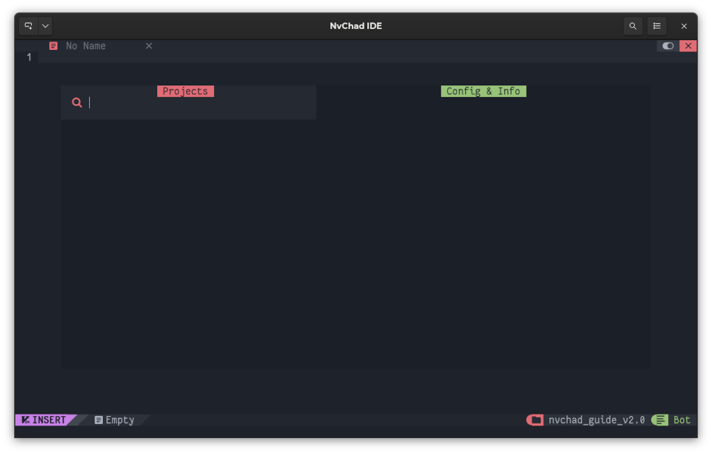
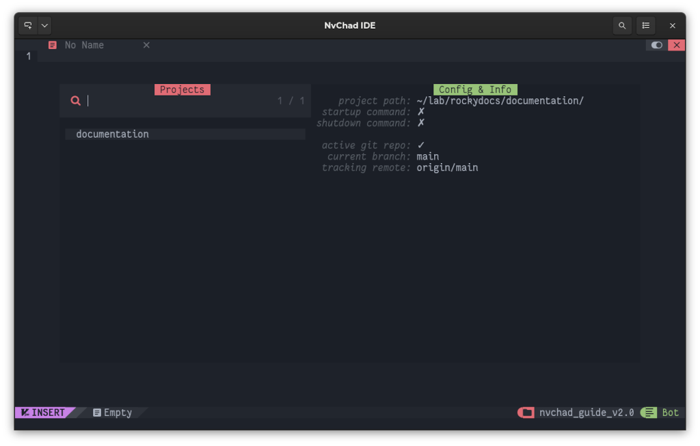

# Project Manager

## Introduction

!!! danger "Wrong instructions"

    With the release of version 2.5, the instructions on this page are no longer correct; its use is not recommended for new installations. For more information see [the main page of the guide](../index.md).

One of the features that an IDE must surely have is the ability to manage the various projects that a developer or publisher works on. Being able to select the project to work on once NvChad is open, without the need to type commands in the *statusline* to achieve the goal. This saves time and allows for simplified management in the case of a large number of projects.

Using [charludo/projectmgr.nvim](https://github.com/charludo/projectmgr.nvim) will integrate this functionality. The plugin provides excellent integration with `Telescope` and some interesting additional features such as the ability to synchronize a *git* repository when opening the *project*.

The plugin also tracks the status of the editor when it closes allowing you to have, when you next open it, all the pages you were working on.

### Plugin installation

To install the plugin you will need to edit the **custom/plugins.lua** file by adding the following block of code:

```lua
{
    "charludo/projectmgr.nvim",
    lazy = false, -- important!
},
```

Once you have saved the file, the plugin will be available for installation. To install it open *lazy.nvim* with the command `:Lazy` and type ++"I"++. Once the installation finishes you will have to exit the editor and reopen it to have it read the new configuration you entered.

The plugin provides a single command `:ProjectMgr` that opens an interactive buffer from which you can perform all operations by using keyboard shortcuts. When first opened, the buffer will be empty as this screenshot shows:



### Using the Project Manager

All operations are performed with the ++ctrl++ key followed by a letter (e.g. `<C-a`), while the `<CR>` key corresponds to the ++enter++ key.

The following table shows all available operations

| Key     | Operation                                       |
|-------- | ----------------------------------------------- |
| `<CR>`  | Opens the project under the cursor              |
| `<C-a>` | Adds a project through an interactive procedure |
| `<C-d>` | Delete a project                                |
| `<C-e>` | Change project settings                         |
| `<C-q>` | Close buffer                                    |

To add your first project you will need to use the combination ++ctrl++ + ++"a"++ which will open an interactive menu in the *statusline*. In this example a clone of the Rocky Linux documentation saved in **~/lab/rockydocs/documentation** will be used.

The first question will ask you for the name of the project:

> Project Name: documentation

It will follow the project path:

> Project Path: ~/lab/rockydocs/documentation/

This is followed by the ability to set commands to be run when opening and closing the project. These commands refer to those executable in the editor and not to the **bash** language.

You have, for example, the possibility to open contextually when opening the editor a side buffer with *NvimTree* with the command `NvimTreeToggle`.

> Startup Command (optional): NvimTreeToggle

Or to run a command before closing the editor.

> Exit Command (optional):

Commands should be entered by omitting the colon `:` used to run the same commands in the *statusline.*

Once the configuration is finished, your project will be available in the buffer. To open it, select it and press ++enter++.



As you can see from the screenshot in the **Config & Info** section, the plugin has recognized the folder as managed by *Git* and provides us with some information about it.

Editing a project is done with ++ctrl++ + ++"e"++ and consists of a new interactive loop, while any deletion is accomplished with the combination ++ctrl++ + ++"d"++.

### Additional functions

The plugin provides some additional functions specified in the [dedicated section](https://github.com/charludo/projectmgr.nvim#%EF%B8%8F-configuration). The most interesting ones are the ability to synchronize a git repository when opening the project and the ability to store the status of the editor when closing it. Both features are already present in the default configuration file, although, the functionality regarding *Git* is disabled.

To add repository synchronization when opening projects you will need to add the following code to the initial plugin configuration:

```lua
config = function()
    require("projectmgr").setup({
        autogit = {
            enabled = true,
            command = "git pull --ff-only >> .git/fastforward.log 2>&1",
        },
    })
end,
```

As you can see from the code the `require("projectmgr").setup` function is called, which allows you to override the default settings. Anything you set inside it will change how it works.

The `git pull --ff-only` command performs a *fast forward* synchronization of the repository, downloading only those files that have no conflicts and can be updated without intervention on your part.

The result of the command also is directed to the file **.git/fastforward.log** to prevent it from being displayed on the terminal where NvChad is running and to have a synchronization history available.

Also provided is the option to save the session when it closes. This allows you to return to the pages you were working on by selecting the project and opening it again.

```lua
session = { enabled = true, file = "Session.vim" },
```

This option is enabled by default but it writes the **Session.vim** file to the *root* directory of the project and this is not desirable in the case of Rocky Linux documentation. In this example, it is saved in the `.git` folder which is not under version control.

Adjust the path of **Session.vim** and **fastforward.log** according to your needs.

Once the changes are complete, your configuration should look as follows:

```lua
{
    "charludo/projectmgr.nvim",
    lazy = false, -- important!
    config = function()
        require("projectmgr").setup({
            autogit = {
                enabled = true,
                command = "git pull --ff-only > .git/fastforward.log 2>&1",
            },
            session = { enabled = true, file = ".git/Session.vim" },
        })
    end,
},
```

Now each time you open your projects, updated files will be automatically downloaded from the Git repository and you will have the latest files you were working on open in the editor ready for editing.

!!! Warning

    Open files in NvChad's saved session buffers are not automatically updated.

To check if the open files do not match those updated from the repository you can use the `:checktime` command, which checks if the files open in the editor have been modified outside NvChad and alerts you to the need to update the buffers.

### Mapping

To speed up the opening of your projects, you can create a keyboard shortcut to put in your mapping in **/custom/mapping.lua**. An example might be:

```lua
-- Projects
M.projects = {
    n = {
        ["<leader>fp"] = { "<cmd> ProjectMgr<CR>", "Open Projects" },
    },
}
```

With the editor in the **NORMAL** state you can open the project manager with the combination ++space++ + ++"f"++ followed by ++"p"++.

## Conclusions and final thoughts

As the number of projects you are working on increases, it might be useful to have a tool to help you manage them all. This plugin will allow you to speed up your work by reducing the time it takes to access the files you need to edit.

We should also point out the excellent integration with `Telescope` which makes project management very functional.
