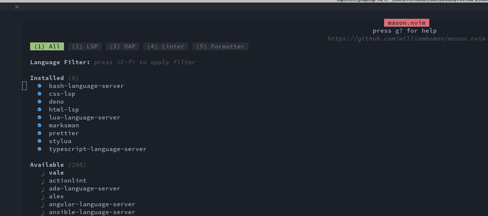
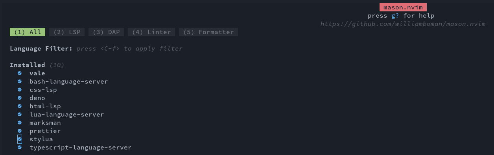
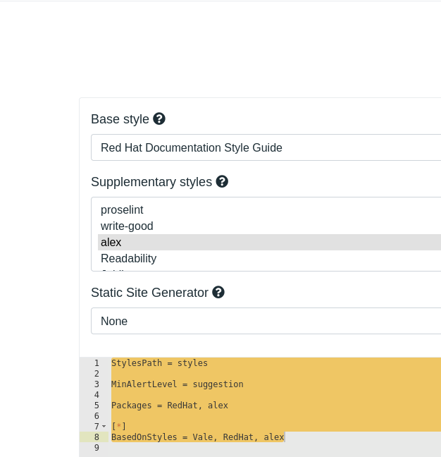
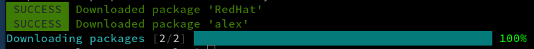

# `vale` in NvChad (Neovim)

## :material-message-outline: Introduzione

`vale.sh` è uno dei principali progetti open source per scrittori tecnici che vogliono migliorare la propria scrittura e la coerenza dello stile. Può essere utilizzato con numerosi editor su quasi tutte le principali piattaforme OS (Linux, MacOS, Windows). Per saperne di più sul progetto, visitate il [sito web vale.sh](https://vale.sh/). Questa guida vi condurrà nell'aggiunta di `vale` a NvChad. Poiché è incluso nei pacchetti Mason usati per l'installazione, il processo non è troppo difficile, anche se comporta alcune piccole modifiche e configurazioni per far funzionare le cose. Per essere chiari, NvChad è in realtà il gestore della configurazione dell'editor Neovim, quindi da questo momento in poi il riferimento sarà `nvim`.

## :material-arrow-bottom-right-bold-outline: Prerequisiti

* È utile la familiarità con NvChad 2.0
* Possibilità di modificare i file dalla riga di comando utilizzando l'editor preferito. (`vi` o il vostro preferito)
* Il plugin *nvim-lint* correttamente installato in NvChad.

### :material-monitor-arrow-down-variant: Installazione di nvim-lint

Il plugin [nvim-lint](https://github.com/mfussenegger/nvim-lint) fornisce il supporto per l'inserimento dei ==linters== nell'editor, fornendo la correzione del codice o del contenuto sia per la parte sintattica che per quella semantica.

Per installare il plugin, è necessario modificare il file `custom/plugins.lua` aggiungendo il seguente blocco di codice:

```lua title="plugins.lua"
  {
    "mfussenegger/nvim-lint",
    event = "VeryLazy",
    config = function()
      require "custom.configs.lint"
    end,
  },
```

Il plugin ha un file di configurazione da collocare nella cartella `custom/configs`. Al suo interno troviamo una tabella ==linters_by_ft== dove è possibile inserire i *linters* per i linguaggi utilizzati per lo sviluppo.

```lua title="lint.lua"
require("lint").linters_by_ft = {
  markdown = { "markdownlint" },
  yaml = { "yamllint" },
}

vim.api.nvim_create_autocmd({ "BufWritePost" }, {
  callback = function()
    require("lint").try_lint()
  end,
})
```

Questo file di configurazione è impostato per lavorare con il codice markdown, ma può essere modificato o esteso con [quelli disponibili](https://github.com/mfussenegger/nvim-lint?tab=readme-ov-file#available-linters) sul sito del progetto.

Una volta completate le modifiche, uscire e rientrare da NvChad per installare il plugin e importare la configurazione.

## :material-monitor-arrow-down-variant: Installazione di `vale` con Mason

L'installazione di `vale` da NvChad usando Mason, manterrà il pacchetto aggiornato con pochi passi in più. L'esecuzione periodica di Mason da `nvim` visualizzerà se ci sono aggiornamenti da installare e permetterà di aggiornarli da lì. Questo include `vale` una volta installato. Per iniziare, eseguiamo `nvim` per richiamare un file vuoto e poi entriamo nella modalità di comando usando ++shift++ ++": "++ + Mason, che dovrebbe mostrare un'interfaccia simile a questa:



Invece di consultare l'intero elenco dei pacchetti, utilizziamo la voce del menu 4 per limitare l'elenco ai soli linter. Premere ++4++ e scorrere l'elenco fino a trovare `vale` e con il cursore su quella riga, premere ++"i "++ per installarlo. Il vostro elenco dovrebbe ora mostrare `vale` come installato:



### :material-timer-cog-outline: Configurazione e inizializzazione di `vale`

Sono disponibili due metodi per configurare `vale`. Si può scegliere il proprio preferito tra le due opzioni sottostanti. Una consiste nel creare i file di configurazione all'interno del percorso del binario `vale`, quindi spostarli nella cartella home, mentre l'altra consiste nel creare i file di configurazione direttamente nella cartella home. Funzionano ugualmente bene. La seconda opzione ha meno passaggi manuali, ma richiede un lungo percorso per il binario `vale`.

!!! tip "Suggerimento"

    Per nascondere la cartella "styles" (sotto), modificare leggermente il contenuto di `.vale.ini' durante la creazione, cambiando l'opzione "StylesPath" da "styles" a qualcosa di nascosto, come ".styles" o ".vale_styles." Esempio:

    ```
    StylesPath = .vale_styles
    ```

La sola installazione di `vale` non è sufficiente. Sono necessari un paio di elementi aggiuntivi. Per prima cosa, sarà necessario un file `.vale.ini` che verrà collocato nella radice della cartella home. Successivamente, è necessario generare la cartella "styles" usando `vale sync`.

=== "Installazione dal percorso del file binario `vale`"

    Se vi trovate nel percorso del binario `vale` qui: `~/.local/share/nvim/mason/packages/vale/` si può semplicemente creare il file `.vale.ini` qui, generare la cartella "styles" e poi spostare entrambi nella propria radice `~/`. La creazione del file `.vale.ini' è semplice utilizzando l'utilità di configurazione del sito web `vale.sh` (https://vale.sh/generator). Scegliere "Red Hat Documentation Style Guide" per lo stile di base e "alex" per lo stile supplementare. L'uso di 'alex' è facoltativo, ma aiuta a individuare e correggere le parole di genere, polarizzanti, razziali, ecc. Se si scelgono queste opzioni, la schermata dovrebbe apparire come questa:
    
    
    
    È sufficiente copiare il contenuto in basso, creare il file `.vale.ini` con il proprio editor preferito e incollare quanto copiato.
    
    È necessario creare la cartella "styles". Per farlo, eseguire il binario `vale` con il comando `sync`. Anche in questo caso, se si sta eseguendo questa operazione dalla directory `~/.local/share/nvim/mason/packages/vale/`, basta fare:

    ```bash
    ./vale sync
    ```


    Una volta terminata l'operazione, verrà visualizzato quanto segue:
    
    
    
    Copiare la cartella `.vale.ini` e la cartella `styles` nella radice della cartella home:

    ```bash
    cp .vale.ini ~/
    cp -rf styles ~/
    ```

Copiare il file `.vale.ini` e la cartella `styles` nella radice della cartella home:

    Se si preferisce non dover copiare i file e si vuole semplicemente crearli nella propria cartella personale, si può usare questo comando da `~/`:
    
    Per prima cosa, creare il file `.vale.ini' nella propria cartella personale usando [il sito web `vale.sh`] (https://vale.sh/generator). Anche in questo caso, scegliere "Red Hat Documentation Style Guide" per lo stile di base e "alex" per lo stile supplementare. Quindi copiare il contenuto nel file `.vale.ini`.
    
    
    
    Successivamente, eseguire il comando `vale sync`. Poiché ci si trova nella propria home directory, è necessario l'intero percorso del binario:

    ```bash
    ~/.local/share/nvim/mason/packages/vale/vale sync
    ```


    
    
    In questo caso, non è necessario copiare i file, poiché verranno creati nella directory principale.

### :material-file-edit-outline: Modifiche al file `lint.lua`

È necessario un ultimo passo. È necessario modificare il file `lint.lua` che si trova in `~/.config/nvim/lua/custom/configs/` e aggiungere il linter `vale`.

Utilizzando l'esempio mostrato sopra per aggiungere *vale* al linter disponibile per i file markdown, sarà necessario aggiungere il nuovo linter alla stringa già presente:

```lua
markdown = { "markdownlint", "vale" },
```

Una volta completato, il file avrà un aspetto simile a questo:

```lua
require("lint").linters_by_ft = {
  markdown = { "markdownlint", "vale" },
  yaml = { "yamllint" },
}

vim.api.nvim_create_autocmd({ "BufWritePost" }, {
  callback = function()
    require("lint").try_lint()
  end,
})

```

## Conclusioni e considerazioni finali

Avviando normalmente `nvim`, ora viene richiamato `vale` e i documenti vengono confrontati con lo stile preferito. L'apertura di un file esistente avvierà `vale` e mostrerà tutti gli elementi segnalati, mentre l'avvio di un nuovo file non mostrerà nulla in modalità di inserimento. Il file viene controllato quando si esce dalla modalità di inserimento. In questo modo si evita che lo schermo sia troppo affollato. `vale` è un eccellente prodotto open source con un'ottima integrazione in molti editor. NvChad non fa eccezione e, anche se la sua attivazione richiede alcuni passaggi, non è una procedura difficile.
