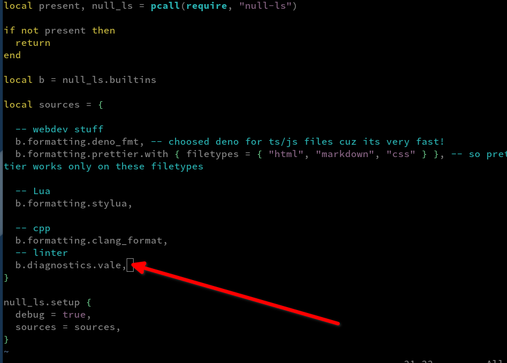

# `vale` in NvChad (Neovim)

## Introduzione

`vale.sh` è uno dei principali progetti open source per scrittori tecnici che vogliono migliorare la propria scrittura e la coerenza dello stile. Può essere utilizzato con numerosi editor su quasi tutte le principali piattaforme OS (Linux, MacOS, Windows). Per saperne di più sul progetto, visitate il [sito web vale.sh](https://vale.sh/). Questa guida vi condurrà nell'aggiunta di `vale` a NvChad. Poiché è incluso nei pacchetti Mason per l'installazione, il processo non è troppo difficile, anche se comporta alcune piccole modifiche e configurazioni per far funzionare le cose. Per essere chiari, NvChad è in realtà il gestore della configurazione dell'editor Neovim, quindi da questo momento in poi il riferimento sarà `nvim`.

## Prerequisiti

* È utile la familiarità con NvChad 2.0
* Possibilità di modificare i file dalla riga di comando utilizzando l'editor preferito. (`vi` o il vostro preferito)

## Installazione di `vale` con Mason

L'installazione di `vale` dall'interno di NvChad, usando Mason, manterrà il pacchetto aggiornato con pochi passi in più. L'esecuzione periodica di Mason da `nvim` mostrerà se ci sono aggiornamenti da installare e permetterà di aggiornarli da lì. Questo include `vale` una volta installato. Cominciamo con l'eseguire `nvim` per visualizzare un file vuoto e poi entriamo nella modalità di comando usando <kbd>SHIFT+</kbd><kbd>:</kbd>+Mason, che dovrebbe mostrare un'interfaccia simile a questa:


Invece di consultare l'intero elenco dei pacchetti, utilizziamo la voce di menu 4 per limitare l'elenco dei linters. Premete <kbd>4</kbd> e scorrete l'elenco fino a trovare `vale` e, con il cursore su quella riga, premete <kbd>i</kbd> per installare. Il vostro elenco dovrebbe ora mostrare `vale` installato:


## Configurazione e inizializzazione di `vale`

Esistono due metodi per configurare `vale`. Potete scegliere il vostro preferito tra le due opzioni qui sotto. Una prevede che i file di configurazione siano creati all'interno del percorso del binario di `vale` e poi spostati nella cartella home, mentre l'altra prevede che i file di configurazione siano creati direttamente nella cartella home. Funzionano ugualmente bene. La seconda opzione comporta un minor numero di passaggi manuali, ma richiede un lungo percorso verso il binario `vale`.

!!! tip "Suggerimento"

    Se si vuole nascondere la cartella "styles" (sotto), modificare leggermente il contenuto di `.vale.ini` durante la creazione, cambiando l'opzione "StylesPath" da "styles" a qualcosa di nascosto, come ".styles" o ".vale_styles" Esempio:

    ```
    StylesPath = .vale_styles
    ```

L'installazione di `vale` non è sufficiente. Sono necessari un paio di elementi aggiuntivi. Per prima cosa, è necessario un file `.vale.ini` che si trova nella radice della cartella home. Successivamente, è necessario generare la cartella "styles" usando `vale sync`.

### Installazione dall'interno del percorso del binario `vale`

Se ci si trova nel percorso del binario di `vale` qui: `~/.local/share/nvim/mason/packages/vale/` si può semplicemente creare il file `.vale.ini` qui, generare la cartella "styles" e poi spostare entrambi nella propria radice `~/`. La creazione del file `.vale.ini` è facile utilizzando l'utilità di configurazione del [sito web `vale.sh`](https://vale.sh/generator). Scegliere "Red Hat Documentation Style Guide" per lo stile di base e "alex" per lo stile supplementare. L'uso di 'alex' è facoltativo, ma aiuta a individuare e correggere le parole di genere, polarizzanti, razziali, ecc. Se si scelgono queste opzioni, la schermata dovrebbe apparire come questa:


È sufficiente copiare il contenuto in basso, creare il file `.vale.ini` con il proprio editor preferito e incollare quanto copiato.

È necessario creare la cartella "styles". Per farlo, eseguire il binario `vale` con il comando `sync`. Anche in questo caso, se si sta eseguendo questa operazione dalla cartella `~/.local/share/nvim/mason/packages/vale/`, basta fare:

```
./vale sync
```

Una volta terminata l'operazione, verrà visualizzato quanto segue:


Copiare il file `.vale.ini` e la cartella `styles` nella radice della cartella home:

```
cp .vale.ini ~/
cp -rf styles ~/
```

### Installazione dalla propria home directory

Se si preferisce non dover copiare i file e si vuole semplicemente crearli nella propria home directory, si può usare questo comando da `~/`:

Per prima cosa, creare il file `.vale.ini` nella cartella principale utilizzando [il sito web `vale.sh`](https://vale.sh/generator). Anche in questo caso, scegliere "Red Hat Documentation Style Guide" per lo stile di base e "alex" per lo stile supplementare. Quindi copiare il contenuto nel file `.vale.ini`.


Quindi, eseguire il comando `vale sync.`  Dal momento che ci si trova nella propria home directory, è necessario l'intero percorso del binario:

```
~/.local/share/nvim/mason/packages/vale/vale sync
```


In questo caso, non è necessario copiare i file, poiché verranno creati nella directory principale.


## Modifiche al file `null-ls.lua`

È necessario un ultimo passo. È necessario modificare il file `null-ls.lua` che si trova in `~/.config/nvim/lua/custom/configs/` e aggiungere il linter `vale`.

Se non sono stati installati altri linters, creare una sezione con due trattini (commenti) chiamata "linters" e inserirvi questo codice:

```
b.diagnostica.vale,
```

Una volta completato, il file avrà un aspetto simile a questo:



## Considerazioni Finali

Avviando normalmente `nvim`, ora viene richiamato `vale` e i documenti vengono confrontati con lo stile preferito. L'apertura di un file esistente avvierà `vale` e mostrerà tutti gli elementi segnalati, mentre l'avvio di un nuovo file non mostrerà nulla in modalità di inserimento. Quando si esce dalla modalità di inserimento, il file viene controllato. In questo modo si evita che lo schermo sia troppo ingombro. `vale` è un eccellente prodotto open source con un'ottima integrazione in molti editor. NvChad non fa eccezione e, anche se la sua messa in funzione richiede alcuni passaggi, e non è una procedura difficile.
