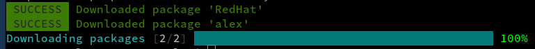

# NvChad(Neovim) 의 `vale`

## 소개

`vale.sh`는 목소리와 스타일의 일관성을 개선하고자 하는 기술 작가들을 위한 최고의 오픈 소스 프로젝트 중 하나입니다. 거의 모든 주요 OS 플랫폼(Linux, MacOS, Windows)에서 여러 편집기와 함께 사용할 수 있습니다. [vale.sh 웹사이트](https://vale.sh/)로 이동하면 프로젝트에 대해 자세히 알아볼 수 있습니다. 이 가이드는 NvChad에 `vale`을 추가하는 과정을 안내합니다. 설치를 위해 Mason 패키지에 포함되어 있기 때문에 작업을 진행하기 위해 약간의 편집 및 구성이 필요하지만 프로세스가 그리 어렵지는 않습니다. 확실히 하자면, NvChad는 Neovim 편집기의 구성 관리자이기 때문에, 앞으로 참조는 `nvim`가 될 것입니다.

## 필요 사항

* NvChad 2.0에 익숙하면 도움이 됩니다.
* 본인이 좋아하는 편집기를 사용하여 명령줄에서 파일을 변경할 수 있습니다. (`vi` 또는 본인이 좋아하는 편집기)

## Mason을 사용하여 `vale` 설치

Mason을 사용하여 NvChad 내에서 `vale`을 설치하면 몇 가지 추가 단계만으로 패키지를 최신 상태로 유지할 수 있습니다. `nvim ` 내에서 Mason을 주기적으로 실행하면 설치해야 하는 업데이트가 있는지 여부가 표시되고, 이를 통해 업데이트할 수 있습니다. 일단 설치되면 `vale`가 여기에 포함됩니다. 먼저 `nvim`을 실행하여 빈 파일을 가져온 다음 <kbd>SHIFT</kbd>+<kbd>:</kbd>+Mason을 사용하여 명령 모드로 들어가겠습니다. 이 인터페이스는 다음과 유사한 인터페이스를 표시해야 합니다:


전체 패키지 목록을 보는 대신 메뉴 항목 4를 사용하여 목록을 linter로 제한하겠습니다. <kbd>4</kbd>를 누르고 `vale`을 찾을 때까지 목록에서 아래로 스크롤하고 해당 줄에 커서를 놓고 <kbd>i</kbd>를 눌러 설치합니다. 이제 목록에 설치된 `vale`가 설치된 것으로 표시됩니다:


## `vale` 구성 및 초기화

`vale`을 구성하는 데 사용할 수 있는 두 가지 방법이 있습니다. 아래 두 가지 옵션 중에서 마음에 드는 것을 선택할 수 있습니다. 하나는 구성 파일을 `vale` 바이너리의 경로 내에서 생성한 다음 홈 폴더로 이동하고, 다른 하나는 홈 폴더에 직접 구성 파일을 생성하도록 합니다. 그들은 똑같이 잘 작동합니다. 두 번째 옵션은 수동 단계가 적지만 `vale` 바이너리에 대한 긴 경로가 필요합니다.

!!! 팁

    "styles"폴더(아래에 있는)를 숨기려면, "StylesPath" 옵션을 "styles"에서 ".styles" 또는 ".vale_styles"와 같은 숨겨진 항목으로 변경하여 생성 중에 `.vale.ini`의 내용을 약간 수정하십시오. 예시:

    ```
    StylesPath = .vale_styles
    ```

`vale`을 설치하는 것만으로는 충분하지 않습니다. 몇 가지 추가 항목이 필요합니다. 먼저 홈 폴더의 루트에 위치할 `.vale.ini` 파일이 필요합니다. 다음으로 `vale sync`를 사용하여 "styles" 디렉토리를 생성해야 합니다.

### `vale` 바이너리의 경로 내에서 설치

만약 여기 `vale` 바이너리의 경로에 있는 경우: `~/.local/share/nvim/mason/packages/vale/` 여기에서 `.vale.ini` 파일을 생성하고, "styles" 디렉토리를 생성한 다음, 둘 다 홈 루트 `~/`로 이동할 수 있습니다. [`vale.sh` 웹 사이트](https://vale.sh/generator)의 구성 유틸리티를 사용하여 `.vale.ini` 파일을 쉽게 생성할 수 있습니다. 여기에서 기본 스타일로 "Red Hat Documentation Style Guide"를 선택하고 보조 스타일로 "alex"를 선택합니다. '알렉스'를 사용하는 것은 선택 사항이지만, 중요한 성별, 양극화 또는 인종 관련 단어 등을 발견하여 수정할 수 있도록 도와줍니다. 해당 옵션을 선택하면 화면이 다음과 같이 표시됩니다.


하단의 내용을 복사하고 원하는 편집기로 `.vale.ini` 파일을 만든 다음 복사한 내용을 붙여넣기만 하면 됩니다.

"styles" 폴더를 만들어야 합니다. `sync` 명령으로 `vale` 바이너리를 실행하면 됩니다. 다시 말하지만 `~/.local/share/nvim/mason/packages/vale/` 디렉토리에서 이 작업을 수행하는 경우 다음을 수행하십시오.

```
./vale sync
```

완료되면 다음이 표시됩니다.



`.vale.ini` 및 `styles` 폴더를 홈 폴더의 루트에 복사합니다.

```
cp .vale.ini ~/
cp -rf styles ~/
```

### 홈 디렉토리에서 설치

파일을 복사하지 않고 홈 디렉터리에 만들고 싶다면 `~/`에서 다음 명령을 사용할 수 있습니다.

먼저 [`vale.sh` 웹사이트](https://vale.sh/generator)를 사용하여 홈 폴더에 `.vale.ini`를 만듭니다. 다시 기본 스타일로 "Red Hat Documentation Style Guide"를 선택하고 추가 스타일로 "alex"를 선택합니다. 그런 다음 콘텐츠를 `.vale.ini` 파일에 복사합니다.


다음으로 `vale sync` 명령을 실행합니다. 현재 홈 디렉토리에 있으므로 바이너리에 대한 전체 경로가 필요합니다.

```
~/.local/share/nvim/mason/packages/vale/vale sync
```


이 경우 홈 디렉토리 루트에 파일이 생성되므로 파일을 복사할 필요가 없습니다.


## `null-ls.lua` 파일 변경

필요한 마지막 단계가 하나 있습니다. `~/.config/nvim/lua/custom/configs/`에 있는 `null-ls.lua` 파일을 변경하고 `vale` linter를 추가해야 합니다.

다른 linters가 설치되어 있지 않은 경우 "linters"라는 두 개의 대시(주석) 가 있는 섹션을 만든 다음 이 코드를 배치합니다.

```
b.diagnostics.vale,
```

완료되면 파일은 다음과 같이 표시됩니다.


## 결론 및 최종 생각

일반적으로 `nvim `를 시작하면 `value `가 호출되고 사용자의 문서가 사용자가 선호하는 스타일과 비교됩니다. 기존 파일을 열면 `vale`이 시작되고 플래그가 지정된 항목이 표시되지만 새 파일을 시작하면 삽입 모드에서 아무 것도 표시되지 않습니다. 삽입 모드를 종료하면 파일이 검사됩니다. 이렇게 하면 화면이 너무 복잡해지지 않습니다. `vale`은 많은 편집기에 잘 통합된 뛰어난 오픈 소스 제품입니다. NvChad도 예외는 아니며 시작 및 실행에는 몇 가지 단계가 필요하지만 어려운 절차는 아닙니다.
