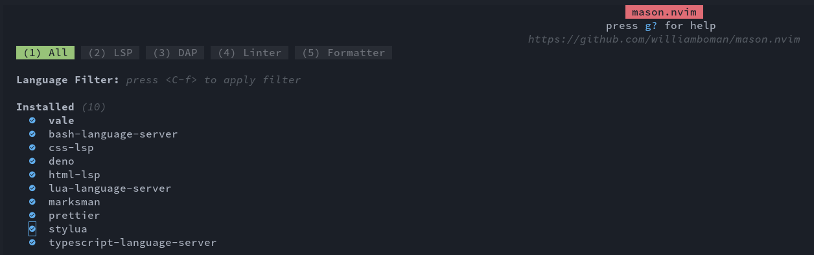

# NvChad(Neovim) 의 `vale`

## 소개

`vale.sh`는 기술 작가들이 음성과 스타일 일관성을 향상시키기 위해 가장 선두적인 오픈 소스 프로젝트 중 하나입니다. 이것은 주요 OS 플랫폼 (Linux, MacOS, Windows)의 거의 모든 주요 편집기와 함께 사용할 수 있습니다. [vale.sh 웹사이트](https://vale.sh/)에서 이 프로젝트에 대해 자세히 알아볼 수 있습니다. 이 안내서는 NvChad에 `vale`를 추가하는 방법을 안내합니다. 설치에는 일부 수정과 구성이 필요하지만, Mason 패키지에 포함되어 있으므로 너무 어렵지 않습니다. 명확히 말하자면, NvChad는 사실상 Neovim 에디터의 구성 관리자이므로 이후부터는 `nvim`에 대한 참조로 사용됩니다.

## 필요 사항

* NvChad 2.0에 대한 이해는 도움이 됩니다
* 본인이 좋아하는 편집기를 사용하여 명령줄에서 파일을 변경할 수 있습니다. (`vi` 또는 본인이 좋아하는 편집기)

## Mason을 사용하여 `vale` 설치

Mason을 사용하여 NvChad 내에서 `vale`를 설치하면 일부 추가 단계로 패키지를 최신 상태로 유지할 수 있습니다. 주기적으로 `nvim`  내에서 Mason을 실행하면 설치해야 할 업데이트가 있는지 확인하고 해당 업데이트를 거기서 업데이트할 수 있습니다. 이에는 설치된 `vale`도 포함됩니다. 먼저 `nvim`을 실행하여 빈 파일을 가져오고 <kbd>SHIFT</kbd>+<kbd>:</kbd>+Mason을 사용하여 명령 모드로 들어가보세요. 이렇게 하면 다음과 유사한 인터페이스가 표시됩니다:


패키지 전체 목록을 살펴보는 대신, <kbd>4</kbd>번 메뉴 항목을 사용하여 linter만 표시하도록 제한해보겠습니다. 4를 누르고 목록에서 `vale`를 찾아 해당 줄에 커서를 놓은 다음, <kbd>i</kbd>를 눌러 설치합니다. 이제 목록에 `vale`가 설치된 것이 표시됩니다:



## `vale` 구성 및 초기화

`vale`을 구성하는 두 가지 방법이 있습니다. 아래의 두 가지 옵션 중에서 선호하는 방법을 선택할 수 있습니다. 하나는 `vale` 바이너리의 경로에서 구성 파일을 생성한 다음 해당 파일을 홈 폴더로 이동시키는 것이고, 다른 하나는 구성 파일을 직접 홈 폴더에 생성하는 것입니다. 두 방법 모두 잘 작동합니다. 두 번째 옵션은 수동 단계가 적지만, `vale` 바이너리의 긴 경로가 필요합니다.

!!! tip "팁"

    "styles" 폴더를 숨기려면, <code>.vale.ini의 내용을 약간 수정하여 "StylesPath" 옵션을 "styles"에서 ".styles" 또는 ".vale_styles"와 같이 숨겨진 형식으로 변경하면 됩니다. 예시:
    </code>

    ```
    StylesPath = .vale_styles
    ```

단순히 `vale`를 설치하는 것으로는 충분하지 않습니다. 추가로 몇 가지 항목이 필요합니다. 먼저, 홈 폴더의 루트에 위치할 `.vale.ini` 파일이 필요합니다. 그리고 "styles" 디렉토리를 `vale sync`를 사용하여 생성해야 합니다.

### `vale` 바이너리의 경로 내에서 설치

`vale` 바이너리 경로인 `~/.local/share/nvim/mason/packages/vale/`에서 다음 단계를 따라 진행하세요. 먼저, 여기에서 `.vale.ini` 파일을 생성하고 "styles" 디렉토리를 생성한 후 두 파일을 홈 폴더 루트 `~/`로 이동시키면 됩니다. `.vale.ini 파일은` [`vale.sh` 웹 사이트](https://vale.sh/generator)의 구성 유틸리티를 사용하여 쉽게 생성할 수 있습니다. 여기서 기본 스타일로 "Red Hat Documentation Style Guide"를 선택하고 보충 스타일로 "alex"를 선택하세요. 'alex'를 선택하는 것은 선택 사항이지만, 성별, 양극화, 인종 관련 단어 등을 포착하고 수정하는 데 도움이 되는 중요한 요소입니다. 이러한 옵션을 선택한 경우, 화면은 다음과 같아야 합니다:


하단의 내용을 복사하고 원하는 편집기를 사용하여 `.vale.ini`파일을 생성한 후, 복사한 내용을 붙여넣으세요.

"styles" 폴더를 만들어야 합니다. `sync` 명령으로 `vale` 바이너리를 실행하면 됩니다. 다시 말하지만 `~/.local/share/nvim/mason/packages/vale/` 디렉토리에서 이 작업을 수행하는 경우 다음을 수행하십시오.

```
./vale sync
```

작업이 완료되면 다음과 같이 표시됩니다:


`.vale.ini` 및 `styles` 폴더를 홈 폴더의 루트로 복사하세요:

```
cp .vale.ini ~/
cp -rf styles ~/
```

### 홈 디렉토리에서 설치

파일을 복사하지 않고 직접 홈 디렉토리에 생성하고자 하는 경우, 홈 디렉토리인 `~/`에서 다음 명령어를 사용할 수 있습니다:

먼저, [`vale.sh` 웹사이트](https://vale.sh/generator)를 통해 홈 폴더에 .vale.ini 파일을 생성하세요. 다시 말하지만, 기본 스타일로 "Red Hat Documentation Style Guide"를 선택하고 보충 스타일로 "alex"를 선택하세요. 그런 다음 복사한 내용을 .vale.ini 파일에 붙여넣으세요.


그런 다음 `vale sync` 명령어를 실행하세요. 홈 디렉토리에 있으므로 바이너리의 전체 경로가 필요합니다:

```
~/.local/share/nvim/mason/packages/vale/vale sync
```


이 경우 파일을 복사할 필요가 없으므로 파일이 홈 디렉토리의 루트에 생성됩니다.


## `null-ls.lua` 파일 변경

필요한 마지막 단계가 하나 있습니다. 마지막으로 `null-ls.lua` 파일을 수정해야 합니다. 이 파일은`~/.config/nvim/lua/custom/configs/` 경로에 있으며 `vale` linter를 추가해야 합니다.

다른 linter가 설치되어 있지 않은 경우, "linters"라는 두 개의 대시 (주석)로 된 섹션을 만든 다음 다음 코드를 그 안에 넣으세요:

```
b.diagnostics.vale,
```

작업이 완료되면 파일은 다음과 같이 보일 것입니다:


## 결론 및 최종 생각

이제 `nvim`을 일반적으로 실행하면 `vale`이 호출되어 문서가 기본 스타일과 비교됩니다. 기존 파일을 열면 `vale`이 시작되고 표시된 문제가 있을 것이고, 새 파일을 시작하면 삽입 모드에서는 아무런 표시도 되지 않습니다. 삽입 모드에서 나가면 파일이 검사됩니다. 이렇게 하면 화면이 너무 혼잡해지지 않습니다. `vale`은 많은 편집기에 잘 통합되어 있는 훌륭한 오픈 소스 제품입니다. NvChad도 예외는 아니며, 실행에는 몇 가지 단계가 필요하지만 어려운 절차는 아닙니다.
