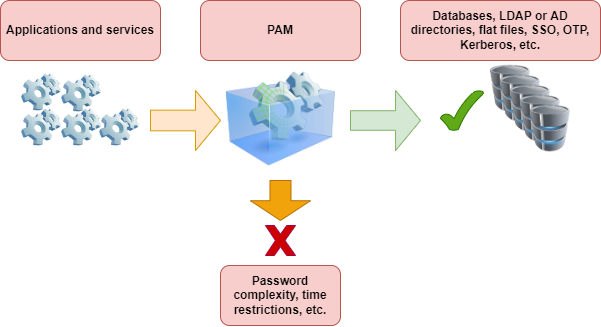
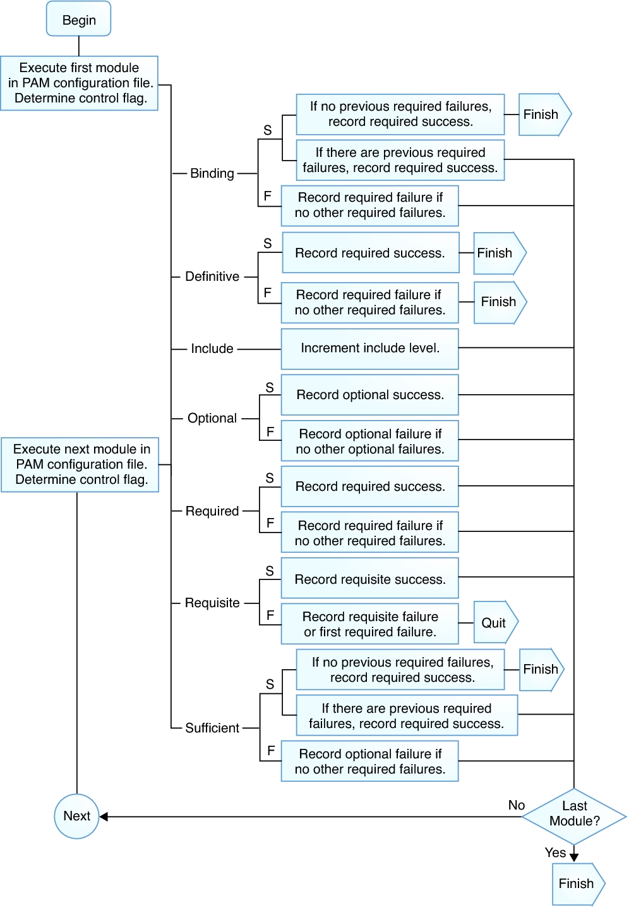
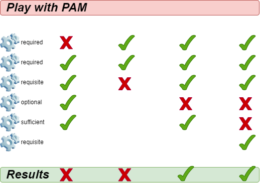

## Опис вмісту документа

У цьому розділі ви дізнаєтесь наступне про PAM:

1. Базовий теоретичний зміст
2. Опис файлу конфігурації
3. Використання PAM для підвищення безпеки операційної системи

Передумови та припущення:

- Некритичний ПК, сервер або віртуальна машина Rocky Linux
- Root-доступ
- Деякі наявні знання Linux
- Бажання дізнатися про автентифікацію користувачів та програм у Linux
- Здатність приймати наслідки власних дій

## Вступ

PAM (**Під’ємні модулі автентифікації**) – це система під GNU/Linux, яка дозволяє багатьом програмам або службам централізовано автентифікувати користувачів. PAM був спочатку запропонований **Віпіном Самаром** та **Чарлі Лаєм** з Sun Microsystems (пізніше придбаної Oracle) у 1995 році та реалізований у їхній системі Solaris. Пізніше різні варіанти UNIX та дистрибутиви GNU/Linux також додали його підтримку. Початковою метою розробки PAM було інтегрувати різні базові механізми автентифікації у високорівневий API, позбавляючи розробників клопоту з проектуванням та впровадженням різних складних механізмів автентифікації самостійно. У 1997 році Open Group опублікувала попередню специфікацію X/Open Single Sign-on (XSSO), яка стандартизувала PAM API та додала розширення для єдиного (або радше інтегрованого) входу.

PAM має відкритий вихідний код. Більше інформації можна знайти [на сайті GitHub тут](https://github.com/linux-pam/linux-pam).

- Як забезпечити, щоб користувачами програм, сервісів чи інструментів, що використовуються в системі, завжди були вони самі?
- Як вказати періоди часу, протягом яких користувачі системи повинні обмежувати доступ до послуг?
- Як обмежити використання системних ресурсів різними програмами або службами?
- ...

Без PAM можна писати функції автентифікації лише в різних застосунках. Після того, як вам знадобиться змінити певний метод автентифікації, розробникам, можливо, доведеться переписати програму, перекомпілювати її та перевстановити. З Pam, автентифікація особи в програмі виконується PAM, тому суб'єкт програми більше не може зосереджуватися на самій автентифікації особи.



PAM в основному складається з набору спільних бібліотек (файлів .so) та файлів конфігурації. Його основні характеристики такі:

- Базується на модульній конструкції та має функцію вставки
- Метод автентифікації не залежить від програми
- Надає розробникам уніфікований API
- Висока гнучкість, що дозволяє програмам вільно вибирати необхідний метод автентифікації через PAM
- Покращення безпеки операційної системи

## Терміни в PAM

На ранніх етапах існування PAM **Віпін Самар** та **Чарлі Лай** не надавали формального визначення цим термінам. Тим не менш, вони використовували терміни, які не були формально визначені, що призводило до оманливих або незрозумілих ситуацій під час їх використання. У 1999 році **Ендрю Г. Морган** (автор Linux-PAM) вперше встановив послідовну, чітку термінологію у своєму офіційному документі, хоча вона ще не була ідеальною. Документація FreeBSD містить пояснення наступних термінів:

- **account** - Набір повноважень, які заявник запитує від арбітра.
- **applicant** - Користувач або об'єкт, що запитує автентифікацію.
- **arbitrator** - Користувач або організація, яка має необхідні права для перевірки облікових даних заявника та повноваження задовольняти або відхиляти запит.
- **chain** - Послідовність модулів, які будуть викликані у відповідь на PAM-запит. Ланцюжок містить інформацію про порядок виклику модулів, які аргументи їм передавати та як інтерпретувати результати.
- **client** - Застосунок відповідає за ініціювання запиту на автентифікацію від імені заявника та за отримання від нього необхідної інформації для автентифікації.
- **facility** - Одна з чотирьох основних груп функціональності, що надаються PAM: **_authentication_**, **_account management_**, **_session management_** та **_authentication token update_**.
- **module** - Колекція з однієї або кількох пов'язаних функцій, що реалізують певний засіб автентифікації, зібраних в один (зазвичай динамічно завантажуваний) двійковий файл та ідентифікованих одним ім'ям.
- **policy** - Повний набір конфігураційних операторів, що описують, як обробляти PAM-запити для певної служби. **_Поліс зазвичай складається з чотирьох ланцюгів, по одному для кожного закладу, хоча деякі служби не використовують усі чотири заклади_**.
- **server** - Додаток діє від імені арбітра, спілкуючись з клієнтом, отримуючи інформацію для автентифікації, перевіряючи облікові дані заявника та задовольняючи або відхиляючи запити.
- **service** - Клас серверів, що забезпечують подібну або споріднену функціональність і вимагають подібної автентифікації. PAM визначає політики для кожної служби окремо, тому всі сервери, які мають однакове ім'я служби, підпорядковуються одній і тій самій політиці.
- **session** - Контекст, у якому сервер надає послугу заявнику. Одна з чотирьох функцій PAM, управління сеансами, займається виключно налаштуванням та руйнуванням цього контексту.
- **token** - Фрагмент інформації, пов’язаної з обліковим записом, такий як пароль або парольна фраза, яку заявник повинен надати для підтвердження своєї особи.
- **transaction** - Послідовність запитів від того самого заявника до того самого екземпляра того самого сервера, починаючи з автентифікації та встановлення сеансу та закінчуючи завершенням сеансу.

### Ілюстрація термінів прикладами

Клієнт і сервер – це одне ціле:

```bash
Bash > whoami
alice

Bash > ls -l `which su`

Bash > su  - 
Password: 1Q.3werzasd

Bash > whoami
root
```

- Поточний користувач - alice
- Обліковий запис root
- Процес su є одночасно клієнтським і серверним.
- Токен автентифікації — 1Q.3werzasd
- Арбітр - root

Клієнт і сервер окремі:

```bash
Bash > whoami
eve

Bash > ssh bob@login.example.com
bob@login.example.com's password:
god
Last login: Thu Oct 11 09:52:57 2024 from 192.168.0.1

```

- Поточний користувач - eve
- Клієнт — це процес `ssh` Єви
- Сервером є процес `sshd` на login.example.com
- Обліковий запис — bob
- Токен автентифікації – це god
- Хоча це не показано в цьому прикладі, арбітром є root

### Приклад політики

```text
sshd	auth		required	pam_nologin.so	no_warn
sshd	auth		required	pam_unix.so	no_warn try_first_pass
sshd	account		required	pam_login_access.so
sshd	account		required	pam_unix.so
sshd	session		required	pam_lastlog.so	no_fail
sshd	password	required	pam_permit.so
```

- Ця політика застосовується до служби `sshd`
- auth, account, session, та password - функції
- pam_nologin.so, pam_unix.so, pam_login_access.so, pam_lastlog.so та pam_permit.so – це модулі. З цього прикладу видно, що pam_unix.so реалізував щонайменше дві групи функціональності (автентифікація та керування обліковими записами)

## Основи PAM

### Зручності та примітиви

**Примітивні** концепції в інформатиці: процес, що складається з кількох інструкцій, що використовуються для виконання певної функції. Система об'єднує ці інструкції в програму, яку неможливо розділити або перервати під час виконання, забезпечуючи безперервність та цілісність операції. Апаратне забезпечення або операційні системи зазвичай надають примітиви для реалізації критично важливих системних функцій.

PAM API надає шість різних примітивів автентифікації, розділених на чотири типи засобів:

1. **auth** - Аутентифікація. Автентифікує заявника та встановлює облікові дані.
2. **account** - Управління обліковими записами. Вирішує проблеми доступності облікових записів, не пов’язані з автентифікацією, такі як обмеження доступу на основі часу доби або робочого навантаження сервера.
3. **session** - Управління сеансом. Обробляє завдання, пов'язані з налаштуванням та завершенням сеансу, такі як вхід до системи та облік.
4. **password** - Керування паролями. Змінює токен автентифікації, пов’язаний з обліковим записом, або через закінчення терміну його дії, або через бажання користувача змінити його.

!!! tip "Різні визначення"

    Деякі дистрибутиви визначають ці 4 можливості як «інтерфейси модулів» або «типи модулів».

### Модулі

PAM-модуль — це автономний фрагмент програмного коду, який реалізує примітиви в одній або кількох функціях для одного конкретного механізму. Простіше кажучи, модулі в PAM – це колекції з однієї або кількох пов'язаних функцій, які реалізують певні служби автентифікації.

Запит модуля PAM поверне один із наступних трьох станів:

1. success - Відповідність політиці безпеки
2. failure - Невідповідність політиці безпеки
3. ignore - Запит не бере участі в політиці безпеки

### Ланцюги та політики

Коли сервер ініціює транзакцію PAM, бібліотека PAM намагається завантажити політику для служби, зазначеної у виклику [pam_start(3)](https://www.man7.org/linux/man-pages/man3/pam_start.3.html). Політика визначає, як обробляти запити на автентифікацію, як визначено у файлі конфігурації. Це ще одна центральна концепція PAM: можливість для адміністратора налаштовувати політику безпеки системи (у ширшому сенсі цього слова) просто редагуючи текстовий файл.

Поліс складається з чотирьох ланцюжків, по одному для кожного з чотирьох об'єктів PAM. Кожен ланцюжок — це послідовність конфігураційних операторів, кожен з яких визначає модуль для виклику, деякі (необов'язкові) параметри для передачі модулю та керуючий прапорець, який описує, як інтерпретувати код повернення з модуля.

#### Прапорці керування

Ці контрольні прапорці включають:

- `binding` - Якщо модуль виконується успішно, і жоден попередній модуль у ланцюжку не мав збоїв, ланцюжок негайно завершується, і запит задовольняється. Якщо модуль завершується невдачею, він виконує решту ланцюжка, але запит зрештою відхиляється
- `required` - Для продовження автентифікації модуль має пройти успішно. Якщо тест на цьому етапі не пройде, користувач не отримає сповіщення, доки не будуть готові результати всіх тестів модулів, що посилаються на цей інтерфейс
- `requisite` - Для продовження автентифікації модуль має пройти успішно. Однак, якщо тест на цьому етапі не пройде, користувач негайно отримає повідомлення, яке відобразить перший невдалий тест «обов’язкового» або «рекомендованого» модуля
- `optional` - Ігнорує результат модуля. Модуль, позначений як "optional", стає необхідним для успішної автентифікації лише тоді, коли інші модулі не посилаються на інтерфейс
- `sufficient` - Ігнорує результат модуля, якщо він завершується невдачею. Однак, якщо результат модуля з позначкою «sufficient» є успішним, і жоден з попередніх модулів з позначкою «required» не завершився невдачею, тоді не потрібні інші результати та користувач автентифікується в сервісі
- `include` - На відміну від інших елементів керування, це не стосується того, як обробляється результат модуля. Цей прапорець витягує всі рядки з конфігураційного файлу, що відповідають заданому параметру, та додає їх як аргумент до модуля

На наступному рисунку показано, як записати успішне або невдале виконання кожного контрольного прапорця:





Щодо інших прапорців керування, будь ласка, зверніться до `man 5 pam.conf`.

Коли сервер викликає один із шести примітивів PAM, PAM отримує ланцюжок для об'єкта, до якого належить цей примітив, та викликає кожен із модулів, перелічених у ланцюжку, у порядку їх переліку, доки не досягне кінця або не визначить, що подальша обробка не потрібна (або тому, що модуль "зв'язування" або "достатній" завершився успішно, або тому, що модуль "обов'язкового" завершився невдало). Система задовольняє запит тоді і тільки тоді, коли вона викликає принаймні один модуль, і всі необов'язкові модулі виконуються успішно.

!!! tip "Підказка"

    Зверніть увагу, що можливо, хоча й не дуже поширене явище, мати один і той самий модуль, зазначений кілька разів в одному ланцюжку. Наприклад, модуль, який шукає імена користувачів та паролі на сервері каталогів, може бути викликаний кілька разів, кожен раз з різними параметрами, що вказують на окремий сервер каталогу для зв'язку. PAM вважає різні позиції одного й того ж модуля в одному ланцюжку окремими та непов'язаними модулями.

## Опис файлу конфігурації

У традиційній старій версії PAM файл конфігурації мав назву `/etc/pam.conf`. Наразі більшість дистрибутивів відмовилися від цього конфігураційного файлу. Цей файл містить усі політики, пов'язані з автентифікацією ідентифікаційних даних для операційної системи. Кожен рядок представляє собою оператор конфігурації в певному ланцюжку певного сервісу, а його синтаксис такий:

```bash
login   auth    required        pam_nologin.so   no_warn
```

Поля такі (по порядку): назва служби, назва об'єкта, прапорець керування, назва модуля та аргументи модуля. Інтерпретація будь-яких додаткових полів відбувається як додаткових аргументів модуля.

> Поліс складається з чотирьох ланцюжків, по одному для кожного з чотирьох об'єктів PAM. Кожен ланцюжок — це послідовність конфігураційних операторів, кожен з яких визначає модуль для виклику, деякі (необов'язкові) параметри для передачі модулю та керуючий прапорець, який описує, як інтерпретувати код повернення з модуля.
> Поліс зазвичай складається з чотирьох ланцюгів, по одному для кожного закладу, хоча деякі служби не використовують усі чотири заклади.

OpenPAM та Linux-PAM підтримують інший механізм конфігурації: централізацію файлів політик у каталозі **/etc/pam.d/**, де назва служби використовується як назва файлу для представлення файлу політики для цієї служби.

```bash
Bash > ls -l /etc/pam.d/
total 88
-rw-r--r--. 1 root root 232 Nov 27 03:04 config-util
-rw-r--r--. 1 root root 322 Nov 30  2023 crond
-rw-r--r--. 1 root root 701 Nov 27 03:04 fingerprint-auth
-rw-r--r--. 1 root root 715 Feb  9  2024 login
-rw-r--r--. 1 root root 154 Nov 27 03:04 other
-rw-r--r--. 1 root root 168 Apr 20  2022 passwd
-rw-r--r--. 1 root root 760 Nov 27 03:04 password-auth
-rw-r--r--  1 root root 155 May 28  2024 polkit-1
-rw-r--r--. 1 root root 398 Nov 27 03:04 postlogin
-rw-r--r--. 1 root root 640 Feb  9  2024 remote
-rw-r--r--. 1 root root 143 Feb  9  2024 runuser
-rw-r--r--. 1 root root 138 Feb  9  2024 runuser-l
-rw-r--r--  1 root root 153 Nov 27 03:04 smartcard-auth
-rw-r--r--. 1 root root 727 Aug 14 04:36 sshd
-rw-r--r--. 1 root root 214 Dec 18 01:38 sssd-shadowutils
-rw-r--r--. 1 root root 566 Feb  9  2024 su
-rw-r--r--. 1 root root 154 Feb 15  2024 sudo
-rw-r--r--. 1 root root 178 Feb 15  2024 sudo-i
-rw-r--r--. 1 root root 137 Feb  9  2024 su-l
-rw-r--r--. 1 root root 760 Nov 27 03:04 system-auth
-rw-r--r--  1 root root 368 Dec 18 01:56 systemd-user
-rw-r--r--. 1 root root  84 Jun 22  2023 vlock
```

```bash
Bash > grep -v ^# /etc/pam.d/sshd
auth       substack     password-auth
auth       include      postlogin
account    required     pam_sepermit.so
account    required     pam_nologin.so
account    include      password-auth
password   include      password-auth
session    required     pam_selinux.so close
session    required     pam_loginuid.so
session    required     pam_selinux.so open env_params
session    required     pam_namespace.so
session    optional     pam_keyinit.so force revoke
session    optional     pam_motd.so
session    include      password-auth
session    include      postlogin
```

Вміст кожного файлу політики може складатися щонайбільше з чотирьох полів:

1. TYPE - Один з варіантів: автентифікація, сесія, пароль або обліковий запис
2. CONTROL - Прапорець керування
3. MOUDLE_PATH - Шляхи до модулів та модулі, що закінчуються на .so. Для 64-розрядних операційних систем. Ви можете знайти всі модулі в **/lib64/security/**
4. MOUDLE_ARGS - Аргументи модуля керують поведінкою модуля. опціонально

У каталозі **/etc/security/** знаходяться глобальні файли конфігурації для модулів PAM, які визначають їхню точну поведінку. Кожна програма, що використовує модуль PAM, викликає набір функцій PAM, які обробляють інформацію з файлу конфігурації та повертають результати програмі, що запитує.

Оскільки політика PAM визначається за назвою файлу, а не вказана у вмісті файлу політики, ви можете використовувати один і той самий файл політики для кількох служб з різними назвами. Наприклад:

```bash
Bash > cd /etc/pam.d/ && ln -s sudo ftp
```

### Пояснення вмісту файлу політики

```bash
Bash > cat /etc/pam.d/system-auth
#%PAM-1.0
# This file is auto-generated.
# User changes will be destroyed the next time authselect is run.
auth        required      pam_env.so
auth        sufficient    pam_unix.so try_first_pass nullok
auth        required      pam_deny.so

account     required      pam_unix.so

password    requisite     pam_pwquality.so try_first_pass local_users_only retry=3 authtok_type=
password    sufficient    pam_unix.so try_first_pass use_authtok nullok sha512 shadow
password    required      pam_deny.so

session     optional      pam_keyinit.so revoke
session     required      pam_limits.so
-session     optional      pam_systemd.so
session     [success=1 default=ignore] pam_succeed_if.so service in crond quiet use_uid
session     required      pam_unix.so

Bash > cat /etc/pam.d/login
#%PAM-1.0
auth       substack     system-auth
auth       include      postlogin
account    required     pam_nologin.so
account    include      system-auth
password   include      system-auth
# pam_selinux.so close should be the first session rule
session    required     pam_selinux.so close
session    required     pam_loginuid.so
session    optional     pam_console.so
# pam_selinux.so open should only be followed by sessions to be executed in the user context
session    required     pam_selinux.so open
session    required     pam_namespace.so
session    optional     pam_keyinit.so force revoke
session    include      system-auth
session    include      postlogin
-session   optional     pam_ck_connector.so
```

Опис контенту:

- `#%PAM-1.0` - Оголошення версії цього конфігураційного файлу для PAM1.0 – це звичка, яку ви можете використовувати для перевірки версій у майбутньому. Подібно до "#!/bin/bash" у bash-скриптах.
- `# This file is auto-generated.` - Рядки, що починаються з `#`, позначають рядки коментарів.
- `-session` - Префікс "-" вказує на те, що навіть якщо модуль не існує, це не вплине на результат автентифікації, не кажучи вже про запис цієї події в журнал. Ця функція дуже корисна для додаткових модулів.
- `include` - Спеціальний контрольний прапор.
- `substack` - Спеціальний контрольний прапор. Існує невелика відмінність від прапорця керування "include". Наприклад, «обов’язковий» збій у підстеку призведе лише до завершення роботи підстеку та повернення результату збою, без негайного завершення роботи батьківського стеку. У PAM «стек» стосується кроків та правил виконання, а підстек — іншого стека, вкладеного в стек (батьківський стек).
- Зі змісту видно, що стиль написання прапорців керування не може використовувати лише ключові слова (так званий режим "ключових слів"), але також має стиль **[значення1=дія1 значення2=дія2 ... ]**, який викликає код повернення функції в модулі рядка.

  - «value» може мати такі значення: success, open_err, symbol_err, service_err, system_err, buf_err, perm_denied, auth_err, cred_insuficient, authinfo_unavail, user_unknown, maxtries, new_authtok_reqd, acct_expired, session_err, cred_unavail, cred_expired, cred_err, no_module_data, conv_err, authtok_err, authtok_recover_err, authtok_lock_busy, authtok_disable_aging, try_again, ignore, abort, authtok_expired, module_unknown, bad_item, conv_again, incomplete та default.
  - «action» може бути одним із них: ignore, bad, die, ok, done, N (N має бути додатним цілим числом більше 0). Якщо воно дорівнює 0, це еквівалентно ОК), reset
- `pam_unix.so` - Шлях до модуля та ім'я модуля. Шлях тут посилається на відносний шлях **/lib64/security/**.
- `use_authtok nullok sha512 shadow` - Необов'язкові аргументи модуля, що передаються модулю. Щоб переглянути всі додаткові параметри для певного модуля, введіть `man 8 Module-Name`, наприклад `man 8 pam_unix`.

### system-auth

system-auth — це дуже важливий файл політики PAM, який головним чином відповідає за автентифікацію користувачів під час входу в систему. Більше того, інші програми чи служби можуть викликати його за допомогою ключового слова include, що заощаджує багато часу, який в іншому випадку був би витрачений на переналаштування. Якщо ви не впевнені, як налаштувати, спочатку слід пошукати відповідну інформацію або проконсультуватися з відповідним технічним персоналом.

```bash
Bash > cat /etc/pam.d/system-auth
#%PAM-1.0
# This file is auto-generated.
# User changes will be destroyed the next time authselect is run.
auth        required      pam_env.so
auth        sufficient    pam_unix.so try_first_pass nullok
auth        required      pam_deny.so

account     required      pam_unix.so

password    requisite     pam_pwquality.so try_first_pass local_users_only retry=3 authtok_type=
password    sufficient    pam_unix.so try_first_pass use_authtok nullok sha512 shadow
password    required      pam_deny.so

session     optional      pam_keyinit.so revoke
session     required      pam_limits.so
-session     optional      pam_systemd.so
session     [success=1 default=ignore] pam_succeed_if.so service in crond quiet use_uid
session     required      pam_unix.so
```

Як бачите, цей файл політики використовує повний набір із 4 ланцюжків, кожен з яких відповідає одній службі, і кожна служба може бути об'єднана в стек (тобто одна служба може записувати кілька рядків, і кожен рядок може викликати ті самі або різні модулі). Ще раз підкресліть:

> PAM вважає різні позиції одного й того ж модуля в одному ланцюжку окремими та непов'язаними модулями.

#### ланцюжок автентифікації

Коли користувач входить у систему, його особа та пароль будуть перевірені за допомогою **auth**.

- **pam_env.so** - Визначає змінні середовища після входу користувача в систему. За замовчуванням, якщо не вказано файл конфігурації, змінні середовища встановлюються на основі файлу **/etc/security/pam_env.conf**.
- **pam_unix.so** - Використовує цей модуль, щоб запропонувати користувачеві ввести свій пароль та порівняти його з інформацією про пароль, записаною у **/etc/shadow**. Якщо результат порівняння паролів правильний, користувачеві дозволено увійти. Використання прапорця керування «достатньо» означає, що якщо перевірка цього елемента конфігурації пройде успішно, користувач може повністю автентифікуватися без необхідності запитувати інші модулі. Параметр модуля nullok вказує, що дозволені порожні паролі.
- **pam_deny.so** - Безпосередньо відхиляє всі запити на вхід, які не відповідають жодній із вищезазначених умов, через модуль **pam_deny.so**. **pam_deny.so** — це спеціальний модуль, який завжди повертає "no". Як і у випадку з більшістю механізмів безпеки, запити, що не відповідають правилам автентифікації, відхиляються після виконання всіх правил автентифікації.

#### ланцюжок облікових записів

- **pam_unix.so** - Вказує на те, що користувачеві потрібно пройти перевірку пароля.

#### ланцюжок паролів

- **pam_pwquality.so** - Використовується лише у службі паролів. Перевірте складність паролів за допомогою часто використовуваних параметрів модулів, як показано нижче:

  - debug - Увімкніть цей параметр, щоб записувати інформацію про поведінку модуля до системного журналу
  - authtok_type=XXX - Дія за замовчуванням полягає в тому, щоб модуль використовував такі запити під час запиту паролів: «New UNIX password: » та Retype UNIX password: ". Приклад слова UNIX можна замінити цією опцією; за замовчуванням вона порожня.
  - try_first_pass - Вказує на те, що модуль повинен спочатку використати пароль, отриманий від попереднього модуля, і, якщо перевірка не вдається, запропонувати користувачеві ввести новий пароль.
  - local_users_only - Вказує на ігнорування користувачів, яких немає в локальному файлі **/etc/passwd**.
  - retry=N - Дозволена кількість спроб введення пароля після зміни пароля; значення за замовчуванням — 1.
  - minlen=N - Яка мінімальна довжина нового пароля? Значення за замовчуванням — 8.
  - difok=N - Яка мінімальна кількість символів має відрізнятися між новим та старим паролями? Значення за замовчуванням — 1. Спеціальне значення 0 вимикає всі перевірки на схожість нового пароля зі старим, за винятком того, що новий пароль точно такий самий, як старий.
  - dcredit=N - Коли N>0, це вказує на максимальну кількість дозволених цифрових символів у новому паролі. Коли N<0, це вказує на мінімальну кількість цифрових символів, необхідних для нового пароля. Коли N=0, це означає, що новий пароль може містити будь-яку кількість цифрових символів.
  - lcredit=N - Коли N>0, це вказує на максимальну кількість малих літер, дозволених у новому паролі. Коли N<0, це вказує на мінімальну кількість малих літер, яку необхідно включити до нового пароля. Коли N=0, це означає, що немає обмеження на кількість малих літер у новому паролі.
  - ucredit=N - Коли N>0, це вказує на максимальну кількість дозволених у новому паролі великих літер. Коли N<0, це вказує на мінімальну кількість великих літер, яку має містити новий пароль. Коли N=0, це означає, що немає обмеження на кількість великих літер у новому паролі.
  - ocredit=N - Коли N>0, це вказує на максимальну кількість спеціальних символів, дозволених у новому паролі. Коли N<0, це вказує на мінімальну кількість спеціальних символів, необхідних у новому паролі. Коли N=0, це означає, що немає обмежень на кількість спеціальних символів у новому паролі.
  - maxrepeat=N - Відхиляє паролі, що містять N або більше однакових послідовних символів. Значення за замовчуванням — 0, що вказує на те, що ця перевірка вимкнена.
  - maxsequence=N - Відхиляє паролі, що містять монотонні послідовності символів довші за N. Значення за замовчуванням — 0, тобто ця перевірка вимкнена. Прикладами таких послідовностей є «12345» або «fedcb». Зверніть увагу, що більшість таких паролів не пройдуть перевірку на простоту, якщо послідовність не є лише незначною частиною пароля.
  - maxclassrepeat=N - Відхиляє паролі, що містять більше N послідовних символів одного класу. Значення за замовчуванням — 0, тобто ця перевірка вимкнена.
  - enforce_for_root - Після додавання цього параметра це означає, що вимога складності пароля застосовується до користувача root.

#### ланцюжок сесій

- **pam_keyinit.so** - Створює відповідну зв'язку ключів під час процесу входу користувача та скасовує її після виходу користувача з системи. Цей модуль можна використовувати лише в сеансовому центрі.

  - revoke - Викликає скасування в'язки ключів сеансу процесу, що викликав, після завершення процесу, що викликав, якщо в'язка ключів сеансу була створена для цього процесу спочатку.

- **pam_limits.so** - Модулі, що обмежують системні ресурси. Користувачі з root-правами (uid=0) також будуть обмежені. За замовчуванням цей модуль спочатку зчитує вміст файлу **/etc/security/limits.conf**, а потім зчитує всі файли .conf у каталозі **/etc/security/limits.d/**.

- **pam_systemd.so** - Модуль pam_systemd реєструватиме сесії користувачів у менеджері входу до systemd (тобто systemd-logind.service) та в групі керування systemd. Цей модуль можна використовувати лише в сеансовому центрі.

- **pam_succeed_if.so** - Модуль, який виконує логічні оцінки характеристик облікових записів користувачів. З назви модуля можна зробити висновок, що спочатку потрібно визначити критерії для оцінки. Базове використання — `pam_succeed_if.so [flag...]  [condition...]`

  - Підтримуються такі прапорці: debug, use_uid, quiet, quiet_fail, quiet_success, audit.
  - Умови – це три слова: поле, тест і значення для перевірки.
  - Серед них, "field" підтримує: user, uid, gid, shell, home, ruser, rhost, tty, service

  Приклад конфігурації цього модуля:

    ```text
    pam_succeed_if.so    quiet    uid < 1000  
    pam_succeed_if.so    quiet    gid  eq  1000
    pam_succeed_if.so    quiet    gid <= 1000
    pam_succeed_if.so    quiet    gid >= 1000
    pam_succeed_if.so    quiet    user = root
    pam_succeed_if.so    quiet    user   ingroup  root
    ```

## Фактичний випадок конфігурації

**Вимога для випадку 1**: Збільшення складності паролів. Для звичайних користувачів (з UID >= 1000), під час зміни паролів, пароль має бути довжиною щонайменше 10 символів і містити принаймні одну цифру, принаймні одну велику літеру, принаймні одну малу літеру та принаймні один спеціальний символ. Коли користувач змінює свій пароль, йому дозволено повторити спробу лише 3 рази.

```bash
Bash > vim /etc/pam.d/system-auth
...
password requisite  pam_pwquality.so  try_first_pass  local_users_only  retry=3  authtok_type=  minlen=10  dcredit=-1  lcredit=-1  ucredit=-1  ocredit=-1
...
```

Оскільки я не додав параметр модуля "enforce_for_root", вимога щодо складності пароля не застосовується до root.

```bash
Bash > whoami
root

Bash > id
uid=0(root) gid=0(root) groups=0(root)

Bash > useradd -u 3000 pam-jack
```

Якщо користувач root змінить пароль для pam-jack, хоча й буде текстове запитання, це все одно буде дозволено:

```bash
# Assuming the password is 'qwer1234'
Bash > passwd pam-jack
Changing password for user pam-jack.
New password:
BAD PASSWORD: The password contains less than 1 uppercase letters
Retype new password:
passwd: all authentication tokens updated successfully.
```

Якщо користувач pam-jack змінить свій пароль, пароль суворо відповідатиме вимогам складності:

```bash
Bash > su - pam-jack

# Assuming the password is "400!@GooBing."
Bash > passwd
Changing password for user pam-jack.
Current password:
New password:
Retype new password:
passwd: all authentication tokens updated successfully.
```

Будь-який пароль, який не відповідає вимогам складності, призведе до відмови прийняття:

```bash
Bash > passwd
Changing password for user pam-jack.
Current password:
New password:
BAD PASSWORD: The password contains less than 1 uppercase letters
New password:
BAD PASSWORD: The password contains less than 1 digits
New password:
BAD PASSWORD: The password contains less than 1 non-alphanumeric characters
passwd: Have exhausted maximum number of retries for service

Bash > 
```

Після трьох невдалих запитів процес зміни пароля завершиться.

**Вимога для випадку 2**: Обмежте кількість спроб введення пароля SSH та заблокуйте обліковий запис після досягнення максимальної кількості. Якщо користувач введе неправильний пароль 3 рази протягом 900 секунд під час віддаленого входу через SSH, обліковий запис користувача буде заблоковано на 180 секунд.

Спочатку давайте розглянемо параметри модуля **pam_faillock.so**:

- preauth - Попередня авторизація. Аргумент preauth необхідно використовувати, коли модуль викликається перед модулями, які вимагають облікових даних користувача, таких як пароль. Модуль просто перевіряє, чи слід блокувати користувачеві доступ до сервісу, якщо нещодавно було аномально багато послідовних невдалих спроб автентифікації.
- authfail - Аргумент authfail необхідно використовувати, коли модуль викликається після того, як модулі, що визначають результат автентифікації, зазнали невдачі.
- authsucc - Аргумент authsucc необхідно використовувати, коли модуль викликається після успішного виклику модулів, що визначають результат автентифікації.
- silent - Не роздруковуйте різні типи повідомлень.
- deny=n - Якщо користувач намагається увійти і не вдається увійти більше n разів за останній проміжок часу, доступ буде заборонено. Значення за замовчуванням — 3.
- audit - Якщо відповідного користувача не знайдено, ім'я користувача буде записано в системний журнал.
- even_deny_root - Обмеження блокування облікового запису також поширюється на root-права.
- root_unlock_time=n - Встановіть час блокування облікового запису root. Якщо цей параметр не вказано, буде використано параметр unlock_time.
- unlock_time=n - Час блокування облікового запису вказано в секундах, значення за замовчуванням становить 600. Після перевищення цього терміну обліковий запис буде автоматично розблоковано.
- fail_interval=n - Визначте інтервал між невдалими спробами входу до системи на рівні 900 за замовчуванням. Тобто, будуть враховані невдалі спроби входу протягом п'ятнадцяти хвилин.

Вищезазначені параметри пояснюються лише коротко. Для отримання детальнішої інформації, будь ласка, зверніться до `man 8 pam_faillock`.

За замовчуванням, без зміни файлу конфігурації, SSH-сервер дозволяє користувачам повторити 6 спроб входу, тоді як SSH-клієнт дозволяє 3 спроби. Ви можете переглянути сторінку посібника:

```bash
Bash > man 5 sshd_config
...
MaxAuthTries
            Specifies the maximum number of authentication attempts permitted per connection.  Once the number of failures reaches half this value, additional failures are logged. The default is 6.
...

Bash > man 5 ssh_config
...
NumberOfPasswordPrompts
            Specifies the number of password prompts before giving up.  The argument to this keyword must be an integer. The default is 3.
```

Вкажіть кількість спроб клієнта в PowerShell:

```text
PS > ssh -p 22 -o NumberOfPasswordPrompts=6 root@192.168.100.20
```

Файл політики sshd містить вміст файлу password-auth:

```bash
Bash > cat /etc/pam.d/sshd
...
account    include      password-auth
...
```

Змініть вміст файлу password-auth:

```bash
Bash > vim /etc/pam.d/password-auth
auth        required      pam_faillock.so  preauth  silent audit even_deny_root deny=3  unlock_time=180  <<< Add a new line
auth        required      pam_env.so
auth        sufficient    pam_unix.so try_first_pass nullok
auth      [default=die]   pam_faillock.so  authfail  audit  even_deny_root  deny=3 unlock_time=180  <<< Add a new line
auth        required      pam_deny.so

account     required      pam_unix.so

password    requisite     pam_pwquality.so try_first_pass local_users_only retry=5 authtok_type=
password    sufficient    pam_unix.so try_first_pass use_authtok nullok sha512 shadow
password    required      pam_deny.so

session     optional      pam_keyinit.so revoke
session     required      pam_limits.so
-session     optional      pam_systemd.so
session     [success=1 default=ignore] pam_succeed_if.so service in crond quiet use_uid
session     required      pam_unix.so
```

SSH-клієнт навмисно ввів неправильний пароль тричі поспіль:

```text
PS > ssh -p 22 root@192.168.100.20
root@192.168.100.20's password:
Permission denied, please try again.
root@192.168.100.20's password:
Permission denied, please try again.
root@192.168.100.20's password:
root@192.168.100.20: Permission denied (publickey,gssapi-keyex,gssapi-with-mic,password).
```

Під час повторного підключення, навіть якщо ваш пароль правильний, він не пройде автентифікацію особи, оскільки обліковий запис був заблокований протягом 180 секунд.

Ви можете скористатися командою `faillock` на SSH-сервері для перегляду певної інформації. Заблоковану інформацію також можна переглянути в журналі **/var/log/secure**.

```bash
Bash > faillock
root:
When                Type  Source                                           Valid
2025-03-31 20:15:19 RHOST 192.168.100.8                                        V
2025-03-31 20:15:55 RHOST 192.168.100.8                                        V
2025-03-31 20:15:59 RHOST 192.168.100.8                                        V

Bash > grep -i lock /var/log/secure
Mar 31 20:15:59 HOME01 sshd[6239]: pam_faillock(sshd:auth): Consecutive login failures for user root account temporarily locked
```

Відповідні дані облікового запису після невдалих спроб входу зберігаються в каталозі **/var/run/faillock/**. Щоб очистити дані, скористайтеся командою `faillock --reset`.

**Вимога для випадку 3**: Заборонити зміну пароля на три останні використані паролі.

Просто використовуйте параметр модуля "remember" модуля pam_pwhistory.so.

!!! tip "Підказка"

    Тільки після успішної зміни пароля користувача PAM може визначити його як «запам’ятовуваний пароль». Успішна зміна пароля користувача буде зафіксована у файлі **/etc/security/opasswd**.

```bash
Bash > vim /etc/pam.d/system-auth
#%PAM-1.0
# This file is auto-generated.
# User changes will be destroyed the next time authselect is run.
auth        required      pam_env.so
auth        sufficient    pam_unix.so try_first_pass nullok
auth        required      pam_deny.so

account     required      pam_unix.so

password    requisite     pam_pwquality.so try_first_pass local_users_only retry=3 authtok_type=
password    requisite     pam_pwhistory.so  remember=3 use_authtok  <<<< Add a new line
password    sufficient    pam_unix.so try_first_pass use_authtok nullok sha512 shadow
password    required      pam_deny.so

session     optional      pam_keyinit.so revoke
session     required      pam_limits.so
-session     optional      pam_systemd.so
session     [success=1 default=ignore] pam_succeed_if.so service in crond quiet use_uid
session     required      pam_unix.so
```

```bash
Bash > useradd -u 3000 hisuser

# Change the password of the hisuser user for the first time using the root user
## The password is Flzx3QC<...>
Bash > passwd hisuser

# Second password change
## The password is Talk---5Ing,
Bash > passwd hisuser

# Third password change
## The password is u>=1000And
Bash > passwd hisuser

Bash > cat /etc/security/opasswd.old
hisuser:2500:2:!!,$6$boNLeNZGXelC2G6H$zlLzz3IMMkUeLozLNRN5OljyGHiNacWKNX.6j.RUEb1mI.pgQH7TubBO8QRCEW7ZcyKM6boTE3CUZKL2ybKDw0

Bash > cat /etc/security/opasswd
hisuser:2500:3:!!,$6$boNLeNZGXelC2G6H$zlLzz3IMMkUeLozLNRN5OljyGHiNacWKNX.6j.RUEb1mI.pgQH7TubBO8QRCEW7ZcyKM6boTE3CUZKL2ybKDw0,$6$8Ohz/v429eBRjk58$N7lG7E9sNYAhD1xLSi0S33teWFuf2udEc5ECwqBiV2x2314s6tt2eZu8EZiVAitIIzeYM9zMJtREOpNQLj05Q.
```

Опис вмісту документа:

- Використовуйте ":" для розділення 4 полів
- Ці чотири поля, зліва направо: ім'я користувача, UID, запис кількості старих паролів, зашифрований текст пароля
- У четвертому полі використовуйте "," для розділення та запису історичних шифртекстів паролів.

Якщо звичайний користувач (uid>=1000) змінить свій пароль на один із трьох останніх варіантів використання, буде виведено наступний текстовий вміст:

```text
Password has been already used. Choose another.
```

## Короткий опис інших модулів

- **pam_cracklib.so** - Модуль PAM для перевірки пароля на відповідність словам зі словника
- **pam_time.so** - PAM-модуль для контролю доступу за часом
- **pam_nologin.so** - Заборонити вхід користувачам без прав root
- **pam_wheel.so** - Дозволити root-доступ лише учасникам групи wheel

## Поради

Будь ласка, зверніть увагу, до яких установ застосовується відповідний модуль.

```bash
Bash > man 8 pam_unix
...
MODULE TYPES PROVIDED
       All module types (account, auth, password and session) are provided.
...

Bash > man 8 pam_success_if
...
MODULE TYPES PROVIDED
       All module types (account, auth, password and session) are provided.
...

Bash > man 8 pam_faillock
...
MODULE TYPES PROVIDED
       The auth and account module types are provided.
...
```

Наразі ви маєте мати набагато краще уявлення про те, що може робити PAM і як вносити зміни за потреби. Однак, ми повинні ще раз наголосити на важливості бути дуже, _дуже_ обережними під час внесення змін до PAM-модулів. Ми наполегливо рекомендуємо зробити знімок операційної системи перед тестуванням відповідної функціональності модуля PAM.
