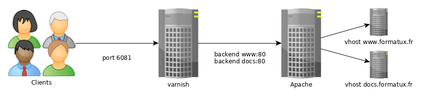
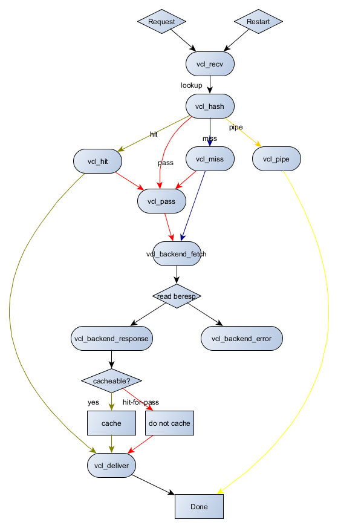
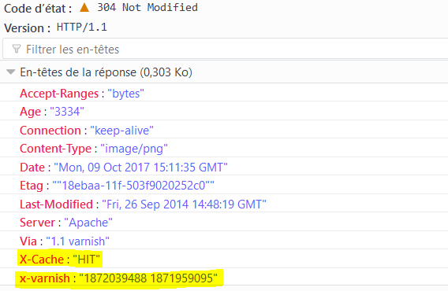

## Varnish

Questo capitolo presenta l'acceleratore web proxy cache : Varnish.

****

**Obiettivi**: si imparerà come:

:heavy_check_mark: Installare e configurare Varnish;\
:heavy_check_mark: Mettere in cache il contenuto di un sito web.

:checkered_flag: **reverse-proxy**, **cache**

**Conoscenza**: :star: :star:
**Complessità**: :star: :star: :star:

**Tempo di lettura**: 30 minuti

****

### Generalità

Varnish è un servizio di reverse-proxy-cache HTTP o un acceleratore di siti web.

Varnish riceve le richieste HTTP dai client:

- se la risposta alla richiesta in cache è disponibile, restituisce la risposta direttamente al client dalla memoria del server,
- se non ha la risposta, Varnish si rivolge al server web. Varnish invia quindi la richiesta al server web, recupera la risposta, la memorizza nella sua cache e risponde al client.

La risposta dalla cache in-memory migliora i tempi di risposta dei client. In questo caso, non c'è accesso ai dischi fisici.

Per impostazione predefinita, Varnish ascolta sulla porta **6081** e utilizza **VCL** (**V**arnish **C**onfiguration **L**anguage) per la sua configurazione. Grazie a VCL, è possibile:

- Decidere il contenuto che il client riceve tramite trasmissione
- Che cos'è il contenuto in cache
- Da quale sito e in che modo si verificano le modifiche della risposta?

Varnish è estensibile con i moduli VMOD (Varnish Modules).

#### Garantire l'high availability

L'uso di diversi meccanismi garantisce l'high availability in tutta la catena web:

- Se Varnish si trova dietro a Load Balancer (LB), sono già in modalità HA, poiché i LB sono generalmente in modalità cluster. Un controllo da parte dei LB verifica la disponibilità di Varnish. Se un server Varnish non risponde più, viene automaticamente rimosso dal pool di server disponibili. In questo caso, Varnish è in modalità ACTIVE/ACTIVE.
- Se il varnish non è dietro un cluster LB, i client si rivolgono a un VIP (vedere il capitolo Heartbeat) condiviso tra i due Varnish. In questo caso, varnish è in modalità ACTIVE/PASSIVE. Il VIP passa al secondo nodo Varnish se il server attivo non è disponibile.
- Quando un backend non è più disponibile, è possibile rimuoverlo dal pool di backend di Varnish, sia automaticamente (con un controllo dello stato health) sia manualmente in modalità CLI (utile per facilitare gli aggiornamenti).

#### Assicurare la scalability

Se i backend non sono più sufficienti a supportare il carico di lavoro:

- o aggiungere più risorse ai backend e riconfigurare il middleware
- oppure aggiungere un altro backend al pool di backend di Varnish

#### Agevolare la scalability

Una pagina web è spesso composta da HTML (spesso generato dinamicamente da PHP) e da risorse più statiche (JPG, gif, CSS, js e così via) durante la creazione. Diventa subito interessante mettere in cache le risorse memorizzabili (quelle statiche), scaricando molte richieste dai backend.

!!! NOTE "Nota"

```
Il caching delle pagine web (HTML, PHP, ASP, JSP, ecc.) è possibile ma più complicata. È necessario conoscere l'applicazione e sapere se le pagine sono memorizzabili nella cache, cosa che dovrebbe essere vera con un'API REST.
```

Quando un client accede direttamente a un server Web, il server deve restituire la stessa immagine tutte le volte che il client la richiede. Una volta che il client ha ricevuto l'immagine per la prima volta, questa viene memorizzata nella cache del browser, a seconda della configurazione del sito e dell'applicazione web.

Quando si accede al server dietro un server di cache correttamente configurato, il primo client che richiede l'immagine inizierà una richiesta iniziale al backend. Tuttavia, la memorizzazione nella cache dell'immagine avverrà per un certo periodo di tempo e la consegna successiva sarà diretta ad altri client che richiedono la stessa risorsa.

Sebbene una cache lato browser ben configurata riduca il numero di richieste al backend, essa integra l'uso di una cache proxy varnish.

#### Gestione dei certificati TLS

Varnish non può comunicare in HTTPS (e non è suo compito farlo).

Il certificato deve quindi essere fornito con una delle seguenti opzioni:

- trasportato dal LB quando il flusso lo attraversa (la soluzione consigliata è quella di centralizzare il certificato, ecc.). Il flusso passa quindi in modo non criptato attraverso il data center.
- da un servizio Apache, Nginx o HAProxy sul server varnish stesso, che agisce solo come proxy verso Varnish (dalla porta 443 alla porta 80). Questa soluzione è utile se si accede direttamente a Varnish.
- Allo stesso modo, Varnish non può comunicare con i backend sulla porta 443. Se necessario, è necessario utilizzare un reverse proxy Nginx o Apache per decifrare la richiesta per varnish.

#### Come funziona

In un servizio Web di base, il client comunica direttamente con il servizio tramite TCP sulla porta 80.


Per utilizzare la cache, il client deve comunicare con il servizio web sulla porta predefinita 6081 di Varnish.



Per rendere il servizio trasparente al client, è necessario modificare la porta di ascolto predefinita per Varnish e i vhost del servizio web.


Per fornire un servizio HTTPS, aggiungere un Load Balancer a monte del servizio Varnish o un servizio proxy sul server Varnish, come Apache, Nginx o HAProxy.

### Configurazione

L'installazione è semplice:

```bash
dnf install -y varnish
systemctl enable varnish
systemctl start varnish
```

#### Configurare il servizio daemon di Varnish

Da `systemctl`, i parametri di Varnish sono impostati grazie al file di servizio `/usr/lib/systemd/system/varnish.service`:

```bash
[Unit]
Description=Varnish Cache, a high-performance HTTP accelerator
After=network-online.target

[Service]
Type=forking
KillMode=process

# Maximum number of open files (for ulimit -n)
LimitNOFILE=131072

# Locked shared memory - should suffice to lock the shared memory log
# (varnishd -l argument)
# Default log size is 80MB vsl + 1M vsm + header -> 82MB
# unit is bytes
LimitMEMLOCK=85983232

# Enable this to avoid "fork failed" on reload.
TasksMax=infinity

# Maximum size of the corefile.
LimitCORE=infinity

ExecStart=/usr/sbin/varnishd -a :6081 -f /etc/varnish/default.vcl -s malloc,256m
ExecReload=/usr/sbin/varnishreload

[Install]
WantedBy=multi-user.target
```

Modificare i valori predefiniti con `systemctl edit varnish.service`: questo creerà il file `/etc/systemd/system/varnish.service.d/override.conf`:

```bash
$ sudo systemctl edit varnish.service
[Service]
ExecStart=/usr/sbin/varnishd -a :6081 -f /etc/varnish/default.vcl -s malloc,512m
```

È possibile selezionare l'opzione più volte per specificare un backend di memorizzazione della cache. I tipi di memoria possibili sono `malloc` (cache in memoria, poi swap se necessario), o `file` (creare un file su disco, poi mappare in memoria). Le dimensioni sono espresse in K/M/G/T (kilobyte, megabyte, gigabyte o terabyte).

#### Configurazione dei backend

Varnish utilizza un linguaggio specifico chiamato VCL per la sua configurazione.

Questo comporta la compilazione del file di configurazione VCL in C. Se la compilazione ha esito positivo e non ci sono allarmi, il servizio può essere riavviato.

È possibile verificare la configurazione di Varnish con il seguente comando:

```bash
varnishd -C -f /etc/varnish/default.vcl
```

!!! NOTE "Nota"

```
È consigliabile controllare la sintassi del VCL prima di riavviare il daemon `varnishd`.
```

Ricaricare la configurazione con il comando:

```bash
systemctl reload varnishd
```

!!! warning "Attenzione"

Un `systemctl restart varnishd` svuota la cache di varnish e causa un picco di carico sui backend. Si dovrebbe quindi evitare di ricaricare `varnishd`.

!!! NOTE "Nota"

```
Per configurare Varnish, seguire le raccomandazioni riportate in questa pagina: <https://www.getpagespeed.com/server-setup/varnish/varnish-virtual-hosts>.
```

### Linguaggio VCL

#### Subroutine

Varnish utilizza file VCL, segmentati in subroutine contenenti le azioni da eseguire. Queste subroutine vengono eseguite solo nei casi specifici che definiscono. Il file predefinito `/etc/varnish/default.vcl` contiene le routine `vcl_recv`, `vcl_backend_response` e `vcl_deliver`:

```bash
#
# This is an example VCL file for Varnish.
#
# It does not do anything by default, delegating control to the
# builtin VCL. The builtin VCL is called when there is no explicit
# return statement.
#
# See the VCL chapters in the Users Guide at https://www.varnish-cache.org/docs/
# and http://varnish-cache.org/trac/wiki/VCLExamples for more examples.

# Marker to tell the VCL compiler that this VCL has been adapted to the
# new 4.0 format.
vcl 4.0;

# Default backend definition. Set this to point to your content server.
backend default {
    .host = "127.0.0.1";
    .port = "8080";
}

sub vcl_recv {

}

sub vcl_backend_response {

}

sub vcl_deliver {

}
```

- **vcl_recv**: routine chiamata prima di inviare la richiesta al backend. In questa routine è possibile modificare le intestazioni HTTP e i cookie, scegliere il backend, ecc. Vedere le azioni `set req`.
- **vcl_backend_response**: routine chiamata dopo la ricezione della risposta del backend (`beresp` significa BackEnd RESPonse). Vedere le azioni `set bereq.` e `set beresp.`.
- **vcl_deliver**: Questa routine è utile per modificare l'output di Varnish. Se è necessario modificare l'oggetto finale (ad esempio, aggiungere o rimuovere un'intestazione), è possibile farlo in `vcl_deliver`.

#### VCL operatori

- `=`: assegnazione
- `==`: confronto
- `~`: confronto in combinazione con un'espressione regolare e ACL
- `!`: negazione
- `&&`: and logico
- `||`: or logico

#### Oggetti di Varnish:

- **req**: l'oggetto richiesta. Crea il `req` quando Varnish riceve la richiesta. La maggior parte del lavoro della subroutine `vcl_recv` riguarda questo oggetto.
- **bereq**: l'oggetto richiesta destinato al server web. Varnish crea questo oggetto da `req`.
- **beresp**: l'oggetto risposta del server web. Contiene le intestazioni degli oggetti dell'applicazione. È possibile modificare la risposta del server nella subroutine `vcl_backend_response`.
- **resp**: la risposta HTTP inviata al client. Modificare questo oggetto con la subroutine `vcl_deliver`.
- **obj**: l'oggetto memorizzato nella cache. Read-only.

#### Azioni in Varnish

Le azioni più frequenti:

- **pass**: Quando fornita, la richiesta e la successiva risposta provengono dal server delle applicazioni. La cache non viene utilizzata.  `pass` restituita dalla subroutine `vcl_recv`.
- **hash**: Quando viene restituito da `vcl_recv`, Varnish servirà il contenuto dalla cache anche se la configurazione della richiesta specifica il passaggio senza cache.
- **pipe**: Utilizzato per gestire i flussi. In questo caso, Varnish non ispezionerà più ogni richiesta, ma lascerà passare tutti i byte al server. Le websocket o la gestione dei flussi video, ad esempio, utilizzano `pipe`.
- **deliver**: Invia l'oggetto al client. Di solito dalla subroutine `vcl_backend_response`.
- **restart**: Riavvia il processo di elaborazione della richiesta. Mantiene le modifiche all'oggetto `req`.
- **retry**: Trasferisce la richiesta al server delle applicazioni. Utilizzato da `vcl_backend_response` o `vcl_backend_error` se la risposta dell'applicazione non è soddisfacente.

In sintesi, il diagramma seguente illustra le possibili interazioni tra le subroutine e le azioni:



### Verifica/Testing/Troubleshooting

È possibile verificare che una pagina provenga dalla cache di Varnish dalle intestazioni della risposta HTTP:



### Backends

Varnish usa il termine `backend` per i vhost che deve proxyare.

È possibile definire più backend sullo stesso server Varnish.

La configurazione dei backend avviene tramite `/etc/varnish/default.vcl`.

#### Gestione ACL

```bash
# Deny ACL
acl deny {
"10.10.0.10"/32;
"192.168.1.0"/24;
}
```

Applicare ACL:

```bash
# Block ACL deny IPs
if (client.ip ~ forbidden) {
  error 403 "Access forbidden";
}
```

Non memorizzare nella cache alcune pagine:

```bash
# Do not cache login and admin pages
if (req.url ~ "/(login|admin)") {
  return (pass);
}
```

#### Impostazioni POST e cookie

Varnish non memorizza mai nella cache le richieste HTTP POST o le richieste contenenti cookie (sia dal client che dal backend).

Se il backend utilizza i cookie, la cache dei contenuti non si verifica.

Per correggere questo comportamento, è possibile disattivare i cookie nelle richieste:

```bash
sub vcl_recv {
    unset req.http.cookie;
}

sub vcl_backend_response {
    unset beresp.http.set-cookie;
}
```

#### Distribuire le richieste a diversi backend

Quando si fa hosting di diversi siti, come un server di documenti (<docs.rockylinux.org>) e un wiki (<wiki.rockylinux.org>), è possibile distribuire le richieste al backend giusto.

Dichiarazione dei backend:

```bash
backend docs {
    .host = "127.0.0.1";
    .port = "8080";
}

backend blog {
    .host = "127.0.0.1";
    .port = "8081";
}
```

La modifica dell'oggetto `req.backend` avviene in base all'host chiamato nella richiesta HTTP nella subroutine `vcl_recv`:

```bash
sub vcl_recv {
    if (req.http.host ~ "^doc.rockylinux.org$") {
        set req.backend = docs;
    }

    if (req.http.host ~ "^wiki.rockylinux.org$") {
        set req.backend = wiki;
    }
}
```

#### Distribuzione del carico

Varnish può gestire il bilanciamento del carico con backend specifici chiamati directors.

Il director del round-robin distribuisce le richieste ai backend del round-robin (alternativamente). È possibile assegnare un peso a ciascun backend.

Il client director distribuisce le richieste in base a un sticky session affinity su qualsiasi elemento dell'intestazione (cioè con un cookie di sessione). Il client director distribuisce le richieste in base a uno sticky In questo caso, un client viene sempre rinviato allo stesso backend.

Backends declaration

```bash
backend docs1 {
    .host = "192.168.1.10";
    .port = "8080";
}

backend docs2 {
    .host = "192.168.1.11";
    .port = "8080";
}
```

Il `director` consente di associare i 2 backend definiti.

Director declaration:

```bash
director docs_director round-robin {
    { .backend = docs1; }
    { .backend = docs2; }
}
```

Non resta che definire il director come backend delle richieste:

```bash
sub vcl_recv {
    set req.backend = docs_director;
}
```

#### Gestire i backends con CLI

È possibile contrassegnare i backend come **sick** o **healthy** per scopi di amministrazione o manutenzione. Questa azione consente di rimuovere un nodo dal pool senza modificare la configurazione del server Varnish (senza riavviarlo) o arrestare il servizio backend.

Visualizza lo stato dei backend: Il comando `backend.list` visualizza tutti i backend, anche quelli senza controllo dello stato di salute (probe).

```bash
$ varnishadm backend.list
Backend name                   Admin      Probe
site.default                   probe      Healthy (no probe)
site.front01                   probe      Healthy 5/5
site.front02                   probe      Healthy 5/5
```

Passare da uno stato all'altro:

```bash
varnishadm backend.set_health site.front01 sick

varnishadm backend.list
Backend name                   Admin      Probe
site.default                   probe      Healthy (no probe)
site.front01                   sick       Sick 0/5
site.front02                   probe      Healthy 5/5

varnishadm backend.set_health site.front01 healthy

varnishadm backend.list
Backend name                   Admin      Probe
site.default                   probe      Healthy (no probe)
site.front01                   probe      Healthy 5/5
site.front02                   probe      Healthy 5/5
```

Per lasciare che sia Varnish a decidere lo stato dei suoi backend, è necessario commutare manualmente i backend in malati o sani e tornare alla modalità automatica.

```bash
varnishadm backend.set_health site.front01 auto
```

La dichiarazione dei backend avviene come segue: <https://github.com/mattiasgeniar/varnish-6.0-configuration-templates>.

### Logs Apache

Poiché il servizio HTTP viene sottoposto a reverse proxy, il server web non avrà più accesso all'indirizzo IP del cliente, ma al servizio Varnish.

Per tenere conto del reverse proxy nei log Apache, modificare il formato del log degli eventi nel file di configurazione del server:

```bash
LogFormat "%{X-Forwarded-For}i %l %u %t "%r" %>s %b "%{Referer}i" "%{User-Agent}i"" varnishcombined
```

e tenere conto di questo nuovo formato nel vhost del sito web:

```bash
CustomLog /var/log/httpd/www-access.log.formatux.fr varnishcombined
```

e renderlo compatibile con Varnish:

```bash
if (req.restarts == 0) {
  if (req.http.x-forwarded-for) {
    set req.http.X-Forwarded-For = req.http.X-Forwarded-For + ", " + client.ip;
  } else {
   set req.http.X-Forwarded-For = client.ip;
  }
}
```

### Pulizia della Cache

Alcune richieste di svuotamento della cache:

a linea di comando:

```bash
arnishadm 'ban req.url ~ .'
```

utilizzando un secret e una porta diversa da quella predefinita:

```bash
varnishadm -S /etc/varnish/secret -T 127.0.0.1:6082 'ban req.url ~ .'
```

con il CLI:

```bash
varnishadm

varnish> ban req.url ~ ".css$"
200

varnish> ban req.http.host == example.com
200

varnish> ban req.http.host ~ .
200
```

tramite una richiesta HTTP PURGE:

```bash
curl -X PURGE http://example.com/foo.txt
```

La configurazione di Varnish per accettare questa richiesta si effettua con:

```bash
acl local {
    "localhost";
    "10.10.1.50";
}

sub vcl_recv {
    # directive to be placed first,
    # otherwise another directive may match first
    # and the purge will never be performed
    if (req.method == "PURGE") {
        if (client.ip ~ local) {
            return(purge);
        }
    }
}
```

### Gestione del log

Varnish scrive i suoi log in memoria e in binario per non penalizzare le sue prestazioni. Quando esaurisce lo spazio di memoria, riscrive i nuovi record sopra quelli vecchi, partendo dall'inizio del suo spazio di memoria.

È possibile consultare i log con gli strumenti `varnishstat` (statistiche), `varnishtop` (top per Varnish), `varnishlog` (verbose logging) o `varnishnsca` (log in formato NCSA, come Apache):

```bash
varnishstat
varnishtop -i ReqURL
varnishlog
varnishnsca
```

L'utilizzo dell'opzione \`-q' per applicare i filtri ai registri si effettua utilizzando:

```bash
varnishlog -q 'TxHeader eq MISS' -q "ReqHeader ~ '^Host: rockylinux\.org$'"
varnishncsa -q "ReqHeader eq 'X-Cache: MISS'"
```

I demoni `varnishlog` e `varnishnsca` registrano i log su disco indipendentemente dal daemon `varnishd`. Il daemon `varnishd` continua a popolare i suoi registri in memoria senza penalizzare le prestazioni dei client; quindi, gli altri demoni copiano i registri su disco.

### Workshop

Per questo workshop è necessario un server con i servizi Apache installati, configurati e protetti, come descritto nei capitoli precedenti.

Si configurerà una cache reverse proxy davanti ad essa.

Il server ha i seguenti indirizzi IP:

- server1: 192.168.1.10

Se non si dispone di un servizio di risoluzione dei nomi, inserire nel file `/etc/hosts` un contenuto simile al seguente:

```bash
$ cat /etc/hosts
127.0.0.1   localhost localhost.localdomain localhost4 localhost4.localdomain4
::1         localhost localhost.localdomain localhost6 localhost6.localdomain6

192.168.1.10 server1 server1.rockylinux.lan
```

#### Task 1: Installazione e configurazione di Apache

```bash
sudo dnf install -y httpd mod_ssl
sudo systemctl enable httpd  --now
sudo firewall-cmd --permanent --add-service=http
sudo firewall-cmd --permanent --add-service=https
sudo firewall-cmd --reload
echo "<html><body>Node $(hostname -f)</body></html>" | sudo tee "/var/www/html/index.html"
```

Verifica:

```bash
$ curl http://server1.rockylinux.lan
<html><body>Node server1.rockylinux.lan</body></html>

$ curl -I http://server1.rockylinux.lan
HTTP/1.1 200 OK
Date: Mon, 12 Aug 2024 13:16:18 GMT
Server: Apache/2.4.57 (Rocky Linux) OpenSSL/3.0.7
Last-Modified: Mon, 12 Aug 2024 13:11:54 GMT
ETag: "36-61f7c3ca9f29c"
Accept-Ranges: bytes
Content-Length: 54
Content-Type: text/html; charset=UTF-8
```

#### Task 2: Installare Varnish

```bash
sudo dnf install -y varnish
sudo systemctl enable varnishd --now
sudo firewall-cmd --permanent --add-port=6081/tcp --permanent
sudo firewall-cmd --reload
```

#### Task 3: Configurare Apache come backend

Modificare `/etc/varnish/default.vcl` per usare apache (porta 80) come backend:

```bash
# Default backend definition. Set this to point to your content server.
backend default {
    .host = "127.0.0.1";
    .port = "80";
}
```

Riavviare Varnish

```bash
sudo systemctl reload varnish
```

Controllare se la Varnish funziona:

```bash
$ curl -I http://server1.rockylinux.lan:6081
HTTP/1.1 200 OK
Server: Apache/2.4.57 (Rocky Linux) OpenSSL/3.0.7
X-Varnish: 32770 6
Age: 8
Via: 1.1 varnish (Varnish/6.6)

$ curl http://server1.rockylinux.lan:6081
<html><body>Node server1.rockylinux.lan</body></html>
```

Come si può vedere, Apache serve la pagina di index.

Sono state aggiunte alcune headers, che ci informano che la nostra richiesta è stata gestita da varnish (header `Via`) e il tempo di cache della pagina (intestazione `Age`), che ci dice che la nostra pagina è stata servita direttamente dalla memoria di varnish invece che dal disco con Apache.

#### Task 4: Rimuovare alcuni headers

Rimuoveremo alcuni headers che possono fornire informazioni non necessarie agli hacker.

Nella sottoparte `vcl_deliver`, aggiungere quanto segue:

```bash
sub vcl_deliver {
    unset resp.http.Server;
    unset resp.http.X-Varnish;
    unset resp.http.Via;
    set resp.http.node = "F01";
    set resp.http.X-Cache-Hits = obj.hits;
    if (obj.hits > 0) { # Add debug header to see if it is a HIT/MISS and the number of hits, disable when not needed
      set resp.http.X-Cache = "HIT";
    } else {
      set resp.http.X-Cache = "MISS";
    }
}
```

Verificare la configurazione e ricaricare varnish:

```bash
$ sudo varnishd -C -f /etc/varnish/default.vcl
...
$ sudo systemctl reload varnish
```

Controlla le differenze:

```bash
$ curl -I http://server1.rockylinux.lan:6081
HTTP/1.1 200 OK
Age: 4
node: F01
X-Cache-Hits: 1
X-Cache: HIT
Accept-Ranges: bytes
Connection: keep-alive
```

Come si può vedere, la rimozione delle intestazioni indesiderate avviene mentre si aggiungono quelle necessarie (per la risoluzione dei problemi).

### Conclusione

Ora avete tutte le conoscenze necessarie per impostare un server cache primario e aggiungere funzionalità.

Avere un server Varnish nella propria infrastruttura può essere molto utile per molte cose oltre alla cache: per la sicurezza del server backend, per la gestione delle intestazioni, per facilitare gli aggiornamenti (modalità blu/verde o canary, per esempio), ecc.

### Verificare le proprie Conoscenze

:heavy_check_mark: Varnish può ospitare file statici?

- [ ] Vero
- [ ] Falso

:heavy_check_mark: La cache di varnish deve essere memorizzata?

- [ ] Vero
- [ ] Falso
