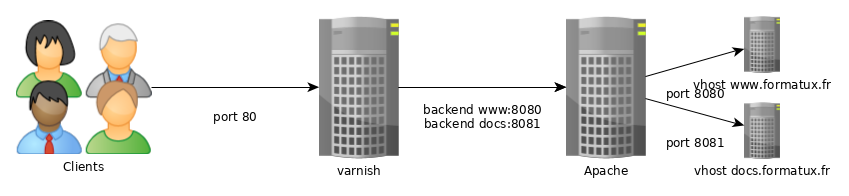
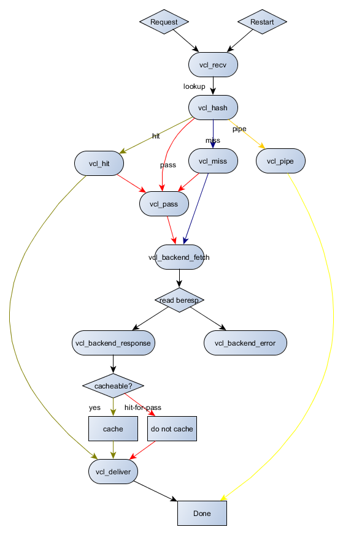
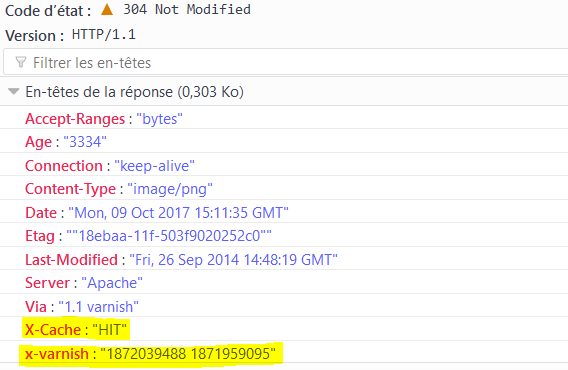

## Varnish

In this chapter, you will learn about the web accelerator proxy cache : Varnish.

****

**Objectives**: In this chapter, you will learn how to:

:heavy_check_mark: Install and configure Varnish;  
:heavy_check_mark: Cache the content of a website.   

:checkered_flag: **reverse-proxy**, **cache**

**Knowledge**: :star: :star:  
**Complexity**: :star: :star: :star:  

**Reading time**: 30 minutes

****

### Generalities

Varnish is an HTTP reverse-proxy-cache service, in other words, a websites accelerator.

Varnish receives HTTP requests from visitors:

* if the response to the cached request is available, it is returned directly to the client from the server's memory,
* if it doesn't have the response, Varnish addresses the web server. Varnish then sends the request to the web server, retrieves the response, stores it in its cache and responds to the client.

Providing the response from the in-memory cache improves response times for clients. In this case, there is no access to physical disks.

By default, Varnish listens on port **6081** and uses **VCL** (**V**arnish **C**onfiguration **L**anguage) for its configuration. Thanks to VCL, it's possible to decide what should or shouldn't be transmitted to the client, what should be cached, from which site and how the response can be modified.

Varnish can be extended with VMOD modules (Varnish Modules).

#### Ensuring high availability

Several mechanisms are used to ensure high availability throughout a web chain:

* if varnish is behind load balancers: as the LBs are generally in cluster mode, they are already in HA mode. A check from the LBs verifies varnish availability. If a varnish server no longer responds, it is automatically removed from the pool of available servers. In this case, varnish is in ACTIVE/ACTIVE mode.
* if varnish isn't behind a LB cluster, clients address a VIP (see Heartbeat chapter), which is shared between the 2 varnishes. In this case, varnish is in ACTIVE/PASSIVE mode. If the active server is no longer available, the VIP switches to the second varnish node.
* When a backend is no longer available, it can be removed from the varnish backend pool either automatically (with a health check) or manually in CLI mode (useful to ease the upgrades/updates).

#### Ensuring scalability

If the backends are no longer sufficient to support the workload :

* either add more resources to the backends and reconfigure the middleware
* or add a new backend to the varnish backend pool.

#### Facilitating scalability

As a web page is made up of an HTML page (often dynamically generated by php, for example) and more static resources (jpg, gif, css, js, etc.), it quickly becomes interesting to cache the resources that can be cached (the static ones), which obviously offloads a large number of requests from the backends.

!!! NOTE

    It is possible to cache web pages (html, php, asp, jsp, etc.), but this is more complicated. You need to know the application and whether the pages are cacheable, which should be the case with a REST API, for example.

When a web server is accessed directly by clients, in this case the server will be called upon for the same image as many times as there are clients. Once the client has received the image for the first time, it is cached on the browser side, depending on the configuration of the site and the web application.

When the server is accessed behind a properly configured cache server, the first client requesting the image will result in an initial request to the backend, but the image will be cached for a certain period of time and delivered directly to subsequent clients.

Although a well-configured browser-side cache reduces the number of requests to the backend, it is complementary to the use of a varnish proxy-cache.

#### TLS certificate management

Varnish cannot communicate in HTTPS (and it's not its role to do so).

The certificate must therefore be either :

* carried by the LB when the flow passes through it (which is the recommended solution: centralization of the certificate, etc.). The flow then passes unencrypted through the datacenter
* carried by an Apache, Nginx or HAProxy service on the varnish server itself, which only acts as a proxy to the varnish (from port 443 to port 80). This solution is useful if varnish is accessed directly.
* Similarly, Varnish cannot communicate with backends on port 443. When necessary, you need to use a nginx or apache reverse proxy to decrypt the request for varnish.

#### How it works

As we saw earlier, in a basic Web service, the client communicates directly with the service via TCP on port 80.


To take advantage of the cache, the client must communicate with the web service on the default Varnish port 6081.


To make the service transparent to the client, you'll need to change the default listening port for Varnish and the web service vhosts.



To provide an HTTPS service, you'll need to add either a load balancer upstream of the varnish service or a proxy service on the varnish server, such as Apache, Nginx or HAProxy.

### Configuration

Installation is simple:

```bash
dnf install -y varnish
systemctl enable varnish
systemctl start varnish
```

#### Configuring the varnish daemon

Since `systemctl`, varnish params are setup thanks to the service file `/usr/lib/systemd/system/varnish.service`:

```bash
[Unit]
Description=Varnish Cache, a high-performance HTTP accelerator
After=network-online.target

[Service]
Type=forking
KillMode=process

# Maximum number of open files (for ulimit -n)
LimitNOFILE=131072

# Locked shared memory - should suffice to lock the shared memory log
# (varnishd -l argument)
# Default log size is 80MB vsl + 1M vsm + header -> 82MB
# unit is bytes
LimitMEMLOCK=85983232

# Enable this to avoid "fork failed" on reload.
TasksMax=infinity

# Maximum size of the corefile.
LimitCORE=infinity

ExecStart=/usr/sbin/varnishd -a :6081 -f /etc/varnish/default.vcl -s malloc,256m
ExecReload=/usr/sbin/varnishreload

[Install]
WantedBy=multi-user.target
```

Change the default values thanks to `systemctl edit varnish.service`: this will create the `/etc/systemd/system/varnish.service.d/override.conf` file:

```bash
$ sudo systemctl edit varnish.service
[Service]
ExecStart=/usr/sbin/varnishd -a :6081 -f /etc/varnish/default.vcl -s malloc,512m
```

To specify a cache storage backend, the option can be specified several times. Possible storage types are malloc (cache in memory, then swap if needed), or file (create a file on disk, then map to memory). Sizes are expressed in K/M/G/T (kilobytes, megabytes, ...).

#### Configuring the backends

Varnish is configured using a specific language called VCL.

This involves compiling the VCL configuration file in C language. The service can be restarted if compilation is successful and no alarms are displayed.

The varnish configuration can be tested with the following command:

```bash
varnishd -C -f /etc/varnish/default.vcl
```

!!! NOTE

    It is advisable to check the VCL syntax before restarting the `varnishd` daemon.

The configuration is reloaded with the command :

```bash
systemctl reload varnishd
```

Warning: a `systemctl restart varnishd` empties the varnish cache and causes a peak load on the backends. You should therefore avoid reloading varnishd.

!!! NOTE

    To configure Varnish, please follow the recommendations on this page: https://www.getpagespeed.com/server-setup/varnish/varnish-virtual-hosts.

### VCL language

#### Subroutines

Varnish uses VCL files, segmented into subroutines containing the actions to be executed. These subroutines are executed only in the specific cases they define. The default `/etc/varnish/default.vcl` file contains the `vcl_recv`, `vcl_backend_response` and `vcl_deliver` routines:

```bash
#
# This is an example VCL file for Varnish.
#
# It does not do anything by default, delegating control to the
# builtin VCL. The builtin VCL is called when there is no explicit
# return statement.
#
# See the VCL chapters in the Users Guide at https://www.varnish-cache.org/docs/
# and http://varnish-cache.org/trac/wiki/VCLExamples for more examples.

# Marker to tell the VCL compiler that this VCL has been adapted to the
# new 4.0 format.
vcl 4.0;

# Default backend definition. Set this to point to your content server.
backend default {
    .host = "127.0.0.1";
    .port = "8080";
}

sub vcl_recv {

}

sub vcl_backend_response {

}

sub vcl_deliver {

}
```

* **vcl_recv**: This routine is called before the request is sent to the backend. In this routine, you can modify HTTP headers, cookies, choose the backend, etc. See actions `set req`.
* **vcl_backend_response**: This routine is called after reception of the backend response (`beresp` means BackEnd RESPonse). See `set bereq.` and `set beresp.` actions.
* **vcl_deliver**: This routine is useful for modifying Varnish output. If you need to modify the final object (add or remove a header, etc.), you can do so in `vcl_deliver`.

#### VCL operators

* `=`: assignment
* `==`: comparison
* `~`: comparison in combination with a regular expression and ACLs
* `!`: negation
* `&&`: and logic
* `||`: or logical

#### Varnish objects

* **req**: the request object. When Varnish receives the request, `req` is created. Most of the work in the `vcl_recv` subroutine concerns this object.
* **bereq**: the request object destined for the web server. Varnish creates this object from `req`.
* **beresp**: the web server response object. It contains the object headers from the application. You can modify the server response in the `vcl_backend_response` subroutine.
* **resp**: the HTTP response to be sent to the client. This object is modified in the `vcl_deliver` subroutine.
* **obj**: the cached object. Read-only.

#### Varnish actions

The most frequent actions:

* **pass**: When `pass` is returned, the request and subsequent response will come from the application server. No cache is applied. `pass` is returned from the `vcl_recv` subroutine.
* **hash**: When `hash` is returned from `vcl_recv`, Varnish will serve the content from the cache even if the request is configured to pass without cache.
* **pipe**: This action is used to manage flows. In this case, Varnish will no longer inspect each request, but will let all bytes pass to the server. `pipe` is used, for example, by websockets or video stream management.
* **deliver**: Delivers the object to the client. Usually from the `vcl_backend_response` subroutine.
* **restart**: Restarts the request processing process. Modifications to the `req` object are retained.
* **retry**: The request is transferred back to the application server. Used from `vcl_backend_response` or `vcl_backend_error` if the application response is unsatisfactory.

In summary, the possible interactions between subroutines and actions are illustrated in the diagram below:



### Verification/Testing/Troubleshooting

It is possible to verify that a page comes from the varnish cache from the HTTP response headers:



### Backends

Varnish uses the term `backend` for the vhosts it needs to proxy.

Several backends can be defined on the same Varnish server.

Backends are configured in `/etc/varnish/default.vcl`.

#### ACL management

```bash
# Deny ACL
acl deny {
"10.10.0.10"/32;
"192.168.1.0"/24;
}
```

Apply ACL:

```bash
# Block ACL deny IPs
if (client.ip ~ forbidden) {
  error 403 "Access forbidden";
}
```

Do not cache certain pages:

```bash
# Do not cache login and admin pages
if (req.url ~ "/(login|admin)") {
  return (pass);
}
```

#### POST and cookies settings

Varnish never caches HTTP POST requests or requests containing cookies (whether from the client or the backend).

If the backend uses cookies, then no content will be cached.

To correct this behavior, we can dereference the cookies in our requests:

```bash
sub vcl_recv {
    unset req.http.cookie;
}

sub vcl_backend_response {
    unset beresp.http.set-cookie;
}
```

#### Distribute requests to different backends

When hosting several sites, such as a document server (doc.rockylinux.org) and a wiki (wiki.rockylinux.org), it's possible to distribute requests to the right backend.

Backends declaration:

```bash
backend docs {
    .host = "127.0.0.1";
    .port = "8080";
}

backend blog {
    .host = "127.0.0.1";
    .port = "8081";
}
```

The req.backend object is modified according to the host called in the HTTP request in the `vcl_recv` subroutine:

```bash
sub vcl_recv {
    if (req.http.host ~ "^doc.rockylinux.org$") {
        set req.backend = docs;
    }

    if (req.http.host ~ "^wiki.rockylinux.org$") {
        set req.backend = wiki;
    }
}
```

#### Load distribution

Varnish can handle load balancing via specific backends called directors.

The round-robin director distributes requests to the round-robin backends (alternately). Each backend can be assigned a weighting.

The client director distributes requests according to a sticky session affinity on any header element (e.g. with a session cookie). In this case, a client is always returned to the same backend.

Backends declaration

```bash
backend docs1 {
    .host = "192.168.1.10";
    .port = "8080";
}

backend docs2 {
    .host = "192.168.1.11";
    .port = "8080";
}
```

The `director` allows you to associate the 2 defined backends.

Director declaration:

```bash
director docs_director round-robin {
    { .backend = docs1; }
    { .backend = docs2; }
}
```

All that remains is to define the director as a backend to the requests:

```bash
sub vcl_recv {
    set req.backend = docs_director;
}
```

#### Managing backends via CLI

Backends can be marked as **sick** or **healthy** for administration or maintenance purposes. This action allows you to remove a node from the pool without having to modify the Varnish server configuration (and therefore without restarting it) or stop the backend service.

View backend status : The `backend.list` command displays all backends, even those without a health check (probe).

```bash
$ varnishadm backend.list
Backend name                   Admin      Probe
site.default                   probe      Healthy (no probe)
site.front01                   probe      Healthy 5/5
site.front02                   probe      Healthy 5/5
```

To switch from one state to another:

```bash
varnishadm backend.set_health site.front01 sick

varnishadm backend.list
Backend name                   Admin      Probe
site.default                   probe      Healthy (no probe)
site.front01                   sick       Sick 0/5
site.front02                   probe      Healthy 5/5

varnishadm backend.set_health site.front01 healthy

varnishadm backend.list
Backend name                   Admin      Probe
site.default                   probe      Healthy (no probe)
site.front01                   probe      Healthy 5/5
site.front02                   probe      Healthy 5/5
```

To let varnish decide on the state of its backends, it is imperative to switch backends that have been manually switched to sick or healthy backends back to auto mode.

```bash
varnishadm backend.set_health site.front01 auto
```

The backends can be declared following: https://github.com/mattiasgeniar/varnish-6.0-configuration-templates

### Apache logs

As the http service is reverse proxied, the web server will no longer have access to the client's IP address, but to that of the Varnish service.

To take reverse proxy into account in Apache logs, change the format of the event log in the server configuration file:

```bash
LogFormat "%{X-Forwarded-For}i %l %u %t "%r" %>s %b "%{Referer}i" "%{User-Agent}i"" varnishcombined
```

and take this new format into account in the website vhost:

```bash
CustomLog /var/log/httpd/www-access.log.formatux.fr varnishcombined
```

and make Varnish compatible:

```bash
if (req.restarts == 0) {
  if (req.http.x-forwarded-for) {
    set req.http.X-Forwarded-For = req.http.X-Forwarded-For + ", " + client.ip;
  } else {
   set req.http.X-Forwarded-For = client.ip;
  }
}
```

### Cache purge

A few requests to purge the cache :

on the command line:

```bash
varnishadm 'ban req.url ~ .'
```

using a secret and a port other than the default :

```bash
varnishadm -S /etc/varnish/secret -T 127.0.0.1:6082 'ban req.url ~ .'
```

on the CLI:

```bash
varnishadm

varnish> ban req.url ~ ".css$"
200

varnish> ban req.http.host == www.example.com
200

varnish> ban req.http.host ~ .
200
```

via an HTTP PURGE request:

```bash
curl -X PURGE http://www.example.org/foo.txt
```

Varnish must be configured to accept this request:

```bash
acl local {
    "localhost";
    "10.10.1.50";
}

sub vcl_recv {
    # directive to be placed first,
    # otherwise another directive may match first
    # and the purge will never be performed
    if (req.method == "PURGE") {
        if (client.ip ~ local) {
            return(purge);
        }
    }
}
```

### Log management

Varnish writes its logs in memory and in binary so as not to penalize its performance. When it runs out of memory space, it rewrites new records on top of old ones, starting from the beginning of its memory space.

Logs can be consulted using the `varnishstat` (statistics), `varnishtop` (top for Varnish), `varnishlog` (verbose logging) or `varnishnsca` (logs in NCSA format, like Apache) tools:

```bash
varnishstat
varnishtop -i ReqURL
varnishlog
varnishnsca
```

The `-q` option can be used to apply filters to logs using the preceding commands:

```bash
varnishlog -q 'TxHeader eq MISS' -q "ReqHeader ~ '^Host: rockylinux\.org$'"
varnishncsa -q "ReqHeader eq 'X-Cache: MISS'"
```

Logging to disk is performed by the varnishlog and varnishnsca daemons independently of the `varnishd` daemon. The `varnishd` daemon continues to populate its logs in memory without penalizing performance towards clients, then the other daemons copy the logs to disk.

### Workshop

For this workshop, you will need one server with Apache services installed, configured, and secured, as described in the previous chapters.

You will configure a reverse-proxy cache in front of it.

Your server has the following IP addresses:

* server1: 192.168.1.10

If you do not have a service to resolve names, fill the `/etc/hosts` file with content like the following:

```bash
$ cat /etc/hosts
127.0.0.1   localhost localhost.localdomain localhost4 localhost4.localdomain4
::1         localhost localhost.localdomain localhost6 localhost6.localdomain6

192.168.1.10 server1 server1.rockylinux.lan
```

#### Task 1 : Installation and configuration of Apache

```bash
sudo dnf install -y httpd mod_ssl
sudo systemctl enable httpd  --now
sudo firewall-cmd --permanent --add-service=http
sudo firewall-cmd --permanent --add-service=https
sudo firewall-cmd --reload
echo "<html><body>Node $(hostname -f)</body></html>" | sudo tee "/var/www/html/index.html"
```

Verify:

```bash
$ curl http://server1.rockylinux.lan
<html><body>Node server1.rockylinux.lan</body></html>

$ curl -I http://server1.rockylinux.lan
HTTP/1.1 200 OK
Date: Mon, 12 Aug 2024 13:16:18 GMT
Server: Apache/2.4.57 (Rocky Linux) OpenSSL/3.0.7
Last-Modified: Mon, 12 Aug 2024 13:11:54 GMT
ETag: "36-61f7c3ca9f29c"
Accept-Ranges: bytes
Content-Length: 54
Content-Type: text/html; charset=UTF-8
```

#### Task 2 : Install varnish

```bash
sudo dnf install -y varnish
sudo systemctl enable varnishd --now
sudo firewall-cmd --permanent --add-port=6081/tcp --permanent
sudo firewall-cmd --reload
```

#### Task 3 : Configure Apache as a backend

Modify `/etc/varnish/default.vcl` to use apache (port 80) as backend:

```bash
# Default backend definition. Set this to point to your content server.
backend default {
    .host = "127.0.0.1";
    .port = "80";
}
```

Reload Varnish

```bash
sudo systemctl reload varnish
```

Check if varnish works:

```bash
$ curl -I http://server1.rockylinux.lan:6081
HTTP/1.1 200 OK
Server: Apache/2.4.57 (Rocky Linux) OpenSSL/3.0.7
X-Varnish: 32770 6
Age: 8
Via: 1.1 varnish (Varnish/6.6)

$ curl http://server1.rockylinux.lan:6081
<html><body>Node server1.rockylinux.lan</body></html>
```

As you can see, Apache serves the index page.

Some headers have been added, giving us information that our request was handled by varnish (header `Via`), and the cached time of the page (header `Age`), giving us the information that our page was served directly from the varnish memory instead of from the disk via Apache.

#### Task 4 : Remove some headers

We will remove some headers that can give unneeded informations to hackers.

In the sub `vcl_deliver`, add the following:

```bash
sub vcl_deliver {
    unset resp.http.Server;
    unset resp.http.X-Varnish;
    unset resp.http.Via;
    set resp.http.node = "F01";
    set resp.http.X-Cache-Hits = obj.hits;
    if (obj.hits > 0) { # Add debug header to see if it's a HIT/MISS and the number of hits, disable when not needed
      set resp.http.X-Cache = "HIT";
    } else {
      set resp.http.X-Cache = "MISS";
    }
}
```

Test your config and reload varnish:

```bash
$ sudo varnishd -C -f /etc/varnish/default.vcl
...
$ sudo systemctl reload varnish
```

Check the differences:

```bash
$ curl -I http://server1.rockylinux.lan:6081
HTTP/1.1 200 OK
Age: 4
node: F01
X-Cache-Hits: 1
X-Cache: HIT
Accept-Ranges: bytes
Connection: keep-alive
```

As you can see, the unwanted headers have been removed and the necessary one (to troubleshoot for example) have been added.

### Conclusion

You now have all the knowledge you need to set up a basic cache server and start adding functionality.

Having a varnish server in your infrastructure can be very useful for many things besides caching: for backend server security, for handling headers, for facilitating updates (blue/green or canary mode, for example), etc.

### Check your Knowledge

:heavy_check_mark: Can Varnish host static files?

* [ ] True  
* [ ] False  

:heavy_check_mark: Does the varnish cache have to be stored in memory??

* [ ] True  
* [ ] False  
