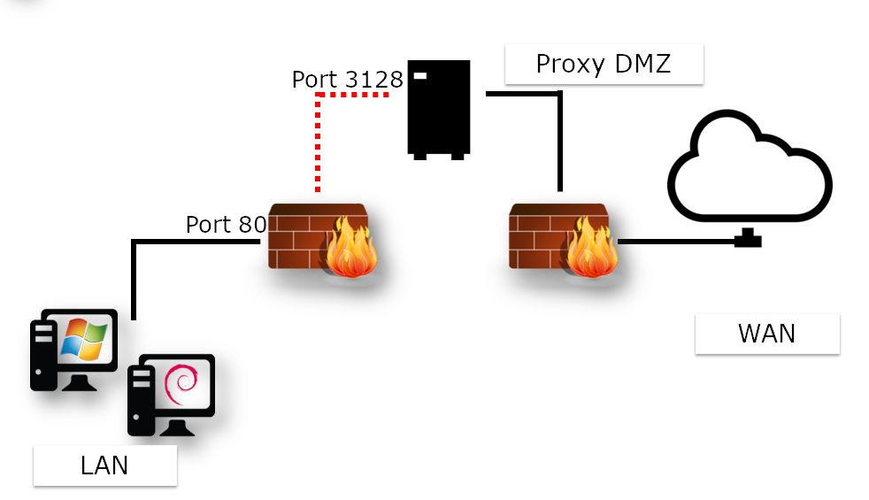

## Squid

Questo capitolo illustra Squid, la cache proxy HTTP.

****

**Obiettivi**: Imparerete a:

:heavy_check_mark: installare squid  
:heavy_check_mark: configurarlo come un proxy e memorizzare il contenuto HTTP.

:checkered_flag: **squid**, **proxy**, **HTTP**

**Competenze**: :star: :star:  
**Complessità**: :star: :star:

**Tempo di lettura**: 20 minuti

****

### Generalità

L'impostazione di un server proxy comporta la scelta tra due tipi di architettura:

- Un'architettura proxy standard che richiede una configurazione specifica di ogni client e dei loro browser web
- Architettura captive proxy, che prevede l'intercettazione dei frame inviati dal client e la loro riscrittura al server proxy

In entrambi i casi, si verifica un'interruzione della rete: Un client non può più collegarsi fisicamente a un server remoto direttamente senza passare attraverso un server proxy.

Due firewall proteggono la workstation client ma non comunicano mai direttamente con la rete esterna.


!!! Note

```
Questa architettura richiede la configurazione del browser sulla workstation client.
```

Non è necessario configurare tutte le workstation client con un captive proxy.

La configurazione avviene a livello del gateway, che riceve le richieste dei client e riscrive in modo trasparente i frame per inviarli al proxy.



!!! Note

```
Questa architettura richiede una configurazione specifica sul router.
```

Nel caso di un'architettura proxy standard o captive proxy, uno degli interessi principali di questo tipo di servizio è quello di fungere da cache.

In questo modo, un file scaricato una volta dalla WAN (potenzialmente da un collegamento più lento della LAN) si memorizza nella cache del proxy per essere utilizzato dai client successivi. In questo modo si ottimizza la larghezza di banda sul collegamento più lento.

Come si vedrà in seguito, esistono altri usi del proxy.

L'implementazione di un proxy può:

- Negare l'accesso a risorse specifiche in base a vari parametri.
- Impostare l'autenticazione e il monitoraggio delle attività Internet dei client.
- Impostare una gerarchia di cache distribuite
- Nascondere l'architettura della LAN da un punto di vista WAN (quanti client ci sono sulla LAN?)

Tra i vantaggi vi sono i seguenti:

- Anonimato su Internet
- Autenticazione
- Registrazione dell'attività del Client
- Applicazione di filtri
- Restrizioni di accesso
- Ottimizzazione della larghezza di banda
- Controllo Sicurezza

!!! Note

```
L'implementazione dell'autenticazione blocca molti degli effetti dannosi dei virus sulla LAN.
```

!!! warning "Attenzione"

```
Il servizio proxy diventa un servizio critico che richiede High Availability
```

Quando si utilizza un server Squid Proxy, l'amministratore deve sfruttare i registri. Pertanto, è essenziale conoscere i principali codici di risposta HTTP.

| Codice | Categorie              |
| ------ | ---------------------- |
| 1XX    | Info                   |
| 2XX    | Success                |
| 3XX    | Redirection            |
| 4XX    | Customer request error |
| 5XX    | Server error           |

Esempi:

- 200: ok
- 301: Trasferito definitivamente
- 302: Trasferito temporaneamente
- 304: Non modificato
- 400: Bad request
- 401: Non autorizzato
- 404: Not trovato

#### Informazioni su Squid

Squid supporta i protocolli HTTP e FTP.

I vantaggi dell'installazione di una soluzione basata sul server Squid:

- Soluzioni hardware sono costose
- Sviluppato dal 1996
- Rilasciato sotto licenza GNU/GPL

##### Dimensionamento

- Assicurare l'High Availability
- Utilizzo di dispositivi di storage veloci per la cache
- La RAM e la CPU devono essere dimensionate correttamente

!!! Note

```
Consentire 14 MB di RAM per ogni GB di cache del disco.
```

### Installazione

Installazione del package `squid`

```bash
sudo dnf install squid
```

!!! warning "Attenzione"

```
Fare attenzione a non avviare il servizio prima che la cache sia stata inizializzata!
```

#### Il tree e i file del server Squid

Il singolo file di configurazione è `/etc/squid/squid.conf`.

I log del servizio (arresto e riavvio) sono in `/var/log/squid.cache.log`, mentre le richieste dei client sono in `/var/log/squid/access.log`. Per impostazione predefinita, i file della cache si trovano in `/var/spool/squid/`.

#### Il comando `squid`

Il comando `squid` controlla il server squid.

Sintassi del commando:

```bash
squid [-z|-s|-k parse|-k rotate]
```

| Opzione     | Descrizione                     |
| ----------- | ------------------------------- |
| `-z`        | Inizializza la directory cache  |
| `-s`        | Abilita il log di syslog        |
| `-k parse`  | Testa il file di configurazione |
| `-k rotate` | Turnazione dei file di log      |

Il Logging delle richieste dei client può portare rapidamente alla archiviazione di grandi quantità di dati.

È buona norma creare regolarmente un nuovo file di log e archiviare quello vecchio in formato compresso.

È possibile farlo manualmente, con l'opzione `-k rotate` del comando `squid`, oppure automaticamente con il servizio Linux dedicato `logrotate`.

### Configurazione

Configurare Squid su `/etc/squid/squid.conf`.

- `http_port` configura la porta del proxy (porta di ascolto)

```bash
http_port num_port
```

!!! Note

```
La porta è impostata di default su 3128, ma spesso viene modificato in 8080. Ricordarsi di aprire la porta corrispondente del firewall!
```

Al riavvio del servizio, il server Squid si metterà in ascolto sulla porta definita dalla directive `http_port`.

- `cache_mem` definisce la RAM riservata

```bash
cache_mem taille KB|taille MB|taille GB
```

Ad esempio:

```bash
cache_mem 1 GB
```

!!! Tip

```
Best practice: allocare 1/3 della RAM totale
```

- Internet Cache Protocol (ICP) `icp_port`

L' Internet Cache Protocol (ICP) consente ai server Squid vicini di scambiarsi le richieste. È prassi comune proporre una gerarchia di proxy che condividono le loro basi informative.

La direttiva `icp_port` definisce la porta che Squid utilizza per inviare e ricevere richieste ICP dai server Squid vicini.

!!! Tip

```
Impostare a 0 per disattivarlo.
```

- L'utente anonimo FTP `ftp_user`

La direttiva `ftp_user` associa un utente FTP alle connessioni FTP anonime. L'utente deve avere un indirizzo e-mail valido.

```bash
ftp_user bob@rockylinux.lan
```

- Impostare le liste di controllo degli accessi

Sintassi ACL:

```bash
acl name type argument
http_access allow|deny aclname
```

Esempio:

```bash
acl LUNCHTIME time 12:00-14:00
http_access deny LUNCHTIME
```

Una trattazione più approfondita delle ACL è contenuta nella sezione “Configurazione avanzata”.

- Dimensione massima di un oggetto memorizzato nella cache `maximum_object_size`

Sintassi della direttiva `maximum_object_size`:

```bash
maximum_object_size size
```

Esempio:

```bash
maximum_object_size 32 MB
```

L'oggetto non viene memorizzato nella cache se la dimensione dell'oggetto è superiore al limite `maximum_object_size`.

- Nome del server proxy  `visible_hostname`

Sintassi della direttiva `visible_hostname`:

```bash
visible_hostname name
```

Esempio:

```bash
visible_hostname proxysquid
```

!!! Note

```
Il valore fornito può essere diverso dal nome dell'host.
```

- Definire una cache per Squid `cache_ufs`

```bash
cache_ufs format path size nbFolderNiv1 nbFolderNiv2
```

È possibile definire più cache su file system diversi per ottimizzare i tempi di accesso.

Esempio:

```bash
cache_dir ufs /var/spool/squid/ 100 16 256
```

| Opzione | Descrizione              |
| ------- | ------------------------ |
| ufs     | Unix File System         |
| 100     | Dimensioni in Mega       |
| 16      | 16 top-level folders     |
| 256     | 256 second-level folders |

Quando il servizio viene lanciato per la prima volta, genera la directory della cache:

```bash
sudo squid -z
sudo systemctl start squid
```

### Configurazione avanzata

#### La Lista di Controllo Accessi (ACL)

Sintassi della direttiva 'http_access'

```bash
http_access allow|deny [!]acl_name
```

Esempio:

```bash
http_access allow LUNCHTIME
http_access deny !LUNCHTIME
```

La negazione di ACL `!acl_name' significa l'opposto di ACL `acl_name\`.

Sintassi della direttiva 'acl':

```bash
acl name type argument
```

L'ordine delle ACL è cumulativo. Più ACL con lo stesso nome rappresentano una singola ACL.

Esempi:

Autorizzazione LUNCHTIME

```bash
acl LUNCHTIME time 12:00-14:00
http_access allow LUNCHTIME
```

Proibire VIDEOS:

```bash
acl VIDEOS rep_mime_type video/mpeg
acl VIDEOS rep_mime_type video/avi
http_access deny VIDEOS
```

Gestire indirizzi IP:

```bash
acl XXX src 192.168.0.0/255.255.255.0
acl XXX dst 10.10.10.1
```

Gestione di FQDN:

```bash
acl XXX srcdomain .rockylinux.org
acl XXX dstdomain .linux.org
```

Gestione delle porte:

```bash
acl XXX port 80 21
```

Gestire protocolli:

```bash
acl XXX proto HTTP FTP
```

#### Algoritmi di cache

Esistono diversi algoritmi di cache con caratteristiche differenti:

- LRU - _Least Recently Used_: rimuove dalla RAM gli oggetti più vecchi.
- LRU-THOLD: copia un oggetto nella cache in base alla sua dimensione.
- MRU: _Most Recently Used_: cancella i dati meno richiesti.
- GDSF: _Greedy Dual Size Frequency_: cancella in base alla dimensione originale e al tempo di accesso conservando quelli più leggeri.
- LFUDA: _Least Frequently Used With Dynamic Aging_: come GDSF, ma senza la nozione della dimensione. Utile per memorizzare in cache in presenza di file molto grandi.

#### Autenticazione del Client

Squid si affida a programmi esterni per gestire l'autenticazione. Può essere basato su un semplice file piatto come `htpasswd` o su LDAP, SMB, PAM o altri servizi.

L'autenticazione può anche essere una necessità legale. Ricordatevi di far firmare agli utenti una carta d'uso!

### Tools

#### Il comando `squidclient`

Usare il comando `squidclient` per testare una richiesta al server squid.

Sintassi del comando `squidclient`:

```bash
squidclient [-s] [-h target] [-p port] url
```

Esempio:

```bash
squidclient -s -h localhost -p 8080 http://localhost/
```

| Opzione | Descrizione                                                         |
| ------- | ------------------------------------------------------------------- |
| `-s`    | Modalità silenziosa (Non mostra nulla a console) |
| `-h`    | Definisce il proxy target                                           |
| `-p`    | In ascolto sulla porta (default 3128)            |
| `-r`    | Forza il server a ricaricare l'oggetto                              |

#### Analizzare logs

È possibile monitorare i record del log di Squid con il comando:

```bash
tail -f /var/log/squid/access.log
```

Scomposizione di un record di log:

| Opzione              | Descrizione                                                              |
| -------------------- | ------------------------------------------------------------------------ |
| Date                 | Data e Ora di registrazione del log                                      |
| Response time        | Il tempo di risposta alla richiesta                                      |
| @client | Indirizzo IP del client                                                  |
| Status code          | Codice di risposta HTTP                                                  |
| Size                 | Dimensione di trasferimento                                              |
| Metodo               | Metodo HTTP (Put / Get / Post / ecc.) |
| URL                  | URL Richiesta                                                            |
| Peer Code            | Codice di risposta interproxy                                            |
| File type            | Tipo di mime della richiesta di destinazione                             |

### Controllo Sicurezza

Il firewall deve essere aperto per la porta di ascolto:

```bash
sudo firewall-cmd --add-port=3128/tcp --permanent
sudo firewall-cmd --reload
```

### Workshop

In questo workshop, si installerà Squid sul vostro server e lo userete per scaricare gli aggiornamenti.

#### Task 1: Installare e configurare

Installazione di Squid:

```bash
sudo dnf install squid
sudo systemctl enable squid
sudo firewall-cmd --add-port=3128/tcp --permanent
sudo firewall-cmd --reload
```

Rimuovere il commento in questa riga del file \`/etc/squid/squid.conf' per creare una directory di cache su disco:

```bash
cache_dir ufs /var/spool/squid 100 16 512
```

Regolare la dimensione della cache come richiesto.

Creare le directory della cache e avviare il servizio

```bash
sudo squid -z
sudo systemctl start squid
```

#### Compito 2: utilizzare il proxy con curl

Aprire un nuovo terminale sul server proxy per seguire l'accesso del proxy.

```bash
sudo tail -f /var/log/squid/access.log
```

Sul secondo terminale, utilizzare `curl` per accedere a una pagina web attraverso il proxy:

```bash
$ curl -I --proxy "http://192.168.1.10:3128" https://docs.rockylinux.org  
HTTP/1.1 200 Connection established

HTTP/2 200 
content-type: text/html
...
```

Come si può vedere, esistono due connessioni HTTP. Il primo è con il proxy e il secondo è dal proxy al server remoto.

È possibile vedere la traccia sul secondo terminale:

```bash
1723793294.548     77 192.168.1.10 TCP_TUNNEL/200 3725 CONNECT docs.rockylinux.org:443 - HIER_DIRECT/151.101.122.132 -
```

Il contenuto non viene memorizzato nella cache, poiché si richiede una connessione `https` al server remoto.

#### Task 3: Configurare il DNS per utilizzare il server proxy

Modificare il file \`/etc/dnf/dnf.conf' per utilizzare il proxy squid:

```bash
[main]
gpgcheck=1
installonly_limit=3
clean_requirements_on_remove=True
best=True
skip_if_unavailable=False
proxy=http://192.168.1.10:3128
```

Pulire la cache di `dnf` e provare ad aggiornare:

```bash
sudo dnf clean all
sudo dnf update
```

Verificare sul terminale che la connessione `dnf` utilizzi il proxy per scaricare l'aggiornamento. Si noti che l'“URL del repository” nella riga che segue sarà sostituito con l'URL effettivo del mirror:

```bash
1723793986.725     20 192.168.1.10 TCP_MISS/200 5238 GET "URL of repository"/9.4/extras/x86_64/os/repodata/7d78a729-8e9a-4066-96d4-ab8ed8f06ee8-FILELISTS.xml.gz - HIER_DIRECT/193.106.119.144 application/x-gzip
...
1723794176.255      1 192.168.1.10 TCP_HIT/200 655447 GET "URL of repository"/9.4/AppStream/x86_64/os/repodata/1af312c9-7139-43ed-8761-90ba3cd55461-UPDATEINFO.xml.gz - HIER_NONE/- application/x-gzip
```

In questo esempio, si può notare una connessione con TCP_MISS (non presente nella cache) e un'altra con TCP_HIT (utilizza la cache per rispondere al client).

### Conclusione

Ora sapete come installare Squid sulla vostra rete locale. Questo vi permetterà di centralizzare le connessioni in uscita verso Internet e di proteggere la vostra rete locale.

### Verificare le proprie Conoscenze

:heavy_check_mark: Qual è la porta ascoltata da un server squid per impostazione predefinita?

- [ ] 8080
- [ ] 1234
- [ ] 443
- [ ] 3128

:heavy_check_mark: Che cos'è Squid?

- [ ] Un cache reverse proxy
- [ ] Un cache proxy
