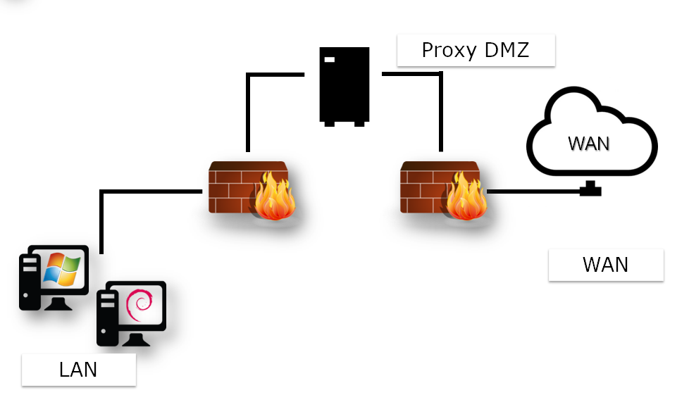
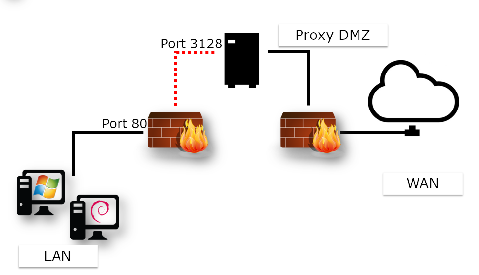

## Squid

In this chapter, you will learn about Squid, the HTTP proxy cache.

****

**Objectives**: In this chapter, you will learn how to:

:heavy_check_mark: install squid  
:heavy_check_mark: configure it to proxify and cache http content.  

:checkered_flag: **squid**, **proxy**, **http**

**Knowledge**: :star: :star:  
**Complexity**: :star: :star:  

**Reading time**: 20 minutes

****

### Generalities

Setting up a proxy server involves choosing between two types of architecture:

* A standard proxy architecture, requiring specific configuration of each client and their web browsers,
* Captive proxy architecture, which involves intercepting the frames sent by the client and rewriting them to the proxy server.

In either case, there is a break in the network: A client can no longer physically address a remote server directly, without going through a proxy server.

The client workstation is protected by two firewalls and never communicates directly with the outside network.



!!! NOTE

    This architecture requires browser configuration on the client workstation.

With a captive proxy, there's no need to configure all client workstations.

The configuration takes place at the gateway level, which receives the client requests and transparently rewrites the frames to send them to the proxy.



!!! NOTE

    This architecture requires a specific configuration on the router.

In the case of standard proxy or captive proxy architecture, one of the primary interests of this type of service is, of course, to act as a cache.

In this way, a file downloaded once from the WAN (and therefore potentially from a slower link than the LAN) is stored in memory by the proxy-cache, to be used by subsequent clients. In this way, the bandwidth of the slow link is optimized.

As we'll see later in this chapter, this isn't the only use for a proxy.

A proxy can be deployed to :

* Deny access to certain resources based on various parameters,
* Set up authentication and monitoring of clients' Internet activities,
* Set up a hierarchy of distributed caches,
* Hide the LAN architecture from a WAN point of view (how many clients are there on the LAN?).

The benefits are manifold:

* Anonymity on the Internet;
* Authentication;
* Client activity logging;
* Filtering;
* Limit access;
* Bandwidth optimization;
* Security.

!!! NOTE

    Implementing authentication blocks many of the malicious effects of viruses on the LAN.

!!! WARNING

    The proxy service becomes a critical service requiring high availability.

When operating a Squid Proxy server, the administrator has to exploit the logs. It is therefore essential to know the main HTTP response codes.

| Code | Categories             |
|------|------------------------|
| 1XX  | Info                   |
| 2XX  | Success                |
| 3XX  | Redirection            |
| 4XX  | Customer request error |
| 5XX  | Server error           |

Examples:

* 200 : ok
* 301 : Moved Permanently
* 302 : Moved Temporatly
* 304 : Not modified
* 400 : Bad request
* 401 : Unauthorized
* 404 : Not found

#### About Squid

Squid supports http and ftp protocols.

The advantages of installing a solution based on the Squid server :

* Hardware solutions are expensive;
* Developed since 1996;
* Released under GNU/GPL license.

##### Sizing

* Ensure high availability;
* Use fast hard disks for caching;
* RAM and CPU should be correctly sized.

!!! NOTE

    Allow 14MB of RAM per GB of disk cache.

### Installation

The Squid server is installed using the `squid` package.

```bash
sudo dnf install squid
```

!!! WARNING

    Take care not to start the service until the cache has been initialized!

#### Squid server tree and files

The single configuration file is `/etc/squid/squid.conf`.

Service logs (stop and restart) are stored in `/var/log/squid.cache.log`, while client requests are stored in `/var/log/squid/access.log`. By default, cache files are stored in `/var/spool/squid/`.

#### The `squid` command

The `squid` command control the squid server.

Syntaxe of the command:

```bash
squid [-z|-s|-k parse|-k rotate]
```

| Option      | Description                  |
|-------------|------------------------------|
| `-z`        | Initialize cache directories |
| `-s`        | Enables syslog logging       |
| `-k parse`  | Test configuration file      |
| `-k rotate` | Rotates logs                 |

Logging client requests can quickly lead to the storage of large volumes of data.

It's a good idea to regularly create a new log file and archive the old one in compressed format.

This can be done manually with the `-k rotate` option of the `squid` command, or via the dedicated Linux service `logrotate`.

### Configuration

Squid is configured in `/etc/squid/squid.conf`.

* Proxy port number (listening port) `http_port`

```bash
http_port num_port
```

!!! NOTE

    By default, the port number is set to 3128, but it is frequently changed to 8080. Don't forget to open the corresponding firewall port!

When the service is restarted, the Squid server will listen on the port defined by the http_port directive.

* RAM reservation `cache_mem`

```bash
cache_mem taille KB|taille MB|taille GB
```

For example :

```bash
cache_mem 1 GB
```

!!! TIP

    Best practice: 1/3 of total RAM allocated

* Internet Cache Protocol (ICP) `icp_port`

The Internet Cache Protocol (ICP) enables neighboring Squid servers to exchange requests. It is common practice to propose a hierarchy of proxies that share their information bases.

The `icp_port` directive defines the port number on which Squid sends and receives ICP requests from neighboring Squid servers.

!!! TIP

    Set to 0 to deactivate.

* Anonymous FTP user `ftp_user`

The `ftp_user` directive is used to associate an FTP user with anonymous FTP connections. The user must be a valid e-mail address.

```bash
ftp_user bob@rockylinux.lan
```

* Set up Access Control Lists

ACL syntax:

```bash
acl name type argument
http_access allow|deny aclname
```

Example:

```
acl LUNCHTIME time 12:00-14:00
http_access deny LUNCHTIME
```

ACLs are discussed in greater detail in the "Advanced configuration" section.

* Maximum size of a cached object `maximum_object_size`

`maximum_object_size` directive syntax:

```bash
maximum_object_size size
```

Example:

```bash
maximum_object_size 32 MB
```

If the object size is greater than the `maximum_object_size` limit, the object is not cached.

* Proxy server name `visible_hostname`

Syntax of `visible_hostname` directive:

```bash
visible_hostname name
```

Example:

```bash
visible_hostname proxysquid
```

!!! NOTE

    The value supplied may be different from the host name.

* Define a cache for squid `cache_ufs`

```bash
cache_ufs format path size nbFolderNiv1 nbFolderNiv2
```

Multiple caches can be defined on different file systems to optimize access times.

Example:

```bash
cache_dir ufs /var/spool/squid/ 100 16 256
```

| Option | Description              |
|--------|--------------------------|
| ufs    | Unix File System         |
| 100    | Size in mega             |
| 16     | 16 top-level folders     |
| 256    | 256 second-level folders |

When the service is launched for the first time, the :

```bash
sudo squid -z
sudo systemctl start squid
```

### Advanced configuration

#### Les Access Control List (ACL)

Syntax of the `http_access` directive

```bash
http_access allow|deny [!]acl_name
```

Example :

```bash
http_access allow LUNCHTIME
http_access deny !LUNCHTIME
```

The `!acl_name` ACL is the opposite of the `acl_name` ACL.

Syntax of the `acl` directive:

```bash
acl name type argument
```

The order of ACLs is cumulative. Several ACLs with the same name represent a single ACL.

Examples :

Lunchtime authorization:

```bash
acl LUNCHTIME time 12:00-14:00
http_access allow LUNCHTIME
```

Ban videos:

```bash
acl VIDEOS rep_mime_type video/mpeg
acl VIDEOS rep_mime_type video/avi
http_access deny VIDEOS
```

Managing IP addresses:

```bash
acl XXX src 192.168.0.0/255.255.255.0
acl XXX dst 10.10.10.1
```

FQDN management:

```bash
acl XXX srcdomain .rockylinux.org
acl XXX dstdomain .linux.org
```

Port management:

```bash
acl XXX port 80 21
```

Protocol management:

```bash
acl XXX proto HTTP FTP
```

#### Caching algorithms

There are different cache algorithms with different characteristics:

* LRU - *Least Recently Used*: removes the oldest objects from RAM.
* LRU-THOLD: copies an object to the cache according to its size.
* MRU: *Most Recently Used*: the least requested data is deleted.
* GDSF: *Greedy Dual Size Frequency*: deletes according to original size and access time. The smallest are retained.
* LFUDA: *Least Frequently Used With Dynamic Aging*: same as GDSF, but without the notion of size. Useful for caches with large files.

#### Client authentication

Squid relies on external programs to manage authentication. It can be based on a simple flat file such as htpasswd, or on LDAP, SMB, PAM or other services.

Authentication can also be a legal necessity: remember to get your users to sign a usage charter!

### Tools

#### The `squidclient` command

The `squidclient` command is used to test a request to the squid server.


`squidclient` command syntax:

```bash
squidclient [-s] [-h target] [-p port] url
```

Example:

```bash
squidclient -s -h localhost -p 8080 http://localhost/
```

| Option | Description                                   |
|--------|-----------------------------------------------|
| `-s`   | Silent mode (displays nothing in the console) |
| `-h`   | Define target proxy                           |
| `-p`   | Listening port (default 3128)                 |
| `-r`   | Force server to reload object                 |

#### Analyze logs

Squid's log records can be monitored with the command :

```bash
tail -f /var/log/squid/access.log
```

Decomposition of a log line:

| Option        | Description                           |
|---------------|---------------------------------------|
| Date          | Log timestamp                         |
| Response time | Response time for request             |
| @client       | Client IP address                     |
| Status code   | HTTP response code                    |
| Size          | Transfer size                         |
| Method        | HTTP method (Put / Get / Post / etc.) |
| URL           | Request URL                           |
| Peer Code     | Inter-proxy response code             |
| File type     | Mime type of request target           |

### Workshop

In this workshop, you'll install squid on your server and use it to download updates.

#### Task 1 : XXX

#### Task 2 : XXX

#### Task 3 : XXX

#### Task 4 : XXX

### Check your Knowledge

:heavy_check_mark: What is the port listened per default by a squid server? 

* [ ] 8080  
* [ ] 1234  
* [ ] 443  
* [ ] 3128  

:heavy_check_mark: What Squid is?

* [ ] A reverse proxy cache  
* [ ] A proxy cache  
