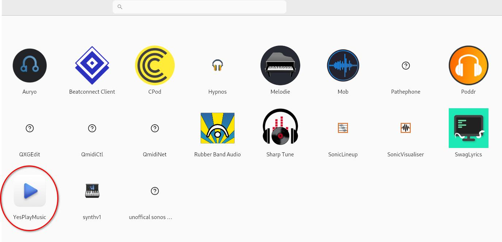
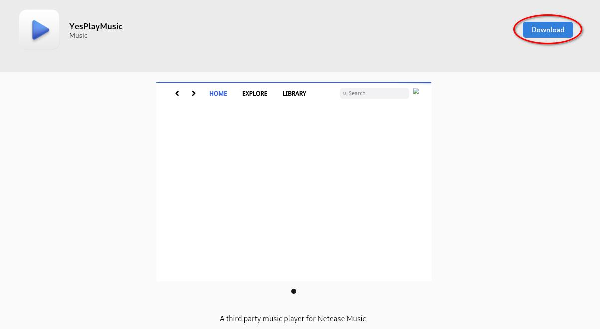
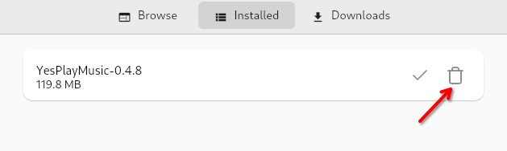

## Einleitung

[AppImagePool](https://github.com/prateekmedia/appimagepool) bietet einen Hub zum Installieren und Verwalten von AppImages. Es ähnelt optisch der Softwareanwendung.

## Voraussetzungen

Für diese Anleitung benötigen Sie Folgendes:

- Eine Rocky Linux-Installation mit einer grafischen Desktopumgebung
- `sudo`-Berechtigungen
- Flatpak ist auf dem System installiert

## AppImagePool – Installation

Installieren Sie das Flatpak-Paket für AppImagePool:

```bash
flatpak install flathub io.github.prateekmedia.appimagepool
```

## Erkunden von AppImage Launcher

Sobald AppImagePool auf Ihrem System installiert ist, starten Sie es und erkunden Sie die verfügbaren AppImages.


Zum Zeitpunkt des Schreibens – Oktober 2024 – sind mehr als sechzehn Kategorien verfügbar:

1. Utility
2. Network
3. Graphics
4. System
5. Science
6. Andere
7. Development
8. Game
9. Education
10. Office
11. Multimedia
12. Audio
13. Emulator
14. Finance
15. Qt
16. Video
17. GTK
18. Sequencer

Darüber hinaus gibt es eine Kategorie `Explore`, in der Sie alle verfügbaren Kategorien von AppImages gleichzeitig durchsuchen können.

## AppImage–Download

Suchen Sie nach einem AppImage, das Sie verwenden möchten:



Klicken Sie auf das Miniaturbild und laden Sie es herunter. Nach einigen Augenblicken Wartezeit wird das AppImage auf Ihr System heruntergeladen und ist einsatzbereit!



## AppImage entfernen

Um ein Image zu entfernen, klicken Sie in der oberen Menüleiste auf ++"Installed"++ und dann auf das Papierkorbsymbol rechts neben dem AppImage, das Sie entfernen möchten:



## Zusammenfassung

Der [AppImagePool](https://github.com/prateekmedia/appimagepool) bietet einen benutzerfreundlichen Hub zum Durchsuchen, Herunterladen und Entfernen von AppImages. Es sieht ähnlich aus wie der Software-Hub und ist genauso einfach zu verwenden.
