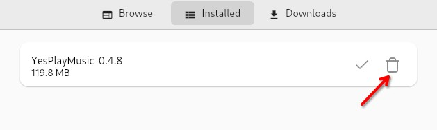

## Introduction

[AppImagePool](https://github.com/prateekmedia/appimagepool) fournit un hub pour installer et gérer les AppImages. Iel est visuellement similaire à l'application logicielle.

## Prérequis

Pour ce guide, vous avez besoin des éléments suivants :

- Une installation Rocky Linux avec un environnement de bureau
- Droits d'accès `sudo`
- Une installation de `Flatpak` sur le système

## Installation de AppImagePool

Installez le package Flatpak pour AppImagePool :

```bash
flatpak install flathub io.github.prateekmedia.appimagepool
```

## Exploration du lanceur AppImage

Une fois l’installation d’AppImagePool terminée, lancez-le et explorez les AppImages disponibles.


Dix-huit catégories sont disponibles au moment de la rédaction de cet article – octobre 2024 – :

1. Utility
2. Network
3. Graphics
4. System
5. Science
6. Autres
7. Development
8. Game
9. Education
10. Office
11. Multimedia
12. Audio
13. Emulator
14. Finance
15. Qt
16. Video
17. GTK
18. Sequencer

De plus, il existe une catégorie `Explore` pour parcourir toutes les catégories d'AppImages disponibles.

## Téléchargement d'une AppImage

Recherchez une AppImage que vous souhaitez utiliser :


Cliquez sur sa miniature et téléchargez. Après quelques instants d’attente, l’AppImage sera téléchargée sur votre système et prête à être utilisée !


## Suppression d'une AppImage

Pour supprimer une image, cliquez sur ++"Installed"++ dans la barre de menu supérieure, puis cliquez sur l'icône de la corbeille à droite de l'AppImage que vous souhaitez supprimer :



## Conclusion

[AppImagePool](https://github.com/prateekmedia/appimagepool) fournit un hub facile à utiliser pour parcourir, télécharger et supprimer des AppImages. Son apparence est similaire à celle du hub logiciel et il est tout aussi simple à utiliser.
