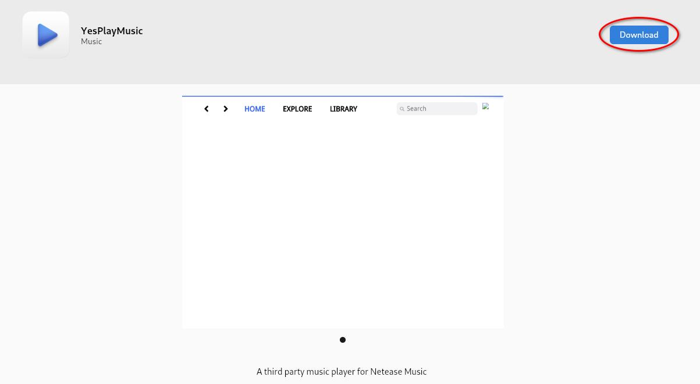

## Introduzione

[AppImagePool](https://github.com/prateekmedia/appimagepool) fornisce un hub per installare e gestire AppImages. Visivamente è simile all'applicazione Software.

## Presupposti

Per questa guida è necessario quanto segue:

- Rocky Linux con un ambiente desktop installato
- Privilegi `sudo`
- Flatpak installato nel sistema

## Installazione di AppImagePool

Installare il pacchetto Flatpak per AppImagePool:

```bash
flatpak install flathub io.github.prateekmedia.appimagepool
```

## Esplorare il launcher AppImage

Una volta completata l'installazione di AppImagePool, avviatelo ed esplorate le immagini delle applicazioni disponibili.


Al momento sono disponibili diciotto categorie:

1. Utility
2. Network
3. Graphics
4. System
5. Science
6. Others
7. Development
8. Game
9. Education
10. Office
11. Multimedia
12. Audio
13. Emulator
14. Finance
15. Qt
16. Video
17. GTK
18. Sequencer

Inoltre, esiste una categoria "Explore" per navigare tra tutte le categorie di AppImages disponibili.

## Scaricare un'AppImage

Trovare una AppImage che si desidera usare:


Cliccare su questa immagine in miniatura e successivamente scaricarla. Dopo un po' di attesa l'AppImage sarà nel sistema pronta per essere usata.



## Rimuovere un'AppImage

Per rimuovere un'immagine, cliccare su ++"Installed"++ nella barra superiore del menu, successivamente cliccare sull'icona del cestino alla sinistra dell'AppImage che si desidera rimuovere:


## Conclusione

L'[AppImagePool](https://github.com/prateekmedia/appimagepool) fornisce un hub facile da consultare, per scaricare e rimuovere AppImages. È simile all'hub dei software ed è altrettanto facile da utilizzare.
