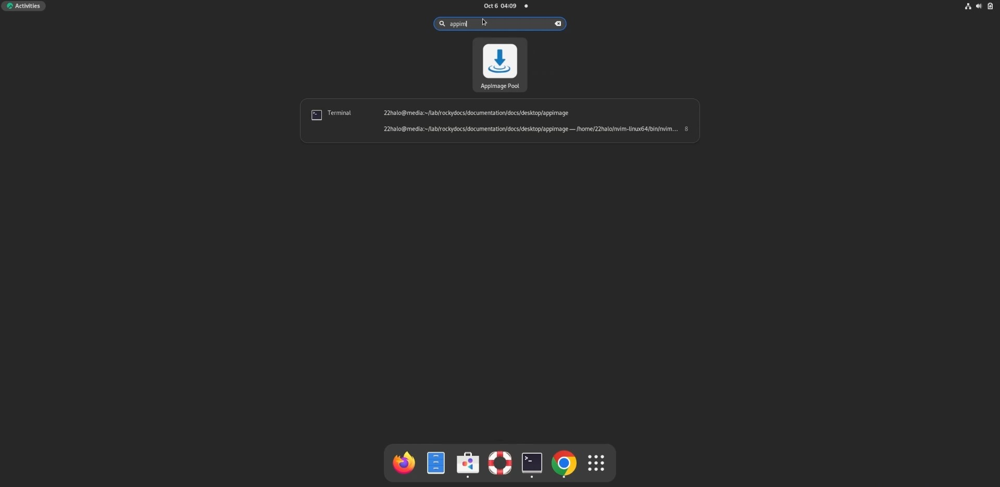
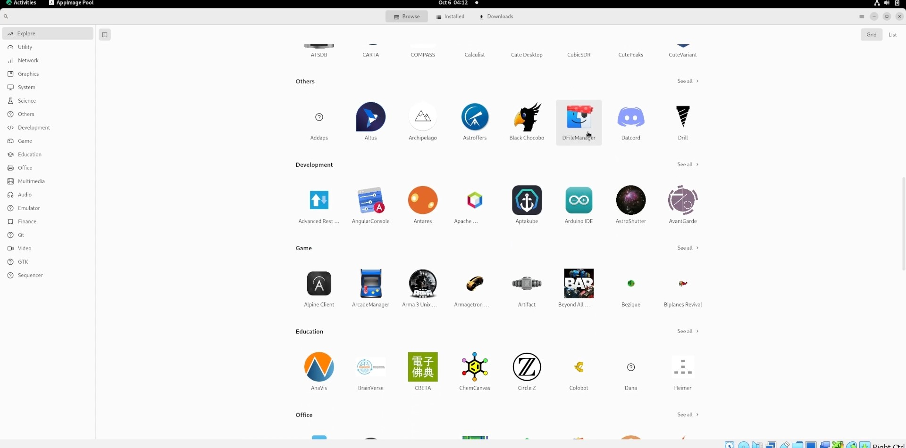
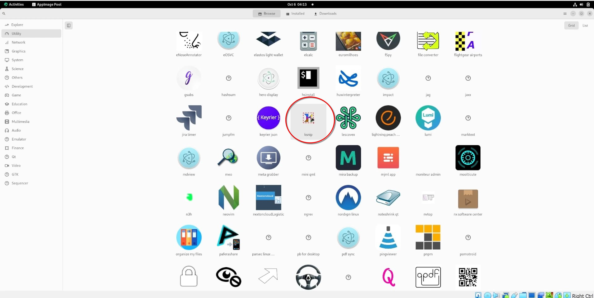

## Introduction

[AppImagePool](https://github.com/prateekmedia/appimagepool) provides a hub to install and manage AppImages. It is visually similar to the Software app. 

## Assumptions

For this guide, you need the following:

* Rocky Linux with a desktop environment installed
* `sudo` privileges
* Flatpak installed on the system

## Install AppImagePool

Install the Flatpak package for AppImagePool:

```bash
flatpak install flathub io.github.prateekmedia.appimagepool
```

## Explore AppImage Launcher

Once AppImagePool is installed on your system, launch it and explore the available AppImages.



At the time of writing there are sixteen available categories:



1. Utility
2. Network
3. System
4. Science
5. Others
6. Development
7. Education
8. Graphics
9. Office
10. Game
11. Multimedia
12. Audio
13. Finance
14. Qt
15. GTK
16. Video

Additionally, there is an Explore category that displays AppImages from all the categories together.

## Download an AppImage



Once you have found an AppImage you would like to use, click on its thumbnail image then download. After a few moments of waiting, the AppImage will be downloaded on your system and ready to use!

## Remove AppImage


To remove an image, click on ++"Installed"++ in the top menu bar. Then click on the trash bin icon to the right of the downloaded AppImage you would like to remove.

## Conclusion

The [AppImagePool](https://github.com/prateekmedia/appimagepool) provides an easy to use hub to browse, download and remove AppImages. It is similar looking to the Software hub and just as simple to use.
