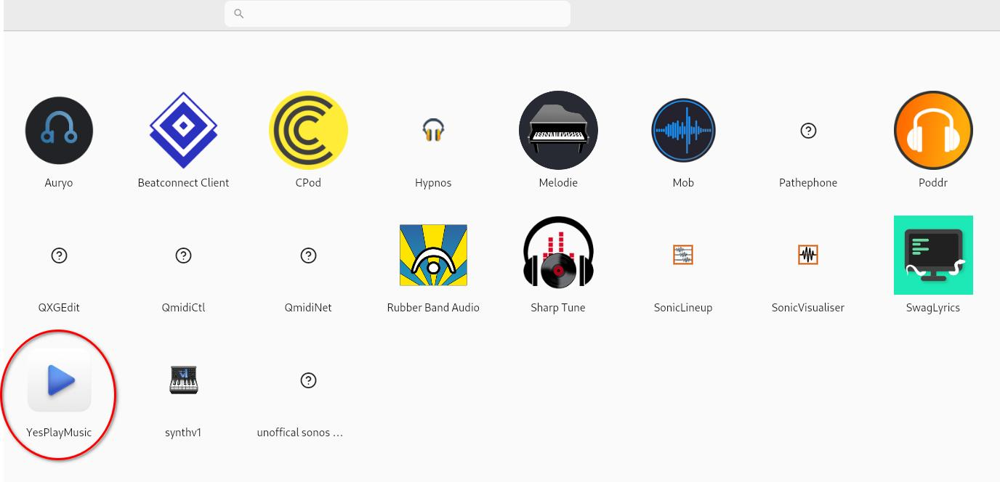
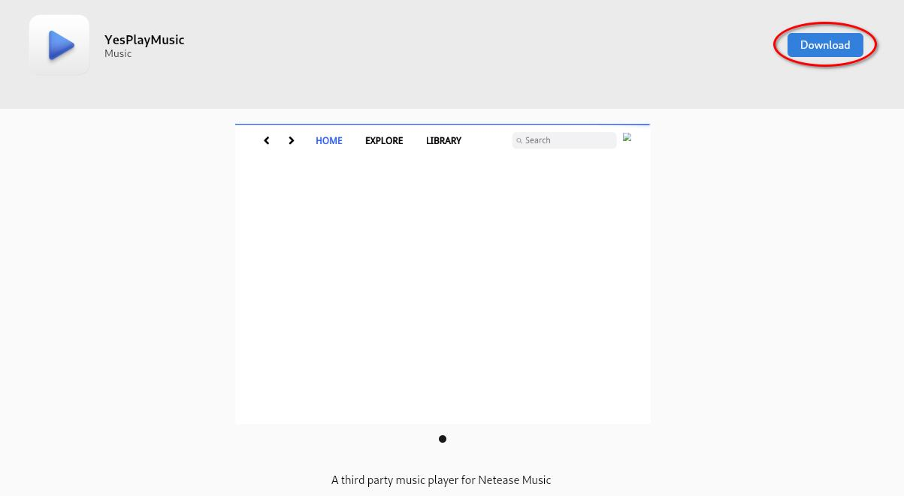
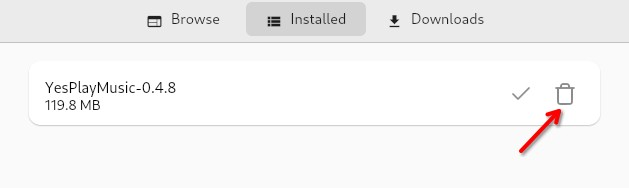

## Introdução

[AppImagePool](https://github.com/prateekmedia/appimagepool) oferece um ambiente centralizado para instalar e gerenciar AppImages. Sua interface é visualmente semelhante ao programa.

## Pressupostos

Para seguir este guia, você precisará do seguinte:

- Rocky Linux com um ambiente gráfico instalado
- Privilégios de `sudo`
- Flatpak instalado no sistema

## Instalando o AppImagePool

Instale o pacote Flatpak do AppImagePool:

```bash
flatpak install flathub io.github.prateekmedia.appimagepool
```

## Explorando o AppImage launcher

Quando a instalação do AppImagePool for concluída, abra o aplicativo e explore os AppImages disponíveis.


Existiam dezoito categorias quando esse guia foi escrito:

1. Utilitários
2. Rede
3. Gráficos
4. Sistema
5. Ciència
6. Outros
7. Desenvolvimento
8. Videogame
9. Educação
10. Escritório
11. Multimídia
12. Áudio
13. Emuladores
14. Finanças
15. Qt
16. Vídeo
17. GTK
18. Sequenciadores

Além disso, há uma categoria chamada "Explorar", que permite navegar por todas as categorias de AppImages em um único local.

## Baixando um AppImage

Encontre um AppImage que você deseja utilizar:



Clique na miniatura da imagem e faça o download. Após alguns instantes, o AppImage estará no seu sistema e pronta para uso!



## Removendo um AppImage

Para remover uma imagem, clique em ++"Instalados"++ na barra de menu superior e, em seguida, clique no ícone da lixeira à direita do AppImage que você deseja remover:



## Conclusão

O [AppImagePool](https://github.com/prateekmedia/appimagepool) oferece uma interface simples e intuitiva para pesquisar, baixar e remover AppImages. Sua aparência é semelhante à da central de aplicativos e sua utilização é igualmente simples.
