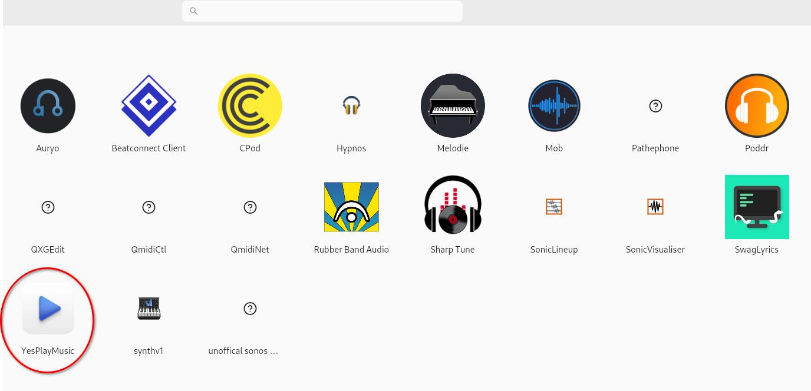

## Вступ

[AppImagePool](https://github.com/prateekmedia/appimagepool) надає центр для встановлення та керування AppImages. Він візуально схожий на програмне забезпечення.

## Припущення

Для цього посібника вам знадобиться наступне:

- Rocky Linux із встановленим робочим середовищем
- привілеї `sudo`
- Встановленний Flatpak

## Встановлення AppImagePool

Встановіть пакет Flatpak для AppImagePool:

```bash
flatpak install flathub io.github.prateekmedia.appimagepool
```

## Дослідження програми запуску AppImage

Після завершення інсталяції AppImagePool запустіть його та дослідіть доступні AppImage.


На момент написання цієї статті існує вісімнадцять доступних категорій:

1. Utility
2. Network
3. Graphics
4. System
5. Science
6. Others
7. Development
8. Game
9. Education
10. Office
11. Multimedia
12. Audio
13. Emulator
14. Finance
15. Qt
16. Video
17. GTK
18. Sequencer

Крім того, існує категорія "Explore" для спільного перегляду всіх доступних категорій AppImages.

## Завантаження AppImage

Знайдіть AppImage, який ви хочете використовувати:



Клацніть на іконку та завантажте його. Через кілька хвилин очікування AppImage буде у вашій системі та готовий до використання!


## Видалення AppImage

Щоб видалити зображення, клацніть ++"Installed"++ у верхній панелі меню та клацніть піктограму кошика праворуч від AppImage, який потрібно видалити:


## Висновок

[AppImagePool](https://github.com/prateekmedia/appimagepool) надає простий у користуванні центр для перегляду, завантаження та видалення AppImages. Він схожий на програмний центр і такий же простий у використанні.
