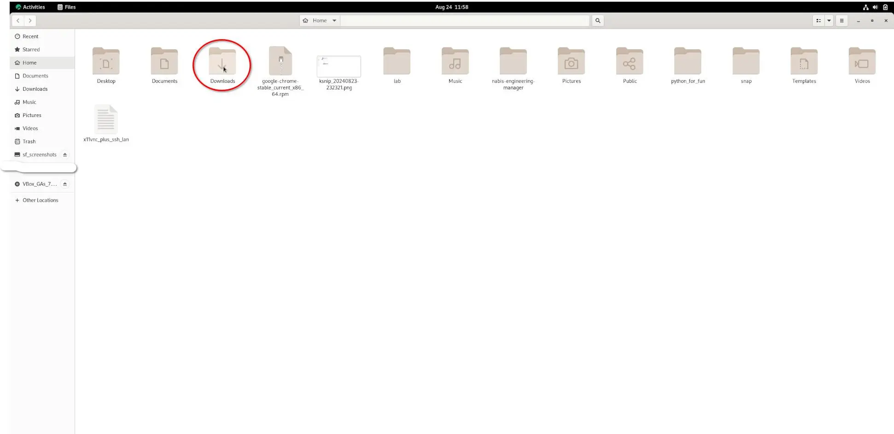

## Einleitung

AppImage ist eine praktische Möglichkeit, Software unter Linux zu installieren, ohne Paketmanager oder die Befehlszeile zu verwenden. Es handelt sich dabei um ausführbare Einzeldateien, die alle Programmabhängigkeiten enthalten und sich daher problemlos auf verschiedenen Linux-Distributionen ausführen lassen. Für Endbenutzer, die mit Windows- und Mac-Betriebssystemen vertraut sind, kann die Installation von Software mit einem AppImage einfacher sein als die Verwaltung von Repositorys oder die Erstellung aus dem Quellcode.

Die Installation von Programmen auf Ihrem Rocky Linux-Desktop mit AppImage erfolgt in drei Schritten:

1. Laden Sie das AppImage des gewünschten Programms herunter
2. Das Programm ausführbar machen
3. Das Programm ausführen, um es zu installieren

Das in diesem Handbuch verwendete Beispielprogramm heißt `Krita`. Sie werden es mit einem AppImage herunterladen und installieren. `Krita` ist eine freie Open-Source-Grafikdesign-Software. Da es in dieser Anleitung um die Funktionen von `AppImage` geht, gibt es keine Details zur Verwendung von `Krita`. Weitere Informationen finden Sie [auf dieser Website](https://krita.org/).

## Voraussetzungen

Für diese Anleitung benötigen Sie Folgendes:

 - Eine Rocky Linux-Installation mit einer grafischen Desktopumgebung
 - `sudo`-Berechtigungen

## Herunterladen des AppImage eines Programms

Der erste Schritt bei der Installation von Software mithilfe eines AppImage besteht darin, das AppImage des Programms herunterzuladen. Um das Krita AppImage herunterzuladen, gehen Sie auf die Seite [Download](https://krita.org/en/download/) und klicken Sie auf die Schaltfläche `Download`.


## Installieren eines Programms mithilfe seines AppImage

Nachdem Sie das AppImage heruntergeladen haben, müssen Sie zum Ordner `Downloads` wechseln, um die Datei ausführbar zu machen, bevor Sie sie starten.

Klicken Sie in der oberen linken Ecke Ihres Rocky Linux-Desktops auf `Activities`:


Sobald das Aktivitätenfenster gestartet ist, geben Sie `files` in das Suchfeld ein. Klicken Sie auf die `Files`-App:


`Files` wird im Home-Verzeichnis gestartet. Klicken Sie auf den `Download`-Ordner:



Nachdem Sie nun zum AppImage-Verzeichnis navigiert sind, ist es Zeit, das Programm ausführbar zu machen. Klicken Sie mit der rechten Maustaste auf die AppImage-Datei und wählen Sie Eigenschaften:


Wählen Sie Berechtigungen aus dem Dateieigenschaften-Menü aus:


Aktivieren Sie das Kontrollkästchen `Execute`, bevor Sie das Eigenschaften-Menü schließen:


Wenn Sie stattdessen die Befehlszeile verwenden möchten, öffnen Sie das Terminal und führen Sie den folgenden Befehl aus, um das AppImage ausführbar zu machen:

```bash
sudo chmod a+x ~/Downloads/krita*.appimage
```

## Ausführen eines Programms mithilfe seines AppImage

Sie haben den letzten Schritt erreicht – das Ausführen Ihres AppImage!

!!! note "Anmerkung"

```
Beim Ausführen eines AppImage wird das Programm nicht in die Dateien Ihres Systems installiert, wie dies bei herkömmlichen Softwarepaketen der Fall ist. Das bedeutet, dass Sie jedes Mal, wenn Sie das Programm verwenden möchten, auf das AppImage doppelklicken müssen. Aus diesem Grund ist es wichtig, das AppImage an einem sicheren und einprägsamen Ort zu speichern.
```

Doppelklicken Sie auf das AppImage:


Alternativ können Sie den folgenden Shell-Befehl ausführen, anstatt auf das AppImage zu doppelklicken:

```bash
   ./krita*.appimage
```

Kurz nach dem Ausführen des AppImage wird `Krita` gestartet.


## Zusammenfassung

In dieser Anleitung haben Sie gelernt, wie Sie ein Programm mit einem AppImage herunterladen und verwenden. AppImages sind praktisch für Endbenutzer, da sie nicht wissen müssen, wie man Repositorys verwaltet, aus dem Quellcode die Software erstellt oder die Befehlszeile verwendet, um ihre Lieblingsprogramme mit einem verfügbaren AppImage zu starten.
