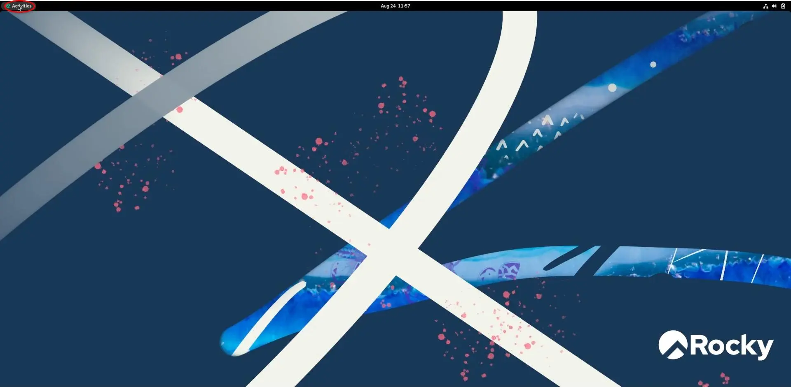
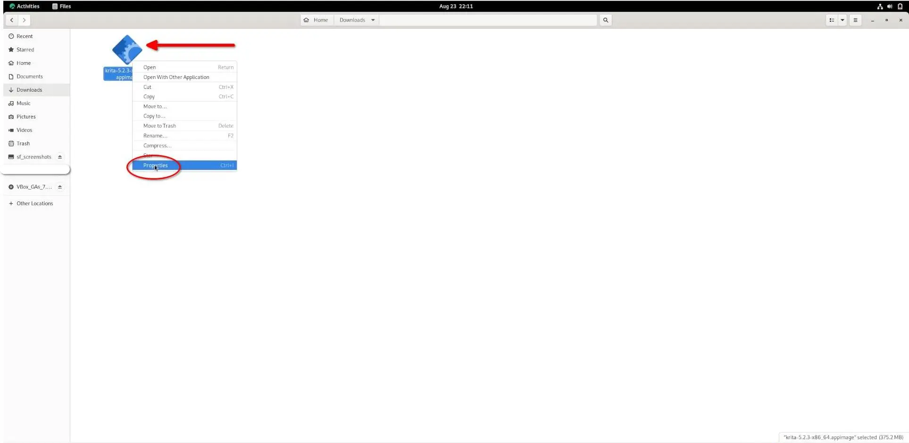

## Introduction

`AppImage` est un moyen pratique d'installer des logiciels sous Linux sans utiliser de gestionnaires de packages ni de ligne de commande. Il s'agit d'exécutables à fichier unique qui contiennent toutes les dépendances du programme, ce qui les rend faciles à exécuter sur différentes distributions Linux. Pour les utilisateurs finaux déjà familiarisés avec les systèmes d'exploitation Windows et Mac, l'installation de logiciels à l'aide d'une AppImage peut être un processus plus simple que la gestion de référentiels ou la création à partir des sources.

Le processus d'installation d'applications sur le Desktop Rocky Linux à l'aide d'AppImage comprend trois étapes :

1. Téléchargez l'AppImage de l'application de votre choix
2. Rendez le programme exécutable
3. Lancez l’application pour l’installer

L'exemple d'application utilisé dans ce didacticiel est Krita. Vous le téléchargez et l'installez en utilisant AppImage. Krita est un logiciel de conception graphique libre et open-source. Étant donné que ce guide concerne les fonctionnalités d'`AppImage`, il n'entre pas dans les détails de l'utilisation de `Krita`. Sie können [mehr darüber auf der Website lesen](https://krita.org/).

## Prérequis

Pour ce guide, vous aurez besoin des conditions suivantes :

- Une installation Rocky Linux avec un environnement de bureau
- Droits d'accès `sudo`

## Téléchargement de l'AppImage d'une application

La première étape de l'installation d'un logiciel à l'aide d'AppImage consiste à télécharger l'AppImage de l'application. Pour récupérer l'AppImage de Krita, accédez à la page de [Téléchargement](https://krita.org/en/download/) et cliquez sur le bouton `Download`.


## Installer une application à l'aide de son AppImage

Après avoir téléchargé AppImage, vous devez accéder au dossier `Downloads` pour rendre le fichier exécutable avant de le lancer.

Dans le coin supérieur gauche du Desktop Rocky Linux, cliquez sur `Activities` :



Après avoir lancé le panneau `Activities`, saisissez « files » dans le champ de recherche. Cliquez sur l'application `Files` :


`Files` sera lancé dans votre répertoire personnel. Cliquez sur le répertoire `Downloads` :


Maintenant que vous avez accédé au répertoire où se trouve l'AppImage, il est temps de rendre l'application exécutable. Faites un clic droit sur le fichier AppImage et sélectionnez les propriétés :



Choisissez les autorisations dans le menu des propriétés du fichier :


Cochez la case « Execute » avant de fermer le menu des propriétés :


Si vous souhaitez plutôt utiliser la ligne de commande, ouvrez le terminal et exécutez la commande suivante pour rendre l'AppImage exécutable :

```bash
sudo chmod a+x ~/Downloads/krita*.appimage
```

## Lancer une application à l'aide de son AppImage

Vous avez atteint la dernière étape : exécuter AppImage !

!!! note "Remarque"

```
L'exécution d'une AppImage n'installe pas le programme dans les fichiers de votre système comme le font les logiciels traditionnels. Cela signifie que chaque fois que vous souhaitez utiliser le programme, vous devez double-cliquer sur l'AppImage. Pour cette raison, il est important de stocker l'AppImage dans un endroit sûr et facile à mémoriser.
```

Double-clic sur l'AppImage :


Vous pouvez également exécuter la commande shell suivante au lieu de double-cliquer sur l'AppImage :

```bash
   ./krita*.appimage
```

Peu de temps après le lancement d'AppImage, Krita sera lui-même lancé.


## Conclusion

Ce didacticiel vous a appris à télécharger et à utiliser une application depuis AppImage. Les fichiers d`AppImage` sont pratiques pour les utilisateurs finaux car ils n'ont pas besoin de savoir comment gérer les référentiels, créer à partir des sources ou utiliser la ligne de commande pour utiliser leurs applications préférées avec une AppImage disponible.
