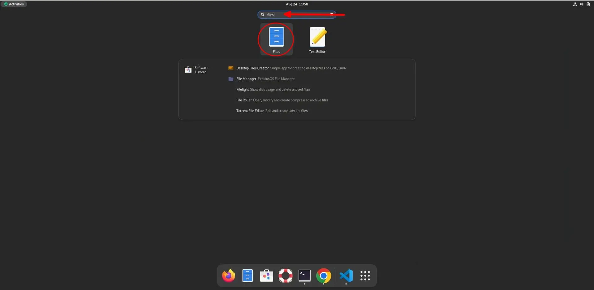
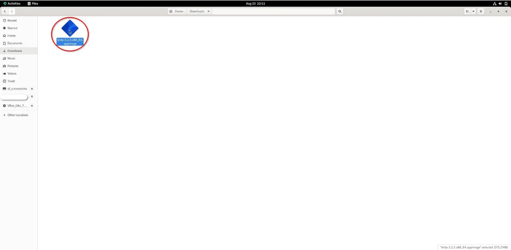

## Introduzione

Le AppImages sono un modo comodo per installare software su Linux senza usare i gestori di pacchetti o la riga di comando. Si tratta di singoli file eseguibili che contengono tutte le dipendenze del programma, il che li rende facili da eseguire su varie distribuzioni Linux. Per gli utenti finali che hanno familiarità con i sistemi operativi Windows e Mac, l'installazione del software con un'AppImage può essere più semplice della gestione dei repository o della creazione dai sorgenti.

L'installazione di programmi sul desktop Rocky Linux con AppImage avviene in tre fasi:

1. Scaricare l'AppImage del programma desiderato
2. Rendere il programma eseguibile
3. Eseguire il programma per installarlo

Il programma di esempio utilizzato in questa guida è Krita. Lo si scarica e installa utilizzando una AppImage. Krita è un software di progettazione grafica gratuito e open-source. Poiché questa guida riguarda le funzioni di AppImage, non ci saranno dettagli sull'uso di Krita. Potete [leggere di più sul loro sito web](https://krita.org/).

## Presupposti

Per questa guida sono necessari i seguenti elementi:

 - Rocky Linux con un ambiente desktop installato
 - Privilegi `sudo`

## Scaricare la AppImage di un programma

Il primo passo per l'installazione di un software tramite AppImage è il download dell'AppImage del programma. Per scaricare l'immagine dell'applicazione Krita, andare alla pagina [Download](https://krita.org/en/download/) e fare clic sul pulsante `Download`.


## Installare un programma con la sua AppImage

Dopo aver scaricato l'immagine dell'applicazione, è necessario navigare nella cartella `Downloads` per rendere il file eseguibile prima di eseguirlo.

Nell'angolo superiore sinistro del desktop di Rocky Linux, fare clic su Attività:

![Desktop Rocky Linux con sfondo predefinito. Il mouse è posizionato sul pulsante delle attività] (images/activites_appimage.webp).

Una volta avviato il pannello delle attività, digitate “file” nel campo di ricerca. Cliccare la app Files:



I file verranno avviati nella home directory. Fare clic sulla cartella Download:


Dopo aver navigato nella directory AppImage, è il momento di rendere il programma eseguibile. Fare clic con il pulsante destro del mouse sul file AppImage e selezionare proprietà:


Selezionate le autorizzazioni dal menu delle proprietà del file:


Selezionare la casella di controllo “Esegui” prima di chiudere il menu delle proprietà:


Se invece volete usare la riga di comando, aprite il terminale ed eseguite il seguente comando per rendere l'AppImage eseguibile:

```bash
sudo chmod a+x ~/Downloads/krita*.appimage
```

## Eseguire il programma utilizzanod AppImage

Si è arrivati al passo finale: l'esecuzione dell'immagine dell'applicazione!

!!! note "Nota"

```
L'esecuzione di un'immagine dell'applicazione non installa il programma nei file del sistema come fanno i pacchetti software tradizionali. Ciò significa che ogni volta che si desidera utilizzare il programma, è necessario fare doppio clic sull'AppImage. Per questo motivo, è importante conservare l'immagine dell'applicazione in un luogo sicuro e memorabile. 
```

Fare doppio clic sull'immagine dell'applicazione:



In alternativa, è possibile eseguire il seguente comando di shell invece di fare doppio clic sull'immagine dell'applicazione:

```bash
   ./krita*.appimage
```

Poco dopo aver eseguito l'immagine dell'applicazione, Krita si avvia.


## Conclusione

Questa guida ha insegnato come scaricare e utilizzare un programma con una AppImage. Le AppImages sono comode per gli utenti finali, che non devono sapere come gestire le repository, compilare dai sorgenti o usare la riga di comando per usare i loro programmi preferiti con una AppImage disponibile.
