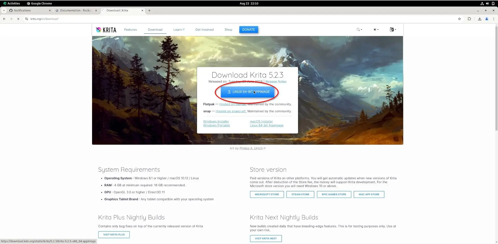
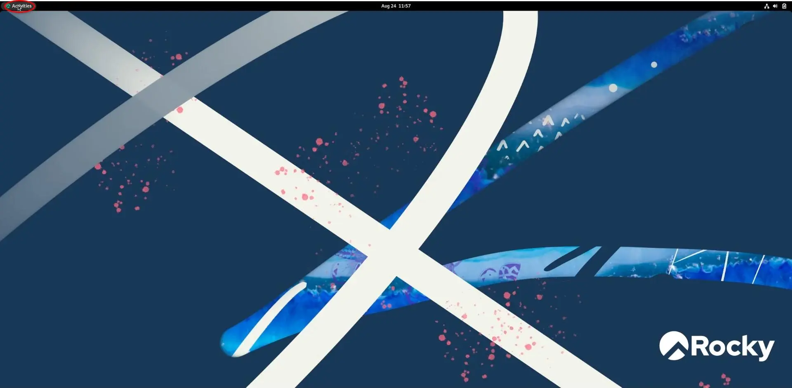
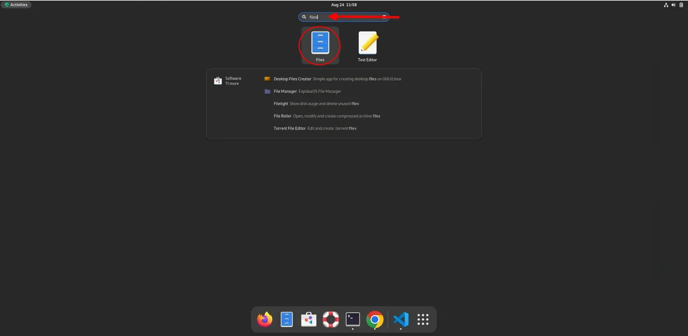
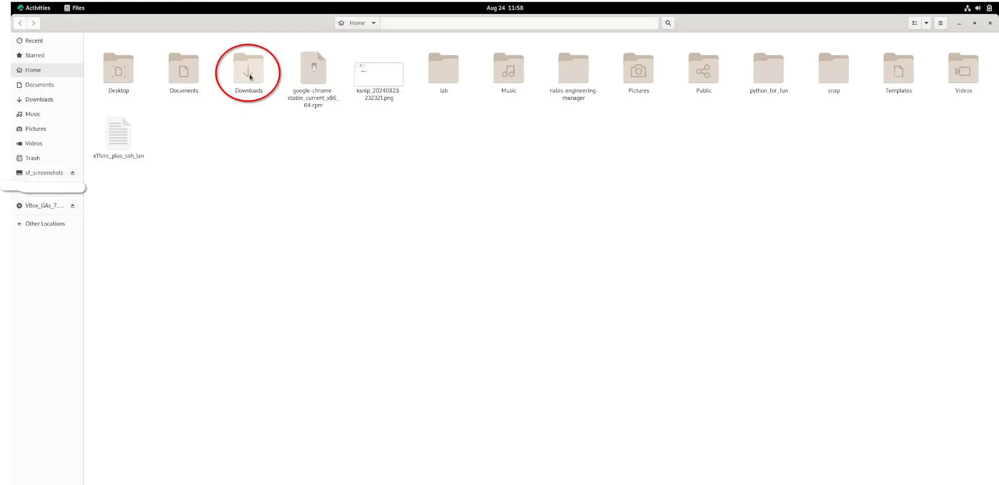
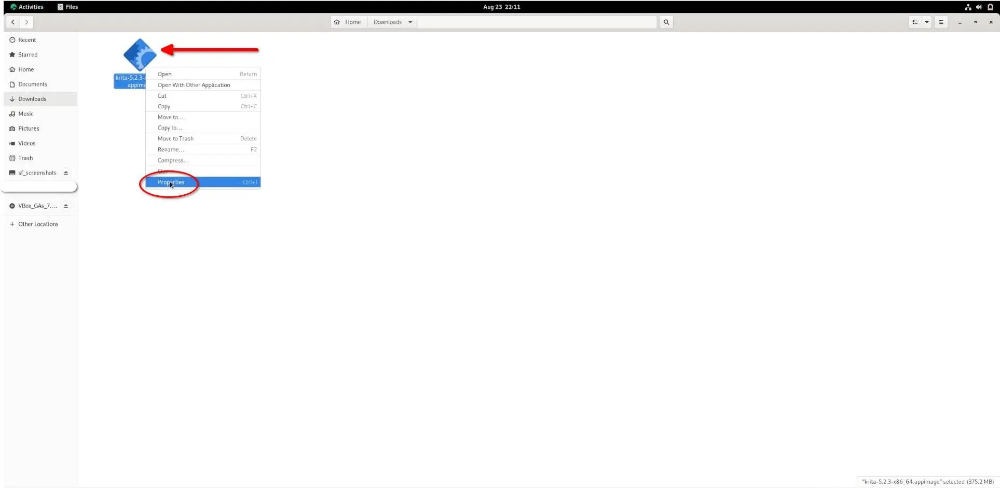
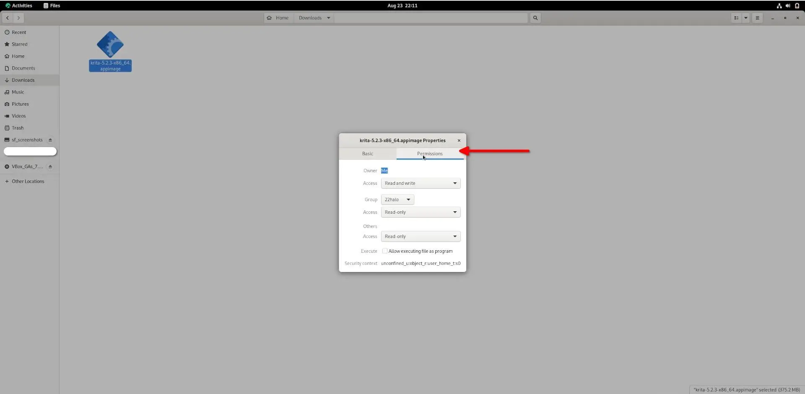
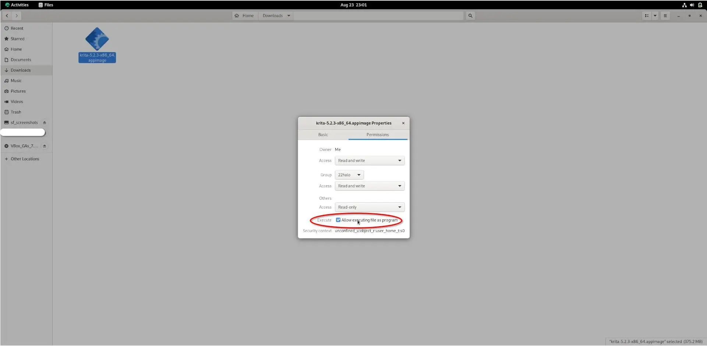
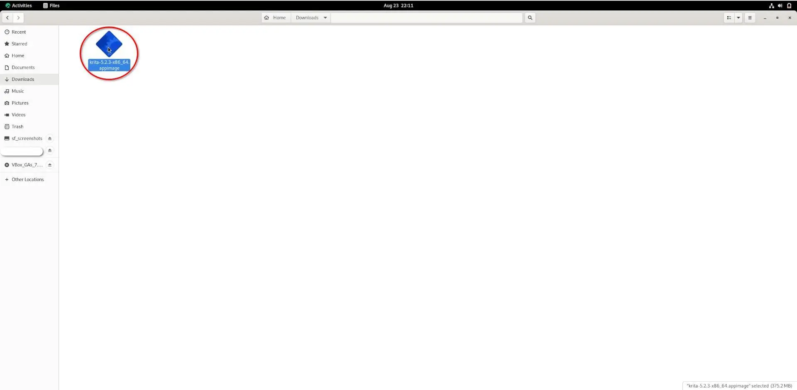
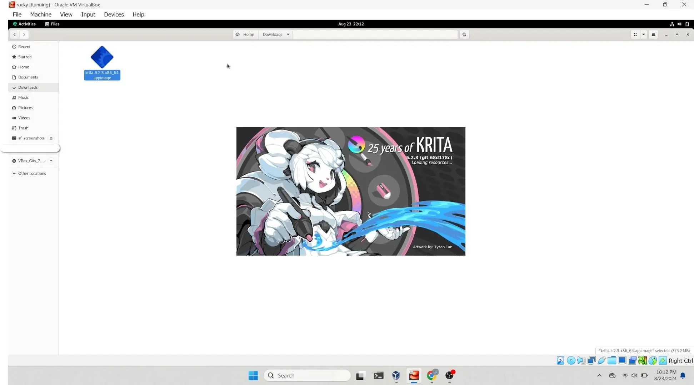

## Introduction

AppImages are a convenient way to install software on Linux without using package managers or the command line. They are single-file executables that contain all the program's dependencies, making them easy to run on various Linux distributions. For end-users familiar with Windows and Mac operating systems, installing software with an AppImage may be more straightforward than managing repositories or building from source.

Installing programs on your Rocky Linux desktop with AppImage is a three-step process:

1. Download the desired program's AppImage
2. Make the program executable
3. Run the program to install it

The example program used in this guide is Krita. You will download and install it using AppImage. Krita is a free and open-source graphic design software. Since this guide is about the functions of AppImage, there needs to be details on using Krita. You can [read more about it on their website](https://krita.org/).

## Assumptions

For this guide, you need the following:

* Rocky Linux with a desktop environment installed
* `sudo` privileges

## Downloading a Program's AppImage

The first step of installing software using an AppImage is downloading the program's AppImage. To download the Krita AppImage, go to the [Download](https://krita.org/en/download/) page and click the `Download` button.



## Installing a Program using its AppImage

After downloading the AppImage, you must navigate to the `Downloads` folder to make the file executable before running it.

In the top left corner of your Rocky Linux desktop, click Activities:



Once the activities panel launches, type 'files' into the search field. Click the Files app:



Files will launch in the home directory. Click the Downloads folder:



Now that you have navigated to the AppImage directory, it is time to make the program executable. Right-click the AppImage file and select properties:



Select permissions from the file properties menu:



Select the checkbox labeled 'Execute' before closing the properties menu:



If you would instead use the command line, open the terminal and run the following command to make the AppImage executable:

```bash
sudo chmod a+x ~/Downloads/krita*.appimage
```

## Running a Program using its AppImage

You have reached the final step - running your AppImage!

!!! Note

    Running an AppImage does not install the program into your system's files like traditional software packages do. This means that whenever you want to use the program, you must double-click the AppImage. For this reason, it is important to store the AppImage in a safe and memorable place. 

Double-click the AppImage:



You can alternatively run the following shell command instead of double-clicking the AppImage:

 ```bash
    ./krita*.appimage
```

Shortly after running the AppImage, Krita will launch.



## Conclusion

This guide taught you how to download and use a program with an AppImage. AppImages are convenient for end-users because they do not need to know how to manage repositories, build from a source, or use the command line to use their favorite programs with an available AppImage.
