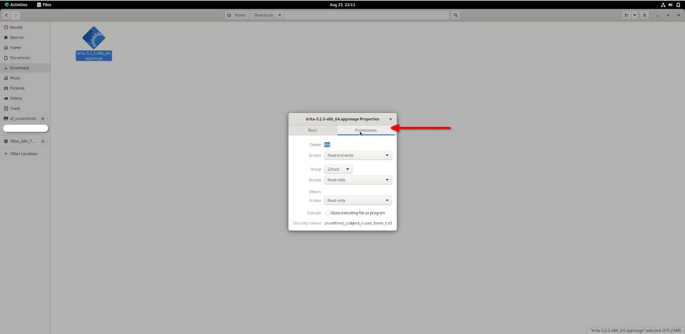
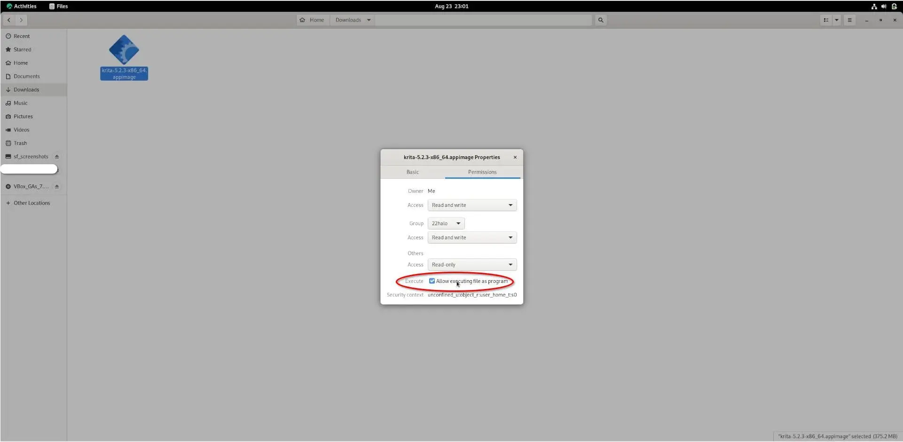

## Вступ

AppImages — це зручний спосіб інсталювати програмне забезпечення в Linux без використання менеджерів пакетів або командного рядка. Це однофайлові виконувані файли, які містять усі залежності програми, завдяки чому їх легко запускати в різних дистрибутивах Linux. Для кінцевих користувачів, які вже знайомі з операційними системами Windows і Mac, інсталяція програмного забезпечення за допомогою AppImage може бути більш простим процесом, ніж керування сховищами чи збірка з джерела.

Процес встановлення програм на робочому столі Rocky Linux за допомогою AppImage складається з трьох етапів:

1. Завантажте AppImage потрібної програми
2. Зробіть програму виконуваною
3. Запустіть програму, щоб встановити її

Прикладом програми, використаної в цьому посібнику, є Krita. Ви завантажите та встановите його за допомогою AppImage. Krita — це безкоштовне програмне забезпечення графічного дизайну з відкритим кодом. Оскільки в цьому посібнику йдеться про функції AppImage, у ньому немає деталей щодо використання Krita. Ви можете [прочитати більше про це на їх веб-сайті](https://krita.org/).

## Припущення

Для цього посібника вам потрібно:

- Rocky Linux із встановленим робочим середовищем
- привілеї `sudo`

## Завантаження AppImage програми

Першим кроком встановлення програмного забезпечення за допомогою AppImage є завантаження AppImage програми. Щоб завантажити Krita AppImage, перейдіть на сторінку [Завантажити](https://krita.org/en/download/) і натисніть кнопку `Download`.


## Встановлення програми за допомогою її AppImage

Після завантаження AppImage ви повинні перейти до папки `Downloads`, щоб зробити файл виконуваним перед його запуском.

У верхньому лівому куті робочого столу Rocky Linux натисніть Activities:


Після запуску панелі дій введіть 'files' в поле пошуку. Натисніть програму Files:


Файли будуть запущені в домашньому каталозі. Натисніть папку Downloads:


Тепер, коли ви перейшли до каталогу, де знаходиться AppImage, настав час зробити програму виконуваною. Клацніть файл AppImage правою кнопкою миші та виберіть properties:


Виберіть дозволи в меню властивостей файлу:



Установіть прапорець 'Execute', перш ніж закрити меню властивостей:



Якщо замість цього ви використовуєте командний рядок, відкрийте термінал і виконайте таку команду, щоб зробити виконуваний файл AppImage:

```bash
sudo chmod a+x ~/Downloads/krita*.appimage
```

## Запуск програми за допомогою її AppImage

Ви досягли останнього кроку – запустили AppImage!

!!! Note "Примітка"

```
Запуск AppImage не інсталює програму у файли вашої системи, як це роблять традиційні пакети програмного забезпечення. Це означає, що коли ви хочете використовувати програму, ви повинні двічі клацнути AppImage. З цієї причини важливо зберігати AppImage у безпечному та незабутньому місці. 
```

Двічі клацніть AppImage:


Ви також можете виконати таку команду оболонки замість подвійного клацання AppImage:

```bash
   ./krita*.appimage
```

Незабаром після запуску AppImage запуститься Krita!


## Висновок

Цей посібник навчив вас, як завантажити та використовувати програму з AppImage. AppImages зручні для кінцевих користувачів, оскільки їм не потрібно знати, як керувати сховищами, створювати з джерела або використовувати командний рядок, щоб використовувати свої улюблені програми з доступним AppImage.
