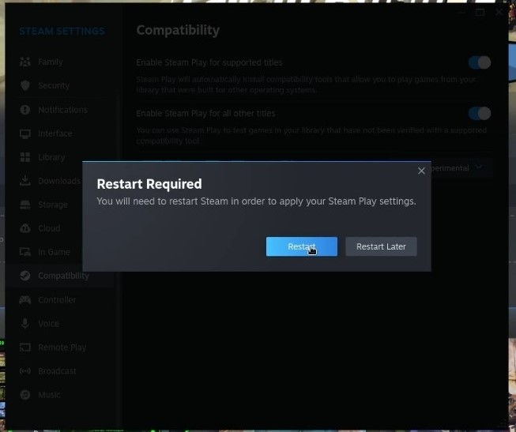

## Introduction

Proton est un projet de Valve visant à intégrer dans le bureau Linux au sein de son client Steam. `Proton` est un Fork de [Wine](https://www.winehq.org/), un système de compatibilité, qui est utilisé pour les applications Windows sous Linux (et d'autres systèmes POSIX compatibles).

Depuis la conception de Proton en août 2018, 802 avis ont été publiés sur le site [Proton Compatible Steam Group](https://store.steampowered.com/curator/33483305-Proton-Compatible/about/) ! Il s’agit d’un progrès considérable de la part de `Valve` et de la communauté `Proton`, puisque seulement 27 jeux ont été initialement testés et certifiés à leur date de sortie initiale.

Contrairement à Wine, Proton ne nécessite généralement aucune configuration et convient parfaitement aux débutants. Installez simplement `Steam` et activez `Proton` !

## Prérequis

- Une station de travail Rocky Linux avec un environnement de bureau
- Flatpak
- Un compte Steam

## Installation de Steam

Installez Steam avec Flatpak:

```bash
flatpak install steam 
```

Entrez l'option `20` pour choisir `app/com.valvesoftware.Steam/x86_64/stable` et appuyez sur ++enter++ pour installer Steam.


Après avoir installé `Steam`, la mise à jour démarre automatiquement.


Après la mise à jour, vous devez vous connecter à votre compte Steam. Créez un compte si vous n'en possédez pas.


## Activer la compatibilité `Proton`

Après vous être connecté à `Steam`, cliquez sur ++"Steam"++ dans le coin supérieur gauche, puis sélectionnez ++"Settings"++.


Sélectionnez ++"Compatibility"++ dans le menu de gauche dans les paramètres Steam.


Notez sur la photo ci-dessus que `Enable Steam Play for supported titles` est activé et que `Enable Steam Play for all other titles` ne l'est pas. Cela signifie que les jeux testés et vérifiés pour fonctionner sur `Proton` sont prêts à être joués, mais tout jeu non vérifié ne fonctionnera pas. Certains titres non vérifiés fonctionnent presque parfaitement avec Proton mais manquent de mappages de contrôleur ou de quelques détails mineurs. C'est pour cette raison que l'auteur recommande d'activer `Steam Play` pour les titres non pris en charge et de les tester soi-même !

Activez `Enable Steam Play for all other titles`. Redémarrez Steam lorsque vous y êtes invité.



## Conclusion

Après avoir redémarré `Steam`, téléchargez votre titre Windows préféré et essayez-le ! Aucune configuration supplémentaire n'est nécessaire. Happy gaming!
