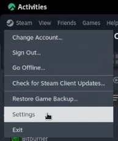
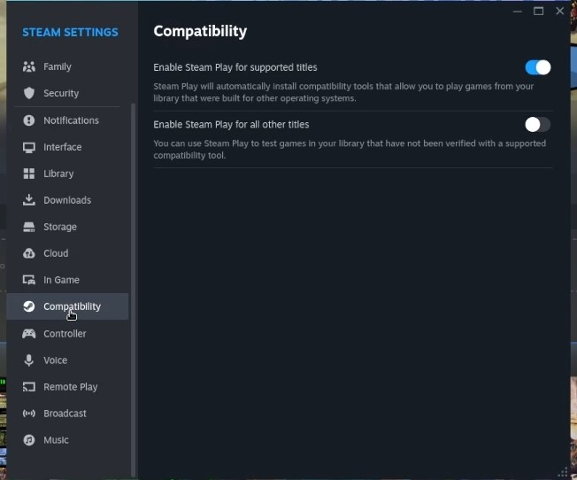

## Introduzione

Proton è un progetto di Valve per portare il gaming su desktop Linux all'interno del client Steam. Proton è un fork di [Wine](https://www.winehq.org/), un layer di compatibilità usato per eseguire applicazioni Windows su Linux (e su altri sistemi operativi conformi a POSIX).

Dal concepimento di Proton nell'agosto 2018, sono state pubblicate 802 recensioni sul [Gruppo Proton Compatible Steam](https://store.steampowered.com/curator/33483305-Proton-Compatible/about/)! Si tratta di un enorme progresso da parte di Valve e della comunità di Proton, dato che solo 27 giochi erano stati originariamente testati e certificati alla data di rilascio.

A differenza di Wine, Proton non richiede alcuna configurazione ed è rivolto ai principianti. Basta installare Steam e abilitare Proton!

## Presupposti

 - Una workstation con ambiente desktop Rocky Linux
 - Flatpak
 - Account Steam

## Installazione di `Steam`

Installare Steam con Flatpak:

```bash
flatpak install steam 
```

Inserire l'opzione `20` per scegliere `app/com.valvesoftware.Steam/x86_64/stable` e premere ++enter++ per installare Steam.


Dopo l'installazione di Steam, l'aggiornamento verrà avviato automaticamente.


Dopo l'aggiornamento, è necessario accedere al proprio account Steam. Se non ne avete uno, dovreste registrarvi per ottenere un account.


## Abilitare la compatibilità con Proton

Dopo aver effettuato l'accesso a Steam, fare clic su ++"Steam"++ nell'angolo in alto a sinistra, quindi selezionare ++"Impostazioni"++.



Selezionare ++"Compatibilità"++ dal menu di sinistra delle impostazioni di Steam.



Nella foto qui sopra si nota che “Enable Steam Play for supported titles” è abilitata, mentre “Enable Steam Play for all other titles” non lo è. Ciò significa che i giochi testati e verificati per funzionare su Proton sono pronti per essere giocati, mentre quelli non verificati non funzioneranno. Alcuni titoli non verificati funzionano perfettamente con Proton ma necessitano di mappature del controller o di qualcosa di relativamente minore. Per questo motivo, l'autore consiglia di abilitare Steam Play per i titoli non supportati e di testarli personalmente!

Attivare "Enable Steam Play for all other titles". Riavviare Steam quando richiesto.


!!! warning “La compatibilità non è sempre universale”

````
Molte persone segnalano problemi con i giochi compatibili con ProtonDB, mentre quelli compatibili con Linux funzionano bene. Ciò è spesso dovuto alle politiche SELinux che proteggono il filesystem.

Per prima cosa, controllate lo stato di SELinux del sistema con:

```
sestatus
```

Questo restituirà uno dei tre risultati:

* SELinux status:                 disabled (if SELinux protection is switched off completely)
* SELinux status:                 permissive (if SELinux is in permissive mode)
* SELinux status:                 enforcing (if SELinux is fully protecting your system)

Se SELinux è disattivato, non sarà la causa dei problemi con il gioco. Se invece è in modalità “enforcing”, potrebbe essere il colpevole. Provate a impostare temporaneamente SELinux in modalità permissiva prima di giocare:

```
sudo setenforce 0
```

Al termine del gameplay, ricordarsi di impostare nuovamente la politica SELinux su “enforcing”:

```
sudo setenforce 1
```

Per una soluzione più permanente che mantenga in vigore le politiche SELinux, è necessario ricercare la regola che blocca il gioco, il che richiede una conoscenza più approfondita di SELinux e degli strumenti sottostanti. Consultate [la nostra guida sulla sicurezza SELinux](../../guides/security/learning_selinux.md) per uno sguardo più approfondito su SELinux.
````

## Conclusione

Dopo aver riavviato Steam, scaricate il vostro titolo Windows preferito e provatelo! Non sono necessarie altre configurazioni. Buon divertimento!
