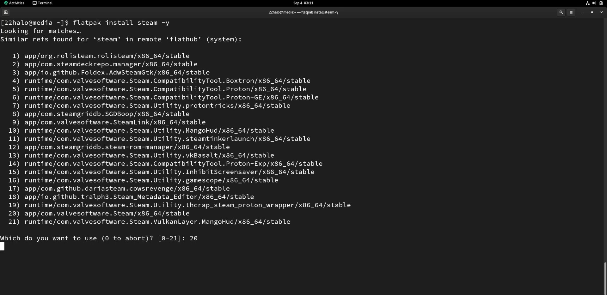

## Introduction

Proton is a project by Valve to bring gaming to the Linux desktop within their Steam client. Proton is a fork of [Wine](https://www.winehq.org/), a compatibility layer used to run Windows applications on linux (as well as other POSIX-compliant operating systems).

Since Proton's conception in August of 2018, 802 reviews have been posted to the [Proton Compatible Steam Group](https://store.steampowered.com/curator/33483305-Proton-Compatible/about/)! This is tremendous progress by Valve and the Proton community, as only 27 games were originally tested and certified at its original release date. 

Unlike Wine, Proton typically does not require any configuration and is aimed for complete beginners. Simply install Steam and enable Proton!

## Assumptions

* A Rocky Linux Workstation with a desktop environment 
* flatpak
* Steam account

## Install steam

Install steam with flatpak:

```bash
flatpak install steam 
```

Enter option `20` to choose `app/com.valvesoftware.Steam/x86_64/stable` and press ++"Enter"++ to install steam.



Once steam is installed it will automatically start updating.


After updating, you will be required to sign into your steam account. Sign up for an account if you don't have one.


## Enable Proton compatibility

Once you are signed into Steam, click on ++"Steam"++ in the top left corner. Then select ++"Settings"++.


Select ++"Compatibility"++ from the left-hand menu in Steam settings.


Notice in the photo above that "Enable Steam Play for supported titles" is enabled and "Enable Steam play for all other titles" is not. What this means is that a selection of games that have been tested and verified to work with Proton are ready to play, but any unverified game will not run. Some unverified titles work nearly flawlessly with Proton but lack controller mappings or something relatively small. For this reason I reccommend enabling Steam play for unsupported titles and testing them out yourself!

Toggle "Enable Steam Play for all other titles". Restart Steam when prompted.


## Conclusion

Once Steam is restarted, download your favorite Windows title and give it a go! No further configuration necessary. Happy gaming!

