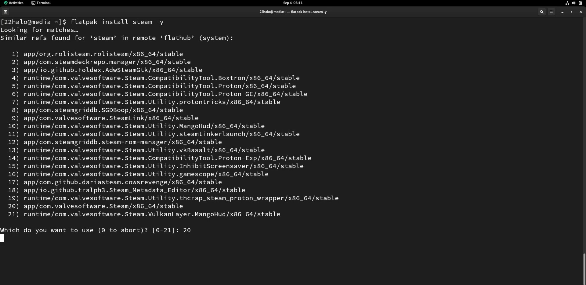
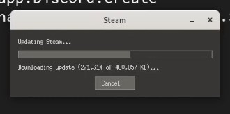
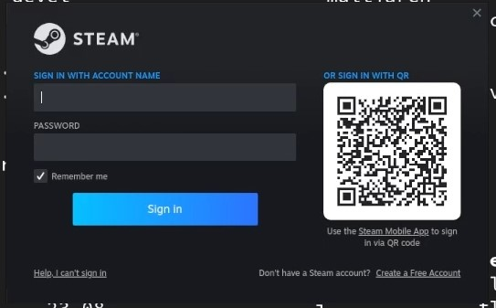
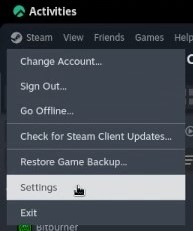
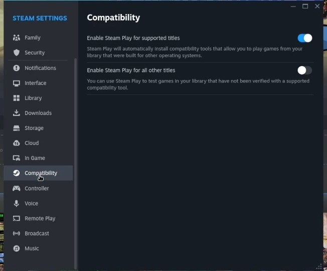
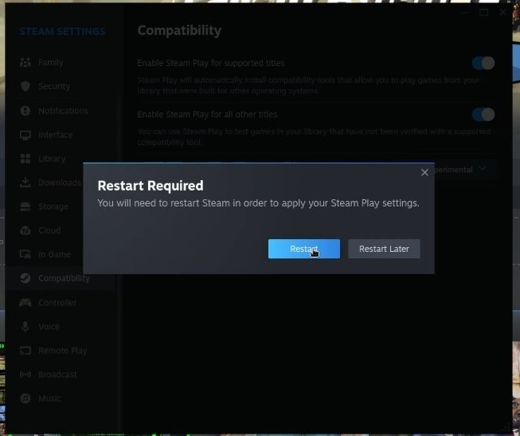

## Introdução

Proton is a project by Valve to bring gaming to the Linux desktop within their Steam client. Proton is a fork of [Wine](https://www.winehq.org/), a compatibility layer used to run Windows applications on Linux (and on other POSIX-compliant operating systems).

Since Proton's conception in August 2018, 802 reviews have been posted to the [Proton Compatible Steam Group](https://store.steampowered.com/curator/33483305-Proton-Compatible/about/)! This is tremendous progress by Valve and the Proton community, as only 27 games were originally tested and certified at their original release date.

Unlike Wine, Proton typically requires no configuration and is intended for the complete beginner. Just install Steam and enable Proton!

## Pré-Requisitos

 - A Rocky Linux Workstation with a desktop environment
 - Flatpak
 - Conta Steam

## Instalação de `Steam`

Instalar Steam com `Flatpak`:

```bash
flatpak install steam 
```

Enter option `20` to choose `app/com.valvesoftware.Steam/x86_64/stable` and press ++enter++ to install Steam.



After installing Steam, it will automatically start updating.



After updating, you must sign into your Steam account. You should sign up for an account if you do not have one.



## Enable Proton compatibility

After signing into Steam, click ++"Steam"++ in the top left corner, then select ++"Settings"++.



Select ++"Compatibility"++ from the left menu in Steam settings.



Notice in the photo above that "Enable Steam Play for supported titles" shows enabled, and "Enable Steam Play for all other titles" is not. This means that games tested and verified to work on Proton are ready to play, but unverified games will not run. Some unverified titles work flawlessly with Proton but need controller mappings or something relatively minor. For this reason, the author recommends enabling Steam play for unsupported titles and testing them yourself!

Toggle "Enable Steam Play for all other titles". Restart Steam when prompted.



!!! warning "Compatibilidade não é sempre universal"

    Many people report issues with ProtonDB-compatible games, while Linux-compatible games work fine. This is often due to SELinux policies protecting the filesystem.
    
    First, check the system's SELinux status with:
    
    `     sestatus     `
    
    This will return one of three results:
    
    \* SELinux status:                 disabled (if SELinux protection is switched off completely)
    \* SELinux status:                 permissive (if SELinux is in permissive mode)
    \* SELinux status:                 enforcing (if SELinux is fully protecting your system)
    
    If SELinux is disabled, it will not be what is causing your issues with the game. If it is in enforcing mode, then it could be the culprit. Try temporarily setting SELinux to permissive mode before gameplay with:
    
    `     sudo setenforce 0     `
    
    After gameplay is completed, remember to set your SELinux policy back to enforcing with:
    
    `     sudo setenforce 1     `
    
    For a more permanent solution that keeps SELinux policies in place, you must research what rule is blocking your game, which requires a more thorough understanding of SELinux and the underlying tools. Look at [our guide on SELinux Security](../../guides/security/learning_selinux.md) for a more thorough look at SELinux.

## Conclusão

After restarting Steam, download your favorite Windows title and try it out! No further configuration is necessary. Happy gaming!
