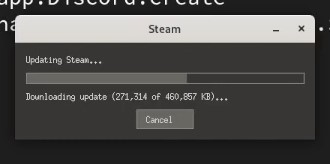

## Вступ

Proton — це проект Valve, спрямований на перенесення ігор на робочий стіл Linux у їхньому клієнті Steam. Proton — це розгалуження [Wine](https://www.winehq.org/), рівня сумісності, який використовується для запуску програм Windows у Linux (та в інших POSIX-сумісних операційних системах).

З моменту створення концепції Proton у серпні 2018 року в [Proton Compatible Steam Group](https://store.steampowered.com/curator/33483305-Proton-Compatible/about/) було опубліковано 802 відгуки! Це надзвичайний прогрес Valve і спільноти Proton, оскільки лише 27 ігор були спочатку протестовані та сертифіковані на початкову дату випуску.

На відміну від Wine, Proton зазвичай не потребує конфігурації та розрахований на повного новачка. Просто встановіть Steam і ввімкніть Proton!

## Припущення

- Робоча станція Rocky Linux із робочим середовищем
- Flatpak
- Акаунт Steam

## Встановлення Steam

Встановіть Steam за допомогою Flatpak:

```bash
flatpak install steam 
```

Введіть опцію `20`, щоб вибрати `app/com.valvesoftware.Steam/x86_64/stable`, і натисніть ++enter++, щоб установити Steam.


Після встановлення Steam автоматично почнеться оновлення.



Після оновлення ви повинні увійти в обліковий запис Steam. Зареєструйте обліковий запис, якщо у вас його немає.


## Увімкнути сумісність з Proton

Після входу в Steam натисніть ++"Steam"++ у верхньому лівому куті, а потім виберіть ++"Settings"++.


Виберіть ++"Compatibility"++ у меню ліворуч у налаштуваннях Steam.


Зверніть увагу на фотографію вище, що «Увімкнути Steam Play для підтримуваних ігор» увімкнено, а «Увімкнути Steam Play для всіх інших ігор» — ні. Це означає, що перевірені та перевірені ігри на Proton готові до гри, але неперевірені ігри працювати не будуть. Деякі неперевірені назви бездоганно працюють із Proton, але не мають відображення контролерів або чогось відносно незначного. З цієї причини автор рекомендує ввімкнути гру Steam для непідтримуваних ігор і перевірити їх самостійно!

Перемкніть «Увімкнути Steam Play для всіх інших ігор». Перезапустіть Steam, коли буде запропоновано.


## Висновок

Після перезапуску Steam завантажте свою улюблену назву Windows і спробуйте! Подальша настройка не потрібна. Щасливої ​​гри!
