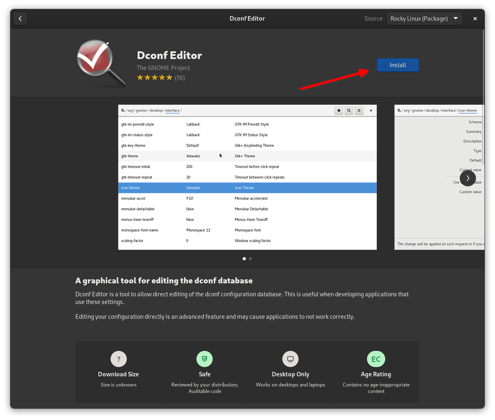
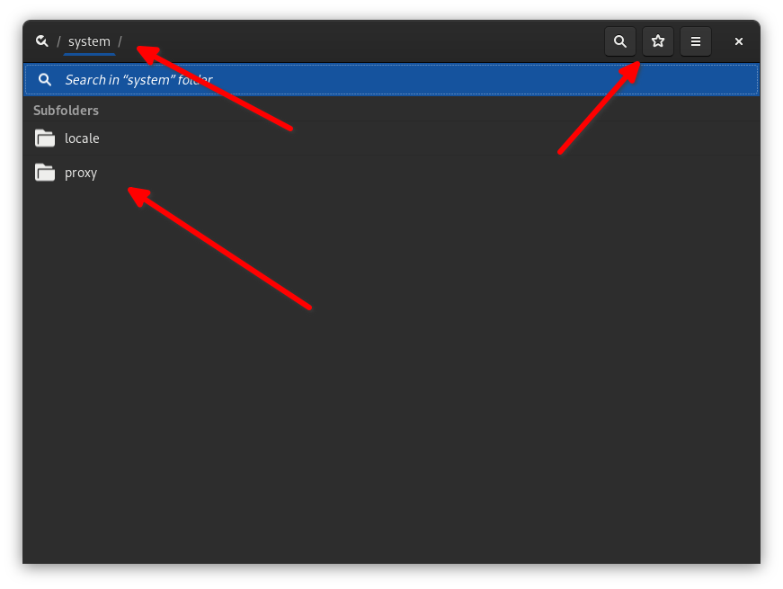
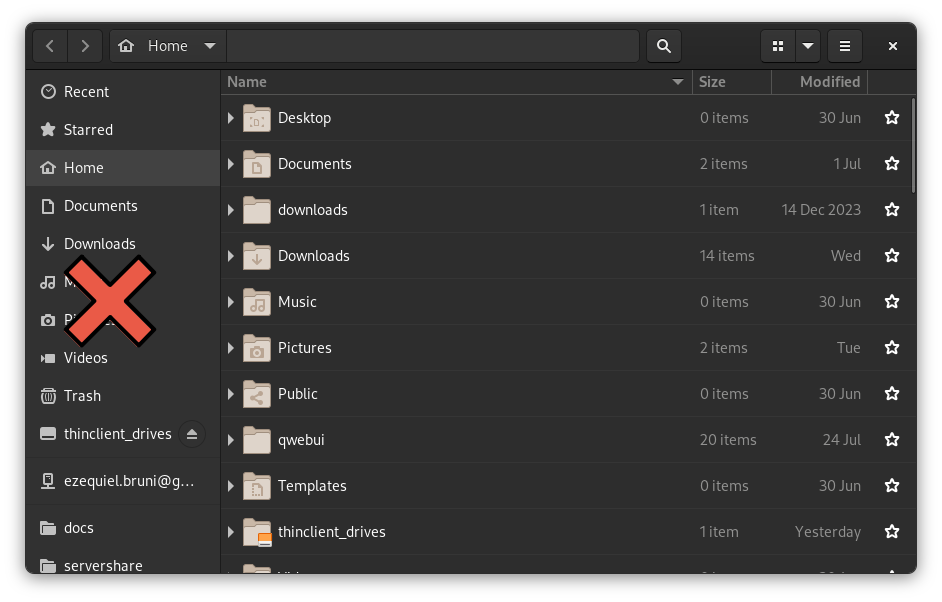
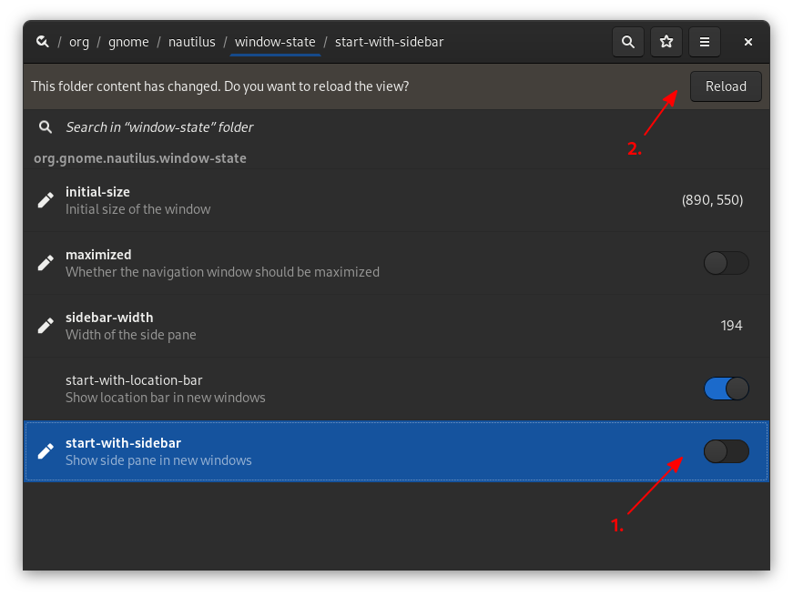
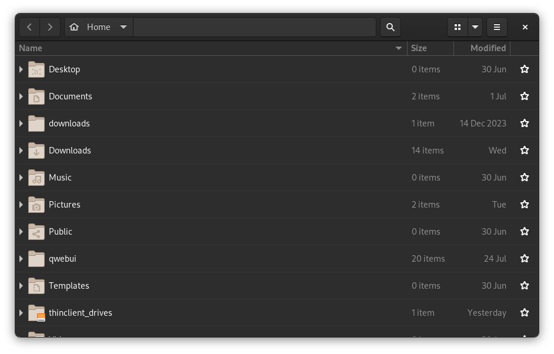
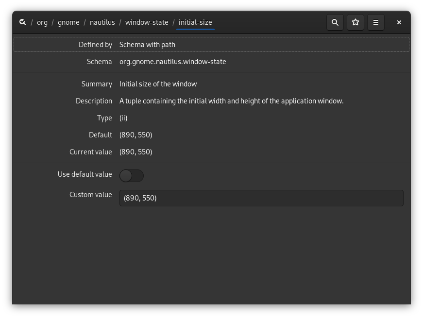

## Introduction

Gnome takes a very streamlined approach to its user interface and its features. This isn't a bad thing, as it's easy enough to learn, and the default Gnome experience lets you get right to work doing... well, your work.

However, this approach also means that it's not as easily configurable as some people would like. Sure, if you can't find what you need in the Settings panel, you can install Gnome Tweaks to expand your options. You can even install Gnome extensions to get new features and options.

But what if you want to see all the little settings, features, and configurations that the Gnome developers have, let's face it, hidden from you? Sure, you can look up your current problem online, and type in a command to change an obscure variable... or you could install `dconf Editor`.

`dconf Editor` is essentially a Gnome Settings app that has *everything*. In fact, it may remind you a little bit of the Windows Registry, and it *is* similar. However, it's a lot more readable, and it really only covers Gnome functionality, and some of the software built for Gnome.

Oh, and you can also edit settings for Gnome extensions, so that's cool.

!!! Warning

    The comparison to the Windows Registry was quite intentional. Like bad Registry keys, *some* of the Gnome Shell settings can actually break your Gnome installation, or at least cause issues. You may need to restore the old settings via the command line.

    If you're not sure what a particular setting does, research it first. Changing app settings is fine, though, and much easier to reverse.

## Assumptions
For this guide, you're going to need:

* Rocky Linux with Gnome installed.
* The authority to install software on your system (sudo privilege).

And that's it.

## Installing `dconf Editor`

Oh that's easy. Go to the Software app, search for Dconf Editor, and hit this install button. It's available in the default Rocky Linux repository, so there's no special configuration needed.



For those of you who want to do it the command line way, that's:

```bash
sudo dnf install dconf-editor
```

## Using `dconf Editor`

Once you open up the app which you'll see three important bits of the UI. Up at the top is the path. Yes, your Gnome settings are all organized in a path/folder structure.

At the top-right, you'll see a button with a little star on it. That's the favorites button, so you can save your place in the app and come back to it later quickly and easily. Down below is the main panel where you select your settings subfolders, and actually change settings as you see fit.



Left of the favorite button, you'll see the search button, which does exactly what you'd expect.

Now let's say you want to change some settings in the file manager. For example, I love the sidebar. I find it very handy. But maybe you feel differently, and want to change things up. So, for the purposes of this guide, it has got to go.



*Good night, sweet prince.*

Go to `/org/gnome/nautilus/window-state`, and you'll see an option called `start-with-sidebar`. Hit the toggle, and click the "Reload" button when that shows up, like so:



If everything has gone right, the next file browser window you open should look like this:



If that feels wrong to you -- and this author contends that it should -- just switch it right back, hit Reload again, and open a new file browser window.

Lastly, you can also click directly on any setting in the `dconf Editor` window to see more information (and sometimes more options). For example, here's what the `initial-size` settings screen for Gnome's file manager looks like.



## Troubleshooting

If you're making changes to your settings in `dconf Editor` and you're not seeing anything change, try one of the following fixes:

1. Restart the app to which you are making the changes.
2. Log out and log back in, or reboot for some changes to Gnome Shell.
3. Give up because that option just isn't actually functional anymore.

On that last point: Yes, the Gnome developers will sometimes just take away your ability to actually change a setting, even with `dconf Editor`. 

For example, I tried making changes to the window switcher settings (the list of open windows that shows up when you press <kbd>Alt</kbd>+<kbd>Tab</kbd>), and got nowhere. No matter what I tried, `dconf Editor` seems to have no effect on some of its functions.

Now that could be a bug, but it wouldn't be the first time a setting shown in `dconf Editor` was essentially stealth-disabled. If you run into that problem, search the Gnome Extensions site to see if there's an extension that adds the option you want back into Gnome.

## Conclusion

And that's all you need to know to get started. Just remember to keep track of all your changes, don't go changing settings without knowing exactly what they do, and have fun exploring the options that are (mostly) available to you.

Have fun!