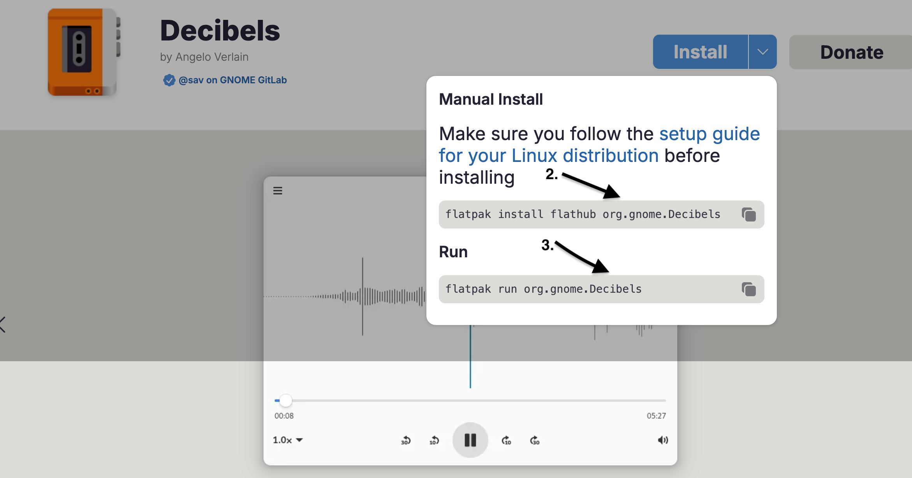

## Einleitung

`Decibels` ist eine Anwendung zum Abspielen von Audiodateien. Die benutzerfreundliche Oberfläche erleichtert das Hochladen und Abspielen Ihrer Lieblingssongs, Vorlesungsaufzeichnungen, Projektideen und anderer Audiodateien.

## Voraussetzungen

Für diese Anleitung benötigen Sie Folgendes:

- Rocky Linux
- Flatpak
- FlatHub

## Installations-Ablauf

Gehen Sie zu [Flathub.org] (https://flathub.org), geben Sie `Decibels` in die Suchleiste ein und klicken Sie auf **Install**.




2. Kopieren Sie das manuelle Installationsskript und führen Sie es in einem Terminal aus:

   ```bash
   flatpak install flathub org.gnome.Decibels
   ```

3. Kopieren Sie abschließend den Ausführungsbefehl und rufen Sie ihn in Ihrem Terminal auf:

   ```bash
   flatpak run org.gnome.Decibels
   ```

## Anwendungshinweise

Gehen Sie wie folgt vor, um `Decibels` zu verwenden:

1. Auf **Open** klicken

   

2. Wählen Sie Ihre gewünschte Datei aus und klicken Sie auf **Open**, das in der oberen rechten Ecke des Bildschirms erscheint

   

!!! note "Anmerkung"

```
Sind Sie es leid, mit der Maus zu klicken? Hier finden Sie einige Möglichkeiten, wie Sie mit Ihrer Tastatur Ihre Audiodateien abspielen und mit ihnen interagieren können

- ++ctrl++ + ++shift++ + ++o++ = Datei öffnen
- ++space++ = Abspielen oder Pause
- ++left++ = Audio um 10 Sekunden nach hinten verschieben
- ++right++ = Audio 10 Sekunden vorwärts bewegen
```

## Zusammenfassung

Möchten Sie mehr über diese App erfahren oder haben Sie noch weitere Ideen dafür? [Submit an issue in Decibel's repository at GitLab](https://gitlab.gnome.org/GNOME/Incubator/decibels/-/issues).
